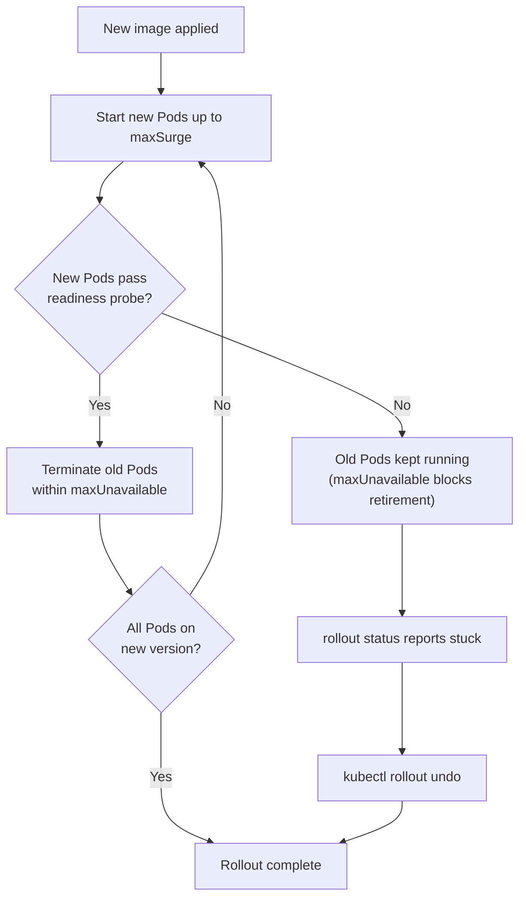

# Rolling Updates, Rollbacks, and Health Checks

## Learning Objectives
- Configure health checks with readiness and liveness probes.
- Check deployment status and roll back using `kubectl rollout`.
- Verify a stable, zero-downtime rolling deployment.

## Body

### Why this lecture matters most

Your pipeline now deploys automatically. But "automatic" is dangerous if it is also "reckless" — pushing a broken version straight to all users with no safety net. This lecture is about making your rollouts **safe**: replacing versions gradually so users never see downtime, teaching Kubernetes how to tell a healthy Pod from a sick one, and being able to undo a bad release in seconds. These are the features that make people trust an automated pipeline in production.

### Rolling updates: replace gradually

When you change a Deployment's image (Lecture 6), Kubernetes uses the **rolling update** strategy by default. Instead of stopping all old Pods and starting new ones (which would cause an outage), it replaces them *incrementally*: spin up some new Pods, wait until they are ready, retire some old ones, repeat — until every Pod runs the new version. Throughout, there is always a working set serving traffic. That is what "zero-downtime deployment" means in practice.

Two knobs control the pace, and they are commonly confused, so let us be precise. Both live under the Deployment's `strategy.rollingUpdate`:

- **`maxUnavailable`** — how many Pods are allowed to be *down* (below the desired count) at any moment during the update. It caps how far you dip *below* full capacity.
- **`maxSurge`** — how many *extra* Pods are allowed *above* the desired count during the update. It caps how far you go *over* desired size.

Both default to `25%`. A concrete example with **4 replicas** and the defaults:

- `maxUnavailable: 25%` of 4 = 1 → at most 1 Pod down at a time, so at least 3 keep serving.
- `maxSurge: 25%` of 4 = 1 → at most 1 extra Pod, so the total never exceeds 5 (125% of 4).

You can use percentages or absolute integers. For a slow, extra-safe rollout, set both to small values:

```yaml
spec:
  replicas: 4
  strategy:
    type: RollingUpdate
    rollingUpdate:
      maxUnavailable: 1
      maxSurge: 1
```

> Mnemonic: **`maxSurge` = how far over you may go; `maxUnavailable` = how far under you may dip.** Surge adds capacity temporarily; unavailable removes it temporarily. Together they bound the window the rollout operates in.

The flow of a rolling update is as follows: create new Pods up to the surge limit, wait for them to pass their readiness check, then terminate old Pods within the unavailable limit, and repeat until the new version is fully rolled out. The diagram below also shows what happens when the new Pods never become ready.



### Health checks: how Kubernetes knows a Pod is OK

A rolling update is only safe if Kubernetes can actually tell whether a new Pod is healthy before it shifts traffic to it. That is the job of **probes**. There are three, and the two you must not confuse are readiness and liveness.

**Readiness probe — "can this Pod receive traffic *right now*?"**
A readiness probe decides whether a Pod should be in the Service's pool of traffic targets. If it **fails**, Kubernetes does **not** kill the Pod — it simply *removes the Pod's IP from the Service endpoints*, so no new requests are routed to it. When it passes again, the Pod is added back. This is exactly what gates a rolling update: a new Pod only starts receiving user traffic once its readiness probe passes (for example, after it has warmed up and connected to its database).

**Liveness probe — "is this Pod broken and in need of a *restart*?"**
A liveness probe decides whether the container is alive and well. If it **fails**, Kubernetes **kills the container and restarts it**. This recovers from states like a deadlock or a process that is stuck but not crashed — the classic "have you tried turning it off and on again."

The distinction is the heart of this lecture, so state it plainly:

> **Readiness controls traffic; liveness controls restarts.** A failing readiness probe means "don't send requests here yet" (Pod stays running, just out of rotation). A failing liveness probe means "this is broken — restart it." Swapping them is a classic and painful mistake: a too-aggressive *liveness* probe will restart Pods that were merely slow to warm up, potentially cascading into a cluster-wide restart storm under load.

The third probe, the **startup probe**, simply holds off the liveness and readiness probes until a slow-starting app (think old Java services) has finished booting — so they do not kill a Pod that is just taking its time to start.

Here is a Deployment container with both key probes, using HTTP checks (probes can also be TCP or run a command):

```yaml
        livenessProbe:
          httpGet:
            path: /healthz       # is the app alive? restart if not
            port: 3000
          initialDelaySeconds: 10
          periodSeconds: 10
        readinessProbe:
          httpGet:
            path: /ready         # is the app ready for traffic? hold traffic if not
            port: 3000
          initialDelaySeconds: 5
          periodSeconds: 5
```

`initialDelaySeconds` waits before the first check; `periodSeconds` is how often to repeat it. A good practice is a lightweight `/ready` endpoint that returns 200 only when dependencies (DB, caches) are reachable, and a `/healthz` that returns 200 as long as the process itself is functioning.

Probes and rolling updates are deeply linked: **without a readiness probe, Kubernetes assumes a Pod is ready the instant its container starts** and will shift traffic to it immediately — even if your app needs ten seconds to be usable. That means users hit errors during every deploy. Configure readiness, and the rollout actually waits.

### Checking and controlling a rollout

`kubectl` gives you live visibility and control over a rollout (this works for Deployments, StatefulSets, and DaemonSets):

```bash
kubectl rollout status deployment/my-app     # block until the rollout finishes (or fails)
kubectl rollout history deployment/my-app     # list past revisions
kubectl rollout pause deployment/my-app        # freeze the rollout mid-way
kubectl rollout resume deployment/my-app       # continue it
```

`rollout status` is the command your pipeline already uses (Lecture 6) to wait for success. `pause`/`resume` let you halt mid-rollout if you spot trouble and then continue once you are satisfied.

### Rollback: undo a bad release in one command

This is the safety net that makes automated deployment tolerable. Kubernetes keeps a history of a Deployment's revisions, so you can revert:

```bash
kubectl rollout undo deployment/my-app                  # back to the previous revision
kubectl rollout undo deployment/my-app --to-revision=3  # to a specific revision
```

There is a beautiful interaction with readiness probes here. Suppose you deploy an image tag that does not exist, or one that crash-loops on startup. The new Pods never pass readiness, so — because of `maxUnavailable` — Kubernetes **refuses to retire the old, healthy Pods**. Your old version keeps serving the whole time, `kubectl rollout status` reports the rollout is stuck waiting, and you run `kubectl rollout undo` to clear out the bad Pods. Users never noticed. This is the entire payoff of the lecture: gradual rollout + health checks + one-command rollback = you can deploy fearlessly.

### Putting it in the pipeline

In practice you wire this together as: configure probes in your manifest (so rollouts gate on real health), let Jenkins run `kubectl rollout status` so a stuck rollout fails the build, and keep `kubectl rollout undo` ready — either run manually by an on-call engineer or, more maturely, automated when the rollout fails. (A more advanced path is to commit a revert in Git and let a GitOps controller reconcile, but the built-in `rollout undo` is the direct tool and exactly what you need here.)

## Key Takeaways
- A rolling update replaces Pods gradually so there is always a working version serving traffic; `maxSurge` bounds how far *over* desired count you go, `maxUnavailable` bounds how far *under* you dip (both default 25%).
- **Readiness probe = traffic control**: on failure, the Pod is removed from the Service (not killed) — this is what gates a rollout. **Liveness probe = restart control**: on failure, Kubernetes restarts the container. Do not confuse them.
- Without a readiness probe, Kubernetes routes traffic to a Pod the moment it starts, causing errors during every deploy; the startup probe just delays the other probes for slow-booting apps.
- `kubectl rollout status/history/pause/resume` give visibility and control; `kubectl rollout undo` reverts to a previous revision in one command.
- Together, gradual rollout + readiness gating + one-command rollback make automated deployment safe: a broken release leaves the old version serving and is trivially undone.
