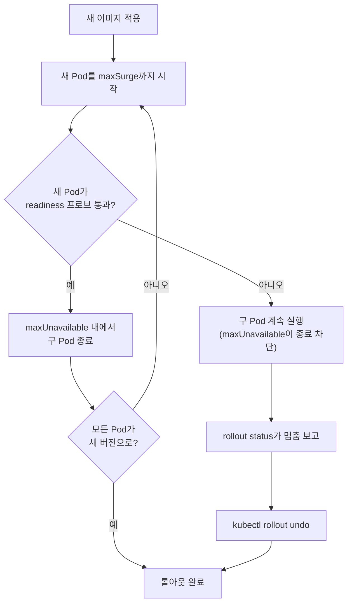

# 롤링 업데이트·롤백·헬스체크(readiness/liveness)

## 학습 목표
- readiness/liveness 프로브로 헬스체크를 구성한다.
- `kubectl rollout`으로 배포 상태를 확인하고 롤백한다.
- 안정적인 무중단 롤링 배포를 검증한다.

## 본문

### 이 강의가 가장 중요한 이유

파이프라인이 이제 자동으로 배포한다. 하지만 "자동"이 "무분별"해지면 위험하다 — 사용자에게 아무런 안전망 없이 깨진 버전을 바로 내보내는 것이 된다. 이 강의는 롤아웃을 **안전**하게 만드는 것에 관한 것이다. 버전을 점진적으로 교체해서 사용자가 다운타임을 경험하지 않게 하고, 쿠버네티스에게 정상 Pod와 비정상 Pod를 구별하는 방법을 가르치며, 잘못된 릴리스를 몇 초 만에 되돌릴 수 있게 한다. 이것이 사람들이 자동화된 파이프라인을 프로덕션에서 신뢰하게 만드는 기능들이다.

### 롤링 업데이트: 점진적 교체

Deployment의 이미지를 변경하면(6강), 쿠버네티스는 기본적으로 **롤링 업데이트** 전략을 사용한다. 구 Pod를 모두 종료하고 새것을 시작하는(이는 중단을 일으킨다) 대신, *점진적으로* 교체한다. 새 Pod를 몇 개 시작하고, 준비됐는지 기다리고, 구 Pod를 몇 개 종료하고, 반복 — 모든 Pod가 새 버전을 실행할 때까지. 그 동안 항상 작동하는 세트가 트래픽을 받는다. 이것이 실제 "무중단 배포"의 의미다.

두 개의 조절 노브가 속도를 제어하며, 자주 혼동되므로 정확히 짚어보겠다. 둘 다 Deployment의 `strategy.rollingUpdate` 아래에 있다.

- **`maxUnavailable`** — 업데이트 중 어느 순간에도 *내려가도 되는*(원하는 수 아래로 내려갈 수 있는) Pod 수. 최대 용량 아래로 얼마나 떨어질 수 있는지를 제한한다.
- **`maxSurge`** — 업데이트 중 원하는 수 *위로* 허용되는 *추가* Pod 수. 원하는 크기 위로 얼마나 올라갈 수 있는지를 제한한다.

둘 다 기본값은 `25%`다. **4개 레플리카**와 기본값으로 구체적인 예를 들면:

- `maxUnavailable: 25%` × 4 = 1 → 한 번에 최대 1개 Pod 다운, 즉 최소 3개는 서비스 중.
- `maxSurge: 25%` × 4 = 1 → 최대 1개 추가 Pod, 즉 전체가 5개(4의 125%)를 초과하지 않는다.

퍼센트 또는 절대 정수를 사용할 수 있다. 느리고 더 안전한 롤아웃을 원하면 둘 다 작은 값으로 설정한다.

```yaml
spec:
  replicas: 4
  strategy:
    type: RollingUpdate
    rollingUpdate:
      maxUnavailable: 1
      maxSurge: 1
```

> 기억법: **`maxSurge` = 위로 얼마나 올라갈 수 있는가; `maxUnavailable` = 아래로 얼마나 떨어질 수 있는가.** Surge는 일시적으로 용량을 추가하고, unavailable은 일시적으로 제거한다. 함께 롤아웃이 동작하는 창을 제한한다.

롤링 업데이트의 흐름은 다음과 같다. 새 Pod를 surge 한도까지 생성하고, readiness 체크를 통과할 때까지 기다리고, unavailable 한도 내에서 구 Pod를 종료하고, 반복한다. 아래 다이어그램은 새 Pod가 준비 상태가 되지 않을 때 어떻게 되는지도 보여준다.



### 헬스체크: 쿠버네티스가 Pod 정상 여부를 아는 방법

롤링 업데이트가 안전하려면 쿠버네티스가 새 Pod가 트래픽을 전환하기 전에 실제로 정상인지 판단할 수 있어야 한다. 이것이 **프로브**의 역할이다. 세 가지가 있으며, 혼동하면 안 되는 두 가지는 readiness와 liveness다.

**Readiness 프로브 — "이 Pod가 *지금 당장* 트래픽을 받을 수 있는가?"**
Readiness 프로브는 Pod가 Service의 트래픽 대상 풀에 있어야 하는지를 결정한다. 프로브가 **실패**하면 쿠버네티스는 Pod를 **죽이지 않는다** — 단지 Service 엔드포인트에서 Pod IP를 *제거*해서 새 요청이 라우팅되지 않게 한다. 다시 통과하면 Pod가 다시 추가된다. 이것이 정확히 롤링 업데이트를 게이팅하는 것이다. 새 Pod는 readiness 프로브를 통과한 후에만(예: 웜업이 완료되고 데이터베이스에 연결된 후) 사용자 트래픽을 받기 시작한다.

**Liveness 프로브 — "이 Pod가 깨졌고 *재시작*이 필요한가?"**
Liveness 프로브는 컨테이너가 살아있고 정상적인지를 결정한다. 프로브가 **실패**하면 쿠버네티스가 **컨테이너를 죽이고 재시작**한다. 데드락이나 멈췄지만 충돌하지 않은 프로세스 같은 상태에서 복구된다 — 전형적인 "껐다 켜봐" 상황이다.

이 구분이 이 강의의 핵심이므로 명확히 표현하겠다.

> **Readiness는 트래픽을 제어하고, Liveness는 재시작을 제어한다.** Readiness 프로브 실패는 "아직 여기로 요청 보내지 마라"(Pod는 계속 실행되지만 순환에서 제외). Liveness 프로브 실패는 "이것은 깨졌다 — 재시작하라." 둘을 바꾸면 전형적이고 고통스러운 실수가 된다. 너무 공격적인 *liveness* 프로브는 단지 웜업이 느린 Pod를 재시작해서 부하 아래서 클러스터 전체 재시작 폭풍으로 이어질 수 있다.

세 번째 프로브인 **startup 프로브**는 느리게 시작하는 앱(구형 Java 서비스를 생각해 보라)이 부팅을 마칠 때까지 liveness와 readiness 프로브를 유예시킨다 — 부팅하는 데 시간이 걸리는 Pod를 죽이지 않도록.

두 핵심 프로브를 가진 Deployment 컨테이너 예시다(프로브는 HTTP 체크 외에도 TCP나 명령 실행 방식도 있다).

```yaml
        livenessProbe:
          httpGet:
            path: /healthz       # 앱이 살아있는가? 아니면 재시작
            port: 3000
          initialDelaySeconds: 10
          periodSeconds: 10
        readinessProbe:
          httpGet:
            path: /ready         # 앱이 트래픽 받을 준비가 됐는가? 아니면 트래픽 보류
            port: 3000
          initialDelaySeconds: 5
          periodSeconds: 5
```

`initialDelaySeconds`는 첫 번째 체크 전에 기다리는 시간이고, `periodSeconds`는 반복 주기다. 좋은 실천은 의존성(DB, 캐시)에 도달 가능할 때만 200을 반환하는 경량 `/ready` 엔드포인트와, 프로세스 자체가 정상적으로 작동하는 한 200을 반환하는 `/healthz`를 두는 것이다.

프로브와 롤링 업데이트는 깊이 연결되어 있다. **readiness 프로브 없이는 컨테이너가 시작하는 순간 Pod가 준비됐다고 가정하고** 즉시 트래픽을 전환한다 — 앱이 사용 가능해지는 데 10초가 필요해도. 그 말은 매 배포마다 사용자가 오류를 경험한다는 것이다. Readiness를 설정하면 롤아웃이 실제로 기다린다.

### 롤아웃 확인과 제어

`kubectl`은 롤아웃에 대한 실시간 가시성과 제어를 제공한다(Deployment, StatefulSet, DaemonSet에 모두 동작한다).

```bash
kubectl rollout status deployment/my-app     # 롤아웃이 완료될 때까지(또는 실패할 때까지) 블로킹
kubectl rollout history deployment/my-app     # 과거 리비전 목록
kubectl rollout pause deployment/my-app        # 롤아웃을 중간에 일시정지
kubectl rollout resume deployment/my-app       # 재개
```

`rollout status`는 파이프라인(6강)에서 이미 성공을 기다리는 데 사용한다. `pause`/`resume`으로 롤아웃 중간에 문제를 발견하면 멈추고 확인한 뒤 계속할 수 있다.

### 롤백: 명령 하나로 잘못된 릴리스 되돌리기

이것이 자동 배포를 참을 수 있게 만드는 안전망이다. 쿠버네티스는 Deployment의 리비전 기록을 유지하므로 되돌릴 수 있다.

```bash
kubectl rollout undo deployment/my-app                  # 이전 리비전으로
kubectl rollout undo deployment/my-app --to-revision=3  # 특정 리비전으로
```

여기서 readiness 프로브와의 아름다운 상호작용이 있다. 존재하지 않거나 시작 시 충돌하는 이미지 태그를 배포했다고 가정하자. 새 Pod가 readiness를 통과하지 못하므로 — `maxUnavailable` 때문에 — 쿠버네티스가 **정상적인 구 Pod를 종료하지 않는다**. 구 버전이 계속 전체 트래픽을 처리하고, `kubectl rollout status`가 롤아웃이 기다리며 멈췄다고 보고하며, `kubectl rollout undo`로 나쁜 Pod를 제거한다. 사용자는 아무것도 눈치채지 못했다. 이것이 이 강의 전체의 결실이다. 점진적 롤아웃 + 헬스체크 + 명령 하나로 롤백 = 두려움 없이 배포할 수 있다.

### 파이프라인에 통합하기

실제로는 이렇게 연결한다. 매니페스트에 프로브를 설정해서(실제 헬스 기반으로 롤아웃이 게이팅되게), Jenkins가 `kubectl rollout status`를 실행해서 멈춘 롤아웃이 빌드를 실패시키게 하고, `kubectl rollout undo`를 준비해 두는 것이다 — 온콜 엔지니어가 수동으로 실행하거나, 더 성숙하게는 롤아웃 실패 시 자동화한다. (더 발전된 경로는 Git에 revert를 커밋하고 GitOps 컨트롤러가 조정하도록 하는 것이지만, 내장 `rollout undo`가 직접적인 도구이며 여기서 필요한 전부다.)

## 핵심 정리
- 롤링 업데이트는 Pod를 점진적으로 교체해서 항상 작동하는 버전이 트래픽을 받게 한다. `maxSurge`는 원하는 수 위로 얼마나 올라갈 수 있는지를, `maxUnavailable`은 아래로 얼마나 떨어질 수 있는지를 제한한다(둘 다 기본값 25%).
- **Readiness 프로브 = 트래픽 제어**: 실패 시 Pod가 Service에서 제거된다(죽지 않음) — 이것이 롤아웃을 게이팅하는 것이다. **Liveness 프로브 = 재시작 제어**: 실패 시 쿠버네티스가 컨테이너를 재시작한다. 둘을 혼동하지 마라.
- Readiness 프로브 없이는 쿠버네티스가 Pod가 시작하는 순간 트래픽을 라우팅해서 배포마다 오류가 발생한다. Startup 프로브는 느리게 부팅하는 앱을 위해 다른 프로브를 지연시킨다.
- `kubectl rollout status/history/pause/resume`으로 가시성과 제어를, `kubectl rollout undo`로 명령 하나에 이전 리비전으로 되돌릴 수 있다.
- 점진적 롤아웃 + readiness 게이팅 + 명령 하나 롤백이 합쳐지면 자동 배포가 안전해진다. 깨진 릴리스는 구 버전을 서비스 중 상태로 두고 쉽게 취소된다.
