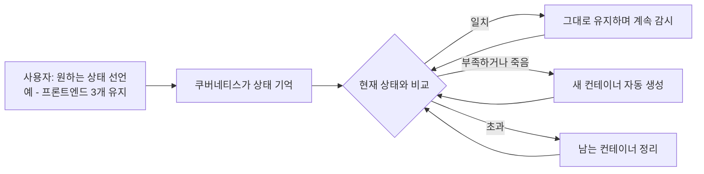
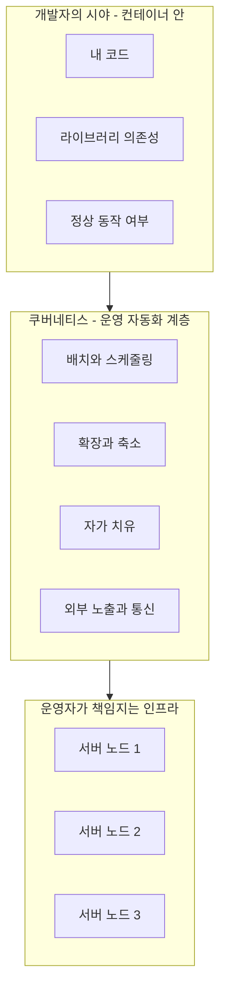

# 쿠버네티스란 무엇인가 - 왜 컨테이너 오케스트레이션이 필요한가

## 학습 목표
- 컨테이너만으로 서비스를 운영할 때 마주치는 한계(확장, 장애 복구, 배포)를 이해한다
- 쿠버네티스가 해결하는 문제와 핵심 가치를 자신의 말로 설명할 수 있다
- 오케스트레이션이라는 개념을 일상 비유로 직관적으로 이해한다

## 본문

### 왜 이걸 배우나요?

"쿠버네티스로 전환해야 한다", "우리도 컨테이너를 도입하자" 같은 말을 한 번쯤 들어보셨을 겁니다. 그런데 정작 *왜* 필요한지를 모른 채 따라가면, 복잡한 용어의 늪에 빠지기 쉽습니다. 이번 강의에서는 명령어나 설정 파일은 잠시 미뤄두고, **"애초에 무슨 문제를 풀려고 쿠버네티스가 등장했는가"** 라는 가장 근본적인 질문부터 함께 풀어보겠습니다. 이 출발점을 제대로 잡으면, 앞으로 배울 모든 개념이 "왜 이게 있는지" 자연스럽게 이해됩니다.

### 컨테이너부터 빠르게 짚고 가기

먼저 **컨테이너(Container)** 가 무엇인지 한 줄로 정리해 봅시다. 컨테이너란 *애플리케이션과 그것이 돌아가는 데 필요한 모든 것(코드, 라이브러리, 설정)을 하나로 포장한 독립 실행 단위* 입니다.

비유하자면 이렇습니다. 한 건물에 임차인을 들이려는데, 입주할 때마다 벽을 세우고 인테리어 공사를 다시 하면 너무 번거롭겠죠. 그래서 **이사 갈 사람이 살림이 다 갖춰진 '컨테이너 박스'를 통째로 가지고 와서 건물 안에 쏙 넣는다**고 상상해 보세요. 공사가 필요 없고, 나갈 때는 박스만 들어내면 됩니다. 컨테이너 기술이 바로 이렇습니다. 예전의 **가상 머신(VM)** 방식이 매번 벽을 세우는 무거운 공사였다면, 컨테이너는 가볍고 빠르게 옮길 수 있는 포장 박스입니다.

> 컨테이너 덕분에 "내 PC에서는 잘 됐는데 서버에서는 안 돼요"라는 고질적인 문제가 크게 줄었습니다. 실행 환경을 통째로 싸서 옮기기 때문입니다.

### 컨테이너 하나는 쉽다, 그런데 수백 개라면?

문제는 여기서 시작됩니다. 요즘 서비스는 하나의 거대한 프로그램이 아니라, 기능별로 잘게 쪼갠 작은 서비스들의 모음입니다. 이를 **마이크로서비스(Microservice)** 라고 부릅니다. 예를 들어 쇼핑몰 하나에도 화면을 그리는 프론트엔드, 주문을 처리하는 백엔드, 데이터를 보관하는 데이터베이스가 각각 따로 돌아갑니다. 트래픽이 몰리면 잘 나가는 메뉴(예: 프론트엔드)만 여러 개로 복제해야 하니, 컨테이너 개수는 금세 수십, 수백, 때로는 수천 개로 불어납니다.

이렇게 많은 컨테이너를, 그것도 여러 대의 서버에 걸쳐 사람이 손으로 관리한다고 상상해 보세요. 다음과 같은 일을 *직접* 챙겨야 합니다.

- 어느 서버에 어떤 컨테이너를 띄울지 일일이 결정하기
- 컨테이너가 죽으면 한밤중에라도 깨어나 다시 살리기
- 트래픽이 몰리면 수동으로 복제본을 늘리고, 빠지면 줄이기
- 새 버전을 배포할 때 서비스가 끊기지 않도록 조심조심 교체하기
- 컨테이너끼리 서로를 어떻게 찾아 통신할지 직접 연결해 주기

스크립트나 자체 제작 도구로 어찌어찌 해볼 수는 있지만, 규모가 커지면 곧 한계에 부딪히고 결국 사람이 감당할 수 없는 수준이 됩니다. **바로 이 지점에서 컨테이너 오케스트레이션이 등장합니다.**

### 오케스트레이션 - 지휘자 비유로 이해하기

**오케스트레이션(Orchestration)** 이라는 단어는 오케스트라에서 왔습니다. 수십 명의 연주자(컨테이너)가 각자 악기를 들고 있어도, 이들을 조화롭게 이끄는 **지휘자**가 없으면 음악이 아니라 소음이 됩니다. 컨테이너 오케스트레이션 도구는 바로 이 *지휘자* 역할을 합니다.

또 다른 비유를 들어볼까요. 당신이 여러 채의 건물을 가진 건물주라고 해봅시다. 건물마다 컨테이너를 만들고 실행해 주는 도구(이것이 바로 **도커(Docker)** 입니다 — 컨테이너를 빌드하고 실행하는 대표적인 도구입니다)를 한 벌씩 깔아 두었습니다. 처음엔 괜찮았지만 건물이 늘어나니, 모든 건물을 일일이 돌며 "여기엔 이걸 띄우고, 저긴 저걸 띄워라"라고 직접 지시하느라 정신이 없습니다. 그래서 **유능한 총괄 매니저**를 한 명 고용합니다. 그 매니저의 이름이 바로 **쿠버네티스**입니다.

이제 당신은 매니저에게 큰 그림만 전달하면 됩니다. "프론트엔드는 3개 띄워두고, 백엔드는 2개 유지해줘." 그러면 쿠버네티스가 알아서 어느 서버에 배치할지 정하고, 하나가 죽으면 조용히 다시 살려 항상 그 개수를 맞춰 줍니다. 사소한 것 하나하나 명령하지 않아도 되는 이유는, 쿠버네티스가 **원하는 상태(desired state)** 를 기억하고 현실을 거기에 끊임없이 맞추기 때문입니다.

아래 흐름도처럼, 쿠버네티스는 우리가 선언한 "원하는 상태"와 실제 현재 상태를 끊임없이 비교하며 둘이 어긋나면 스스로 행동에 나섭니다. 이 반복 루프가 바로 선언형 관리의 핵심입니다.

### 쿠버네티스가 보장하는 핵심 가치

쿠버네티스는 구글이 만들어 오픈소스로 공개한 컨테이너 오케스트레이션 플랫폼입니다. 도커든 다른 기술이든 컨테이너의 종류를 가리지 않고, 물리 서버·가상 머신·클라우드 등 어떤 환경에서도 컨테이너 무리를 관리해 줍니다. 그 핵심 가치는 다음 네 가지로 요약할 수 있습니다.

> 한 가지 오해를 짚고 갑시다. 흔히 "쿠버네티스는 도커 위에서 돈다"고 생각하지만, 실제로 쿠버네티스는 **CRI(Container Runtime Interface)** 라는 표준 규격을 통해 컨테이너 런타임과 연결되며, 오늘날 표준 런타임은 주로 **containerd**나 **CRI-O**입니다. 도커를 런타임으로 직접 끼워 쓰던 방식(dockershim)은 쿠버네티스 1.24부터 제거되었습니다. 다만 **도커로 빌드한 이미지는 표준(OCI) 이미지라 그대로 잘 동작**하므로, "도커로 이미지를 만든다"는 개발 워크플로 자체는 달라지지 않습니다.

1. **자가 치유(Self-healing)와 고가용성** — 컨테이너나 노드가 죽으면 자동으로 다시 띄우거나 다른 정상 노드로 옮겨, 사용자가 느끼는 다운타임을 최소화합니다. 항상 "원하는 개수"를 유지합니다.
2. **확장성(Scalability)** — 트래픽이 몰리면 복제본을 늘리고, 한가하면 줄입니다. 쿠버네티스는 각 서버의 남은 자원을 보고 *어디에 띄우는 게 가장 효율적인지* 판단해 배치합니다. 이 똑똑한 배치 결정을 **스케줄링**이라고 합니다.
3. **서비스 디스커버리와 로드 밸런싱** — 컨테이너는 자주 죽고 새로 태어나며, 그때마다 주소(IP)가 바뀝니다. 쿠버네티스는 변하지 않는 고정 창구를 앞에 세워, 뒤의 컨테이너가 바뀌어도 다른 서비스가 항상 같은 주소로 접속하고 트래픽을 고르게 나눠 받게 해줍니다.
4. **선언적 구성(Declarative Configuration)을 통한 상태 관리** — 위의 세 가지 가치를 한데 떠받치는 가장 근본적인 원리입니다. 쿠버네티스에서 우리는 "어떻게 하라(How)"가 아니라 "최종적으로 이런 모습이어야 한다(What)"라고 **원하는 상태를 선언**합니다. 이렇게 선언된 구성은 클러스터의 장부인 **etcd** 에 저장되고, 쿠버네티스의 컨트롤러들이 *실제 상태가 선언된 상태와 같아지도록 끊임없이 비교·교정*합니다. 이 메커니즘의 정식 명칭이 **원하는 상태 조정(Desired State Reconciliation)** 이며, 그 핵심 동작 단위를 **조정 루프(reconciliation loop)** 라고 부릅니다. 그래서 노드가 다운되거나 컨테이너가 죽어 실제 상태가 선언된 구성과 어긋나면, 컨트롤러가 자동으로 원래 모습으로 되돌립니다. etcd에 담긴 이 구성을 백업해 두면 **클러스터의 구성 상태(어떤 리소스를 어떻게 띄울지)** 를 마지막 선언 시점으로 복원할 수 있습니다 — 다만 이는 어디까지나 '구성'의 복원이지, 바로 아래에서 설명할 애플리케이션 데이터의 복원이 아닙니다.

> 주의: 쿠버네티스가 자동으로 되돌려 주는 것은 etcd에 선언된 "구성 상태(어떤 앱을 몇 개 띄울지)"이지, 그 앱이 다루던 **애플리케이션 데이터(데이터베이스 내용, 사용자가 올린 파일 등)가 아닙니다.** 데이터까지 안전하게 지키려면 퍼시스턴트 볼륨 백업, 데이터베이스 백업 같은 **별도의 데이터 보호 솔루션**이 반드시 필요합니다. "앱은 되살아나도 데이터는 날아갈 수 있다"는 점은 초급 단계에서 꼭 구분해 두세요.

### 개발자와 운영자의 시야 차이

마지막으로 한 가지 관점을 더 짚겠습니다. 같은 시스템을 봐도 **개발자**와 **운영자**의 시야는 다릅니다. 개발자는 컨테이너 *안*에 집중합니다. 내 코드, 의존성, 동작이 제대로 도는지에만 관심이 있죠. 반면 운영자는 그 아래 전체 그림을 봅니다. 어느 서버에 무엇을 배포하고, 어떻게 확장하고, 외부에 어떻게 노출하고, 장애를 어떻게 감지할지를 책임집니다.

아래 계층도처럼, 개발자는 위쪽의 "내 컨테이너"에 집중하고, 쿠버네티스가 그 아래 운영 영역을 맡아 여러 서버에 흩어진 컨테이너 무리를 대신 다스립니다.

쿠버네티스는 이 운영자의 무거운 짐을 대부분 자동화해 줍니다. 그래서 개발자는 "내 컨테이너"에만 집중할 수 있고, 운영팀은 수백 개의 컨테이너를 사람의 야근이 아니라 **선언된 규칙**으로 다스릴 수 있게 됩니다. 흥미로운 점은, 이렇게 운영이 코드처럼 선언으로 다뤄지면서 개발자도 배포·확장 같은 운영 영역에 자연스럽게 관여하게 된다는 것입니다. 개발(Dev)과 운영(Ops)의 경계가 흐려지는 **DevOps** 문화가 쿠버네티스와 함께 빠르게 퍼진 이유가 여기에 있습니다. 최근 SRE(사이트 신뢰성 엔지니어) 같은 역할이 주목받는 것도 이런 자동화된 운영 위에서 안정성을 설계하는 일이 중요해졌기 때문입니다.

## 핵심 요약
- 컨테이너는 앱과 실행 환경을 통째로 포장한 가볍고 빠른 단위지만, 컨테이너가 수백 개로 늘고 여러 서버에 흩어지면 사람이 손으로 관리하기란 불가능에 가깝다.
- 이 문제를 풀기 위한 도구가 **컨테이너 오케스트레이션**이고, 그 사실상의 표준이 구글이 만든 오픈소스 플랫폼 **쿠버네티스**다.
- 쿠버네티스는 오케스트라의 지휘자(또는 건물 총괄 매니저)처럼, 우리가 "원하는 상태"만 알려주면 배치·복제·자가 치유·통신 연결을 알아서 맞춰 준다.
- 핵심 가치는 자가 치유와 고가용성, 확장성과 스마트 스케줄링, 서비스 디스커버리·로드 밸런싱, 그리고 이 모두를 떠받치는 **선언적 구성(Declarative Configuration)** 이다. 쿠버네티스는 etcd에 선언된 구성과 실제 상태를 끊임없이 맞추는 **원하는 상태 조정(Desired State Reconciliation)** 으로 클러스터를 복구한다. 단, 애플리케이션의 **데이터 자체는 별도의 백업 솔루션**으로 지켜야 한다.
- 이 "왜"를 이해했다면, 다음 강의에서 다룰 쿠버네티스의 내부 구조(아키텍처)가 훨씬 자연스럽게 읽힐 것이다.
