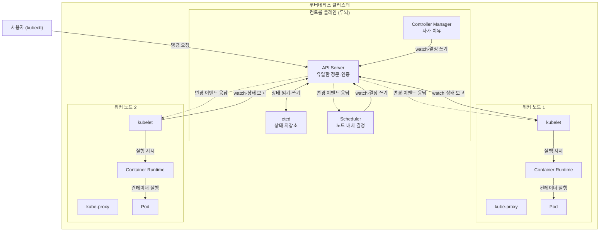
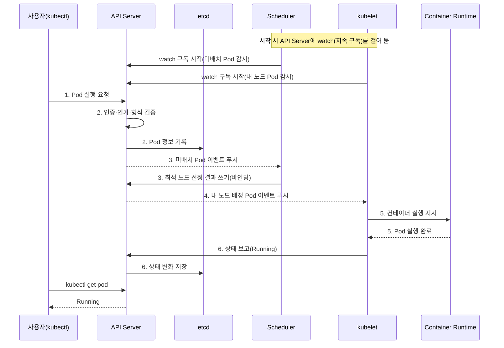

# 쿠버네티스 아키텍처 - 컨트롤 플레인과 워커 노드

## 학습 목표
- 클러스터, 마스터(컨트롤 플레인), 워커 노드가 각각 무슨 역할을 하는지 구분한다.
- API Server, Scheduler, etcd, kubelet 등 핵심 구성요소가 무엇을 담당하는지 이해한다.
- 사용자가 명령을 내렸을 때 그 요청이 클러스터 안에서 어떤 순서로 처리되는지 그릴 수 있다.

## 본문

### 왜 아키텍처를 알아야 할까

1강에서 우리는 "쿠버네티스가 컨테이너를 알아서 배치하고, 죽으면 다시 살려준다"고 배웠습니다. 그런데 그 "알아서"의 정체를 모르면, 막상 무언가 잘못됐을 때 어디를 들여다봐야 할지 막막합니다. Pod가 안 뜰 때, 어떤 부품이 일을 안 하고 있는 걸까요?

쿠버네티스는 마법 상자가 아니라, **여러 개의 작은 프로그램(프로세스)이 서로 통신하며 협력하는 시스템**입니다. 이 구조를 한 번 머릿속에 그려 두면, 이후 모든 실습이 훨씬 쉬워집니다. 이번 강의는 직접 명령을 치는 실습은 없지만, 앞으로의 실습을 떠받치는 가장 중요한 밑그림입니다.

비유하자면 쿠버네티스 클러스터는 **하나의 큰 물류 창고 회사**와 같습니다. 실제로 물건을 나르고 쌓는 작업자들이 있는 창고(워커 노드)가 있고, 그 작업자들에게 "무엇을, 어디에, 몇 개 둘지" 지시하는 본사 관제실(컨트롤 플레인)이 있습니다.

### 클러스터, 컨트롤 플레인, 워커 노드

먼저 가장 큰 그림부터 봅시다.

- **클러스터(Cluster)**: 여러 대의 머신(서버)을 하나로 묶어 컨테이너 앱을 실행하는 전체 시스템입니다. 회사 전체라고 보면 됩니다. 한 조직이 운영 환경용, 테스트 환경용처럼 여러 클러스터를 동시에 운영하기도 합니다.
- **노드(Node)**: 클러스터를 구성하는 개별 머신 한 대입니다. 클라우드의 가상 머신(EC2 등)일 수도, 물리 서버일 수도, 심지어 여러분의 노트북일 수도 있습니다.

이 노드들은 역할에 따라 두 종류로 나뉩니다.

- **컨트롤 플레인(Control Plane, 옛 명칭 '마스터')**: 클러스터 전체를 관리하고 **결정을 내리는 두뇌**입니다. 사용자 요청을 받고, 어떤 컨테이너를 어디에 띄울지 정하고, 클러스터의 상태 데이터를 보관하며, 장애에 반응합니다. 직접 앱을 실행하지는 않습니다 — 명령하는 쪽입니다.
- **워커 노드(Worker Node)**: 실제로 여러분의 애플리케이션이 **돌아가는 작업장**입니다. 컨트롤 플레인의 지시를 받아 컨테이너를 실제로 띄우고 유지합니다.

> 운영 환경에서는 두뇌가 멈추면 클러스터 전체가 위험하므로, 컨트롤 플레인을 여러 노드에 분산 배치해 고가용성을 확보합니다. 반면 테스트용이라면 컨트롤 플레인과 워커를 한 머신에 몰아넣어도 됩니다.

한 가지 중요한 사실: **워커 노드는 컨테이너를 직접 실행하지 않고 "Pod"라는 단위를 실행합니다.** 도커에서 최소 단위가 컨테이너였다면, 쿠버네티스의 최소 배포 단위는 Pod입니다. Pod 하나 안에는 한 개 이상의 컨테이너가 들어가며, 앱을 더 늘리고 싶으면 Pod를 더 띄우면 됩니다. (Pod는 3강에서 자세히 다룹니다.)

### 컨트롤 플레인의 핵심 부품 4가지

관제실(컨트롤 플레인) 안에는 역할이 다른 네 개의 프로그램이 있습니다.

**1. API Server (관제실의 안내데스크)**
클러스터로 들어오는 모든 요청이 거쳐 가는 **유일한 정문**입니다. 우리가 `kubectl`(쿠버네티스 명령줄 도구)이나 대시보드로 명령을 내리면, 실제로는 이 API Server와 대화하는 것입니다. 심지어 워커 노드의 부품들조차 API Server를 통해서만 소통합니다. 정문인 만큼 **인증(누구인지 확인)과 인가(권한이 있는지 확인)**, 요청이 올바른 형식인지 검증하는 일도 여기서 합니다.

**2. etcd (회사의 장부)**
클러스터의 모든 상태 데이터를 저장하는 **키-값 저장소**입니다. 어떤 노드가 있고, 어떤 Pod가 어디서 돌고 있으며, 사용자가 무엇을 요청했는지 — 이 모든 "현재 사실"이 etcd에 기록됩니다. 그래서 etcd를 클러스터의 **단일 진실 공급원(single source of truth)**이라 부릅니다. Pod를 만들면 그 정보가 etcd에 기록되고, 지우면 etcd에서도 지워집니다.

**3. Scheduler (배치 담당자)**
새로 만들어야 할 Pod를 **어느 워커 노드에 올릴지 결정**합니다. 단순히 빈자리에 넣는 게 아니라, Pod가 요구하는 CPU·메모리 양, 노드의 여유 자원, "이 Pod는 저 Pod와 가까이 둬라" 같은 제약 조건을 종합해 가장 적합한 노드를 고릅니다. 한정된 서버에 여러 앱을 최적으로 욱여넣는 이른바 '짐 싸기(bin packing) 문제'를 푸는 역할입니다.

**4. Controller Manager (현장 감독)**
시스템을 항상 **사용자가 원하는 상태(desired state)로 되돌리려는** 백그라운드 프로세스입니다. 예를 들어 Deployment나 ReplicaSet으로 "Pod 3개가 떠 있어야 한다"고 선언했는데 하나가 죽으면, 컨트롤러가 이를 감지하고 부족한 만큼 새 Pod 객체를 만들어 채웁니다. 노드가 다운되면 감지하는 노드 컨트롤러, 배포를 관리하는 디플로이먼트 컨트롤러처럼, 자원 종류마다 전담 컨트롤러가 돌아갑니다. 쿠버네티스의 '자가 치유'가 바로 여기서 나옵니다.

> Controller Manager는 "선언한 개수만큼 Pod 객체가 존재하는가"를 맞추는 역할이지, 개별 Pod를 어느 노드에서 직접 기동시키는 주체가 아닙니다. 컨트롤러가 만든 Pod도 처음엔 노드가 정해지지 않은 상태로, Scheduler가 노드를 골라준 뒤에야 그 노드의 kubelet이 실제로 띄웁니다.

> 클라우드에서 운영한다면 Cloud Controller Manager가 추가로 붙어, 노드용 가상 머신 생성 같은 작업을 클라우드 제공자(AWS·GCP·Azure)에게 위임합니다.

### 워커 노드의 핵심 부품 3가지

작업장(워커 노드)에는 Pod를 실제로 돌리기 위한 세 가지 프로그램이 있습니다.

**1. kubelet (현장 작업반장)**
모든 워커 노드에서 도는 에이전트입니다. 컨트롤 플레인(API Server)과 통신해 "이 노드에서 어떤 Pod를 돌려라"는 지시를 받고, 그 Pod가 실제로 살아 건강하게 돌아가는지 책임집니다. 노드와 두뇌를 잇는 연락책이라고 보면 됩니다.

**2. Container Runtime (컨테이너 실행 엔진)**
실제로 컨테이너를 실행하는 소프트웨어입니다. 이미지를 레지스트리에서 내려받고, 컨테이너를 시작·중지하며 자원을 관리합니다. 흔히 도커를 떠올리지만, 도커는 여러 런타임 중 하나일 뿐입니다. 쿠버네티스는 표준 규격(CRI)만 만족하면 containerd, CRI-O 등 어떤 런타임이든 끼워 쓸 수 있습니다. kubelet이 이 런타임에게 실제 실행을 지시합니다.

**3. kube-proxy (네트워크 교통정리)**
각 노드의 네트워크 규칙을 관리해, 클러스터 안팎의 트래픽이 올바른 Pod로 전달되도록 라우팅하고 부하를 분산합니다.

지금까지 설명한 클러스터의 전체 구성을 한 장으로 정리하면 아래 구성도와 같습니다. 컨트롤 플레인의 4대 부품과 워커 노드의 3대 부품이 각각 어디에 속하는지, 그리고 **모든 통신 화살표가 결국 API Server를 향한다는 점**을 눈으로 확인해 보세요. Scheduler·Controller·각 노드의 kubelet은 API Server를 **watch(지속 구독)** 하고, 변경이 생기면 API Server가 그 구독으로 정보를 되돌려 줍니다. 즉 부품들이 API Server에 "물어보는" 방향으로 연결되어 있고, API Server가 응답·이벤트를 보내 주는 구조입니다.

### 사용자 명령이 처리되는 흐름

이제 부품들이 어떻게 협력하는지, "Pod 하나를 만들어줘"라는 요청이 클러스터를 흐르는 과정을 따라가 봅시다. **핵심은 모든 소통이 API Server를 거친다는 점입니다.** 흐름은 다음과 같습니다.

1. 사용자가 `kubectl`로 "이 컨테이너를 Pod로 실행해줘"를 **API Server**에 요청한다.
2. API Server가 인증·인가와 요청 형식을 검증한 뒤, 이 Pod 정보를 **etcd**에 기록한다. 이 시점의 Pod는 아직 어느 노드에서 돌지 정해지지 않은 **Pending(대기) 상태**다.
3. 아직 노드가 정해지지 않은 이 Pending Pod를 **Scheduler**가 발견하고, 자원 상황을 분석해 최적의 워커 노드를 골라 "이 Pod는 이 노드에서 돌려라"라고 API Server에 알린다(바인딩). 이 결정도 etcd에 기록된다.
4. 선택된 워커 노드의 **kubelet**이 API Server를 계속 지켜보다가(watch), 자기 노드에 배정된 Pod를 발견하고 직접 실행에 들어간다.
5. kubelet이 노드의 **Container Runtime**에게 지시하고, 런타임이 이미지를 내려받아 컨테이너를 실행한다 → Pod가 뜬다.
6. kubelet이 "이 Pod는 Running 상태"라고 API Server에 보고하고, 그 상태 변화가 다시 etcd에 저장된다. 이제 사용자가 `kubectl get pod`로 확인하면 "Running"이 보인다.

여기서 컨트롤 플레인의 역할 분담을 한 문장으로 정리하면 이렇습니다 — **컨트롤러가 '무엇을 몇 개' 보장하고, Scheduler가 '어디에' 둘지 결정하며, kubelet이 '실제 실행'을 맡습니다.** 그래서 단일 Pod를 직접 만든 위 흐름에는 **Controller Manager가 등장하지 않습니다.** 우리가 Pod 하나를 콕 집어 만들었으니 "몇 개를 보장할지"를 챙기는 컨트롤러가 끼어들 일이 없고, 곧바로 Scheduler가 노드를 정한 뒤 그 노드의 kubelet이 스스로 Pod를 띄우기 때문입니다.

Controller Manager가 일하는 때는 따로 있습니다 — Deployment나 ReplicaSet처럼 "Pod를 몇 개 유지하라"고 선언했을 때, 현재 개수가 모자라면 부족한 만큼 Pod **객체를 생성**하는 일을 합니다. 단, 컨트롤러는 Pod 객체를 만들어 "개수"만 채울 뿐, 그 Pod를 어느 노드에 둘지는 정하지 않습니다. 그래서 컨트롤러가 만든 Pod도 처음엔 노드 미정의 Pending 상태로 태어나, 위 흐름의 **3단계(Scheduler의 노드 배치)부터 6단계(kubelet 실행·보고)까지를 똑같이 거쳐** 비로소 노드 위에 떠오릅니다. Scheduler 단계는 어떤 경로로 만들어진 Pod든 건너뛸 수 없는 필수 관문입니다.

이 6단계를 시간 순서대로 그리면 아래 시퀀스 다이어그램과 같습니다. 여기서 꼭 기억할 점은 Scheduler와 kubelet이 매번 API Server에 "새 일감 있나요?"라고 물어보는 게 아니라, **처음에 한 번 watch(지속 구독)를 걸어 두면 변경이 생길 때마다 API Server가 그쪽으로 이벤트를 밀어 보낸다**는 것입니다. 그래서 화살표가 단발성 조회가 아니라 끊기지 않는 구독 위에서 흐릅니다.

여기서 한 가지 더. 만약 Deployment 같은 컨트롤러로 띄운 Pod가 갑자기 죽으면 어떻게 될까요? **Controller Manager**가 "원하는 상태(Pod N개 실행 중)와 현재 상태(N-1개)가 다르다"는 것을 감지하고 부족한 Pod 객체를 새로 만듭니다. 이때도 새 Pod는 노드 미정의 Pending 상태로 태어나므로, **Scheduler가 노드를 고르고(3단계) → kubelet이 실행·보고(4~6단계)** 하는 동일한 경로를 다시 타고 새 노드에 떠오릅니다. 이것이 우리가 손대지 않아도 클러스터가 스스로 복구되는 원리입니다.

## 핵심 요약
- **클러스터**는 여러 노드의 묶음이며, 노드는 결정을 내리는 **컨트롤 플레인**과 앱을 실제 실행하는 **워커 노드**로 나뉜다.
- 컨트롤 플레인 4대 부품: **API Server**(유일한 정문·인증), **etcd**(상태를 보관하는 단일 진실 공급원), **Scheduler**(Pod를 어느 노드에 둘지 결정), **Controller Manager**(선언한 개수만큼 Pod 객체를 맞추는 자가 치유).
- 워커 노드 3대 부품: **kubelet**(API Server를 watch하며 자기 노드 Pod를 직접 실행·유지), **Container Runtime**(컨테이너 실제 실행), **kube-proxy**(네트워크 라우팅).
- 워커 노드는 컨테이너가 아니라 **Pod**를 실행한다.
- 모든 요청과 내부 통신은 **반드시 API Server를 거친다.** 단일 Pod 생성은 API Server → etcd → Scheduler(노드 결정) → 해당 노드의 kubelet(직접 실행) → Runtime 순으로 흐른다.
- 컨트롤 플레인의 역할은 **컨트롤러('무엇을 몇 개' 보장) → Scheduler('어디에' 결정) → kubelet('실제 실행')** 으로 나뉜다. Controller Manager가 만든 Pod도 노드 미정의 Pending 상태로 태어나 반드시 **Scheduler의 노드 배치 단계를 거친 뒤** kubelet이 띄운다 — Scheduler는 어떤 Pod든 건너뛸 수 없는 필수 관문이다.
