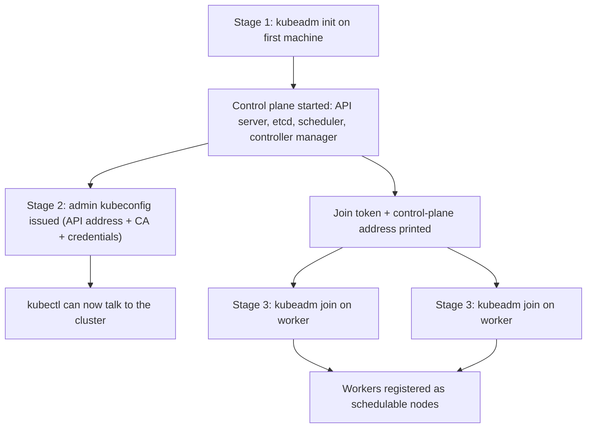
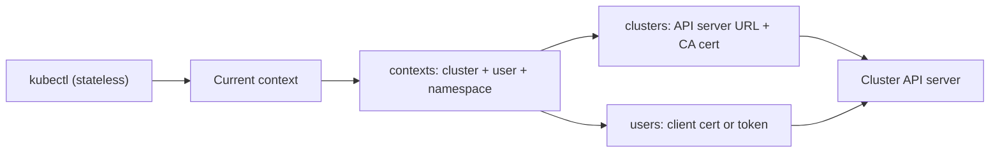

# Building a Local Kubernetes Cluster: From minikube and kind to Your First Deployment

## Learning Objectives
- Spin up a local cluster with both **minikube** and **kind**, and explain the difference between them (single VM/Docker node vs. multi-node containers) and when to reach for each.
- Understand the **kubeadm bootstrap flow** at a conceptual level — control-plane init, kubeconfig issuance, and node join — and explain how a kubeconfig file connects `kubectl` to a cluster.
- Verify a fresh cluster with `kubectl get nodes`, then ship your **first Deployment** and confirm it is actually running.

## Body

### Why run Kubernetes on your laptop?

Before you operate Kubernetes in production, you want a safe place to break things. Renting cloud clusters for every experiment is slow and expensive, and you don't want your first `kubectl delete` to land on something real. A **local cluster** gives you the full Kubernetes API on your own machine: you can deploy apps, scale them, watch them self-heal, and tear it all down in seconds. The two tools most people start with are **minikube** and **kind**. They both give you a working cluster, but they take very different approaches — and knowing which to pick is the first real skill of this lecture.

> A "cluster" is just a set of machines (nodes) running Kubernetes together. Locally, those "machines" are usually a VM or Docker containers pretending to be machines — but to Kubernetes they look identical to real servers.

### minikube vs. kind: two paths to the same API

**minikube** boots a single-node cluster inside a VM or a Docker container. It is beginner-friendly and batteries-included: it bundles handy extras like a dashboard, an Ingress add-on, and a `minikube service` helper that opens your app in the browser without you fighting with networking. Its default shape is **one node** that runs both the control plane and your workloads. That single-node simplicity is exactly what you want for learning and small demos.

**kind** — short for **Kubernetes IN Docker** — runs each cluster *node* as a Docker container. Because nodes are just containers, kind can stand up a realistic **multi-node** cluster (one control-plane container plus several worker containers) in seconds, and it can run **multiple independent clusters** side by side. It is lightweight, scripts cleanly, and is the de-facto standard for **CI/CD pipelines**, where you spin a throwaway cluster up, run your tests, and throw it away.

Here is the practical rule of thumb:

> Reach for **minikube** when you want the friendliest single-node sandbox with add-ons included. Reach for **kind** when you want a fast, scriptable, multi-node cluster — especially inside automated test pipelines.

One more option you'll meet: **Docker Desktop** has a built-in Kubernetes toggle (Settings → Kubernetes → enable). It's the lowest-effort path if you already run Docker Desktop, and it even installs `kubectl` for you. The trade-off is less control — you can't deeply customize how the cluster is built — so people who need extra port mappings, persistent-volume mounts, or multiple clusters still prefer standalone kind.

### What kubeadm is actually doing under the hood

minikube and kind are convenient wrappers. Underneath, a real Kubernetes cluster is bootstrapped with a tool called **kubeadm**, and understanding its flow demystifies what your local tools quietly automate. The bootstrap proceeds in three conceptual stages:

1. **Initialize the control plane** — On the first machine you run `kubeadm init`. This starts the cluster's "brain": the **API server** (the front door every command talks to), **etcd** (the key-value store that holds all cluster state), the **scheduler** (decides which node a Pod lands on), and the **controller manager** (the loops that drive reality toward your desired state).
2. **Issue a kubeconfig** — `kubeadm init` writes out an **admin kubeconfig** file. This file contains three things: the API server's address, the certificate authority that proves the server is trustworthy, and your client credentials. Without it, `kubectl` has no idea which cluster to talk to or how to authenticate.
3. **Join worker nodes** — `kubeadm init` prints a `kubeadm join` command containing the control-plane address and a short-lived join token. You run that command on each additional machine, and it registers as a **worker node** that the control plane can schedule workloads onto.

The conceptual flow is as follows: a single control-plane init produces the credentials and a join token, and every worker uses that token to attach itself to the control plane.



```bash
# (Conceptual — this is what kubeadm runs on a real multi-node cluster)

# On the first machine — initialize the control plane:
kubeadm init --pod-network-cidr=10.244.0.0/16

# kubeadm then tells you to copy the admin kubeconfig into place:
mkdir -p $HOME/.kube
cp /etc/kubernetes/admin.conf $HOME/.kube/config

# On each worker machine — join using the token kubeadm printed:
kubeadm join 192.168.0.10:6443 --token <token> \
  --discovery-token-ca-cert-hash sha256:<hash>
```

When you run `minikube start` or `kind create cluster`, this entire dance happens automatically and the resulting kubeconfig is merged into your `~/.kube/config` for you. That's why "it just works."

### How kubeconfig connects kubectl to your cluster

`kubectl` is stateless — it has no built-in memory of any cluster. Every time you run a command, it reads a **kubeconfig** file (by default `~/.kube/config`) to learn *where* to connect and *who* it is. A kubeconfig holds three kinds of entries that combine into a **context**:

- **clusters** — the API server URL and its CA certificate.
- **users** — your credentials (a client certificate or token).
- **contexts** — a named pairing of "this cluster + this user + a default namespace."

The **current context** is the one `kubectl` uses right now. Because you can hold many contexts in one file, switching between your minikube and kind clusters is a single command — no reconfiguration needed. The diagram below shows how these entries combine and how the current context steers `kubectl`.



```bash
# See every context you have, and which one is active (marked with *):
kubectl config get-contexts

# Switch the active cluster:
kubectl config use-context kind-kind

# Inspect where kubectl is currently pointed:
kubectl config current-context
```

> The mental model: kubeconfig is the address book. `kubectl get nodes` doesn't know about any server — it looks up the current context, reads the address and credentials, and calls that API server.

### Hands-on: from zero to a running cluster

Let's create both clusters and confirm they're alive. The first step every time is to verify the nodes are **Ready** — that's your signal the control plane is healthy.

```bash
# --- Option A: minikube (single-node, Docker driver) ---
minikube start --driver=docker
minikube status          # control plane, kubelet, apiserver should all be "Running"

# --- Option B: kind (here, a 3-node cluster) ---
# kind-config.yaml:
#   kind: Cluster
#   apiVersion: kind.x-k8s.io/v1alpha4
#   nodes:
#     - role: control-plane
#     - role: worker
#     - role: worker
kind create cluster --name dev --config kind-config.yaml

# --- Verify either cluster the same way: ---
kubectl get nodes
```

A healthy single-node minikube shows one node with status `Ready`; the 3-node kind cluster shows one control-plane node and two workers, all `Ready`. If a node is stuck in `NotReady`, the cluster networking usually hasn't finished initializing — give it a moment, or run `kubectl describe node <name>` to investigate.

### Your first Deployment

With a Ready cluster, ship something. A **Deployment** is a declarative object: you tell Kubernetes the *desired state* ("run N copies of this image"), and its reconciliation loops continuously make reality match. We'll use a small public image so there's nothing to build.

```bash
# Create a Deployment running 2 replicas of a tiny web server:
kubectl create deployment hello --image=nginx:alpine --replicas=2

# Watch the Pods come up:
kubectl get pods
# hello-xxxx-aaaa   1/1   Running
# hello-xxxx-bbbb   1/1   Running

# Expose it inside the cluster, then reach it:
kubectl expose deployment hello --type=NodePort --port=80

# minikube gives you a ready-made URL:
minikube service hello --url
```

Now prove the **self-healing** behavior that makes Kubernetes special. Delete a Pod and watch a replacement appear almost instantly — because you *declared* 2 replicas, the controller refuses to let the count drop:

```bash
kubectl delete pod <one-pod-name>
kubectl get pods     # still 2 — Kubernetes recreated the missing one
```

This is the reconciliation loop in action: desired state (2) vs. current state (1) → Kubernetes schedules a new Pod to close the gap. The same idea scales the other way:

```bash
kubectl scale deployment hello --replicas=5
kubectl get pods     # now 5
```

When something misbehaves (a Pod stuck in `Pending`, `ImagePullBackOff`, or `CrashLoopBackOff`), your two best friends are `kubectl describe pod <name>` for the event timeline and `kubectl logs <name>` for the app's own output. Get comfortable with these now — they are exactly the commands you'll use in production.

## Key Takeaways
- **minikube** = friendly single-node sandbox with add-ons; **kind** = fast, scriptable, multi-node clusters (and multiple clusters), ideal for CI/CD. Docker Desktop's toggle is the easiest start but the least customizable.
- A real cluster is bootstrapped by **kubeadm**: `init` starts the control plane and issues a kubeconfig, then each worker runs `join` with a token. Local tools automate this whole flow for you.
- **kubeconfig** is the address book that wires stateless `kubectl` to a cluster — clusters + users + contexts — and switching clusters is just changing the current context.
- Always verify with `kubectl get nodes` (look for `Ready`), then deploy with `kubectl create deployment` and watch reconciliation keep your declared replica count alive even when you delete Pods.
