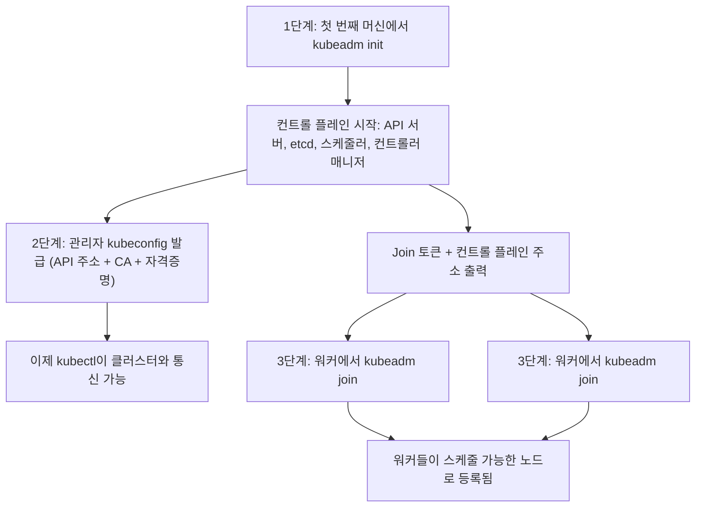
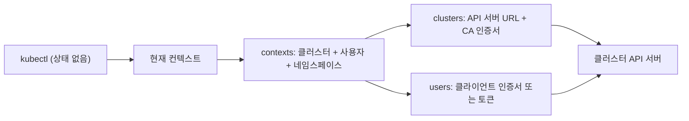

# 로컬 쿠버네티스 클러스터 만들기: minikube·kind부터 첫 배포까지

## 학습 목표
- **minikube**와 **kind**로 로컬 클러스터를 각각 생성하고, 두 도구의 차이(단일 VM/도커 노드 vs. 멀티노드 컨테이너)와 각각 어떤 상황에 어울리는지 설명할 수 있다.
- **kubeadm 부트스트랩 흐름** — 컨트롤 플레인 초기화, kubeconfig 발급, 노드 join — 을 개념적으로 이해하고, kubeconfig 파일이 어떻게 `kubectl`을 클러스터에 연결하는지 설명할 수 있다.
- 새로 만든 클러스터를 `kubectl get nodes`로 검증한 뒤, **첫 Deployment**를 배포하고 실제로 동작하는지 확인할 수 있다.

## 본문

### 왜 노트북에서 쿠버네티스를 돌리는가?

프로덕션에서 쿠버네티스를 운영하기 전에, 마음껏 실험할 수 있는 안전한 공간이 필요하다. 실험할 때마다 클라우드 클러스터를 빌리는 건 느리고 돈도 든다. 게다가 처음 치는 `kubectl delete`가 실제 서비스에 닿으면 곤란하다. **로컬 클러스터**는 내 컴퓨터 위에서 쿠버네티스 API 전체를 그대로 제공한다. 앱을 배포하고, 스케일을 조정하고, 자가 복구를 관찰하고, 다 끝나면 몇 초 만에 날려버릴 수 있다. 대부분의 사람들이 처음 접하는 도구는 **minikube**와 **kind**다. 둘 다 동작하는 클러스터를 만들어주지만 접근 방식은 완전히 다르다. 어떤 걸 골라야 하는지 아는 것이 이번 강의의 첫 번째 핵심 기술이다.

> "클러스터"란 쿠버네티스를 함께 실행하는 노드(머신)들의 묶음이다. 로컬에서는 그 "머신"이 보통 VM이나 Docker 컨테이너처럼 행세하지만, 쿠버네티스 입장에서는 실제 서버와 전혀 차이가 없다.

### minikube vs. kind: 같은 API로 가는 두 가지 길

**minikube**는 VM 또는 Docker 컨테이너 안에서 단일 노드 클러스터를 띄운다. 입문자에게 친절하고 기능이 충실하다. 대시보드, Ingress 애드온, `minikube service` 헬퍼(앱을 브라우저에서 바로 열어주는 도구) 같은 편의 기능이 기본 제공된다. 기본 구성은 컨트롤 플레인과 워크로드를 모두 담당하는 **노드 하나**다. 이 단순함이 학습과 간단한 데모에는 딱 맞다.

**kind** — **Kubernetes IN Docker**의 약자 — 는 클러스터의 각 *노드*를 Docker 컨테이너로 실행한다. 노드가 컨테이너이기 때문에, 컨트롤 플레인 컨테이너 하나와 워커 컨테이너 여러 개로 구성된 **멀티노드** 클러스터를 몇 초 만에 만들 수 있다. 여러 클러스터를 동시에 독립적으로 운용하는 것도 가능하다. 가볍고 스크립트 친화적이어서 **CI/CD 파이프라인**의 사실상 표준으로 자리 잡았다. 테스트 클러스터를 띄우고, 테스트를 돌리고, 날려버리는 용도에 최적이다.

실용적인 선택 기준은 다음과 같다:

> 애드온이 포함된 가장 친절한 단일 노드 샌드박스가 필요하면 **minikube**. 빠르고 스크립트 자동화가 가능한 멀티노드 클러스터 — 특히 자동화 테스트 파이프라인 안 — 가 필요하면 **kind**.

한 가지 더 알아둘 옵션이 있다. **Docker Desktop**에는 쿠버네티스 토글이 내장되어 있다(설정 → Kubernetes → 활성화). Docker Desktop을 이미 쓰고 있다면 가장 손쉬운 시작점이고, `kubectl`도 같이 설치해준다. 다만 클러스터 구성을 깊이 커스터마이징할 수 없다는 단점이 있다. 포트 매핑 추가, 퍼시스턴트 볼륨 마운트, 클러스터 동시 운용이 필요한 경우엔 여전히 독립적인 kind를 선호한다.

### kubeadm이 내부에서 하는 일

minikube와 kind는 편의를 위한 래퍼다. 그 아래에서 실제 쿠버네티스 클러스터는 **kubeadm**이라는 도구로 부트스트랩된다. 이 흐름을 이해하면 로컬 도구들이 자동으로 처리해주는 것들이 무엇인지 명확해진다. 부트스트랩은 개념적으로 세 단계로 진행된다.

1. **컨트롤 플레인 초기화** — 첫 번째 머신에서 `kubeadm init`을 실행한다. 클러스터의 "두뇌"에 해당하는 구성 요소들이 시작된다. **API 서버**(모든 명령이 통과하는 입구), **etcd**(클러스터 상태를 저장하는 키-값 저장소), **스케줄러**(파드를 어느 노드에 배치할지 결정), **컨트롤러 매니저**(현실을 선언된 상태로 지속적으로 맞춰가는 루프)가 여기에 해당한다.
2. **kubeconfig 발급** — `kubeadm init`이 **관리자 kubeconfig** 파일을 생성한다. 이 파일에는 세 가지 정보가 담긴다. API 서버 주소, 서버를 신뢰할 수 있다는 것을 증명하는 CA 인증서, 클라이언트 자격증명이다. 이 파일 없이는 `kubectl`이 어느 클러스터에 연결해야 하는지, 어떻게 인증해야 하는지 알 수 없다.
3. **워커 노드 join** — `kubeadm init`이 컨트롤 플레인 주소와 단기 join 토큰이 담긴 `kubeadm join` 명령을 출력한다. 추가할 각 머신에서 이 명령을 실행하면 **워커 노드**로 등록되어 컨트롤 플레인이 워크로드를 스케줄할 수 있게 된다.

개념적인 흐름은 다음과 같다. 단일 컨트롤 플레인 init이 자격증명과 join 토큰을 만들고, 모든 워커가 그 토큰을 사용해 컨트롤 플레인에 합류한다.



```bash
# (개념 설명용 — 실제 멀티노드 클러스터에서 kubeadm이 실행하는 내용)

# 첫 번째 머신 — 컨트롤 플레인 초기화:
kubeadm init --pod-network-cidr=10.244.0.0/16

# kubeadm이 관리자 kubeconfig를 제자리에 복사하도록 안내한다:
mkdir -p $HOME/.kube
cp /etc/kubernetes/admin.conf $HOME/.kube/config

# 각 워커 머신 — kubeadm이 출력한 토큰으로 join:
kubeadm join 192.168.0.10:6443 --token <token> \
  --discovery-token-ca-cert-hash sha256:<hash>
```

`minikube start`나 `kind create cluster`를 실행하면 이 모든 과정이 자동으로 처리되고, 생성된 kubeconfig가 `~/.kube/config`에 병합된다. 그래서 "그냥 되는" 것이다.

### kubeconfig가 kubectl을 클러스터에 연결하는 방식

`kubectl`은 상태가 없다. 어떤 클러스터도 기억하지 않는다. 명령을 실행할 때마다 **kubeconfig** 파일(기본값: `~/.kube/config`)을 읽어 *어디에* 연결할지, *누구로서* 인증할지를 파악한다. kubeconfig에는 **컨텍스트**를 구성하는 세 종류의 항목이 담겨 있다.

- **clusters** — API 서버 URL과 CA 인증서.
- **users** — 자격증명(클라이언트 인증서 또는 토큰).
- **contexts** — "이 클러스터 + 이 사용자 + 기본 네임스페이스"를 묶은 이름 붙은 쌍.

**현재 컨텍스트(current context)**가 `kubectl`이 지금 사용하는 항목이다. 하나의 파일에 여러 컨텍스트를 담을 수 있기 때문에, minikube 클러스터와 kind 클러스터 사이를 오가는 것이 명령 하나로 끝난다. 재구성이 필요 없다. 아래 다이어그램은 이 항목들이 어떻게 조합되고, 현재 컨텍스트가 `kubectl`을 어떻게 이끄는지 보여준다.



```bash
# 보유한 모든 컨텍스트 확인 (* 표시가 현재 활성 컨텍스트):
kubectl config get-contexts

# 활성 클러스터 전환:
kubectl config use-context kind-kind

# kubectl이 현재 가리키는 클러스터 확인:
kubectl config current-context
```

> 핵심 개념: kubeconfig는 주소록이다. `kubectl get nodes`는 어떤 서버도 직접 알지 못한다. 현재 컨텍스트를 조회해 주소와 자격증명을 읽고, 그 API 서버를 호출할 뿐이다.

### 실습: 클러스터 생성부터 동작 확인까지

두 가지 클러스터를 모두 만들고 정상 동작하는지 확인해보자. 매번 가장 먼저 해야 할 일은 노드가 **Ready** 상태인지 확인하는 것이다. 이것이 컨트롤 플레인이 정상이라는 신호다.

```bash
# --- 방법 A: minikube (단일 노드, Docker 드라이버) ---
minikube start --driver=docker
minikube status          # control plane, kubelet, apiserver가 모두 "Running"이어야 한다

# --- 방법 B: kind (여기서는 3노드 클러스터) ---
# kind-config.yaml:
#   kind: Cluster
#   apiVersion: kind.x-k8s.io/v1alpha4
#   nodes:
#     - role: control-plane
#     - role: worker
#     - role: worker
kind create cluster --name dev --config kind-config.yaml

# --- 어느 클러스터든 동일하게 검증: ---
kubectl get nodes
```

정상적인 단일 노드 minikube라면 노드 하나가 `Ready` 상태로 보인다. 3노드 kind 클러스터라면 컨트롤 플레인 노드 하나와 워커 두 개가 모두 `Ready`로 표시된다. 노드가 `NotReady` 상태에서 멈춰 있다면 클러스터 네트워킹이 아직 초기화 중인 경우가 많다. 잠시 기다리거나 `kubectl describe node <이름>`으로 상태를 확인하자.

### 첫 Deployment

클러스터가 Ready 상태라면 뭔가를 배포해보자. **Deployment**는 선언적 오브젝트다. 쿠버네티스에 *원하는 상태*("이 이미지를 N개 실행해줘")를 말하면, 조정 루프가 현실을 계속 그 상태에 맞춰간다. 빌드할 것이 없도록 작은 공개 이미지를 사용한다.

```bash
# 작은 웹 서버 이미지를 2개 레플리카로 실행하는 Deployment 생성:
kubectl create deployment hello --image=nginx:alpine --replicas=2

# 파드가 뜨는 것 확인:
kubectl get pods
# hello-xxxx-aaaa   1/1   Running
# hello-xxxx-bbbb   1/1   Running

# 클러스터 안에 서비스 노출 후 접근:
kubectl expose deployment hello --type=NodePort --port=80

# minikube라면 URL을 바로 얻을 수 있다:
minikube service hello --url
```

이제 쿠버네티스를 특별하게 만드는 **자가 복구** 동작을 직접 확인해보자. 파드 하나를 삭제하면 거의 즉시 교체 파드가 생긴다. 레플리카 수를 2로 *선언*했기 때문에 컨트롤러가 그 수를 내려가게 두지 않는다.

```bash
kubectl delete pod <파드-이름>
kubectl get pods     # 여전히 2개 — 쿠버네티스가 없어진 파드를 새로 만들었다
```

조정 루프가 동작하는 모습이다. 선언된 상태(2) vs. 현재 상태(1) → 쿠버네티스가 새 파드를 스케줄해 차이를 메운다. 반대 방향으로도 마찬가지다.

```bash
kubectl scale deployment hello --replicas=5
kubectl get pods     # 이제 5개
```

파드가 `Pending`, `ImagePullBackOff`, `CrashLoopBackOff` 상태에 빠져 있을 때는 `kubectl describe pod <이름>`으로 이벤트 타임라인을, `kubectl logs <이름>`으로 앱 자체의 로그를 확인하면 된다. 이 두 명령에 지금 익숙해져 두자. 프로덕션에서도 똑같이 쓴다.

## 핵심 정리
- **minikube** = 애드온이 포함된 친절한 단일 노드 샌드박스. **kind** = 빠르고 스크립트 친화적인 멀티노드 클러스터(여러 클러스터 동시 운용 가능), CI/CD에 최적. Docker Desktop 토글은 시작이 가장 쉽지만 커스터마이징이 제한된다.
- 실제 클러스터는 **kubeadm**으로 부트스트랩된다. `init`이 컨트롤 플레인을 시작하고 kubeconfig를 발급하면, 각 워커가 토큰으로 `join`한다. 로컬 도구들이 이 전체 흐름을 자동화해준다.
- **kubeconfig**는 상태 없는 `kubectl`을 클러스터에 연결하는 주소록이다. clusters + users + contexts 구조로 이루어지고, 클러스터 전환은 현재 컨텍스트만 바꾸면 된다.
- 항상 `kubectl get nodes`로 `Ready` 상태를 확인한 뒤 `kubectl create deployment`로 배포하자. 파드를 삭제해도 선언한 레플리카 수를 유지하는 조정 루프를 눈으로 확인할 수 있다.
