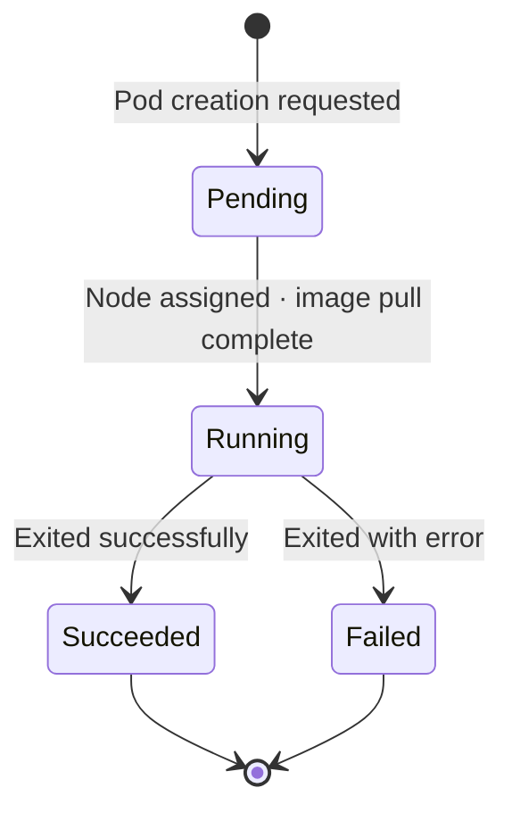

# Pods and Containers - The Smallest Deployable Unit in Kubernetes

## Learning Objectives
- Understand what a Pod is and how it differs from a container
- Know the Pod lifecycle and both single-container and multi-container patterns
- Create a Pod with kubectl and check its status

## Lecture

### Why Pods Instead of Containers?

In previous lectures we learned that a container is "a self-contained unit that bundles application code with everything it needs to run." Yet when you actually work with Kubernetes, you rarely interact with containers directly — the term **Pod** keeps appearing instead. Why doesn't Kubernetes manage containers directly?

In Kubernetes, a **Pod is the smallest deployable unit**. Kubernetes does not manage containers directly; it wraps containers inside an envelope called a Pod. Deploying anything to a cluster means deploying a Pod.

> Key point: A container is the "packaging unit." A Pod is Kubernetes's "execution and deployment unit." You never throw a container straight at the cluster — it always goes inside a Pod first.

### What Is a Pod? — An Envelope for Containers

A Pod is **a group of one or more containers**. The defining feature is that containers within the same Pod **share** the following:

- **Network**: Containers in the same Pod share a single IP address and can reach each other via `localhost`. They also share port space.
- **Storage (volumes)**: They can share a directory to exchange data.

Each container still has its own filesystem, so **isolation is maintained**. Think of a Pod as "roommates sharing an address (same IP and network)," where each person has their own room (separate filesystem).

Here is something beginners often miss: **regardless of whether a Pod holds one container or several, all containers in the same Pod are always scheduled on the same node, created together, and destroyed together.** You cannot move individual containers to a different node.

### Single-Container vs. Multi-Container Patterns

In practice, **most Pods contain a single container (single-container pattern)**. "One application = one container = one Pod" is the most fundamental and recommended form. When you are starting out, this is the only pattern you need to think about.

So when do you use multiple containers? Only when you have a **helper container that must work so closely with the main container that separating them makes no sense**. The canonical example is the sidecar pattern:

- Main container: a Python application serving web content
- Sidecar container: a container that collects the application's logs and ships them to an external destination

Because these two need to operate on the same data and communicate tightly over `localhost`, they are placed in the same Pod rather than split into separate ones. That way they always run together in the same location and are managed as a single unit.

As shown in the diagram below, both patterns share an IP and volumes within a single Pod, while each container keeps its own isolated filesystem.

```mermaid Internal structure of a single-container Pod and a multi-container (sidecar) Pod
flowchart LR
    subgraph SinglePod["Single-Container Pod"]
        direction TB
        SC["Main Container<br/>Web App"]
        SNet["Shared Network<br/>1 IP · localhost"]
        SVol["Shared Volume"]
        SC --- SNet
        SC --- SVol
    end

    subgraph MultiPod["Multi-Container Pod (Sidecar)"]
        direction TB
        MMain["Main Container<br/>Web App"]
        MSide["Sidecar Container<br/>Log Collector"]
        MNet["Shared Network<br/>1 IP · localhost"]
        MVol["Shared Volume"]
        MMain --- MNet
        MSide --- MNet
        MMain --- MVol
        MSide --- MVol
    end
```

> Note: Multi-container Pods are not for grouping things together simply because they seem related. Use this pattern only when the coupling is tight enough that the containers genuinely must share a lifecycle. Otherwise, split them into separate Pods.

### The Pod Lifecycle — and "Pods Are Ephemeral"

Once a Pod is created, it passes through the following phases:

- **Pending**: The cluster has received the request and is preparing — deciding which node to place it on and pulling the image.
- **Running**: The Pod has been scheduled to a node and its containers are actively running.
- **Succeeded**: (For one-off jobs) All containers have exited successfully.
- **Failed**: At least one container exited with an error.

As shown in the state diagram below, a Pod goes through a preparation phase before running, then ends in either a successful or failed state depending on the nature of the workload.



There is a critical concept to internalize here: **Pods are ephemeral (temporary)**. The term "ephemeral" covers two distinct behaviors, and it is important to keep them straight:

**① Container restart within the same Pod — controlled by `restartPolicy`.**
When the Pod itself is still alive but a container *inside* it crashes, the **kubelet** on that node restarts the container within the same Pod according to the Pod's restart policy (`Always` / `OnFailure` / `Never`). The Pod's name and IP stay the same; only the `RESTARTS` counter in `kubectl get pods` goes up. The restart policy governs *containers inside* a Pod.

**② Pod itself is gone — replacement is the job of a higher-level controller.**
If a node goes down entirely or someone deletes the Pod so that the **Pod itself disappears**, that Pod does not come back. Creating a *new* Pod to restore the desired count is the responsibility of a higher-level controller such as a **Deployment or ReplicaSet**. (ReplicationController used to handle this, but it is rarely used today. ReplicaSet replaced it, and in practice you typically manage ReplicaSets indirectly through a Deployment.) The replacement Pod has a completely new name and IP.

In short: **a container crash triggers a kubelet restart inside the same Pod; a Pod's disappearance triggers a higher-level controller to create a brand-new replacement Pod.** These two mechanisms together deliver the "self-healing" described in Lecture 1. Note that a **standalone Pod** created directly with `kubectl run` has no controller watching over it, so if that Pod disappears, nothing will recreate it.

> That is exactly why in production you use a Deployment to manage Pods rather than creating them directly. This lecture works with Pods directly so you can build a solid conceptual foundation.

### Creating and Inspecting Pods with kubectl (Hands-On)

Time to try it yourself. To practice Kubernetes locally, you can use **minikube** (a tool that runs a single-node cluster on your development machine) or the Kubernetes feature built into Docker Desktop. The following assumes your cluster is up and `kubectl` is connected to it.

`kubectl` is the command-line tool for sending commands to Kubernetes. Commands are delivered to the API Server, following the flow below.

```mermaid Flow of a kubectl run command through the API Server to a running Pod
sequenceDiagram
    participant U as User
    participant K as kubectl
    participant API as API Server
    participant Sched as Scheduler
    participant Kubelet as kubelet (Node)
    U->>K: kubectl run my-pod --image=nginx
    K->>API: Pod creation request
    API-->>K: pod/my-pod created
    API->>Sched: Request node assignment
    Sched-->>API: Selected node
    API->>Kubelet: Instruction to start container on assigned node
    Kubelet-->>API: Image pull · container start report
```

Let's start by creating a Pod containing a single nginx web server container. Good news: **in modern Kubernetes (1.18 and later), `kubectl run` creates a single Pod by default.** No extra flags are needed:

```bash
kubectl run my-pod --image=nginx
```

```
pod/my-pod created
```

- `run`: the command that creates a standalone Pod
- `my-pod`: the name for the Pod
- `--image=nginx`: the container image to use

> A note on history: before Kubernetes 1.18, `kubectl run` had a "generator" feature that created different resource types (Deployments, Jobs, etc.) depending on the flags you passed. That is why older documentation says "add `--restart=Never` to create a single Pod." The generator behavior was **removed in 1.18**, and `kubectl run` now creates only Pods. Use `kubectl create deployment` when you need a Deployment.

So what does `--restart` do in current Kubernetes? It simply sets the **`restartPolicy` field on the resulting Pod** — it does not change the kind of resource created. Whether or not you include `--restart`, you always get a Pod; only the restart policy differs:

- Omitted: `restartPolicy: Always` (default)
- `--restart=OnFailure`: restart only on non-zero exit (suitable for batch jobs)
- `--restart=Never`: never restart (run once and stop)

> Tip: Add `--dry-run=client -o yaml` to preview the YAML manifest a command would produce without actually creating anything. For example: `kubectl run my-pod --image=nginx --dry-run=client -o yaml`. Check the `kind: Pod` and `restartPolicy` fields in the output — it is a great bridge to the declarative YAML approach covered in Lecture 5.

> Practical tip: For a quick debugging shell, use `kubectl run tmp --image=busybox --rm -it --restart=Never -- sh`. The `--rm` flag deletes the Pod automatically when you exit, and `--restart=Never` ensures it runs once without restarting.

Now check the Pod list and status:

```bash
kubectl get pods
```

```
NAME     READY   STATUS    RESTARTS   AGE
my-pod   1/1     Running   0          12s
```

- `READY 1/1`: all 1 container in the Pod is ready (a multi-container Pod would show `2/2`)
- `STATUS Running`: running normally (right after creation you may briefly see `ContainerCreating` or `Pending`)
- `RESTARTS`: the number of times the **container has been restarted within the same Pod** by the restart policy mechanism described above

For more detail — which node it landed on, its IP, events, and more — use `describe`. This is the first command you will reach for when something goes wrong:

```bash
kubectl describe pod my-pod
```

```
Name:         my-pod
Namespace:    default
Node:         minikube/192.168.49.2
Status:       Running
IP:           10.244.0.7
Containers:
  my-pod:
    Image:    nginx
    State:    Running
Events:
  Type    Reason     Age   Message
  ----    ------     ----  -------
  Normal  Scheduled  20s   Successfully assigned default/my-pod to minikube
  Normal  Pulled     18s   Container image "nginx" already present on machine
  Normal  Started    17s   Started container my-pod
```

The `Events` section shows the actual log entries for the Scheduler assigning a node (Scheduled), pulling the image (Pulled), and starting the container (Started) — the same flow described in Lecture 2, now visible as real output.

You can also view the container's logs or open an interactive shell inside it:

```bash
kubectl logs my-pod
kubectl exec -it my-pod -- /bin/bash
```

When you are done, delete the Pod:

```bash
kubectl delete pod my-pod
```

```
pod "my-pod" deleted
```

> A standalone Pod created with `kubectl run` simply disappears when deleted — there is no controller to recreate it. But a Pod managed by a Deployment (covered next) gets replaced immediately the moment you delete it. That difference is exactly what "Pods are ephemeral" means in practice.

### Wrapping Up

A Pod is the smallest unit Kubernetes works with — an envelope that wraps containers and lets them share networking and storage. Most of the time you use a single-container Pod, and you only bundle multiple containers together when a tightly coupled sidecar needs to share the same lifecycle. Pods are ephemeral: a container crash triggers a kubelet restart inside the same Pod, while a Pod's disappearance is handled by a higher-level controller that creates a brand-new replacement. That is why production workloads hand Pod management over to a Deployment — which is the topic of the next lecture.

## Key Takeaways
- A **Pod** is Kubernetes's smallest deployable unit — a group wrapping one or more containers. You deploy Pods to the cluster, not bare containers.
- Containers in the same Pod **share an IP, network, and storage volumes** and communicate over `localhost`, but each has its own isolated filesystem. They are always co-located on the same node and are created and destroyed together.
- Use a **single-container Pod** by default. Only use a **multi-container (sidecar)** Pod when a helper container is so tightly coupled to the main container that they must share a lifecycle.
- The Pod lifecycle is `Pending → Running → (Succeeded / Failed)`. **When a container crashes**, the kubelet restarts it inside the same Pod according to `restartPolicy`. **When the Pod itself disappears**, a higher-level controller such as a Deployment or ReplicaSet creates a brand-new replacement Pod. Do not confuse these two mechanisms.
- **`kubectl run` in modern Kubernetes (1.18+) creates a single Pod.** The `--restart` flag sets only the `restartPolicy` on that Pod — it does not change what kind of resource is created. Use `kubectl create deployment` when you need a Deployment.
- Hands-on commands: `kubectl run` (create) → `kubectl get pods` (list and status) → `kubectl describe pod` (detail and events) → `kubectl logs` / `kubectl exec` (logs and shell access) → `kubectl delete pod` (delete).
