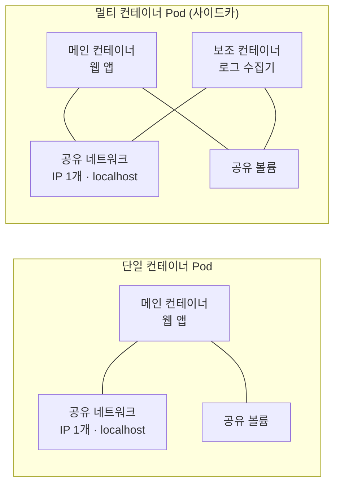
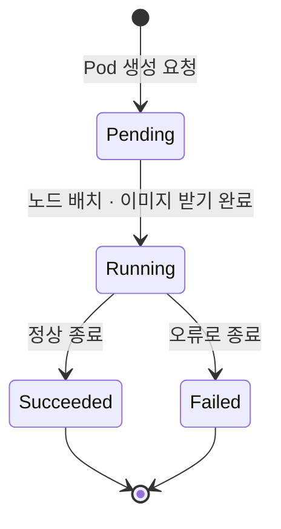
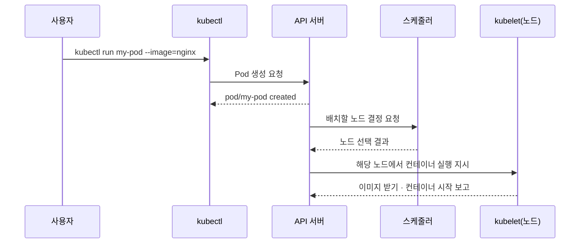

# Pod와 컨테이너 - 쿠버네티스의 최소 배포 단위

## 학습 목표
- Pod가 무엇이며 컨테이너와 어떻게 다른지 이해한다
- Pod의 생명주기와 단일/멀티 컨테이너 패턴을 안다
- kubectl로 Pod를 생성하고 상태를 확인할 수 있다

## 본문

### 왜 컨테이너가 아니라 Pod일까

앞선 강의에서 컨테이너가 "애플리케이션 코드와 실행에 필요한 모든 것을 하나로 묶은 단위"라는 것을 배웠습니다. 그런데 막상 쿠버네티스를 다루다 보면 컨테이너를 직접 만지는 명령은 거의 없고, 늘 **Pod(파드)** 라는 단어가 등장합니다. 왜 쿠버네티스는 컨테이너를 직접 다루지 않을까요?

쿠버네티스에서 **Pod는 배포할 수 있는 가장 작은 단위**입니다. 쿠버네티스는 컨테이너를 직접 다루지 않고, 컨테이너를 Pod라는 봉투에 한 번 감싸서 다룹니다. 즉 우리가 클러스터에 무언가를 올린다는 것은 곧 "Pod를 올린다"는 뜻입니다.

> 핵심: 컨테이너는 "패키징 단위", Pod는 쿠버네티스가 다루는 "실행/배포 단위"입니다. 컨테이너를 직접 클러스터에 던지는 게 아니라, 항상 Pod로 감싸서 올립니다.

### Pod란 무엇인가 - 컨테이너를 담는 봉투

Pod는 **하나 이상의 컨테이너를 묶은 그룹**입니다. 핵심은 같은 Pod 안에 든 컨테이너들이 다음을 **공유**한다는 점입니다.

- **네트워크**: 같은 Pod의 컨테이너들은 동일한 IP 주소를 가지며, 서로를 `localhost`로 부를 수 있습니다. 포트도 공유합니다.
- **스토리지(볼륨)**: 같은 디렉터리를 공유해 데이터를 주고받을 수 있습니다.

다만 컨테이너는 여전히 각자의 파일시스템을 갖고 있어 **격리**는 유지됩니다. 비유하자면 Pod는 "한 집(주소·네트워크는 공유)에 사는 룸메이트들"이고, 각자의 방(파일시스템)은 분리되어 있는 셈입니다.

여기서 초보자가 자주 놓치는 중요한 사실이 있습니다. **Pod에 컨테이너가 한 개든 여러 개든, 같은 Pod의 컨테이너는 항상 같은 노드(서버)에 함께 배치되고, 함께 생성되고 함께 사라집니다.** 따로 떼어 다른 노드로 옮길 수 없습니다.

### 단일 컨테이너 vs 멀티 컨테이너 패턴

실무에서 **대부분의 Pod는 컨테이너 1개짜리(단일 컨테이너 패턴)** 입니다. "하나의 애플리케이션 = 하나의 컨테이너 = 하나의 Pod"가 가장 기본이고 권장되는 형태입니다. 처음 배울 때는 이 형태만 생각해도 충분합니다.

그렇다면 멀티 컨테이너는 언제 쓸까요? **서로 아주 밀접하게 협력하며, 떨어지면 의미가 없는 보조 컨테이너**가 있을 때입니다. 대표적인 예가 사이드카(sidecar) 패턴입니다.

- 메인 컨테이너: 웹 콘텐츠를 제공하는 파이썬 애플리케이션
- 보조 컨테이너: 그 애플리케이션의 로그를 수집해 외부로 전송하는 컨테이너

이 둘은 같은 데이터를 다루고 `localhost`로 긴밀히 통신해야 하므로, 별도 Pod로 떼지 않고 한 Pod에 함께 둡니다. 그러면 항상 같은 곳에서 함께 실행되고 함께 관리됩니다.

아래 구성도처럼 두 패턴 모두 하나의 Pod 안에서 IP와 볼륨을 공유하되, 컨테이너마다 파일시스템은 분리되어 있습니다.



> 주의: 멀티 컨테이너는 "한 화면에 보이니까 그냥 같이 넣자"가 아닙니다. 생명주기를 함께해야 할 만큼 결합도가 높을 때만 사용하고, 그렇지 않으면 각각 별도의 Pod로 분리하는 것이 정석입니다.

### Pod의 생명주기 - 그리고 "Pod는 일회용이다"

Pod를 만들면 다음과 같은 상태(Phase)를 거칩니다.

- **Pending**: 클러스터가 요청을 받았고, 어느 노드에 둘지 정하고 이미지를 내려받는 등 준비 중인 상태
- **Running**: 노드에 배치되어 컨테이너가 실제로 실행 중인 상태
- **Succeeded**: (일회성 작업의 경우) 컨테이너가 정상 종료되어 끝난 상태
- **Failed**: 컨테이너가 오류로 종료된 상태

아래 상태 전이도처럼 Pod는 준비 단계를 거쳐 실행되고, 작업 성격에 따라 정상 종료 또는 실패로 끝납니다.



여기서 반드시 기억할 개념이 있습니다. **Pod는 일회용(ephemeral, 임시적)** 입니다. 다만 "일회용"이라는 말이 가리키는 동작이 두 가지로 나뉘니 정확히 구분해 둡시다.

**① 같은 Pod 안에서 컨테이너만 재시작 — `restartPolicy`(재시작 정책).**
Pod 자체는 그대로 살아 있는데 그 *안의 컨테이너*가 오류로 종료되면, 그 노드의 **kubelet**이 Pod에 설정된 재시작 정책(`Always`/`OnFailure`/`Never`)에 따라 **같은 Pod 안에서 컨테이너를 다시 띄웁니다.** 이때 Pod 이름과 IP는 그대로이고, `kubectl get pods`의 `RESTARTS` 숫자만 올라갑니다. 즉 재시작 정책은 "Pod 내부의 컨테이너"를 다루는 규칙입니다.

**② Pod 자체가 사라지면 새 Pod로 교체 — 상위 컨트롤러의 몫.**
반면 노드가 통째로 다운되거나 누군가 Pod를 삭제해 **Pod 자체가 사라지면**, 그 Pod는 되살아나지 않습니다. 이때 "원하는 개수를 맞추기 위해 *새로운* Pod를 만들어 채우는" 일은 재시작 정책이 아니라 **Deployment나 ReplicaSet 같은 상위 컨트롤러**가 합니다. (과거에는 ReplicationController가 이 역할을 했지만, 지금은 거의 쓰지 않고 ReplicaSet이 대신하며, 실무에서는 보통 그 ReplicaSet을 직접 다루지 않고 Deployment를 통해 관리합니다.) 새로 만들어진 Pod는 이름도 IP도 이전과 다른 완전히 새 Pod입니다.

정리하면, **컨테이너 한 개의 죽음은 같은 Pod에서 kubelet이 재시작**하고, **Pod 한 개의 죽음은 상위 컨트롤러가 새 Pod로 대체**합니다. 두 메커니즘이 합쳐져 1강에서 말한 쿠버네티스의 "자가 치유"가 완성됩니다. 다만 우리가 `kubectl run`으로 만든 **단독 Pod**에는 그를 돌봐줄 상위 컨트롤러가 없으므로, Pod 자체가 사라지면 아무도 새로 만들어 주지 않습니다.

> 그래서 실무에서는 Pod를 직접 만들기보다, 다음 강의에서 배울 Deployment로 Pod를 관리합니다. 이 강의에서는 개념을 익히기 위해 Pod를 직접 다뤄봅니다.

### kubectl로 Pod 만들고 확인하기 (실습)

이제 직접 손으로 해봅니다. 로컬에서 쿠버네티스를 연습하려면 **minikube**(개발 PC에 1노드 클러스터를 띄우는 도구)나 Docker Desktop의 쿠버네티스 기능을 사용하면 됩니다. 클러스터가 준비되어 `kubectl`이 동작하는 상태라고 가정합니다.

`kubectl`은 쿠버네티스에 명령을 보내는 커맨드라인 도구입니다. 명령은 API 서버로 전달되고, 그 흐름은 다음과 같습니다.



먼저 nginx 웹서버 컨테이너 하나를 담은 Pod를 만들어 봅니다. 좋은 소식이 있습니다. **최신 쿠버네티스(1.18 이상)에서 `kubectl run`은 기본적으로 단일 Pod 하나를 생성합니다.** 별다른 플래그 없이 아래처럼 쓰면 됩니다.

```bash
kubectl run my-pod --image=nginx
```

```
pod/my-pod created
```

- `run`: 명령형으로 Pod를 생성하는 명령
- `my-pod`: Pod의 이름
- `--image=nginx`: 사용할 컨테이너 이미지

> 옛날에는 달랐습니다: 쿠버네티스 1.18 이전 버전의 `kubectl run`에는 'generator'라는 기능이 있어, 플래그에 따라 Deployment·Job 등 다른 리소스를 만들어 주었습니다. 그래서 "단일 Pod를 만들려면 `--restart=Never`를 붙여야 한다"는 설명이 돌아다닙니다. 하지만 이 generator 동작은 **1.18에서 제거**되었고, 지금은 `kubectl run`이 오직 Pod만 만듭니다. Deployment가 필요하면 별도로 `kubectl create deployment`를 씁니다.

그렇다면 `--restart` 플래그는 지금 무슨 일을 할까요? **생성될 Pod의 `restartPolicy` 필드를 지정할 뿐, 만들어지는 리소스의 종류를 바꾸지는 않습니다.** 즉 `--restart`를 붙이든 안 붙이든 결과물은 똑같이 Pod 한 개입니다. 값에 따라 그 Pod의 재시작 정책만 달라집니다.

- 플래그 생략 시: `restartPolicy: Always` (기본값)
- `--restart=OnFailure`: 비정상 종료일 때만 재시작 (일회성 작업에 적합)
- `--restart=Never`: 재시작하지 않음 (한 번 끝나면 그대로)

> 참고: `--dry-run=client -o yaml` 옵션을 붙이면 실제로 만들지 않고, 이 명령형 커맨드가 어떤 선언형 YAML 매니페스트를 만들어 내는지 미리 볼 수 있습니다. 예: `kubectl run my-pod --image=nginx --dry-run=client -o yaml`. 출력된 YAML의 `kind: Pod`와 `restartPolicy` 필드를 직접 확인해 보세요. 다음 강의에서 배울 선언형(YAML) 방식과의 연결고리가 한눈에 보입니다.

> 실무 팁: 단발성 디버깅 Pod가 필요할 때는 `kubectl run tmp --image=busybox --rm -it --restart=Never -- sh`처럼 끝나면 자동 삭제되는(`--rm`) 임시 Pod로 자주 씁니다. 여기서 `--restart=Never`는 "재시작하지 말고 한 번만 실행"이라는 정책을 주기 위함입니다.

이제 Pod 목록과 상태를 확인합니다.

```bash
kubectl get pods
```

```
NAME     READY   STATUS    RESTARTS   AGE
my-pod   1/1     Running   0          12s
```

- `READY 1/1`: Pod 안의 컨테이너 1개가 모두 준비됨 (멀티 컨테이너라면 `2/2`처럼 표시)
- `STATUS Running`: 정상 실행 중 (방금 만들었다면 잠깐 `ContainerCreating`이나 `Pending`으로 보일 수 있습니다)
- `RESTARTS`: 앞서 설명한 재시작 정책에 따라 **컨테이너가 같은 Pod 안에서 재시작된 횟수**

더 자세한 정보(어느 노드에 배치됐는지, IP, 이벤트 등)를 보려면 `describe`를 씁니다. 문제가 생겼을 때 가장 먼저 보게 될 명령입니다.

```bash
kubectl describe pod my-pod
```

```
Name:         my-pod
Namespace:    default
Node:         minikube/192.168.49.2
Status:       Running
IP:           10.244.0.7
Containers:
  my-pod:
    Image:    nginx
    State:    Running
Events:
  Type    Reason     Age   Message
  ----    ------     ----  -------
  Normal  Scheduled  20s   Successfully assigned default/my-pod to minikube
  Normal  Pulled     18s   Container image "nginx" already present on machine
  Normal  Started    17s   Started container my-pod
```

`Events` 부분을 보면 스케줄러가 노드를 정하고(Scheduled), 이미지를 받고(Pulled), 컨테이너를 시작(Started)하는 2강의 흐름이 실제 로그로 찍혀 있는 것을 확인할 수 있습니다.

컨테이너가 내보내는 로그를 보거나, 컨테이너 안으로 들어가 명령을 실행할 수도 있습니다.

```bash
kubectl logs my-pod
kubectl exec -it my-pod -- /bin/bash
```

실습이 끝나면 Pod를 삭제합니다.

```bash
kubectl delete pod my-pod
```

```
pod "my-pod" deleted
```

> 직접 만든(`kubectl run`) 단독 Pod를 삭제하면 그대로 사라집니다 — 돌봐줄 상위 컨트롤러가 없기 때문입니다. 하지만 다음 강의의 Deployment로 만든 Pod는, 지우면 컨트롤러가 곧바로 새 Pod를 다시 띄웁니다. 바로 이 차이가 "Pod는 일회용"이라는 말의 실체입니다.

### 정리하며

Pod는 쿠버네티스가 다루는 최소 단위로, 컨테이너를 감싸 네트워크와 스토리지를 공유하게 해주는 봉투입니다. 대부분은 컨테이너 1개짜리 단일 Pod를 쓰고, 긴밀히 협력하는 보조 컨테이너가 있을 때만 멀티 컨테이너로 묶습니다. 그리고 Pod는 일회용이라 죽으면 되살아나는 게 아니라 새로 태어납니다. 그래서 실무에서는 Pod를 직접 관리하지 않고, 다음 강의에서 배울 Deployment에게 맡기게 됩니다.

## 핵심 요약
- **Pod**는 쿠버네티스의 최소 배포 단위로, 하나 이상의 컨테이너를 감싼 그룹이다. 클러스터에는 컨테이너가 아니라 Pod를 올린다.
- 같은 Pod의 컨테이너들은 **IP·네트워크·스토리지를 공유**하고 `localhost`로 통신하지만, 파일시스템은 격리된다. 항상 같은 노드에서 함께 생성·소멸한다.
- 대부분은 **단일 컨테이너 Pod**를 쓰고, 떼어낼 수 없을 만큼 결합도가 높은 보조 컨테이너가 있을 때만 **멀티 컨테이너(사이드카)** 로 묶는다.
- Pod 생명주기는 `Pending → Running → (Succeeded/Failed)`이다. **컨테이너가 죽으면** 같은 Pod에서 kubelet이 `restartPolicy`에 따라 재시작하고, **Pod 자체가 사라지면** Deployment/ReplicaSet 같은 상위 컨트롤러가 새 Pod로 대체한다. 이 둘을 혼동하지 말 것.
- **`kubectl run`은 최신 쿠버네티스(1.18+)에서 단일 Pod를 생성한다.** `--restart` 플래그는 만들어질 Pod의 `restartPolicy`만 정할 뿐 리소스 종류를 바꾸지 않으며, Deployment가 필요하면 `kubectl create deployment`를 쓴다.
- 실습 명령: `kubectl run`(단독 Pod 생성) → `kubectl get pods`(목록·상태) → `kubectl describe pod`(상세·이벤트) → `kubectl logs`/`kubectl exec`(로그·접속) → `kubectl delete pod`(삭제).
