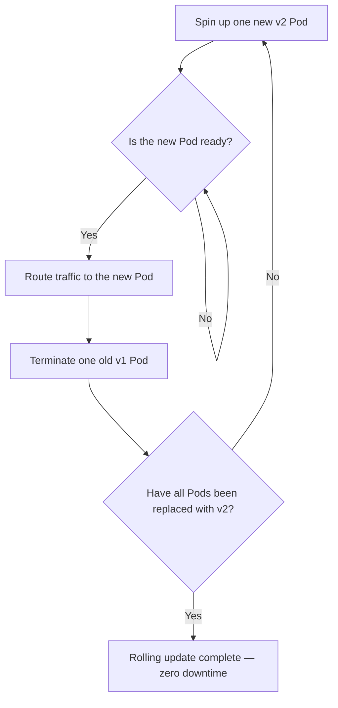

# Deployment and Service - Deploying Apps and Exposing Them Externally

## Learning Objectives
- Manage Pod replication, self-healing, and rolling updates using a Deployment
- Understand how to access Pods through a Service (ClusterIP / NodePort)
- Deploy a Deployment with kubectl and expose it externally via a Service

## Lecture

### Why Not Create Pods Directly?

In Lecture 3 we created a Pod directly with `kubectl run`. In practice, however, you will rarely — if ever — create Pods by hand. The reason is simple: a Pod is a **disposable resource that can disappear at any moment**. If a node goes down, someone accidentally deletes the Pod, or the cluster migrates the Pod to another node, that Pod is gone. If you created it manually, the service stays down until someone recreates it by hand.

That is why Kubernetes provides **Deployment** as a higher-level abstraction on top of Pods. You simply declare the desired state — "keep N Pods running at all times" — and let Kubernetes do the work of maintaining that state.

> The core philosophy of Kubernetes is to declare *what state you want*, not *how to get there*. A Deployment is the canonical example of this declarative mindset.

### Three Things a Deployment Does

A Deployment manages a group of Pod **replicas**. It has three core capabilities:

**1. Replication — run multiple identical copies.**
If you set `replicas: 3` in a Deployment, Kubernetes ensures exactly three identical Pods are always running. When traffic increases, simply raise the number. With multiple replicas, losing one Pod does not interrupt the service.

**2. Self-healing — automatically replace what dies.**
A Deployment continuously monitors the number of Pods it manages. If one Pod dies and the count drops from 3 to 2, Kubernetes immediately creates a new Pod to bring it back to 3. The desired state is restored automatically without any human intervention. This is the single biggest reason to use a Deployment instead of raw Pods.

**3. Rolling Update — deploy a new version without downtime.**
When upgrading an app from v1 to v2, a Deployment does not replace all Pods at once. It gradually swaps them out, keeping the service running throughout the update (zero downtime).

The rolling update process works as follows:

1. Create one additional Pod running the new version (v2).
2. Once the new Pod is ready and accepting traffic, route requests to it.
3. Terminate one Pod still running the old version (v1).
4. Repeat until every Pod runs the new version.

The diagram below shows this cycle of bringing up a new Pod and tearing down an old one.



Two safety parameters control the process. **maxUnavailable** sets how many Pods may be taken down simultaneously, and **maxSurge** sets how many extra Pods may exist above the desired count. Both default to 25%. With 4 Pods, for example, at most 1 is taken down at a time, and at most 1 extra is spun up — temporarily running 5 — to fill the gap without leaving any Pod slot empty.

> If the new version has a problem, `kubectl rollout undo` instantly reverts to the previous version. A Deployment retains the revision history to make this possible.

### Let's Deploy a Deployment

Time to try it hands-on. (Assumes a local cluster such as Minikube is already running.) The command below deploys an nginx web server with 3 replicas:

```bash
# Create a Deployment using the nginx image with 3 replicas
kubectl create deployment web --image=nginx --replicas=3

# Check the result
kubectl get deployments
```

```
NAME   READY   UP-TO-DATE   AVAILABLE   AGE
web    3/3     3            3           15s
```

`READY 3/3` means all three desired replicas are healthy. Now check the Pods that were created:

```bash
kubectl get pods
```

```
NAME                   READY   STATUS    RESTARTS   AGE
web-5d4f8c7b9c-7k2lp   1/1     Running   0          30s
web-5d4f8c7b9c-q8xvr   1/1     Running   0          30s
web-5d4f8c7b9c-zm4tn   1/1     Running   0          30s
```

Now let's see self-healing in action. Force-delete one of the Pods:

```bash
kubectl delete pod web-5d4f8c7b9c-7k2lp
kubectl get pods
```

```
NAME                   READY   STATUS              RESTARTS   AGE
web-5d4f8c7b9c-q8xvr   1/1     Running             0          1m
web-5d4f8c7b9c-zm4tn   1/1     Running             0          1m
web-5d4f8c7b9c-rt9wd   0/1     ContainerCreating   0          2s
```

A new Pod with a different name (`...-rt9wd`) appears immediately in place of the deleted one. We did nothing, yet the count is back to 3. That is self-healing in action.

Changing the replica count takes a single command:

```bash
kubectl scale deployment web --replicas=5
```

> The `kubectl create`, `kubectl scale`, and `kubectl expose` commands used here are **imperative** — you tell Kubernetes what action to take. This is convenient for learning, but the production standard is the **declarative** approach covered in Lecture 5: writing the desired state into a YAML manifest and applying it with `kubectl apply -f`. Think of these commands as a preview of what you will eventually express in YAML.

### Service — Stable Access to a Shifting Set of Pods

There is one problem remaining. Every time a Pod dies and is recreated, its **IP address changes**. As you saw above, a replaced Pod gets a new name and a new IP. How do users of your app know which IP to connect to?

**Service** solves this. A Service is a **stable front door and load balancer** placed in front of a set of Pods. It holds a single address that never changes and distributes incoming requests evenly across the Pods behind it. Even as Pods are replaced with new IPs, the Service automatically keeps track of healthy Pods, so users never notice the change.

The Service decides which Pods to send traffic to using a **label selector**. If you specify "send to Pods with the label `app=web`", the Service finds and distributes requests to all Pods carrying that label, regardless of how many there are.

There are several Service types. The two you must know at the beginner level are:

**ClusterIP (default)** — assigns a virtual address that is reachable only *inside* the cluster. External access is not possible. Use it for Pod-to-Pod communication within the cluster — for example, a web server Pod connecting to a database Pod. Because there is no external exposure, this is the safest default choice.

**NodePort** — extends ClusterIP by adding an external access path. Here is the most important thing to understand: **NodePort is not a separate Service that replaces ClusterIP. It wraps ClusterIP and adds an external port on top of it.** Creating a NodePort Service automatically (1) assigns a ClusterIP for internal communication, and (2) opens the same port (in the range 30000–32767) on every node so that `<NodeIP>:<NodePort>` reaches the Service from outside the cluster. NodePort is well-suited for learning and simple testing.

A single NodePort Service therefore provides **two access paths to the same set of Pods**:

- External user → `NodeIP:NodePort` (NodePort) → **same Service** → the backing Pods
- Pod inside the cluster → ClusterIP address (included in the NodePort Service) → **same Service** → the same backing Pods

The diagram below shows how external traffic (via NodePort) and internal traffic (via ClusterIP) both arrive at **one Service object** and are then distributed to the same set of Pods. NodePort is the "outer door" added to that Service, while ClusterIP is the "inner door" that was already there.

```mermaid Service access paths — one NodePort Service providing both an external port and an internal ClusterIP
flowchart LR
    User["External User"]
    InPod["Pod Inside Cluster"]

    subgraph Cluster["Kubernetes Cluster"]
        subgraph Svc["One NodePort Service (web)"]
            NPGate["External path<br/>NodeIP:NodePort"]
            CIPGate["Internal path<br/>ClusterIP address"]
        end
        P1["Pod web-1<br/>app=web"]
        P2["Pod web-2<br/>app=web"]
        P3["Pod web-3<br/>app=web"]
    end

    User -->|"NodeIP:NodePort"| NPGate
    InPod -->|"ClusterIP address"| CIPGate
    NPGate -->|Load-balanced to the same Pod set| P1
    NPGate --> P2
    NPGate --> P3
    CIPGate --> P1
    CIPGate --> P2
    CIPGate --> P3
```

### Let's Expose the Service

Expose the `web` Deployment as a NodePort Service:

```bash
# Expose the web Deployment as a NodePort Service on port 80
kubectl expose deployment web --type=NodePort --port=80

# Check the created Service
kubectl get service web
```

```
NAME   TYPE       CLUSTER-IP      EXTERNAL-IP   PORT(S)        AGE
web    NodePort   10.96.142.31    <none>        80:31845/TCP   5s
```

Notice the `CLUSTER-IP` column (`10.96.142.31`). Even though this is a NodePort Service, a ClusterIP is still assigned — that is the internal path for Pods within the cluster. In the `PORT(S)` column, `80:31845` means port 80 is the Service port and `31845` is the NodePort exposed to the outside (automatically assigned; the number varies by environment). One Service object, two access paths — visible right here in the output.

On Minikube, get the full external URL with one command:

```bash
minikube service web --url
```

```
http://192.168.49.2:31845
```

Open that URL in a browser or with curl and you will see the nginx default page:

```bash
curl http://192.168.49.2:31845
```

```
<!DOCTYPE html>
<html>
<head><title>Welcome to nginx!</title></head>
...
```

Now let's try a rolling update. Simply change the image:

```bash
# Update the container image to a new version → rolling update starts automatically
kubectl set image deployment/web nginx=nginx:1.27

# Watch the rollout progress in a human-readable format
kubectl rollout status deployment/web
```

```
Waiting for deployment "web" rollout to finish: 2 out of 3 new replicas have been updated...
deployment "web" successfully rolled out
```

If a problem shows up during the update, roll back immediately:

```bash
kubectl rollout undo deployment/web
```

Throughout this entire process, the Service address stays the same and user requests are never interrupted. A Deployment (keeping the app alive) paired with a Service (providing a stable access point) is the most fundamental pattern for running applications on Kubernetes.

## Key Takeaways
- **Pods are ephemeral**, so instead of creating them directly, manage them through a **Deployment**.
- A Deployment handles three things: **replication** (maintaining the desired count), **self-healing** (auto-recreating failed Pods), and **rolling updates** (zero-downtime deployments).
- A rolling update brings up new Pods until they are ready, then replaces old Pods one at a time. `maxUnavailable` and `maxSurge` control the pace and safety margin. Use `kubectl rollout undo` to revert if something goes wrong.
- Because Pod IPs change constantly, a **Service** provides a stable address and load balancing. The **label selector** determines which Pods receive traffic.
- **ClusterIP** is for internal cluster communication (default). **NodePort** wraps ClusterIP and adds an external port on every node, giving a single Service object two access paths — one internal, one external.
- The `kubectl create/scale/expose` commands used in this lecture are imperative; the production standard is the declarative YAML + `kubectl apply` approach covered in Lecture 5.
- Key commands: `kubectl create deployment`, `kubectl scale`, `kubectl expose`, `kubectl set image`, `kubectl rollout status/undo`.
