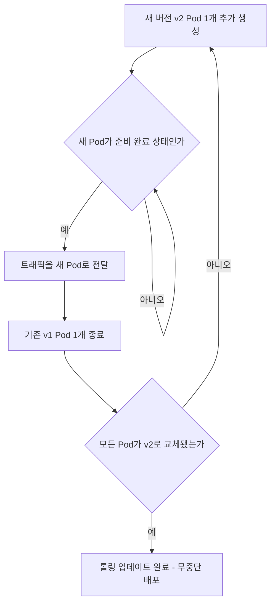

# Deployment와 Service - 앱 배포와 외부 노출

## 학습 목표
- Deployment로 Pod 복제, 자가 치유(self-healing), 롤링 업데이트를 관리한다.
- Service(ClusterIP / NodePort)로 Pod에 접근하는 방법을 이해한다.
- kubectl로 Deployment를 배포하고 Service로 외부에 노출해본다.

## 본문

### 왜 Pod를 직접 만들지 않을까

3강에서 우리는 `kubectl run`으로 Pod를 직접 만들어 보았습니다. 그런데 실무에서는 Pod를 손으로 직접 만드는 일이 거의 없습니다. 이유는 간단합니다. Pod는 **언제든 사라질 수 있는 일회용 자원**이기 때문입니다. 노드가 죽거나, 누군가 실수로 지우거나, 클러스터가 Pod를 다른 노드로 옮기면 그 Pod는 그대로 없어집니다. 직접 만든 Pod라면 누군가 다시 만들어주기 전까지 서비스는 멈춰 있게 됩니다.

그래서 쿠버네티스는 Pod 위에 한 단계 더 높은 추상화인 **Deployment**를 제공합니다. 우리는 "Pod 몇 개를 항상 띄워 둬"라고 원하는 상태만 선언하고, 실제로 그 상태를 유지하는 일은 쿠버네티스에게 맡깁니다.

> 쿠버네티스의 핵심 철학은 "어떻게 하라"가 아니라 "어떤 상태가 되길 원한다"를 선언하는 것입니다. Deployment는 이 선언형 사고방식의 대표적인 예입니다.

### Deployment가 하는 세 가지 일

Deployment는 Pod의 **복제본(replica)** 묶음을 관리합니다. 핵심 기능은 세 가지입니다.

**1. 복제(Replication) — 여러 개를 똑같이 띄운다.**
Deployment에 `replicas: 3`이라고 적으면, 동일한 Pod 3개가 항상 떠 있도록 유지됩니다. 트래픽이 늘면 숫자만 키우면 되고, 여러 개가 떠 있으니 한 개가 죽어도 서비스는 계속됩니다.

**2. 자가 치유(Self-healing) — 죽으면 알아서 살린다.**
Deployment는 자신이 관리하는 Pod 개수를 끊임없이 감시합니다. 만약 Pod 하나가 죽어서 3개에서 2개가 되면, 쿠버네티스는 곧바로 새 Pod 하나를 만들어 다시 3개를 맞춥니다. 사람이 개입하지 않아도 "원하는 상태(3개)"가 자동으로 회복됩니다. 이것이 우리가 Pod를 직접 만들지 않는 가장 큰 이유입니다.

**3. 롤링 업데이트(Rolling Update) — 무중단으로 새 버전을 배포한다.**
앱을 v1에서 v2로 올릴 때, Deployment는 모든 Pod를 한꺼번에 갈아치우지 않습니다. 기존 Pod를 하나씩 새 버전으로 천천히 교체합니다. 이렇게 하면 업데이트 중에도 서비스가 멈추지 않습니다(zero downtime).

롤링 업데이트의 흐름은 다음과 같습니다.

1. 새 버전(v2) Pod를 하나 추가로 생성한다.
2. 새 Pod가 정상적으로 떠서 요청을 받을 준비가 되면, 트래픽을 그 Pod로 보낸다.
3. 그 다음 기존 버전(v1) Pod를 하나 종료한다.
4. 이 과정을 모든 Pod가 새 버전이 될 때까지 반복한다.

아래 흐름도처럼 새 Pod를 먼저 띄우고 기존 Pod를 하나씩 내리는 과정을 반복합니다.



이때 두 가지 안전장치가 동작합니다. **maxUnavailable**은 "동시에 몇 개까지 내려가도 되는가"를, **maxSurge**는 "원하는 개수보다 몇 개까지 더 띄워도 되는가"를 정합니다. 기본값은 둘 다 25%입니다. 즉 Pod가 4개라면 한 번에 1개만 내려가고, 잠깐 1개를 더 띄워(최대 5개) 빈자리 없이 교체합니다.

> 새 버전에 문제가 생겼다면 `kubectl rollout undo`로 이전 버전으로 즉시 되돌릴 수 있습니다. Deployment가 버전 이력을 기억하고 있기 때문입니다.

### Deployment를 직접 배포해 보자

이제 직접 해봅니다. (Minikube 같은 로컬 클러스터가 떠 있다고 가정합니다.) 아래는 nginx 웹 서버를 3개 복제본으로 배포하는 명령입니다.

```bash
# nginx 이미지로 Deployment 생성, 복제본 3개
kubectl create deployment web --image=nginx --replicas=3

# 결과 확인
kubectl get deployments
```

```
NAME   READY   UP-TO-DATE   AVAILABLE   AGE
web    3/3     3            3           15s
```

`READY 3/3`은 원하는 3개가 모두 정상이라는 뜻입니다. 실제로 만들어진 Pod도 봅니다.

```bash
kubectl get pods
```

```
NAME                   READY   STATUS    RESTARTS   AGE
web-5d4f8c7b9c-7k2lp   1/1     Running   0          30s
web-5d4f8c7b9c-q8xvr   1/1     Running   0          30s
web-5d4f8c7b9c-zm4tn   1/1     Running   0          30s
```

이제 자가 치유를 눈으로 확인해 봅시다. Pod 하나를 강제로 지워봅니다.

```bash
kubectl delete pod web-5d4f8c7b9c-7k2lp
kubectl get pods
```

```
NAME                   READY   STATUS              RESTARTS   AGE
web-5d4f8c7b9c-q8xvr   1/1     Running             0          1m
web-5d4f8c7b9c-zm4tn   1/1     Running             0          1m
web-5d4f8c7b9c-rt9wd   0/1     ContainerCreating   0          2s
```

지운 Pod 자리에 이름이 다른 새 Pod(`...-rt9wd`)가 즉시 생기는 것을 볼 수 있습니다. 우리가 아무것도 하지 않았는데 다시 3개로 맞춰지죠. 이것이 자가 치유입니다.

복제본 개수를 바꾸는 것도 명령 한 줄입니다.

```bash
kubectl scale deployment web --replicas=5
```

> 여기서 쓴 `kubectl create`, `kubectl scale`, `kubectl expose`는 빠르게 결과를 보여주는 **명령형(imperative)** 방식입니다. 개념을 익히기엔 좋지만, 실무 표준은 5강에서 배울 **선언형(declarative)** 방식 — 즉 YAML 매니페스트에 원하는 상태를 적고 `kubectl apply -f`로 적용하는 방식입니다. 이 강의의 명령들은 "YAML로 무엇을 적게 될지"를 미리 맛보는 과정이라고 생각하세요.

### Service - 흩어진 Pod에 안정적으로 접근하기

문제가 하나 남았습니다. Pod는 죽고 다시 태어날 때마다 **IP 주소가 바뀝니다.** 위에서 봤듯이 Pod가 교체되면 이름도, IP도 달라집니다. 그렇다면 우리 앱에 접속하려는 사용자는 매번 바뀌는 IP를 어떻게 알 수 있을까요?

이 문제를 해결하는 것이 **Service**입니다. Service는 여러 Pod 앞에 놓인 **고정된 출입구이자 부하 분산기**입니다. Service는 변하지 않는 하나의 주소를 가지며, 들어온 요청을 자신이 관리하는 Pod들에게 골고루 나눠 보냅니다(load balancing). Pod가 죽고 새로 생겨 IP가 바뀌어도, Service는 자동으로 살아있는 Pod 목록을 갱신하므로 사용자는 변화를 전혀 느끼지 못합니다.

Service가 어떤 Pod에게 요청을 보낼지는 **레이블(label) 셀렉터**로 결정합니다. "`app=web` 레이블이 붙은 Pod에게 보내"라고 지정하면, 그 레이블을 가진 Pod가 몇 개든 알아서 찾아 분배합니다.

Service에는 여러 종류(타입)가 있는데, 초급 단계에서 꼭 알아야 할 두 가지는 다음과 같습니다.

**ClusterIP (기본값)** — 클러스터 *내부*에서만 통하는 가상 주소를 부여합니다. 외부에서는 접근할 수 없고, 같은 클러스터 안의 다른 Pod끼리 통신할 때 씁니다. 예를 들어 웹 서버 Pod가 데이터베이스 Pod에 접속할 때 데이터베이스를 ClusterIP Service로 노출합니다. 외부에 열 필요가 없으니 가장 안전한 기본 선택입니다.

**NodePort** — 외부에서도 접속할 수 있도록 확장한 타입입니다. 여기서 가장 중요한 점: **NodePort는 ClusterIP를 대체하는 별개의 Service가 아니라, ClusterIP를 그대로 품은 채 그 위에 외부 통로를 하나 더 얹은 것입니다.** 즉 NodePort 타입 Service를 만들면 (1) 클러스터 내부에서 쓰는 ClusterIP 주소가 여전히 자동으로 부여되고, (2) 동시에 모든 노드에 동일한 포트(30000~32767 범위)가 열려 `노드IP:노드포트`로 클러스터 밖에서도 같은 Service에 접속할 수 있습니다. 학습이나 간단한 테스트에 적합합니다.

그래서 **하나의 NodePort Service는 동일한 Pod 묶음에 대해 두 가지 접근 경로를 제공합니다.**

- 외부 사용자 → `노드IP:노드포트`(NodePort) → **같은 Service** → 뒤의 Pod 여러 개
- 클러스터 내부 Pod → ClusterIP 주소(NodePort에 포함됨) → **같은 Service** → 같은 Pod 여러 개

아래 구성도처럼 외부 요청(NodePort)과 내부 통신(ClusterIP)은 **서로 다른 Service가 아니라 하나의 Service 객체**로 들어와 동일한 뒤쪽 Pod들로 분배됩니다. NodePort는 그 Service에 달린 "바깥쪽 문"이고, ClusterIP는 같은 Service의 "안쪽 문"인 셈입니다.

```mermaid Service 접근 경로 구성도 - 하나의 NodePort Service가 품은 외부 통로와 내부 ClusterIP
flowchart LR
    User["외부 사용자"]
    InPod["클러스터 내부 Pod"]

    subgraph Cluster["쿠버네티스 클러스터"]
        subgraph Svc["하나의 NodePort Service (web)"]
            NPGate["외부 통로<br/>노드IP:노드포트"]
            CIPGate["내부 통로<br/>ClusterIP 주소"]
        end
        P1["Pod web-1<br/>app=web"]
        P2["Pod web-2<br/>app=web"]
        P3["Pod web-3<br/>app=web"]
    end

    User -->|"노드IP:노드포트"| NPGate
    InPod -->|"클러스터 내부 주소"| CIPGate
    NPGate -->|같은 Pod 묶음으로 부하 분산| P1
    NPGate --> P2
    NPGate --> P3
    CIPGate --> P1
    CIPGate --> P2
    CIPGate --> P3
```

### Service로 노출해 보자

앞서 만든 `web` Deployment를 NodePort Service로 외부에 노출합니다.

```bash
# web Deployment를 80번 포트로 받는 NodePort Service로 노출
kubectl expose deployment web --type=NodePort --port=80

# 생성된 Service 확인
kubectl get service web
```

```
NAME   TYPE       CLUSTER-IP      EXTERNAL-IP   PORT(S)        AGE
web    NodePort   10.96.142.31    <none>        80:31845/TCP   5s
```

출력의 `CLUSTER-IP` 칸(`10.96.142.31`)에 주목하세요. NodePort 타입인데도 ClusterIP가 함께 부여된 것이 보입니다. 이 주소는 클러스터 내부 Pod가 같은 Service에 접속하는 통로이고, `PORT(S)` 칸의 `80:31845`에서 오른쪽 `31845`가 외부에 열린 NodePort입니다(왼쪽 80은 Service 포트, 노드포트 번호는 자동 할당되므로 환경마다 다릅니다). 하나의 Service가 안팎 두 통로를 동시에 제공하는 것을 출력에서 직접 확인할 수 있습니다. Minikube에서는 아래 명령으로 외부 접속 주소를 바로 얻을 수 있습니다.

```bash
minikube service web --url
```

```
http://192.168.49.2:31845
```

이 주소를 브라우저나 curl로 열면 nginx 기본 페이지가 보입니다.

```bash
curl http://192.168.49.2:31845
```

```
<!DOCTYPE html>
<html>
<head><title>Welcome to nginx!</title></head>
...
```

이제 새 버전을 배포하는 롤링 업데이트도 해봅니다. 이미지를 바꾸기만 하면 됩니다.

```bash
# 컨테이너 이미지를 새 버전으로 변경 → 롤링 업데이트 자동 시작
kubectl set image deployment/web nginx=nginx:1.27

# 교체 진행 상황을 사람이 읽기 좋게 확인
kubectl rollout status deployment/web
```

```
Waiting for deployment "web" rollout to finish: 2 out of 3 new replicas have been updated...
deployment "web" successfully rolled out
```

업데이트 도중 문제가 발견되면 즉시 되돌립니다.

```bash
kubectl rollout undo deployment/web
```

이 모든 과정 동안 Service의 주소는 그대로이고, 사용자 요청은 끊기지 않습니다. Deployment(앱의 생명 유지)와 Service(안정적인 접근 통로)가 짝을 이뤄 동작하는 것이 쿠버네티스 앱 운영의 가장 기본적인 형태입니다.

## 핵심 요약
- **Pod는 일회용**이라 직접 만들지 않고, **Deployment**로 관리한다.
- Deployment는 **복제(원하는 개수 유지)**, **자가 치유(죽으면 자동 재생성)**, **롤링 업데이트(무중단 배포)**를 담당한다.
- 롤링 업데이트는 새 Pod를 준비 완료까지 띄운 뒤 기존 Pod를 하나씩 교체하며, `maxUnavailable`·`maxSurge`로 속도와 안전을 조절한다. 문제가 생기면 `kubectl rollout undo`로 되돌린다.
- Pod는 IP가 계속 바뀌므로, **Service**가 고정 주소와 부하 분산을 제공한다. 어떤 Pod로 보낼지는 **레이블 셀렉터**로 정한다.
- **ClusterIP**는 클러스터 내부 통신용(기본값)이고, **NodePort**는 그 ClusterIP를 그대로 품은 채 외부 통로(노드 포트)를 추가한 타입이다. 즉 하나의 NodePort Service가 내부·외부 두 접근 경로를 동시에 제공한다.
- 실습에서 쓴 `kubectl create/scale/expose`는 명령형 방식이며, 실무 표준은 5강의 선언형(YAML + `kubectl apply`) 방식이다.
- 실습 명령: `kubectl create deployment`, `kubectl scale`, `kubectl expose`, `kubectl set image`, `kubectl rollout status/undo`.
