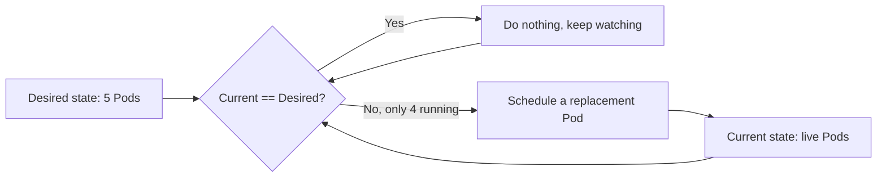
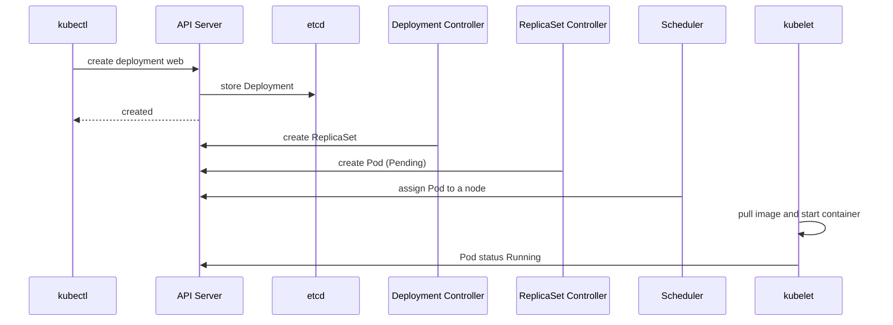

# kubectl CLI Basics: Core Commands and Cluster Operations

## Learning Objectives
- Understand the structure of your kubeconfig and switch safely between contexts and namespaces so you never run a command against the wrong cluster.
- Inspect and debug live resources with `get`, `describe`, `logs`, and `exec`, and shape the output using `-o wide/yaml/json` and label selectors.
- Tell the difference between the imperative style (`run`, `create`, `set`) and the declarative style (`apply -f`), and choose the right one for the task in front of you.

## Body

### Why kubectl is the tool you live in

`kubectl` (pronounced "kube-control" or "kube-cuttle"; both are accepted) is the command-line client that talks to the Kubernetes API server. Almost everything you do with a cluster — listing Pods, reading logs, scaling a Deployment, opening a shell inside a running container — flows through this one binary. If Kubernetes is the engine, kubectl is the cockpit. The goal of this lecture is to make that cockpit feel familiar so that when something breaks at 2 a.m., your hands already know where the controls are.

A small but important detail before we start: every example below uses `kubectl`, but most operators add a shell alias `alias k=kubectl`. You'll see `k` used interchangeably in the wild, and enabling shell auto-completion (`source <(kubectl completion bash)` or the zsh equivalent) means you can Tab-complete resource names instead of memorizing them. These two habits alone will roughly halve your typing.

> The official kubectl Cheat Sheet in the Kubernetes docs is the single best reference to keep open while you learn. It lists every short name and output flag in one page.

### Knowing which cluster you're talking to: kubeconfig, context, namespace

Before you run a single command, you need to answer one question: *which cluster, and as whom, am I about to act?* Running a `delete` against production when you thought you were on a local test cluster is one of the most common and most painful beginner mistakes. Kubernetes solves this with a configuration file called the **kubeconfig**, by default at `~/.kube/config`.

A kubeconfig bundles three kinds of entries:

- **clusters** — the API server addresses and their certificate authorities (the "where").
- **users** — the credentials you authenticate with, such as a client certificate or a token (the "who").
- **contexts** — named combinations that glue one cluster + one user + a default namespace together (the "which combination").

The structure is as follows: a context is simply a pointer that says "use *this* cluster, *this* user, and *this* namespace by default." One of the contexts is marked as **current**, and that is the one every command uses unless you override it.

You inspect and switch all of this with `kubectl config`:

```bash
# See everything kubectl knows about (credentials are redacted)
kubectl config view

# List all contexts; the current one is marked with a *
kubectl config get-contexts

# See just the name of the context you're on right now
kubectl config current-context

# Switch to a different cluster/user combination
kubectl config use-context minikube
```

A **namespace** is a virtual partition *inside* a single cluster — think of it as a folder that scopes resource names so that the `web` Deployment in `team-a` doesn't collide with the `web` Deployment in `team-b`. Most commands default to the `default` namespace. You can target another namespace per command with `-n`, or change the default baked into your current context:

```bash
# One-off: list Pods in the kube-system namespace
kubectl get pods -n kube-system

# Persist a new default namespace for the current context
kubectl config set-context --current --namespace=jupiter
```

> Best practice: glance at `kubectl config current-context` before any destructive command. Many teams install tools like `kubectx` and `kubens`, or add the context name to their shell prompt, precisely so a wrong-cluster mistake becomes hard to make.

### Reading the cluster: get, describe, and output formatting

`kubectl get` is your bird's-eye view — a quick table of what exists and its high-level status.

```bash
kubectl get pods
kubectl get deployments
kubectl get nodes
```

Many resource types have short names that save keystrokes: `po` for pods, `deploy` for deployments, `svc` for services, `ns` for namespaces, `no` for nodes, `rs` for replicasets. So `kubectl get po` is the same as `kubectl get pods`. Run `kubectl api-resources` to see the full list of types and their short names.

The default table is often not enough. The `-o` (output) flag reshapes the result:

```bash
# Add extra columns like node placement and Pod IP
kubectl get pods -o wide

# Dump the full live object as YAML (great for learning the schema)
kubectl get pod nginx -o yaml

# Same thing as JSON, ideal for piping into jq or scripts
kubectl get pod nginx -o json
```

When you have dozens of Pods, **label selectors** let you filter to just the ones you care about. Labels are key/value tags attached to resources, and `--selector` (or its short form `-l`) matches against them:

```bash
# Only Pods labelled app=web
kubectl get pods -l app=web

# Combine two labels
kubectl get pods -l 'app=web,env=prod'
```

While `get` gives you the summary, `kubectl describe` gives you the deep, human-readable detail of one object — its configuration, current conditions, and, crucially, the **Events** at the bottom. When a Pod is stuck, the Events section usually tells you exactly why.

```bash
kubectl describe pod nginx
```

If you see a Pod stuck in `Pending`, `ImagePullBackOff`, or `CrashLoopBackOff`, `describe` is almost always your first stop — for example, `ImagePullBackOff` typically means the image name is wrong or the cluster can't reach the registry, and the Events will say so.

### Debugging from the inside: logs and exec

Two commands let you reach into a running container.

`kubectl logs` streams whatever the container wrote to standard output — your application logs:

```bash
kubectl logs nginx

# Follow new lines as they arrive (like tail -f)
kubectl logs -f nginx

# Read logs from a Pod that already crashed and restarted
kubectl logs nginx --previous
```

`kubectl exec` runs a command inside a container. With `-it` (interactive + TTY) it opens a live shell, which is the closest thing to SSH-ing into your workload:

```bash
# Run a single command and print its result
kubectl exec nginx -- printenv

# Open an interactive shell inside the container
kubectl exec -it nginx -- sh
```

Note the `--` separator: everything after it is the command for the *container*, not for kubectl. So `kubectl exec -it nginx -- sh -c 'echo $var1'` prints the value of an environment variable from inside the Pod — exactly how you'd confirm a configuration value really took effect.

### Two ways to create things: imperative vs declarative

There are two philosophies for managing Kubernetes resources, and a good operator uses both deliberately.

The **imperative** style means you tell kubectl *what to do, step by step*, on the command line. It's fast and great for experimenting, throwaway resources, and exam-style time pressure:

```bash
# Create a Pod directly from the CLI
kubectl run nginx --image=nginx --env=var1=val1

# Create a Deployment with two replicas
kubectl create deployment web --image=nginx:1.18.0 --replicas=2

# Change a running Deployment's image in place
kubectl set image deployment/web nginx=nginx:1.19.8

# Scale a Deployment up or down
kubectl scale deployment web --replicas=5
```

The **declarative** style means you write the *desired end state* into a YAML manifest and hand it to `kubectl apply -f`. Kubernetes figures out the steps to reach that state:

```bash
kubectl apply -f deployment.yaml
kubectl apply -f service.yaml
```

The key difference: with imperative commands you describe *actions*; with declarative apply you describe the *goal*, and you can re-run `apply` against the same file as many times as you like — Kubernetes only changes what differs from the live state. That makes declarative manifests version-controllable and the standard choice for anything you'll run more than once. Imperative commands are for speed and exploration; declarative manifests are for production and GitOps.

A wonderful bridge between the two is `--dry-run=client -o yaml`. It tells kubectl to *not* actually create anything, but instead print the YAML it *would* have generated. This lets you scaffold a correct manifest in seconds instead of hand-writing indentation:

```bash
kubectl create deployment web --image=nginx:1.18.0 --replicas=2 \
  --dry-run=client -o yaml > deployment.yaml
```

### Desired state and self-healing: why apply is so powerful

Once you understand declarative management, one of Kubernetes' best features makes sense. When you declare `replicas: 5`, you've told the cluster the **desired state**: five Pods should always be running. Suppose you delete one by hand:

```bash
kubectl delete pod web-7d9f-abcde
kubectl get pods   # you still see 5, not 4
```

This is not a bug. A controller continuously compares the **current state** to the **desired state**, notices only four Pods are running, and immediately schedules a replacement. This loop is called **reconciliation**, and it's the engine behind Kubernetes' self-healing, shown in the loop below.



It also explains why `kubectl create deployment` returns instantly while your container isn't running *yet*. The flow is as follows, as shown in the sequence diagram below: kubectl sends your request to the **API server**, which records the Deployment in **etcd** (the cluster's database) and replies "created" — like a restaurant confirming your order before the food is cooked. Then the **Deployment controller** creates a ReplicaSet, the **ReplicaSet controller** creates a Pod (initially `Pending`), the **scheduler** picks a node for it, and finally the **kubelet** on that node pulls the image and starts the container, flipping the Pod to `Running`. You can watch this whole sequence unfold live:



```bash
kubectl get pods -o wide --watch
kubectl create deployment web --image=nginx
```

You'll see the Pod move from `Pending`, to `ContainerCreating`, to `Running` with an assigned IP — a front-row seat to reconciliation in action.

## Key Takeaways
- A kubeconfig binds **clusters**, **users**, and **contexts** together; always confirm `kubectl config current-context` and your namespace before acting, especially on anything destructive.
- `get` gives the summary table (reshape it with `-o wide/yaml/json` and filter with `-l`/`--selector`), while `describe`, `logs`, and `exec` take you progressively deeper for debugging.
- Imperative commands (`run`, `create`, `set`, `scale`) are fast for experiments; declarative `apply -f` describes the desired end state and is the standard for repeatable, version-controlled, production workloads.
- Use `--dry-run=client -o yaml` to generate correct manifests instantly, bridging the imperative and declarative worlds.
- Kubernetes constantly reconciles current state toward your declared desired state, which is why a deleted Pod comes back and why a `create` returns before the container is truly running.
