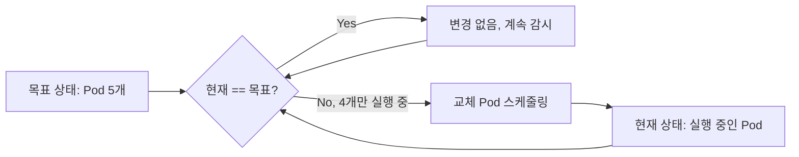
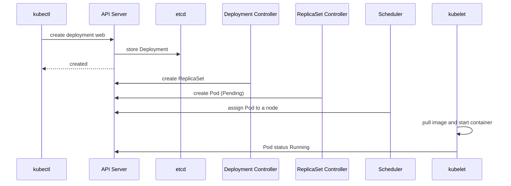

# kubectl CLI 기초: 핵심 명령어와 클러스터 조작

## 학습 목표
- kubeconfig 구조를 이해하고 context와 namespace를 안전하게 전환해, 엉뚱한 클러스터에 명령을 날리는 실수를 방지한다.
- `get`, `describe`, `logs`, `exec`로 실행 중인 리소스를 조회·디버깅하고, `-o wide/yaml/json`과 레이블 셀렉터로 출력을 원하는 형태로 다듬는다.
- 명령형 스타일(`run`, `create`, `set`)과 선언형 스타일(`apply -f`)의 차이를 파악하고 상황에 맞게 골라 쓴다.

## 본문

### kubectl — 클러스터 조작의 유일한 창구

`kubectl`(발음은 "kube-control" 또는 "kube-cuttle" 둘 다 통용된다)은 Kubernetes API 서버와 통신하는 커맨드라인 클라이언트다. Pod 목록 조회, 로그 확인, Deployment 스케일 조정, 컨테이너 내부에서 셸 실행까지 — 클러스터에서 하는 거의 모든 일이 이 하나의 바이너리를 거친다. Kubernetes가 엔진이라면 kubectl은 조종석이다. 이번 강의의 목표는 그 조종석을 손에 익혀두는 것이다. 새벽 2시에 장애가 터져도 손이 먼저 움직일 수 있도록.

시작하기 전에 실용적인 팁 두 가지: 대부분의 운영자는 `alias k=kubectl`로 단축키를 등록해 쓴다. 현장에서 `k`와 `kubectl`이 혼용되는 이유가 이것이다. 또한 셸 자동완성(`source <(kubectl completion bash)` 혹은 zsh 버전)을 켜두면 리소스 이름을 Tab으로 완성할 수 있어 외울 필요가 줄어든다. 이 두 가지 습관만으로도 타이핑량이 거의 반으로 줄어든다.

> 공식 kubectl Cheat Sheet(Kubernetes 공식 문서)는 단축 이름과 출력 플래그를 한 페이지에 담아놓은 최고의 레퍼런스다. 학습하는 동안 늘 열어두길 권한다.

### 어떤 클러스터와 대화 중인가: kubeconfig, context, namespace

명령을 실행하기 전에 반드시 확인해야 할 것이 있다. "지금 어떤 클러스터에, 어떤 권한으로 접속해 있는가?" 로컬 테스트 클러스터라고 생각하고 `delete`를 날렸는데 프로덕션이었다면 — 이것이 초보자들이 가장 자주, 가장 뼈아프게 겪는 실수다. Kubernetes는 이 문제를 **kubeconfig**라는 설정 파일로 관리한다. 기본 위치는 `~/.kube/config`다.

kubeconfig에는 세 종류의 항목이 묶여 있다:

- **clusters** — API 서버 주소와 인증서 정보 ("어디에")
- **users** — 클라이언트 인증서나 토큰 등 인증 수단 ("누가")
- **contexts** — cluster + user + 기본 namespace를 하나로 묶은 이름표 ("어떤 조합으로")

context는 "이 cluster, 이 user, 이 namespace를 기본값으로 쓴다"는 포인터다. 여러 context 중 하나가 **current**로 지정되고, 명시적으로 덮어쓰지 않는 한 모든 명령은 이 current context를 따른다.

`kubectl config` 명령으로 조회하고 전환한다:

```bash
# kubectl이 알고 있는 모든 설정 보기 (인증 정보는 마스킹됨)
kubectl config view

# 전체 context 목록 조회; 현재 context는 * 표시
kubectl config get-contexts

# 현재 활성 context 이름만 확인
kubectl config current-context

# 다른 cluster/user 조합으로 전환
kubectl config use-context minikube
```

**namespace**는 클러스터 내부의 가상 구획이다. 폴더에 비유하면, `team-a`의 `web` Deployment와 `team-b`의 `web` Deployment가 이름 충돌 없이 공존할 수 있다. 대부분의 명령은 기본값으로 `default` namespace를 사용한다. 특정 명령에만 `-n`으로 namespace를 지정하거나, current context의 기본 namespace 자체를 바꿀 수도 있다:

```bash
# 이번 명령에만 kube-system namespace 사용
kubectl get pods -n kube-system

# 현재 context의 기본 namespace를 jupiter로 변경
kubectl config set-context --current --namespace=jupiter
```

> 권장 습관: 삭제처럼 파급력이 큰 명령을 실행하기 전에 `kubectl config current-context`로 현재 위치를 확인한다. 많은 팀이 `kubectx`, `kubens` 같은 도구를 쓰거나 셸 프롬프트에 context 이름을 표시해, 잘못된 클러스터에 접속하는 실수 자체를 구조적으로 막는다.

### 클러스터 읽기: get, describe, 출력 포맷

`kubectl get`은 클러스터의 조감도다. 리소스가 어떤 상태인지 빠르게 테이블 형태로 확인할 수 있다.

```bash
kubectl get pods
kubectl get deployments
kubectl get nodes
```

자주 쓰는 리소스 타입에는 단축 이름이 있다: pods→`po`, deployments→`deploy`, services→`svc`, namespaces→`ns`, nodes→`no`, replicasets→`rs`. 따라서 `kubectl get po`는 `kubectl get pods`와 같다. `kubectl api-resources`를 실행하면 전체 타입 목록과 단축 이름을 볼 수 있다.

기본 테이블만으로는 부족할 때 `-o` 플래그로 출력 형식을 바꾼다:

```bash
# 노드 배치, Pod IP 등 추가 컬럼 표시
kubectl get pods -o wide

# 실제 오브젝트를 YAML로 덤프 (스키마 학습에 유용)
kubectl get pod nginx -o yaml

# JSON으로 덤프 (jq나 스크립트와 연계할 때 유용)
kubectl get pod nginx -o json
```

Pod이 수십 개라면 **레이블 셀렉터**로 원하는 것만 필터링한다. 레이블은 리소스에 붙이는 키/값 태그이며, `--selector`(또는 `-l`)로 조건을 지정한다:

```bash
# app=web 레이블이 달린 Pod만
kubectl get pods -l app=web

# 두 레이블을 동시에 만족하는 Pod
kubectl get pods -l 'app=web,env=prod'
```

`get`이 요약 정보를 보여준다면, `kubectl describe`는 오브젝트 하나의 상세 정보를 사람이 읽기 좋은 형태로 펼쳐준다. 설정 값, 현재 상태, 그리고 맨 아래의 **Events** 섹션까지. Pod이 멈춰 있다면 Events 섹션이 이유를 대부분 알려준다.

```bash
kubectl describe pod nginx
```

Pod이 `Pending`, `ImagePullBackOff`, `CrashLoopBackOff` 상태에 빠졌을 때 `describe`가 첫 번째 행동이 되어야 한다. 예를 들어 `ImagePullBackOff`는 대부분 이미지 이름이 틀렸거나 클러스터가 레지스트리에 접근하지 못한 것인데, Events에 구체적인 오류 메시지가 찍힌다.

### 컨테이너 내부 들여다보기: logs와 exec

실행 중인 컨테이너에 접근하는 명령이 두 가지 있다.

`kubectl logs`는 컨테이너가 표준 출력에 쓴 내용, 즉 애플리케이션 로그를 스트리밍한다:

```bash
kubectl logs nginx

# 새 로그를 실시간으로 추적 (tail -f와 동일)
kubectl logs -f nginx

# 이미 재시작된 Pod의 이전 컨테이너 로그 확인
kubectl logs nginx --previous
```

`kubectl exec`는 컨테이너 안에서 명령을 실행한다. `-it`(인터랙티브 + TTY) 옵션을 붙이면 라이브 셸이 열려 워크로드에 SSH로 접속한 것과 가장 비슷한 경험을 얻는다:

```bash
# 단일 명령 실행 후 결과 출력
kubectl exec nginx -- printenv

# 컨테이너 내부에서 인터랙티브 셸 열기
kubectl exec -it nginx -- sh
```

`--` 구분자에 주목하자. 이 뒤에 오는 모든 것은 kubectl이 아닌 *컨테이너*에서 실행할 명령이다. 예를 들어 `kubectl exec -it nginx -- sh -c 'echo $var1'`은 Pod 내부의 환경 변수 값을 출력해 설정이 제대로 적용됐는지 확인할 때 쓸 수 있다.

### 리소스를 만드는 두 가지 방식: 명령형 vs 선언형

Kubernetes 리소스를 관리하는 방식은 두 가지 철학으로 나뉜다. 숙련된 운영자는 이 둘을 상황에 맞게 의식적으로 선택한다.

**명령형** 방식은 kubectl에게 "지금 이것을 해라"고 단계별로 지시한다. 빠르고 실험적인 작업이나 임시 리소스, 시험 환경처럼 속도가 중요할 때 유용하다:

```bash
# CLI에서 Pod 직접 생성
kubectl run nginx --image=nginx --env=var1=val1

# 레플리카 2개짜리 Deployment 생성
kubectl create deployment web --image=nginx:1.18.0 --replicas=2

# 실행 중인 Deployment의 이미지를 즉시 교체
kubectl set image deployment/web nginx=nginx:1.19.8

# Deployment 스케일 조정
kubectl scale deployment web --replicas=5
```

**선언형** 방식은 원하는 최종 상태를 YAML 매니페스트로 작성하고 `kubectl apply -f`에 넘긴다. Kubernetes가 그 상태에 도달하기 위한 단계를 알아서 결정한다:

```bash
kubectl apply -f deployment.yaml
kubectl apply -f service.yaml
```

핵심 차이: 명령형은 *행동*을 기술하고, 선언형은 *목표 상태*를 기술한다. `apply`는 같은 파일로 몇 번이든 재실행할 수 있다. Kubernetes는 현재 상태와 매니페스트를 비교해 달라진 부분만 변경한다. 덕분에 선언형 매니페스트는 버전 관리가 가능하고, 한 번 쓰고 버릴 게 아닌 모든 작업의 표준이 된다. 명령형은 속도와 탐색용, 선언형은 프로덕션과 GitOps용이다.

두 방식을 연결하는 유용한 다리가 `--dry-run=client -o yaml`이다. 실제로 리소스를 만들지 않고 생성될 YAML만 출력해준다. 매니페스트를 처음부터 손으로 작성하는 대신 몇 초 만에 올바른 뼈대를 만들 수 있다:

```bash
kubectl create deployment web --image=nginx:1.18.0 --replicas=2 \
  --dry-run=client -o yaml > deployment.yaml
```

### 선언형 관리와 자가 치유: apply가 강력한 이유

선언형 관리를 이해하면 Kubernetes의 핵심 기능 하나가 자연스럽게 이해된다. `replicas: 5`를 선언했다는 것은 클러스터에게 "Pod이 항상 5개 실행 중이어야 한다"는 **목표 상태**를 알린 것이다. 여기서 Pod 하나를 손으로 삭제하면:

```bash
kubectl delete pod web-7d9f-abcde
kubectl get pods   # 4개가 아닌 5개가 보인다
```

이것은 버그가 아니다. 컨트롤러가 **현재 상태**와 **목표 상태**를 계속 비교하다가 Pod이 4개뿐임을 감지하고 즉시 새 Pod을 스케줄링한다. 이 루프를 **조정(reconciliation)**이라고 하며, Kubernetes 자가 치유의 핵심 메커니즘이다. 아래 다이어그램이 이 루프를 보여준다.



이 원리는 `kubectl create deployment`가 컨테이너가 실제로 뜨기도 전에 즉시 반환되는 이유도 설명해준다. 아래 시퀀스 다이어그램처럼: kubectl이 요청을 **API 서버**에 전달하면, API 서버는 Deployment를 **etcd**(클러스터 데이터베이스)에 기록하고 "created"를 반환한다 — 음식이 나오기 전에 주문 확인을 받는 것과 같다. 이후 **Deployment 컨트롤러**가 ReplicaSet을 만들고, **ReplicaSet 컨트롤러**가 Pod을 만들며(`Pending` 상태), **스케줄러**가 노드를 배정하고, 마지막으로 해당 노드의 **kubelet**이 이미지를 Pull해 컨테이너를 시작하면 Pod이 `Running`으로 바뀐다.



```bash
kubectl get pods -o wide --watch
kubectl create deployment web --image=nginx
```

Pod이 `Pending` → `ContainerCreating` → `Running`으로 바뀌며 IP를 할당받는 과정을 실시간으로 볼 수 있다. 조정 루프가 실제로 작동하는 현장이다.

## 핵심 정리
- kubeconfig는 **clusters**, **users**, **contexts**를 하나로 묶는다. 특히 삭제처럼 파급력이 큰 작업 전에는 반드시 `kubectl config current-context`와 namespace를 확인한다.
- `get`은 요약 테이블을 보여준다(`-o wide/yaml/json`으로 상세화, `-l`/`--selector`로 필터링). `describe`, `logs`, `exec`는 디버깅을 위해 점점 더 깊이 들어가는 도구들이다.
- 명령형(`run`, `create`, `set`, `scale`)은 실험과 빠른 작업에, 선언형 `apply -f`는 반복 가능하고 버전 관리되는 프로덕션 워크로드에 쓴다.
- `--dry-run=client -o yaml`로 올바른 매니페스트를 즉시 생성해, 명령형과 선언형 사이의 다리로 활용한다.
- Kubernetes는 선언한 목표 상태를 향해 현재 상태를 끊임없이 조정한다. 삭제한 Pod이 되살아나는 것도, `create`가 컨테이너 기동 전에 즉시 반환되는 것도 이 조정 루프 때문이다.
