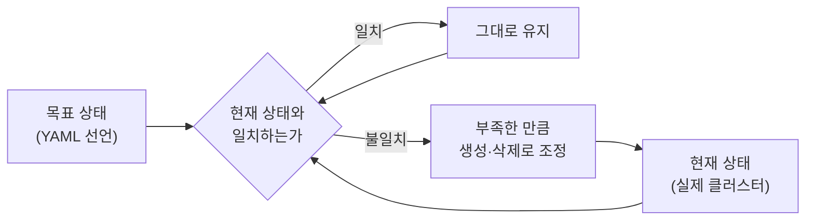
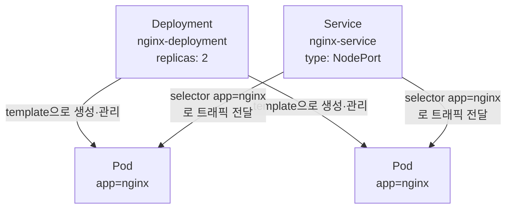

# YAML 매니페스트로 직접 배포하기 - 선언형 구성 실습

## 학습 목표
- 명령형(imperative)과 선언형(declarative) 배포 방식의 차이를 이해한다
- Deployment와 Service의 YAML 매니페스트를 직접 작성한다
- `kubectl apply`로 매니페스트를 적용하고 결과를 검증한다

## 본문

### 왜 YAML로 배포하는가

3강과 4강에서 우리는 `kubectl run`이나 `kubectl create deployment` 같은 명령어로 Pod와 Deployment를 만들었습니다. 명령어 한 줄로 끝나니 빠르고 편리하죠. 그런데 실무 현장에서는 이렇게 명령어로 자원을 만드는 경우가 거의 없습니다. 대신 **YAML 파일에 원하는 상태를 적어 두고** 그 파일을 클러스터에 적용합니다. 이번 강의에서는 그 이유와 방법을 직접 손으로 따라 하며 익힙니다.

> YAML(YAML Ain't Markup Language)은 사람이 읽기 쉬운 설정 파일 형식입니다. 쿠버네티스에서는 "어떤 자원을, 어떤 모습으로 띄울지"를 적는 설계도 역할을 합니다.

### 명령형 vs 선언형 — 핵심 차이

두 방식의 차이는 한 문장으로 요약됩니다.

- **명령형(Imperative)**: "이렇게 **해라**"라고 *행동*을 지시합니다. 예) `kubectl run`, `kubectl create`, `kubectl delete`. 내가 어떤 절차를 밟아야 할지 직접 명령합니다.
- **선언형(Declarative)**: "최종 모습은 **이래야 한다**"라고 *상태*를 선언합니다. 예) YAML 파일 + `kubectl apply`. 어떻게 거기에 도달할지는 쿠버네티스가 알아서 계산합니다.

식당에 비유하면, 명령형은 주방에 들어가 "불을 켜고, 패티를 굽고, 빵을 데워라"라고 단계마다 지시하는 것이고, 선언형은 "치즈버거 하나 주세요"라고 **원하는 결과만 말하는 것**입니다. 주방(쿠버네티스)이 현재 상태와 목표 상태를 비교해 부족한 만큼만 알아서 채웁니다.

이 "현재 상태를 목표 상태에 맞춰 끊임없이 조정하는 것"을 **조정 루프(reconciliation loop)** 라고 부릅니다. 선언형 방식이 강력한 이유가 바로 여기 있습니다. 같은 YAML을 두 번, 세 번 적용해도 결과는 항상 동일하고(멱등성), 누군가 Pod를 지워도 쿠버네티스가 선언된 상태로 되돌립니다.

아래 그림처럼 조정 루프는 "목표 상태와 현재 상태를 비교 → 차이가 있으면 조정 → 다시 비교"를 끝없이 반복합니다.



선언형 방식의 실무 장점을 정리하면 다음과 같습니다.

- **버전 관리**: YAML을 Git에 올려 변경 이력을 추적하고 되돌릴 수 있습니다.
- **재현성**: 같은 파일로 개발/스테이징/운영 환경에 똑같은 구성을 재현합니다.
- **협업**: 팀원에게 파일만 공유하면 동일한 자원을 만들 수 있습니다.
- **검토 가능**: 코드처럼 리뷰(PR)를 거쳐 배포할 수 있습니다.

> 실험·학습 단계에서는 `kubectl run`도 충분합니다. 하지만 실제 운영 환경이라면 YAML + `kubectl apply`가 정답입니다.

### 모든 매니페스트의 공통 뼈대

자원 종류가 Pod든 Deployment든 Service든, 매니페스트는 항상 4개의 최상위 필드로 시작합니다.

| 필드 | 의미 |
|------|------|
| `apiVersion` | 사용할 쿠버네티스 API 버전 (자원 종류마다 다름) |
| `kind` | 만들 자원의 종류 (Pod, Deployment, Service 등) |
| `metadata` | 이름·라벨 등 자원을 식별하는 정보 |
| `spec` | 자원이 갖춰야 할 실제 명세(원하는 상태) |

여기서 초보자가 가장 많이 틀리는 지점이 `apiVersion`입니다. 자원마다 값이 다릅니다. Pod와 Service는 `v1`, Deployment는 `apps/v1`을 씁니다. 또 YAML은 **들여쓰기(공백 2칸)로 계층을 표현**하므로, 탭 대신 스페이스를 쓰고 콜론(`:`) 뒤에는 반드시 한 칸을 띄워야 합니다.

### 실습 1 — Deployment 매니페스트 작성

이제 nginx 웹 서버를 2개 복제본으로 띄우는 Deployment를 작성해 봅니다. `nginx-deployment.yaml` 파일을 만듭니다.

```yaml
apiVersion: apps/v1          # Deployment는 apps/v1
kind: Deployment
metadata:
  name: nginx-deployment      # 이 Deployment의 이름
  labels:
    app: nginx
spec:
  replicas: 2                 # Pod를 몇 개 띄울지 (원하는 상태)
  selector:
    matchLabels:
      app: nginx              # 아래 라벨과 일치하는 Pod를 내 관리 대상으로 삼음
  template:                   # 찍어낼 Pod의 설계도
    metadata:
      labels:
        app: nginx            # selector와 반드시 일치해야 함
    spec:
      containers:
        - name: nginx         # 컨테이너 목록(리스트)이라 '-'로 시작
          image: nginx:1      # nginx 프로젝트가 '메이저 1의 최신'으로 운용하는 태그
          ports:
            - containerPort: 80
```

핵심은 `selector`의 라벨과 `template`의 라벨이 **반드시 일치**해야 한다는 점입니다. Deployment는 이 라벨을 기준으로 "내가 책임질 Pod"를 찾기 때문입니다. 불일치하면 적용 단계에서 에러가 납니다.

> 이미지 태그 팁: 태그는 그 자체로 버전을 자동 추적하는 *기능*이 아니라, 특정 이미지를 가리키는 **이동 가능한 별명(포인터)** 일 뿐입니다. 위에서 쓴 `nginx:1`이 "메이저 버전 1 계열의 최신 이미지"를 가리키는 이유는, **nginx 프로젝트가 `1` 태그를 1.x 최신 릴리스로 계속 옮겨 달아 주는 운용 정책을 따르기 때문**이지, `<숫자>` 태그면 무조건 그 계열의 최신을 가리킨다는 보편 규칙이 있어서가 아닙니다. 태그 운용 방식은 **이미지마다 다릅니다** — 다른 이미지에서 `image:2`라고 쓴다고 해서 항상 2.x 최신이 보장되지는 않습니다. 또한 `nginx:1`이 가리키는 실제 버전은 시점마다 바뀔 수 있어 재현성이 떨어집니다. 그래서 운영 환경에서는 `nginx:1.27.4`처럼 **패치 버전까지 명시적으로 고정**해, 언제 배포해도 똑같은 이미지가 뜨도록 만드는 것을 권장합니다.

### 실습 2 — Service 매니페스트 작성

Deployment가 만든 Pod들은 클러스터 내부에서만 보이고, IP도 재시작 때마다 바뀝니다. 외부에서 접속하려면 안정적인 진입점인 **Service**가 필요합니다. `nginx-service.yaml`을 만듭니다.

```yaml
apiVersion: v1               # Service는 v1
kind: Service
metadata:
  name: nginx-service
spec:
  type: NodePort             # 노드의 포트로 외부 노출 (ClusterIP도 함께 자동 부여됨)
  selector:
    app: nginx               # 이 라벨을 가진 Pod로 트래픽 전달
  ports:
    - port: 80               # Service가 받는 포트
      targetPort: 80         # Pod(컨테이너)로 전달할 포트
      nodePort: 30080        # 외부에서 접속할 노드 포트(30000~32767)
```

Service 역시 `selector` 라벨(`app: nginx`)로 대상 Pod를 찾습니다. Deployment에서 붙인 라벨과 같기 때문에, Service는 그 2개의 Pod에 트래픽을 자동으로 나눠 보냅니다. Pod IP를 일일이 몰라도 되고, Pod가 죽고 새로 떠도 라벨만 맞으면 알아서 연결됩니다.

> `nodePort: 30080`처럼 포트를 직접 고정하면, 그 포트가 이미 다른 서비스에 쓰이고 있을 때 `kubectl apply`가 충돌로 실패할 수 있습니다. 운영 환경에서는 **`nodePort` 필드를 아예 생략**하는 편이 안전한데, 그러면 쿠버네티스가 30000~32767 범위에서 빈 포트를 **자동 할당**하고, 할당된 값은 `kubectl get service nginx-service`의 `PORT(S)` 열에서 확인해 접속하면 됩니다. 다만 이 강의처럼 학습·실습에서는 매번 같은 포트(`30080`)로 접속할 수 있도록 **고정값을 쓰는 편이 편리**하므로, "운영에서는 생략(자동 할당), 학습에서는 고정"으로 기억해 두면 좋습니다.

아래 구성도처럼 Deployment와 Service는 둘 다 `app: nginx` 라벨을 매개로 같은 Pod 묶음과 연결됩니다. 이 라벨이 일치해야 모든 연결이 성립합니다.



### 실습 3 — kubectl apply로 적용하고 검증하기

작성한 매니페스트를 클러스터에 적용합니다. 명령형의 `create`와 달리 `apply`를 씁니다.

```bash
kubectl apply -f nginx-deployment.yaml
kubectl apply -f nginx-service.yaml
```

```
deployment.apps/nginx-deployment created
service/nginx-service created
```

> `create`는 "새로 만들기"만 하지만, `apply`는 "이 상태가 되도록 맞춰라"입니다. 파일을 수정한 뒤 다시 `apply`하면 바뀐 부분만 반영됩니다. 이것이 선언형 운영의 핵심입니다.

이제 결과를 검증합니다.

```bash
kubectl get deployment
kubectl get pods
kubectl get service
```

```
NAME               READY   UP-TO-DATE   AVAILABLE   AGE
nginx-deployment   2/2     2            2           20s

NAME                                READY   STATUS    RESTARTS   AGE
nginx-deployment-7d9c5b8f6c-abcde   1/1     Running   0          20s
nginx-deployment-7d9c5b8f6c-fghij   1/1     Running   0          20s

NAME            TYPE       CLUSTER-IP      EXTERNAL-IP   PORT(S)        AGE
nginx-service   NodePort   10.96.120.45    <none>        80:30080/TCP   18s
```

`READY 2/2`는 원하던 복제본 2개가 모두 떠 있다는 뜻이고, Pod가 2개 `Running` 상태인 것이 보입니다. 한 가지 눈여겨볼 점: Pod 이름 `nginx-deployment-7d9c5b8f6c-abcde`는 세 부분으로 이루어진 **`<Deployment 이름>-<ReplicaSet 해시>-<Pod 고유 ID>`** 구조입니다.

- `nginx-deployment` — 우리가 만든 **Deployment의 이름**
- `7d9c5b8f6c` — Deployment가 자동으로 만든 **ReplicaSet을 식별하는 해시값**입니다. 같은 ReplicaSet이 찍어낸 Pod들은 이 가운데 부분이 모두 같습니다(`kubectl get replicaset`으로 `nginx-deployment-7d9c5b8f6c`라는 이름의 ReplicaSet을 직접 확인할 수 있습니다).
- `abcde` — 각 **Pod에 무작위로 붙는 고유 suffix(ID)** 입니다. 같은 ReplicaSet이 만든 Pod라도 이 마지막 부분은 Pod마다 다릅니다.

즉 우리가 Deployment 하나만 적용했는데, 그 아래에 ReplicaSet이 생기고 다시 그 아래에 Pod가 생긴 것이고, Pod 이름이 이 3단 구조(Deployment → ReplicaSet → Pod)를 그대로 드러내 줍니다. 잠시 뒤 이 구조를 자세히 설명합니다.

선언형의 위력을 확인하려면 Pod 하나를 강제로 지워 보세요.

```bash
kubectl delete pod nginx-deployment-7d9c5b8f6c-abcde
kubectl get pods
```

```
NAME                                READY   STATUS    RESTARTS   AGE
nginx-deployment-7d9c5b8f6c-fghij   1/1     Running   0          90s
nginx-deployment-7d9c5b8f6c-klmno   1/1     Running   0          5s
```

지운 즉시 쿠버네티스가 새 Pod를 띄워 다시 2개를 맞춥니다. 새로 뜬 Pod는 가운데 ReplicaSet 해시(`7d9c5b8f6c`)는 그대로지만 마지막 고유 ID만 `klmno`로 바뀐 것을 확인할 수 있습니다 — 같은 ReplicaSet이 새 Pod를 찍어냈다는 뜻입니다. "복제본 2개"라는 선언된 상태를 조정 루프가 끊임없이 지켜 주는 것입니다. 마지막으로 동작을 확인합니다.

```bash
curl http://localhost:30080
```

응답에 `Welcome to nginx!`가 보이면 배포 성공입니다. 실습이 끝나면 다음으로 정리합니다.

```bash
kubectl delete -f nginx-service.yaml -f nginx-deployment.yaml
```

### 적용 흐름 한눈에 보기 — Deployment → ReplicaSet → Pod

매니페스트를 적용했을 때 클러스터 내부에서 벌어지는 흐름을 정확히 짚어 봅시다. 여기서 초보자가 흔히 오해하는 부분이 있습니다. **Deployment는 Pod를 직접 만들지 않습니다.** 실제 흐름은 책임이 한 단계씩 위임되는 3단 구조입니다.

1. 사용자가 `kubectl apply`로 YAML(목표 상태)을 **API Server**에 보낸다.
2. API Server가 그 목표 상태를 **etcd**에 저장한다.
3. **Deployment 컨트롤러**가 이 Deployment를 감지하고, 자기가 직접 Pod를 만드는 대신 **ReplicaSet 객체를 하나 생성**한다. (ReplicaSet은 "동일한 Pod를 N개 유지"만 책임지는 더 단순한 컨트롤러입니다. Deployment가 롤링 업데이트 같은 버전 관리를 위해 그 아래에 ReplicaSet을 두는 것입니다.)
4. 이번엔 **ReplicaSet 컨트롤러**가 자신의 ReplicaSet을 감지하고, 명세에 적힌 `replicas` 수만큼 **Pod 객체를 생성**한다.
5. 아직 노드가 정해지지 않은 Pod들을 **스케줄러**가 발견해 적절한 노드에 배치한다.
6. 각 노드의 **kubelet**이 자기에게 배정된 Pod를 받아 실제 컨테이너를 띄우고, 상태를 다시 API Server에 보고한다.

즉 책임의 사슬은 **Deployment(버전·롤아웃 관리) → ReplicaSet(개수 유지) → Pod(실제 실행)** 입니다. 앞서 본 Pod 이름의 세 부분(`Deployment-ReplicaSet해시-Pod고유ID`)이 바로 이 사슬을 그대로 반영한 것입니다. 4강에서 본 "자가 치유"가 실제로는 이 ReplicaSet 계층에서 일어나는 일이고, Deployment는 그 위에서 새 버전 배포 시 새 ReplicaSet을 만들어 천천히 교체하는 식으로 동작합니다. 아래 시퀀스 다이어그램이 그 순서를 시간 흐름으로 보여 줍니다. Deployment 컨트롤러와 ReplicaSet 컨트롤러를 별개 참여자로 나눠, 책임이 한 단계씩 위임되는 모습에 주목하세요.

```mermaid kubectl apply 한 번이 Deployment→ReplicaSet→Pod 3단 위임을 거쳐 컨테이너 실행까지 이어지는 순서
sequenceDiagram
    participant U as 사용자(kubectl)
    participant API as API Server
    participant ETCD as etcd
    participant DC as Deployment 컨트롤러
    participant RC as ReplicaSet 컨트롤러
    participant SCH as 스케줄러
    participant KUBELET as kubelet(노드)

    U->>API: kubectl apply, YAML 목표 상태 전송
    API->>ETCD: 목표 상태 저장
    API-->>U: 접수 응답(created)
    DC->>API: Deployment 감지
    DC->>API: ReplicaSet 생성 요청
    RC->>API: ReplicaSet 감지
    RC->>API: replicas 수만큼 Pod 생성 요청
    SCH->>API: 미배치 Pod 발견, 배치할 노드 결정
    KUBELET->>API: 내게 할당된 Pod 확인
    KUBELET->>KUBELET: 컨테이너 실행
    KUBELET->>API: 실행 상태 보고(Running)
```

## 핵심 요약
- 명령형은 "행동"을 지시하고(`kubectl run/create`), 선언형은 "원하는 상태"를 선언한다(YAML + `kubectl apply`).
- 선언형은 버전 관리·재현성·협업에 유리하며, 조정 루프 덕분에 멱등성과 자가 치유가 보장된다.
- 모든 매니페스트는 `apiVersion`, `kind`, `metadata`, `spec` 4개 필드로 구성된다. Pod/Service는 `v1`, Deployment는 `apps/v1`.
- Deployment·Service는 `selector` 라벨로 대상 Pod를 찾으므로 라벨 일치가 매우 중요하다.
- NodePort는 `nodePort` 값을 생략하면 쿠버네티스가 30000~32767에서 자동 할당한다(포트 충돌을 피하는 운영 권장 방식). 학습·실습에서는 매번 같은 포트로 접속하기 위해 `30080`처럼 고정값을 써도 무방하다.
- 이미지 태그는 자동 버전 추적 기능이 아니라 특정 이미지를 가리키는 **이동 가능한 별명**이다. `nginx:1`이 메이저 1의 최신을 가리키는 것은 nginx 프로젝트의 운용 정책일 뿐 보편 규칙이 아니며, 태그 정책은 이미지마다 다르다. 운영에서는 재현성을 위해 `nginx:1.27.4`처럼 패치 버전까지 고정한다.
- Pod 이름은 **`<Deployment 이름>-<ReplicaSet 해시>-<Pod 고유 ID>`** 구조다. 가운데는 ReplicaSet을 식별하는 해시, 마지막은 Pod마다 다른 고유 suffix다.
- Deployment는 Pod를 직접 만들지 않는다. **Deployment → ReplicaSet → Pod** 순으로 책임이 위임되며, 개수 유지(자가 치유)는 ReplicaSet이, 버전·롤아웃 관리는 Deployment가 맡는다.
- `kubectl apply -f`로 적용하고 `kubectl get`으로 검증하며, 파일을 고쳐 다시 apply하면 변경분만 반영된다.
