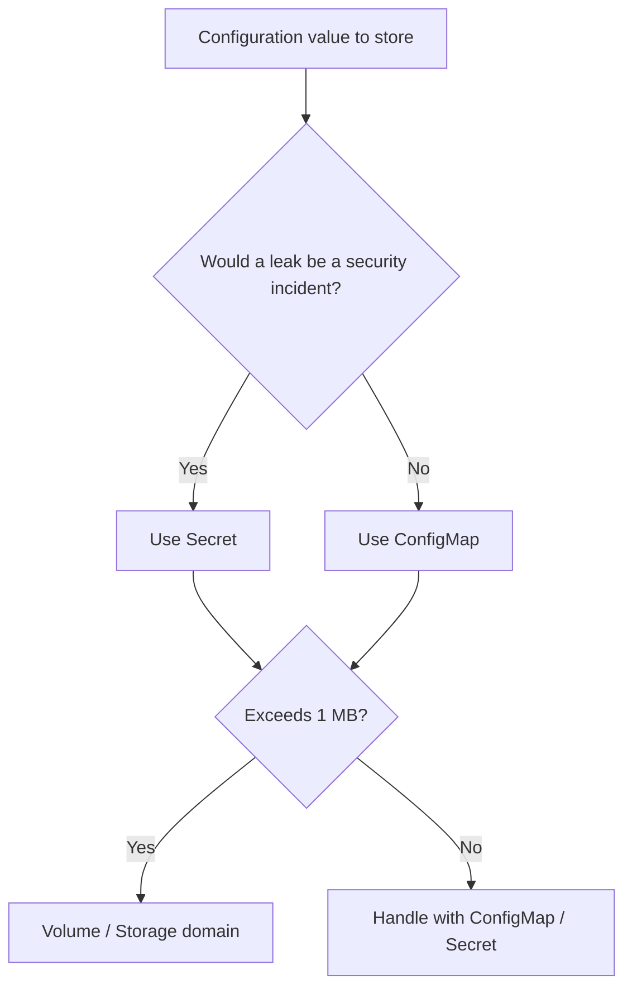
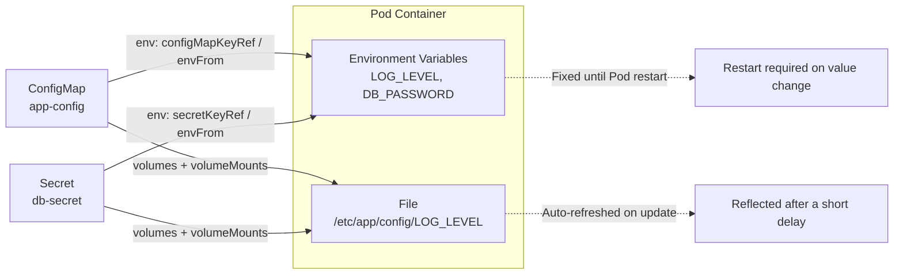

# Separating Configuration with ConfigMap and Secret - Decoupling Code from Config

## Learning Objectives
- Understand why environment variables and configuration files must be separated from the container image (12-factor app)
- Distinguish the difference between ConfigMap and Secret and know when to use each
- Inject ConfigMap and Secret into Pods via environment variables and volume mounts

## Content

### Why Configuration Must Be Separated from the Image

In the introductory course, we learned how to build container images and deploy them with Deployments. Moving into real-world operations, however, you quickly run into a fundamental question: **database addresses and API keys differ across development, staging, and production environments — do you have to rebuild the image every single time?**

The answer is no. The same image should be able to run in every environment, with only the configuration changing. This principle is captured in the **12-factor app** methodology's third factor: "store config in the environment." The 12-factor app is a set of twelve design guidelines for building software that runs well in cloud environments.

Let's examine what goes wrong when configuration is baked into the image.

- **The image diverges per environment.** You end up with images like `myapp:1.0-dev` and `myapp:1.0-prod` — effectively different artifacts even though the application code is identical. You can no longer guarantee that "the image running in production is exactly what was tested."
- **Secrets leak into the image.** Image layers can be unpacked by anyone. Putting a database password in a `Dockerfile` or in source code exposes it directly.
- **Rebuilding and redeploying just to change a config value.** Running the entire build pipeline to flip a single log level is wasteful.

Kubernetes provides two objects to enable this separation. **Non-sensitive general configuration** goes into a `ConfigMap`; **sensitive secrets** go into a `Secret`. Both are fundamentally **collections of key-value pairs**. The difference lies in their intended use and how they are handled.

### ConfigMap vs Secret — What to Use and When

| | ConfigMap | Secret |
|---|---|---|
| Stores | Non-sensitive general configuration | Sensitive secret values |
| Examples | Log level, feature flags, server addresses, config files | DB passwords, API tokens, TLS certificates |
| Storage format | Plain text | Stored **base64-encoded** |
| Size limit | ~1 MB | ~1 MB |

One point that is frequently misunderstood deserves special emphasis.

> The base64 encoding in a Secret is **encoding, not encryption**. Anyone can decode base64 in under a second. The reason Secrets are genuinely more secure than ConfigMaps is not base64 — it is the separate protective mechanisms applied to Secrets: encryption at rest in etcd, RBAC access controls, and log masking.

The decision rule is simple: **"Would this value leaking cause a security incident?"** If yes, use a Secret; otherwise, use a ConfigMap. Also keep in mind that neither object can hold large data exceeding 1 MB — that belongs in the volumes and storage domain covered in the next lecture. The decision flowchart below shows that a single question is all it takes to choose between the two.



### Creating a ConfigMap — Three Methods

There are three ways to create a ConfigMap. The examples below assume a local cluster (e.g., minikube) is running.

**1) Specify values directly on the command line (`--from-literal`)**

```bash
kubectl create configmap app-config \
  --from-literal=LOG_LEVEL=info \
  --from-literal=APP_REGION=ap-northeast-2
```

**2) Create from a file (`--from-file`)**

```bash
# Load the entire contents of app.properties as a single entry
kubectl create configmap app-config-file --from-file=app.properties

# --from-env-file splits each line in the file into individual key-value pairs
kubectl create configmap app-config-env --from-env-file=app.properties
```

With `--from-file=app.properties`, the **filename becomes the key** and the **entire file content becomes the value** — there is exactly one key (`app.properties`) whose value is the whole file. This is useful when you want to mount the file as a single unit. To specify a custom key name, use the `key=path` form: `--from-file=myconfig=app.properties`.

With `--from-env-file=app.properties`, each `KEY=VALUE` line in the file is parsed into a **separate key-value pair**. If the file contains `LOG_LEVEL=info` and `APP_REGION=ap-northeast-2` on two lines, the resulting ConfigMap will have two distinct keys: `LOG_LEVEL` and `APP_REGION`. The core distinction is "load the whole file as one blob (`--from-file`)" versus "split the file into individual entries (`--from-env-file`)." This is a common source of confusion, so keep it in mind.

**3) Declare via a YAML manifest (recommended for production)**

In production, it is best practice to manage manifests declaratively in version control (Git) rather than using imperative commands.

```yaml
# app-config.yaml
apiVersion: v1
kind: ConfigMap
metadata:
  name: app-config
data:
  LOG_LEVEL: "info"
  APP_REGION: "ap-northeast-2"
```

```bash
kubectl apply -f app-config.yaml
kubectl describe configmap app-config   # verify the stored values
```

### Creating a Secret

Secrets follow the same pattern, but creating them imperatively (without a file) is often the safer choice to avoid committing plaintext secret files to source control.

```bash
kubectl create secret generic db-secret \
  --from-literal=DB_USER=admin \
  --from-literal=DB_PASSWORD='s3cr3t!'
```

`generic` creates the most common `Opaque` type (arbitrary user-defined data). There are also specialized types for specific use cases: `docker-registry` for container registry credentials and `tls` for TLS certificates, each with built-in validation.

If you prefer writing a YAML manifest directly, values must be base64-encoded and placed under the `data` field.

```bash
# The -n flag removes the trailing newline — omitting it is a common cause of authentication failures
echo -n 's3cr3t!' | base64
# czNjcjN0IQ==
```

```yaml
apiVersion: v1
kind: Secret
metadata:
  name: db-secret
type: Opaque
data:
  DB_PASSWORD: czNjcjN0IQ==   # base64-encoded value
```

> If encoding is inconvenient, use `stringData` instead of `data` — you can write the plain-text value directly and Kubernetes will encode it automatically. However, the manifest file itself then contains a plaintext secret, so it must never be committed to Git.

### Injecting into a Pod — Environment Variable Method

There are two main ways to deliver ConfigMap and Secret values into a container: **environment variables** and **volume mounts**. Let's start with environment variables.

**Inject individual keys (`valueFrom`)** — you can choose a separate environment variable name inside the container for each key.

```yaml
spec:
  containers:
    - name: app
      image: busybox
      command: ["sh", "-c", "echo LEVEL=$LOG_LEVEL PW=$DB_PASSWORD; sleep 3600"]
      env:
        - name: LOG_LEVEL                 # variable name inside the container
          valueFrom:
            configMapKeyRef:
              name: app-config            # which ConfigMap to read from
              key: LOG_LEVEL              # which key to pull
        - name: DB_PASSWORD
          valueFrom:
            secretKeyRef:                 # use secretKeyRef for Secrets
              name: db-secret
              key: DB_PASSWORD
```

**Inject all keys at once (`envFrom`)** — dumps every key from the ConfigMap or Secret directly as environment variables; the key name becomes the variable name.

```yaml
      envFrom:
        - configMapRef:
            name: app-config
        - secretRef:
            name: db-secret
```

Application code accesses these values just like any other environment variable. In Python: `os.environ.get("DB_PASSWORD")`; in Node.js: `process.env.DB_PASSWORD`.

### Injecting into a Pod — Volume Mount Method

When an application is designed to read **files** rather than environment variables — such as nginx configuration files or TLS certificates — the ConfigMap or Secret should be mounted as a volume. In this case, **each key becomes a file, and its value becomes the file's contents**.

The configuration is split into two parts: (1) declare a volume at the Pod level under `volumes`, referencing the ConfigMap or Secret; and (2) attach that volume to a specific path inside the container using `volumeMounts`. The `name` field in both sections must match exactly for the binding to work.

```yaml
spec:
  containers:
    - name: app
      image: nginx
      volumeMounts:
        - name: config-volume          # must match the name in volumes below
          mountPath: /etc/app/config   # files will appear at this path
          readOnly: true
  volumes:
    - name: config-volume
      configMap:
        name: app-config               # for a Secret: secret: { secretName: db-secret }
```

In the example above, if `app-config` has keys `LOG_LEVEL` and `APP_REGION`, two files will appear inside the container — `/etc/app/config/LOG_LEVEL` and `/etc/app/config/APP_REGION` — each containing the corresponding value.

There is one hidden advantage to volume mounts: **when a ConfigMap is updated, the mounted files are automatically refreshed (after a short delay).** In contrast, values injected via environment variables are fixed at Pod creation time — updating the ConfigMap does not take effect until the Pod is restarted. If your application needs dynamic reloading, the volume mount approach is the better choice.

The diagram below summarizes both injection paths at a glance, showing how the same ConfigMap and Secret reach the container through two separate channels.



### Verifying Behavior

```bash
kubectl apply -f pod.yaml
kubectl get pods
kubectl exec -it <pod-name> -- printenv | grep LOG_LEVEL      # verify environment variable
kubectl exec -it <pod-name> -- cat /etc/app/config/LOG_LEVEL  # verify volume file
```

### Production Gotchas

- **base64 is not security.** As emphasized earlier, the base64 encoding in a Secret is just encoding. Real protection comes from encryption at rest in etcd and RBAC. If you manage your own cluster, these must be configured.
- **Never commit Secret manifests to Git.** Whether the values are plaintext or base64-encoded, files containing secrets must be excluded from version control. Use tools like Sealed Secrets, External Secrets, or HashiCorp Vault to manage them safely.
- **Protect secrets within the application too.** Do not log Secret values or transmit them to untrusted external systems.
- **ConfigMaps and Secrets are namespace-scoped.** A Pod can only reference objects in the same namespace. Make sure your ConfigMap or Secret lives in the same namespace as the Pod that uses it.

## Key Takeaways
- Separating configuration and secrets from the image allows the same image to be reused across all environments (12-factor). This prevents image divergence, secret leakage, and unnecessary rebuilds.
- **ConfigMap = non-sensitive configuration**, **Secret = sensitive secrets**. Both are key-value collections with a 1 MB size limit. The base64 in a Secret is encoding, not encryption.
- Creation options: `--from-literal`, `--from-file` (filename as key, entire file content as value), `--from-env-file` (each line as a separate key-value pair), or a YAML manifest (recommended).
- Injection methods: environment variables (`valueFrom` with `configMapKeyRef`/`secretKeyRef`, or `envFrom`) and volume mounts. Volume mounts create one file per key and update automatically when the ConfigMap changes.
- Security is enforced through etcd encryption, RBAC, Git exclusion, and in-app protection — not base64.

## Sources
- DevOps Directive, "Kubernetes Secrets in 5 Minutes!" — https://www.youtube.com/watch?v=cQAEK9PBY8U
- Thetips4you, "Kubernetes Tutorial For Beginners | Kubernetes ConfigMap" — https://www.youtube.com/watch?v=3RvudbKR1gc
- Civo, "How to Create ConfigMaps in Kubernetes - Civo Academy" — https://www.youtube.com/watch?v=6kBNZ9c88FY
