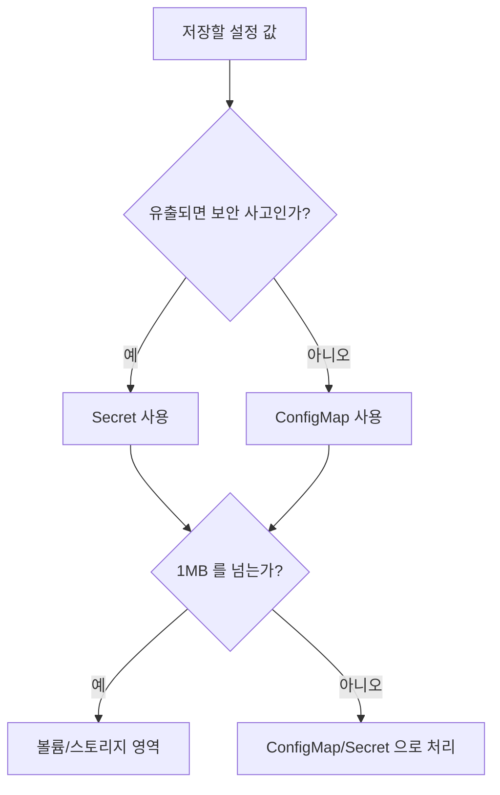
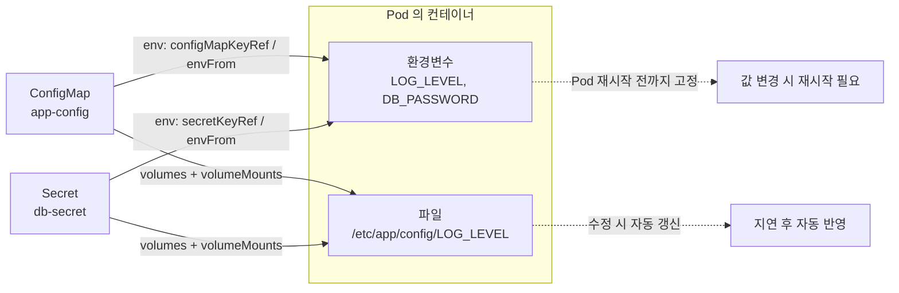

# ConfigMap과 Secret으로 설정 분리하기 - 코드와 구성의 분리

## 학습 목표
- 환경 변수·설정 파일을 이미지에서 분리해야 하는 이유(12-factor)를 이해한다
- ConfigMap과 Secret의 차이와 각각의 사용 시점을 구분한다
- ConfigMap/Secret을 환경변수·볼륨 마운트로 Pod에 주입해본다

## 본문

### 왜 설정을 코드(이미지)에서 분리해야 하나

기초 과정에서 우리는 컨테이너 이미지를 빌드하고 Deployment로 배포하는 법을 배웠다. 그런데 실무로 넘어오면 곧장 마주치는 질문이 있다. **개발·스테이징·운영 환경마다 데이터베이스 주소나 API 키가 다른데, 그때마다 이미지를 새로 빌드해야 할까?**

정답은 "아니오"다. 같은 이미지를 환경만 바꿔 그대로 돌릴 수 있어야 한다. 이 원칙을 정리한 것이 **12-factor app**의 세 번째 원칙인 "설정(config)을 환경에 저장하라"이다. 12-factor란 클라우드 환경에서 잘 동작하는 애플리케이션이 지켜야 할 12가지 설계 지침을 모은 방법론이다.

설정을 이미지 안에 박아 넣으면 어떤 문제가 생기는지 짚어보자.

- **환경마다 이미지가 갈라진다.** `myapp:1.0-dev`, `myapp:1.0-prod` 처럼 사실상 같은데 다른 이미지가 늘어난다. "운영에서 테스트한 것과 똑같은 이미지가 도는가?"를 보장할 수 없게 된다.
- **비밀값이 이미지에 새어 들어간다.** 이미지 레이어는 누구나 풀어볼 수 있다. DB 비밀번호를 `Dockerfile`이나 코드에 적으면 그대로 노출된다.
- **설정 하나 바꾸려고 재빌드·재배포한다.** 로그 레벨 한 줄 바꾸는 데 빌드 파이프라인 전체를 돌리는 건 비효율적이다.

쿠버네티스는 이 분리를 위해 두 가지 오브젝트를 제공한다. **비밀이 아닌 일반 설정**은 `ConfigMap`, **민감한 비밀값**은 `Secret`이다. 둘 다 핵심 형태는 **key-value 쌍의 모음**으로 같다. 차이는 "용도와 취급 방식"에 있다.

### ConfigMap vs Secret — 무엇을 언제 쓰나

| 구분 | ConfigMap | Secret |
|------|-----------|--------|
| 저장 대상 | 비밀이 아닌 일반 설정 | 민감한 비밀값 |
| 예시 | 로그 레벨, 기능 플래그, 서버 주소, 설정 파일 | DB 비밀번호, API 토큰, TLS 인증서 |
| 저장 형태 | 평문(plain text) | base64로 **인코딩**되어 저장 |
| 크기 제한 | 약 1MB | 약 1MB |

여기서 가장 자주 오해하는 지점을 명확히 하자.

> Secret의 base64는 **암호화가 아니라 인코딩**이다. base64는 누구나 1초 만에 디코딩할 수 있다. Secret이 ConfigMap보다 안전한 본질적 이유는 base64가 아니라, etcd 저장 시 암호화·RBAC 접근 제어·로깅 마스킹 같은 별도 보호 장치가 Secret에 적용되기 때문이다.

판단 기준은 단순하다. **"이 값이 유출되면 보안 사고인가?"** 그렇다면 Secret, 아니면 ConfigMap이다. 둘 다 1MB를 넘는 큰 데이터(대용량 파일 등)는 담을 수 없다는 점도 기억하자. 그런 데이터는 다음 강의에서 배울 볼륨/스토리지의 영역이다. 아래 판단 흐름도처럼 한 가지 질문으로 둘 중 무엇을 쓸지 가른다.



### ConfigMap 만들기 — 세 가지 방법

ConfigMap을 만드는 방법은 세 가지다. 실습 클러스터(minikube 등)가 떠 있다고 가정한다.

**1) 명령줄에서 직접 값 지정 (`--from-literal`)**

```bash
kubectl create configmap app-config \
  --from-literal=LOG_LEVEL=info \
  --from-literal=APP_REGION=ap-northeast-2
```

**2) 파일로부터 생성 (`--from-file`)**

```bash
# app.properties 파일 하나를 통째로 담는다
kubectl create configmap app-config-file --from-file=app.properties

# --from-env-file 을 쓰면 파일의 각 줄을 개별 key-value 로 분리해 담는다
kubectl create configmap app-config-env --from-env-file=app.properties
```

`--from-file=app.properties`를 쓰면 **`app.properties`(파일 이름)가 key가 되고, 그 파일의 전체 내용이 value**가 된다. 즉 key는 딱 하나(`app.properties`)이고, 값이 파일 본문 전체인 셈이다. 파일을 통째로 하나의 설정 파일로 마운트하고 싶을 때 쓴다. key 이름을 직접 지정하고 싶다면 `--from-file=설정파일=app.properties`처럼 `key=경로` 형식으로 줄 수도 있다.

반면 `--from-env-file=app.properties`는 파일 안의 `KEY=VALUE` 줄들을 한 줄씩 읽어 **각 줄을 별도의 key-value로** 풀어 넣는다. 예를 들어 파일에 `LOG_LEVEL=info`, `APP_REGION=ap-northeast-2` 두 줄이 있으면 ConfigMap에는 `LOG_LEVEL`, `APP_REGION` 두 개의 key가 생긴다. "파일 하나를 한 덩어리로 담을지(`--from-file`)" vs "파일 안의 항목을 낱개로 풀어 담을지(`--from-env-file`)"가 핵심 차이이니 혼동하지 않도록 주의한다.

**3) YAML 매니페스트로 선언 (실무 권장)**

운영에서는 명령형(imperative) 명령보다 매니페스트를 Git으로 버전 관리하는 선언형(declarative) 방식을 권장한다.

```yaml
# app-config.yaml
apiVersion: v1
kind: ConfigMap
metadata:
  name: app-config
data:
  LOG_LEVEL: "info"
  APP_REGION: "ap-northeast-2"
```

```bash
kubectl apply -f app-config.yaml
kubectl describe configmap app-config   # 들어간 값 확인
```

### Secret 만들기

Secret도 동일한 패턴이지만, 비밀값을 평문 파일로 저장소에 올리지 않도록 명령형(imperative) 생성이 더 안전한 선택이 되기도 한다.

```bash
kubectl create secret generic db-secret \
  --from-literal=DB_USER=admin \
  --from-literal=DB_PASSWORD='s3cr3t!'
```

`generic`은 가장 일반적인 `Opaque` 타입(임의의 사용자 정의 데이터)을 만든다. 이 밖에 도커 레지스트리 자격증명용 `docker-registry`, TLS 인증서용 `tls` 같은 특수 타입도 있어 용도에 맞는 검증이 적용된다.

YAML로 직접 작성한다면 값을 base64로 인코딩해 `data`에 넣어야 한다.

```bash
# -n 플래그로 끝의 개행을 제거하는 것이 중요하다 (개행이 섞이면 인증 실패의 원인이 된다)
echo -n 's3cr3t!' | base64
# czNjcjN0IQ==
```

```yaml
apiVersion: v1
kind: Secret
metadata:
  name: db-secret
type: Opaque
data:
  DB_PASSWORD: czNjcjN0IQ==   # base64 인코딩된 값
```

> 인코딩이 귀찮다면 `data` 대신 `stringData` 필드를 쓰면 평문을 그대로 적을 수 있고 쿠버네티스가 알아서 인코딩해 준다. 다만 그 매니페스트 파일 자체는 평문 비밀을 담게 되므로 Git에 올리면 안 된다.

### Pod에 주입하기 — 환경변수 방식

만든 ConfigMap/Secret을 Pod 안 컨테이너로 전달하는 방법은 크게 **환경변수**와 **볼륨 마운트** 두 가지다. 먼저 환경변수 방식이다.

**특정 key 하나씩 주입 (`valueFrom`)** — key마다 컨테이너 안에서 쓸 환경변수 이름을 따로 정할 수 있다.

```yaml
spec:
  containers:
    - name: app
      image: busybox
      command: ["sh", "-c", "echo LEVEL=$LOG_LEVEL PW=$DB_PASSWORD; sleep 3600"]
      env:
        - name: LOG_LEVEL                 # 컨테이너 안에서 쓸 변수명
          valueFrom:
            configMapKeyRef:
              name: app-config            # 어떤 ConfigMap에서
              key: LOG_LEVEL              # 어떤 key를 꺼낼지
        - name: DB_PASSWORD
          valueFrom:
            secretKeyRef:                 # Secret은 secretKeyRef
              name: db-secret
              key: DB_PASSWORD
```

**전체를 한꺼번에 주입 (`envFrom`)** — ConfigMap/Secret의 모든 key를 그대로 환경변수로 쏟아붓는다. key 이름이 곧 변수명이 된다.

```yaml
      envFrom:
        - configMapRef:
            name: app-config
        - secretRef:
            name: db-secret
```

애플리케이션 코드에서는 평소 환경변수를 읽듯 접근하면 된다. 파이썬이면 `os.environ.get("DB_PASSWORD")`, Node.js면 `process.env.DB_PASSWORD` 식이다.

### Pod에 주입하기 — 볼륨 마운트 방식

nginx의 설정 파일이나 TLS 인증서처럼 **애플리케이션이 환경변수가 아니라 파일을 읽도록 설계된 경우**에는 볼륨으로 마운트한다. 이때 **각 key는 하나의 파일이 되고, value는 그 파일의 내용**이 된다.

설정은 두 부분으로 나뉜다. (1) Pod 레벨에서 `volumes`로 ConfigMap/Secret을 참조하는 볼륨을 선언하고, (2) 컨테이너 안에서 `volumeMounts`로 그 볼륨을 특정 경로에 붙인다. 두 곳의 `name`이 정확히 일치해야 연결된다.

```yaml
spec:
  containers:
    - name: app
      image: nginx
      volumeMounts:
        - name: config-volume          # 아래 volumes의 name과 일치해야 함
          mountPath: /etc/app/config   # 이 경로에 파일들이 생긴다
          readOnly: true
  volumes:
    - name: config-volume
      configMap:
        name: app-config               # Secret이면 secret: { secretName: db-secret }
```

위 예시에서 `app-config`의 key가 `LOG_LEVEL`, `APP_REGION`이라면, 컨테이너 안에는 `/etc/app/config/LOG_LEVEL`, `/etc/app/config/APP_REGION` 두 파일이 생기고 각 파일에 해당 value가 담긴다.

볼륨 마운트의 숨은 장점이 하나 있다. **ConfigMap을 수정하면 마운트된 파일은 (다소 지연 후) 자동으로 갱신된다.** 반면 환경변수로 주입한 값은 Pod 생성 시점에 고정되어, ConfigMap을 바꿔도 Pod를 재시작하기 전까지 반영되지 않는다. 동적 reload가 필요하면 볼륨 방식이 유리하다.

지금까지 살펴본 두 주입 경로를 아래 구성도로 한눈에 정리하면, 같은 ConfigMap/Secret이 환경변수와 볼륨 두 갈래로 컨테이너에 닿는 모습을 볼 수 있다.



### 동작 확인

```bash
kubectl apply -f pod.yaml
kubectl get pods
kubectl exec -it <pod-name> -- printenv | grep LOG_LEVEL   # 환경변수 확인
kubectl exec -it <pod-name> -- cat /etc/app/config/LOG_LEVEL  # 볼륨 파일 확인
```

### 실무 주의사항 (gotchas)

- **base64는 보안이 아니다.** 앞서 강조했듯 Secret의 base64는 인코딩일 뿐이다. 진짜 보호는 etcd 저장 암호화(encryption at rest)와 RBAC로 한다. 직접 클러스터를 운영한다면 반드시 설정하자.
- **Secret 매니페스트를 Git에 올리지 말라.** 평문이든 base64든 비밀값이 담긴 파일은 버전 관리에서 제외하고, Sealed Secrets·External Secrets·Vault 같은 도구로 안전하게 다룬다.
- **앱 안에서도 비밀을 보호하라.** Secret을 로그로 찍거나 신뢰할 수 없는 외부로 보내지 않는다.
- **ConfigMap/Secret은 같은 네임스페이스 안에서만 참조된다.** Pod와 다른 네임스페이스에 있는 ConfigMap은 가져다 쓸 수 없으니 같은 네임스페이스에 두어야 한다.

## 핵심 요약
- 설정과 비밀을 이미지에서 분리하면 같은 이미지를 모든 환경에서 재사용할 수 있다(12-factor). 이미지 갈라짐·비밀 유출·불필요한 재빌드를 막는다.
- **ConfigMap = 비밀 아닌 설정**, **Secret = 민감한 비밀값**. 둘 다 key-value 모음이며 1MB 제한이 있다. Secret의 base64는 암호화가 아닌 인코딩이다.
- 생성은 `--from-literal`/`--from-file`(파일명이 key, 내용이 value)/`--from-env-file`(줄마다 개별 key-value) 또는 YAML 매니페스트(권장)로 한다.
- 주입은 환경변수(`valueFrom`의 `configMapKeyRef`/`secretKeyRef`, 또는 `envFrom`)와 볼륨 마운트 두 방식. 볼륨은 key당 파일 하나로 마운트되고 변경이 자동 반영된다.
- 보안은 base64가 아니라 etcd 암호화·RBAC·Git 제외·앱 내 보호로 지킨다.

## 출처
- DevOps Directive, "Kubernetes Secrets in 5 Minutes!" — https://www.youtube.com/watch?v=cQAEK9PBY8U
- Thetips4you, "Kubernetes Tutorial For Beginners | Kubernetes ConfigMap" — https://www.youtube.com/watch?v=3RvudbKR1gc
- Civo, "How to Create ConfigMaps in Kubernetes - Civo Academy" — https://www.youtube.com/watch?v=6kBNZ9c88FY
