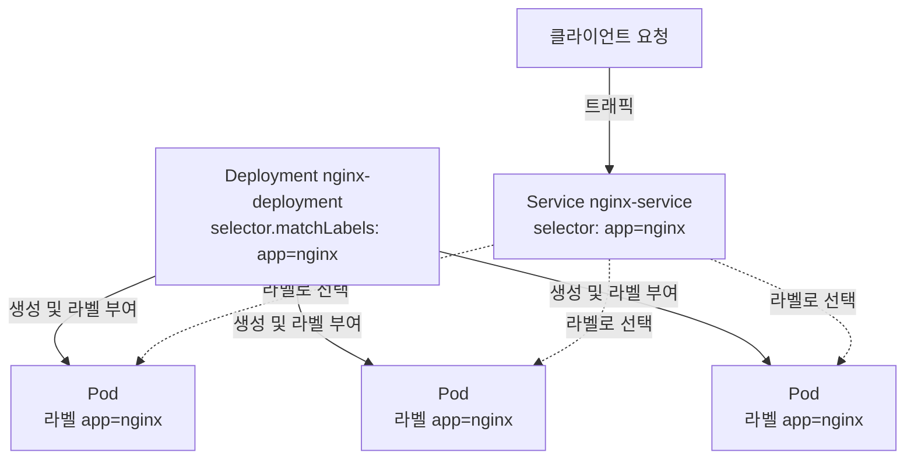

# Kubernetes 라벨과 셀렉터: 클러스터 리소스 조직화

## 학습 목표
- 라벨(key/value 쌍)로 Kubernetes 리소스를 조직화하고, equality-based 셀렉터와 set-based 셀렉터로 리소스를 필터링하는 방법을 익힌다.
- Deployment의 `selector.matchLabels`와 Service의 `selector`가 Pod 템플릿 라벨과 어떻게 매칭되어 실제로 Pod를 선택하는지 원리를 이해한다.
- 라벨 설계 모범 사례(권장 라벨인 `app`/`version`/`tier` 등)를 적용하고, 라벨과 어노테이션(annotation)의 용도 차이를 구분한다.

## 본문

### 라벨이 필요한 이유

실제 Kubernetes 클러스터는 금방 수백 개의 Pod, 수십 개의 Deployment, Service, ConfigMap 등으로 채워진다. 이 오브젝트들을 묶고 찾을 방법이 없다면 클러스터 운영은 감(感)에 의존하게 된다. Kubernetes는 이 문제를 **라벨**로 해결한다. 라벨은 오브젝트에 붙이는 단순한 key/value 쌍으로, 해당 오브젝트가 무엇인지 설명하는 역할을 한다.

핵심은 라벨이 단순한 설명 문서가 아니라는 점이다. 라벨은 Kubernetes 자체가 읽어 시스템을 연결하는 **기능적 메타데이터**다. Service가 특정 Pod 집합으로 트래픽을 보내거나, Deployment가 자신이 소유한 Pod를 판별할 때 모두 라벨 매칭으로 동작한다. 라벨을 올바르게 설계하면 클러스터가 스스로 정돈되고, 잘못 설계하면 트래픽이 조용히 어디에도 도달하지 못한다.

라벨의 형식은 다음과 같다.

```yaml
metadata:
  labels:
    app: nginx
    tier: frontend
    version: "1.21"
```

라벨은 모든 오브젝트의 `metadata` 섹션에 위치한다. 키에는 선택적으로 접두사를 붙일 수 있고(예: `app.kubernetes.io/name`), 값은 짧은 문자열이다. YAML 매니페스트에서 오브젝트를 생성할 때 지정하거나, 이미 실행 중인 오브젝트에 나중에 추가할 수도 있다.

### kubectl로 라벨 다루기

파일을 편집하지 않고도 라벨을 조회·추가·변경할 수 있다. 일상적으로 자주 쓰는 명령어들이다.

```bash
# 모든 Pod와 라벨을 함께 출력
kubectl get pods --show-labels

# 실행 중인 Pod에 라벨 추가(또는 덮어쓰기)
kubectl label pod nginx demo=true

# 기존 라벨 값 덮어쓰기(--overwrite 플래그 필수)
kubectl label pod nginx tier=backend --overwrite

# 키 뒤에 마이너스 부호를 붙여 라벨 삭제
kubectl label pod nginx demo-
```

> 영구적으로 반영해야 할 내용은 매니페스트를 수정하고 apply하는 방식이 맞다. `kubectl label`은 트러블슈팅 중 빠르게 임시 변경할 때 쓴다 — YAML에서 재배포하면 이 변경은 사라진다.

### 리소스 선택: equality-based vs set-based

라벨 자체만으로는 정적인 태그에 불과하다. 라벨의 힘은 **셀렉터**에서 나온다 — 셀렉터는 라벨을 기준으로 오브젝트를 찾는 쿼리다. Kubernetes는 두 가지 셀렉터 문법을 지원한다.

**Equality-based 셀렉터**는 정확한 값 하나와 매칭한다. `=`, `==`, `!=`를 사용한다.

```bash
# app이 nginx인 Pod
kubectl get pods -l app=nginx

# tier가 frontend가 아닌 Pod
kubectl get pods -l 'tier!=frontend'

# 여러 조건은 AND로 결합된다
kubectl get pods -l 'app=nginx,tier=frontend'
```

**Set-based 셀렉터**는 `in`, `notin`, `exists`를 사용해 더 복잡한 조건을 표현한다.

```bash
# version이 지정된 값 중 하나인 Pod
kubectl get pods -l 'version in (1.20, 1.21)'

# tier가 cache도 backend도 아닌 Pod
kubectl get pods -l 'tier notin (cache, backend)'

# "release" 라벨이 어떤 값이든 존재하는 Pod
kubectl get pods -l 'release'
```

Set-based 셀렉터는 "이 값들 중 하나"(`in`), "이 값들 모두 아님"(`notin`), "값에 관계없이 이 키가 존재함"(`exists`)을 표현할 수 있다. Equality-based 셀렉터가 더 단순하고 대부분의 일상적인 용도에 충분하다. OR 조건 매칭이나 키 존재 여부 확인이 필요할 때 set-based를 쓰면 된다.

### Deployment와 Service가 Pod를 선택하는 방식

라벨이 단순한 장식을 벗어나 애플리케이션을 실제로 구동하는 지점이 바로 여기다. Kubernetes에서 가장 중요한 두 오브젝트인 Deployment와 Service는 오로지 라벨 매칭으로 자신의 Pod를 찾는다.

**Deployment**는 `spec.selector.matchLabels`로 자신이 관리할 Pod를 선언하고, `spec.template.metadata.labels`를 통해 생성하는 모든 Pod에 동일한 라벨을 찍는다. 이 두 값이 일치하지 않으면 Kubernetes는 Deployment를 거부한다.

```yaml
apiVersion: apps/v1
kind: Deployment
metadata:
  name: nginx-deployment
spec:
  replicas: 3
  selector:
    matchLabels:
      app: nginx          # 이 라벨을 가진 Pod를 Deployment가 소유
  template:
    metadata:
      labels:
        app: nginx        # 생성되는 각 Pod에 동일한 라벨을 찍음
    spec:
      containers:
        - name: nginx
          image: nginx:1.21
```

**Service**도 같은 방식으로 트래픽을 보낼 대상을 결정한다. `spec.selector`에 지정된 라벨을 모두 가진 Pod가 Service의 엔드포인트(endpoint)가 되어 로드밸런싱 대상이 된다.

```yaml
apiVersion: v1
kind: Service
metadata:
  name: nginx-service
spec:
  selector:
    app: nginx            # app=nginx 라벨을 가진 모든 Pod로 트래픽 전달
  ports:
    - port: 80
      targetPort: 80
```

클라이언트 요청이 컨테이너에 도달하는 흐름은 이렇다. 트래픽이 Service에 닿으면, Service는 `selector`로 `app: nginx` 라벨을 가진 Pod를 모두 찾고, 그 Pod들이 바로 Deployment가 생성해 라벨을 찍어둔 것들이다. `app: nginx`라는 라벨 하나가 Deployment, Pod, Service를 하나로 묶는 실이 된다. 아래 다이어그램이 이 관계를 보여준다.



> Service가 엔드포인트를 반환하지 않으면, 가장 먼저 확인할 것은 Service의 `selector`가 실제 Pod 라벨과 일치하는지 여부다. 철자 하나 차이(`app: nginx` vs `app: ngnix`)만으로도 아무런 오류 메시지 없이 라우팅이 끊긴다.

Deployment의 셀렉터는 `matchExpressions`를 통해 set-based 조건도 지원하며, `matchLabels`와 조합할 수 있다.

```yaml
selector:
  matchLabels:
    app: nginx
  matchExpressions:
    - key: tier
      operator: In
      values: [frontend, web]
```

`matchLabels`와 `matchExpressions`가 함께 있으면 **모든 조건이 참이어야** 매칭된다 — AND로 결합되는 것이다. 동일한 매칭 메커니즘이 `nodeAffinity`와 `podAffinity` 같은 고급 스케줄링 기능에서도 쓰이며, `In`, `NotIn`, `Exists` 연산자로 Pod가 어느 노드에 배치될지 결정한다.

### 라벨 vs 어노테이션

Kubernetes에는 라벨과 비슷해 보이지만 정반대 목적을 가진 두 번째 메타데이터가 있다. 바로 **어노테이션(annotation)**이다. 둘 다 `metadata`의 key/value 쌍이지만 용도가 전혀 다르다.

- **라벨**은 **식별과 선택**에 쓴다. 짧고, 인덱싱되어 있으며, 쿼리할 수 있다. Service, Deployment, `kubectl -l`처럼 오브젝트 그룹을 *찾아야* 할 때 쓴다.
- **어노테이션**은 **비식별 정보를 첨부**하는 데 쓴다. 셀렉터로 선택할 수 없고, 빌드 ID, Git 커밋 SHA, 담당자 이메일, 도구 설정처럼 크거나 구조적인 값을 담을 수 있다. 셀렉터가 아닌 사람이나 도구가 읽을 목적으로 존재한다.

```yaml
metadata:
  labels:
    app: nginx            # 이 오브젝트를 SELECT할 때 사용
  annotations:
    kubernetes.io/change-cause: "rollout to v1.21"   # 정보성 기록, 선택에 사용 안 함
    team-contact: "platform@example.com"
```

간단한 기준을 하나 제시하자면, 셀렉터로 쓸 가능성이 있는 값은 라벨로, 그렇지 않으면 어노테이션으로 저장한다.

### 라벨 설계 모범 사례

Kubernetes 프로젝트는 다양한 도구가 애플리케이션을 일관된 방식으로 이해할 수 있도록 `app.kubernetes.io/` 접두사 아래 **권장 라벨** 세트를 제공한다.

```yaml
metadata:
  labels:
    app.kubernetes.io/name: nginx
    app.kubernetes.io/instance: nginx-prod
    app.kubernetes.io/version: "1.21"
    app.kubernetes.io/component: frontend
    app.kubernetes.io/part-of: storefront
    app.kubernetes.io/managed-by: helm
```

실무에서는 팀마다 `app`, `version`, `tier` 같은 소수의 일관된 라벨 어휘로 수렴하는 경향이 있다. 몇 가지 지침을 소개한다.

- **팀 전체에서 일관성을 유지한다.** 라벨 키는 한 번 정하면 모든 곳에 통일해서 쓴다. `tier`의 철자가 제각각이면 셀렉터가 동작하지 않는다.
- **셀렉터 라벨은 안정적으로 유지한다.** Deployment의 `selector`는 생성 후 변경할 수 없으므로, 식별용 라벨은 신중하게 선택한다. `version`처럼 자주 바뀌는 값은 셀렉터에 포함시키지 말고 별도의 추가 라벨로 관리한다.
- **하나의 라벨에 모든 것을 담지 않는다.** 거대한 복합 값 하나 대신 `app`, `tier`, `environment`처럼 용도가 분명한 여러 라벨을 사용해, 다양한 기준으로 리소스를 나눌 수 있게 한다.
- **쿼리하지 않을 상세 정보는 어노테이션에 넣는다.** 라벨 셋을 깔끔하고 의미 있게 유지하는 데 도움이 된다.

## 핵심 정리
- 라벨은 `metadata.labels`에 위치하는 기능적 key/value 메타데이터로, Kubernetes가 오브젝트를 그룹화·탐색·연결하는 데 사용한다.
- Equality-based 셀렉터(`=`, `!=`)는 정확한 값 하나와 매칭하고, set-based 셀렉터(`in`, `notin`, `exists`)는 OR 스타일 매칭과 키 존재 여부 확인을 지원하며, 여러 조건은 항상 AND로 결합된다.
- Deployment는 `selector.matchLabels`(Pod 템플릿과 동일해야 함)로 Pod를 소유하고, Service는 `spec.selector`로 트래픽 라우팅 대상 Pod를 결정한다 — 둘 다 순전히 Pod 라벨 매칭으로 동작한다.
- 선택(select)에 쓸 것은 **라벨**로, 선택에 쓰지 않을 비식별 정보는 **어노테이션**으로 관리한다.
- 권장 `app.kubernetes.io/` 라벨을 따르고, 셀렉터 라벨은 팀 전체에서 일관되고 안정적으로 유지한다.
