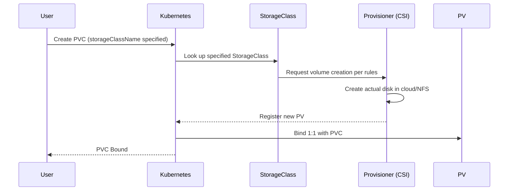
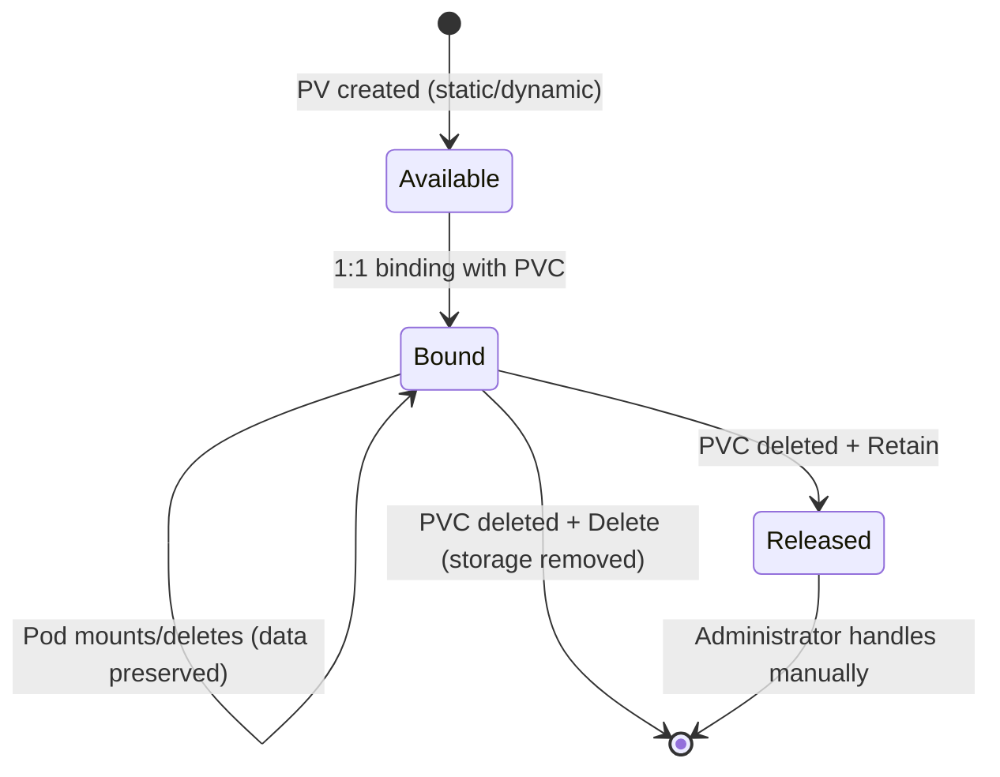

# Persistent Volumes (PV/PVC) and Storage - How to Keep Your Data Safe

## Learning Objectives
- Understand why data disappears when a Pod restarts, and why persistent storage is necessary
- Explain the relationship between PersistentVolume (PV), PersistentVolumeClaim (PVC), and StorageClass
- Create a PVC, mount it to a Pod, and verify that data survives after the Pod is deleted and recreated

## Content

### 1. Pods Are Ephemeral - And So Is Their Data

In Kubernetes, containers are fundamentally **ephemeral** resources. When a Pod dies, gets rescheduled to another node due to a node failure, or is simply redeployed with a new image version, the container's filesystem is reset to its initial state. Any database files, uploaded images, or logs stored inside are gone.

To prevent this, you need "storage that outlives the Pod." Kubernetes provides two broad categories of storage.

- **Ephemeral volumes (emptyDir, etc.)**: Created when the Pod starts and destroyed when the Pod is deleted. Used for sharing data between containers in the same Pod, or for caches and temporary workspaces. They offer no persistence.
- **Persistent volumes (PersistentVolume)**: Exist **independently** of the Pod's lifecycle. Data survives even if the Pod dies, and the volume follows the Pod when it is rescheduled to a different node. Workloads that must preserve data — such as databases — must use persistent volumes.

> Key takeaway: **emptyDir shares the Pod's fate; PersistentVolume survives it.** Anything you cannot afford to lose must live on a persistent volume.

Volumes are defined inside a Pod and mounted at a specific path (`mountPath`) inside a container. The same volume can be mounted at different paths in different containers, or omitted from some containers entirely.

### 2. Why PV and PVC Are Separate Roles

Can't you just attach storage directly to a Pod? The problem is **abstraction and replication**.

Consider scaling a Deployment to three replicas. Each Pod needs its own independent disk. But each disk is a unique physical entity (a specific cloud disk ID, for example). If you hard-code a disk directly in the Deployment template, every replica points to the same disk, causing conflicts. Worse, if the type of underlying storage ("Azure Disk? NFS? AWS EBS?") is embedded directly in the manifest, you have to edit it every time you move to a different cluster.

That is why Kubernetes splits storage into **two separate objects**.

- **PersistentVolume (PV)** — the "supply" side. A single slice of actual storage that exists in the cluster. It does not matter whether it comes from NFS, a cloud disk, a local hostPath, or a CSI driver. PVs are created by an administrator or by the cluster itself.
- **PersistentVolumeClaim (PVC)** — the "demand" side. An application declares, "I need 10 Gi of storage in ReadWriteOnce mode." It is not a physical disk — it is a *statement of need*.

A Pod never interacts with a PV directly; it **only references a PVC**. The Pod simply says "mount this PVC," with no knowledge of where the underlying storage lives or how it is configured. This separation means the same manifest works identically on a cloud cluster or on-premises — the PVC's request is satisfied by whatever PV that cluster can provide.

The full chain looks like this: **PV (actual storage) ← binding → PVC (request) ← reference → Pod (consumer).** The PV is a stable anchor; Pods come and go while storage remains intact. As shown in the diagram below, a Pod references only the PVC, the PVC is bound to a PV, and the PV is backed by real physical storage.

```mermaid Pod → PVC → PV → Physical Storage: Reference and Binding Relationship
flowchart LR
    Pod["Pod<br/>(Consumer)"] -->|reference| PVC["PVC<br/>(Request: 10Gi RWO)"]
    PVC <-->|"1:1 binding"| PV["PV<br/>(Supply: one slice)"]
    SC["StorageClass<br/>(Creation rules)"] -.->|dynamic provisioning| PV
    PV --> Disk["Physical Storage<br/>(Cloud disk / NFS / hostPath)"]
```

### 3. Binding - How a PVC Gets Matched to a PV

When you create a PVC, Kubernetes searches for a PV that meets the conditions and **binds them 1:1**. The matching criteria are:

1. **Capacity**: PVC requested size ≤ PV capacity (the PVC claims a slice of the PV)
2. **Access modes (accessModes)**: The PVC and PV must share a common access mode
3. **StorageClass**: Both must have the same `storageClassName`

Once bound, a PVC points exclusively to that PV and will not switch to another PV until the PVC is deleted. Likewise, a PV reserved by one PVC cannot be claimed by anyone else.

**Access modes** are a frequent source of confusion in practice, so let's be precise. They control "how many nodes can mount this volume simultaneously for writing."

- **ReadWriteOnce (RWO)**: The volume can be mounted read/write by a single *node* at a time. Multiple Pods can share the same PVC as long as they all run on the same node. Used when only one writer is allowed to prevent data corruption — typical for databases. Most block storage (cloud disks) falls into this category.
- **ReadWriteMany (RWX)**: Multiple nodes can read and write to the same volume simultaneously. Used when multiple replicas need to share the same files. Not all storage types support this — you need **NFS or a CSI driver that supports shared storage**.

> Caution: Block disks (EBS, GCE PD, etc.) typically do not support RWX. If you find that one Pod is stuck pending after you share a PVC among multiple Pods, the access mode almost certainly does not match the storage type.

### 4. StorageClass - Static vs. Dynamic Provisioning

There are two ways to create PVs.

**Static provisioning**: An administrator creates PVs **in advance**. For example, they provision an 80 Gi PV; when someone later requests a 10 Gi PVC, Kubernetes finds a matching existing PV and binds it. If no suitable PV exists, the PVC waits in `Pending` state. This gives full control over storage origins but requires manual preparation for every workload.

**Dynamic provisioning**: No PVs are created in advance. When you specify a **StorageClass** on a PVC, Kubernetes **automatically creates** a PV at the moment the PVC is submitted (according to the StorageClass rules) and binds them. This avoids pre-provisioning overhead, reduces cost by creating storage only when needed, and scales well in large cloud environments. The sequence of events for dynamic provisioning is shown below.



A **StorageClass** is an object that defines "how to create storage." Its key fields are:

- **provisioner**: Which storage system to use for volume creation. Examples: `pd.csi.storage.gke.io` (GCP), `ebs.csi.aws.com` (AWS), NFS provisioner. This plugin connects the cluster to a cloud storage backend.
- **parameters**: Fine-grained settings such as disk type. For example: SSD (high performance) vs. standard disk (low cost). Performance, durability, and cost are determined here.
- **reclaimPolicy**: What happens to the PV after the PVC is deleted (see Section 5).
- **volumeBindingMode**: When to perform binding. `Immediate` creates the PV as soon as the PVC is submitted; `WaitForFirstConsumer` defers PV creation until a **Pod using that PVC is scheduled**. The latter ensures the disk is created in the same availability zone as the Pod, preventing zone mismatch between disk and Pod.

> Practical tip: If a PVC is stuck in `Pending`, run `kubectl describe pvc` first. "waiting for first consumer" is normal — creating a Pod will trigger the binding. A StorageClass marked `(default)` is used automatically when you omit `storageClassName` from a PVC.

### 5. Reclaim Policy - What Happens to Data After a PVC Is Deleted?

This controls **the final stage of a volume's life**, not its runtime behavior. An important fact: **deleting a Pod has no effect on PV/PVC or data.** The volume is simply detached from the Pod. Data fate is decided when **a PVC is deleted**, at which point Kubernetes checks the PV's `reclaimPolicy`.

- **Retain**: Data is preserved. The PV transitions to `Released` state but the data is not deleted; an administrator must handle it manually. Use this for critical data — such as database files — that must never be deleted automatically.
- **Delete**: The PV and the underlying physical storage resource are deleted automatically. This is the common default for dynamically provisioned cloud volumes and is appropriate for temporary data.

(The legacy `Recycle` policy is no longer recommended.)

### 6. Hands-On - Creating a PVC and Verifying Data Persistence

Using a local cluster (minikube, kind, or any environment that supports hostPath), let's manually create a static PV and walk through the entire flow.

**(1) PV definition** `pv.yaml`:

```yaml
apiVersion: v1
kind: PersistentVolume
metadata:
  name: demo-pv
spec:
  capacity:
    storage: 1Gi
  accessModes:
    - ReadWriteOnce
  persistentVolumeReclaimPolicy: Retain
  storageClassName: manual          # PVC must match this class to bind
  hostPath:
    path: /mnt/data                 # actual path on the node (for learning purposes)
```

**(2) PVC definition** `pvc.yaml` — capacity, access mode, and StorageClass must match the PV above:

```yaml
apiVersion: v1
kind: PersistentVolumeClaim
metadata:
  name: demo-pvc
spec:
  accessModes:
    - ReadWriteOnce
  storageClassName: manual
  resources:
    requests:
      storage: 1Gi
```

**(3) A Pod that mounts the PVC** `pod.yaml` — the Pod references only the PVC name, not the PV directly:

```yaml
apiVersion: v1
kind: Pod
metadata:
  name: demo-pod
spec:
  containers:
    - name: app
      image: nginx
      volumeMounts:
        - name: data
          mountPath: /usr/share/nginx/html   # writes here go to the PV
  volumes:
    - name: data
      persistentVolumeClaim:
        claimName: demo-pvc
```

**(4) Apply and verify**:

```bash
kubectl apply -f pv.yaml -f pvc.yaml -f pod.yaml

kubectl get pv            # confirm demo-pv is Bound
kubectl get pvc           # confirm demo-pvc is Bound, VOLUME column shows demo-pv
```

**(5) Write data, delete the Pod, and confirm the data survives** — this is the central verification of this lecture:

```bash
# Write a file into the volume
kubectl exec demo-pod -- sh -c 'echo "persistence test" > /usr/share/nginx/html/test.txt'

# Delete the Pod (the container filesystem is gone)
kubectl delete pod demo-pod

# Recreate the Pod using the same PVC
kubectl apply -f pod.yaml

# Verify the file is still there
kubectl exec demo-pod -- cat /usr/share/nginx/html/test.txt
# => persistence test   (if this prints correctly, the test passes)
```

If the file is still there after the Pod is recreated, you have confirmed that data was stored in the PV via the PVC — not in the container filesystem.

**The dynamic provisioning version** is even simpler — no need to create a PV manually. On a cluster with a StorageClass (such as a cloud cluster), simply specify `storageClassName` on the PVC. A PV is automatically created and bound the moment the PVC is submitted (or when a Pod first uses it).

```yaml
apiVersion: v1
kind: PersistentVolumeClaim
metadata:
  name: dynamic-pvc
spec:
  accessModes:
    - ReadWriteOnce
  storageClassName: standard     # the cluster's default or named StorageClass
  resources:
    requests:
      storage: 5Gi
```

### 7. Volume Lifecycle Summary

The complete flow, step by step:

1. **Creation**: A PV is created statically (manually) or dynamically (automatically). It is in an available state, not yet attached to anything.
2. **Request and binding**: When a PVC is created, Kubernetes finds or creates a matching PV and binds them 1:1. From this point the PV is reserved.
3. **Use**: When a Pod references the PVC, the PV is mounted at the container path for reading and writing.
4. **Pod deletion**: Data remains intact; only the mount is detached. As long as the PVC exists, the next Pod can reuse the same storage.
5. **PVC deletion**: At this point `reclaimPolicy` determines whether data is preserved (Retain) or deleted (Delete).

The state diagram below shows the PV lifecycle from the available state through to the split outcome when a PVC is deleted.



## Key Takeaways
- Container filesystems are ephemeral. Data is lost on Pod restart, rescheduling, or redeployment — anything that must be preserved belongs on a persistent volume (emptyDir has no persistence).
- **PV is the actual storage (supply); PVC is the storage request (demand).** Pods never interact with PVs directly — they mount PVCs. This separation enables replication, portability, and abstraction.
- A PVC binds to a PV 1:1 only when **capacity, access mode, and StorageClass** all match. RWO is single-node; RWX is multi-node (requires shared storage).
- **StorageClass** defines the rules for dynamic provisioning (provisioner / parameters / reclaimPolicy / volumeBindingMode). Static provisioning requires pre-created PVs; dynamic provisioning lets PVCs trigger automatic PV creation.
- **reclaimPolicy** (Retain / Delete) determines data fate after a PVC is deleted. Deleting a Pod never causes data loss.
