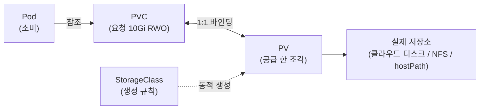
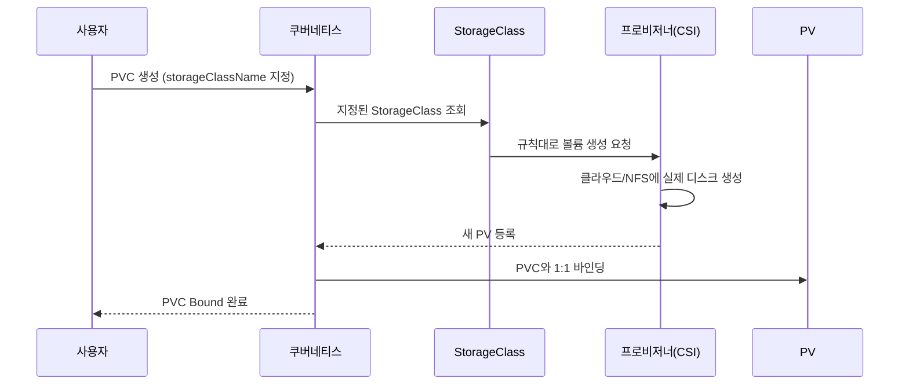
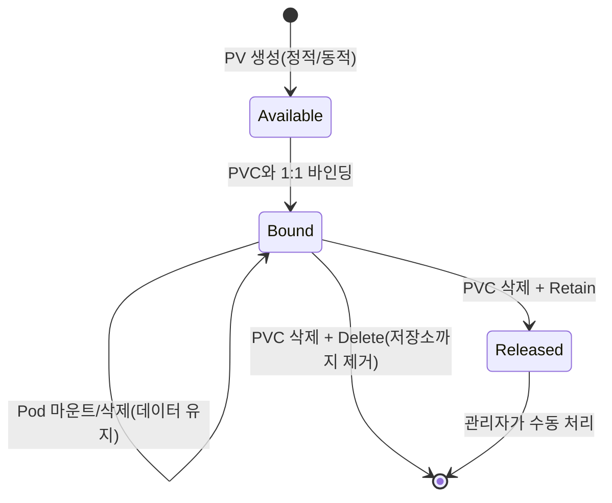

# 영구 볼륨(PV/PVC)과 스토리지 - 데이터를 잃지 않는 법

## 학습 목표
- Pod가 재시작되면 데이터가 사라지는 문제와 영구 스토리지의 필요성을 이해한다
- PersistentVolume(PV), PersistentVolumeClaim(PVC), StorageClass의 관계를 설명한다
- PVC를 생성해 Pod에 마운트하고, Pod를 지웠다 다시 띄워도 데이터가 남는지 확인한다

## 본문

### 1. Pod는 일회용이다 - 그래서 데이터가 증발한다

쿠버네티스에서 컨테이너는 본질적으로 **임시(ephemeral)** 자원이다. Pod가 죽거나, 노드 장애로 다른 노드로 옮겨가거나, 단순히 이미지 버전을 올려 재배포되면 컨테이너의 파일 시스템은 처음 상태로 초기화된다. 그 안에 쌓아둔 데이터베이스 파일, 업로드된 이미지, 로그는 전부 사라진다.

이걸 막으려면 "Pod보다 오래 사는 저장 공간"이 필요하다. 쿠버네티스가 제공하는 저장 수단은 크게 두 갈래다.

- **임시 볼륨(emptyDir 등)**: Pod가 시작될 때 만들어지고 Pod가 삭제되면 같이 사라진다. 같은 Pod 안 컨테이너끼리 데이터를 주고받거나, 캐시·임시 작업 공간으로 쓴다. 영속성과는 무관하다.
- **영구 볼륨(PersistentVolume)**: Pod의 생명주기와 **독립적으로** 존재한다. Pod가 죽어도 데이터는 그대로 남고, Pod가 다른 노드로 이동하면 볼륨도 따라 붙는다. 데이터베이스처럼 데이터를 지켜야 하는 워크로드는 반드시 이쪽을 써야 한다.

> 핵심 한 줄: **emptyDir은 Pod와 운명을 함께하고, PersistentVolume은 Pod와 무관하게 살아남는다.** 데이터를 잃으면 안 되는 모든 것은 영구 볼륨 위에 올린다.

볼륨은 Pod 안에 정의되어 컨테이너의 특정 경로(mountPath)에 마운트된다. 같은 볼륨을 다른 컨테이너에 다른 경로로 붙일 수도 있고, 일부 컨테이너에는 아예 안 붙일 수도 있다.

### 2. 왜 PV와 PVC로 역할을 나눴나

영구 저장소를 그냥 Pod에 직접 박으면 안 될까? 문제는 **추상화와 복제**다.

예를 들어 Deployment로 Pod 3개를 복제(replica)한다고 하자. 각 Pod는 각자의 독립된 디스크가 필요하다. 그런데 디스크 하나하나는 고유한 실체(특정 클라우드 디스크 ID 등)다. 이걸 Deployment 템플릿에 직접 못박으면 복제본마다 같은 디스크를 가리키게 되어 충돌한다. 또 "Azure Disk냐 NFS냐 AWS EBS냐" 하는 물리 저장소 종류가 매니페스트에 그대로 노출되면, 다른 클러스터로 옮길 때 매번 고쳐야 한다.

그래서 쿠버네티스는 저장소를 **두 개의 객체로 분리**했다.

- **PersistentVolume(PV)** - "공급" 쪽. 클러스터 안에 실제로 존재하는 저장 공간 한 조각이다. NFS, 클라우드 디스크, 로컬 hostPath, CSI 드라이버 등 어디서 오든 상관없다. 관리자나 클러스터가 만든다.
- **PersistentVolumeClaim(PVC)** - "요청" 쪽. 애플리케이션이 "나는 10Gi짜리 저장소가 ReadWriteOnce 모드로 필요하다"고 **선언**한다. 물리적 디스크가 아니라 *필요에 대한 주장*이다.

Pod는 PV를 직접 모르고, **오직 PVC만 바라본다.** Pod는 "이 PVC를 마운트해줘"라고만 말하고, 실제 저장소가 어디에 있고 어떻게 구성됐는지는 신경 쓰지 않는다. 이 분리 덕분에 같은 매니페스트가 클라우드든 온프레미스든 그대로 동작한다 - PVC라는 요청을 각 클러스터가 자기 환경의 PV로 만족시키기 때문이다.

전체 연결 고리는 다음과 같다: **PV(실제 저장소) ← 바인딩 → PVC(요청) ← 참조 → Pod(소비).** PV는 안정적인 손잡이가 되고, Pod는 왔다 갔다 해도 저장소는 그대로 유지된다. 아래 구성도처럼 Pod는 PVC만 참조하고, PVC는 PV와 묶이며, PV 뒤에 실제 물리 저장소가 연결된다.



### 3. 바인딩 - PVC가 PV와 맺어지는 규칙

PVC를 만들면 쿠버네티스는 조건이 맞는 PV를 찾아 **1:1로 묶는다(bind).** 매칭 기준은 다음 세 가지다.

1. **용량**: PVC 요청 크기 ≤ PV 용량 (PVC가 PV에서 한 조각을 가져가는 개념)
2. **접근 모드(accessModes)**: PVC와 PV의 모드가 일치해야 한다
3. **StorageClass**: 둘의 storageClassName이 같아야 한다

한번 바인딩된 PVC는 그 PV만 가리키며, PVC를 삭제하기 전까지는 다른 PV로 바뀌지 않는다. PV도 마찬가지로 한 PVC에 예약되면 다른 누구도 못 가져간다.

**접근 모드**는 실무에서 자주 헷갈리니 짚고 넘어가자. 이건 "몇 개의 노드가 동시에 이 볼륨에 쓸 수 있나"를 통제한다.

- **ReadWriteOnce(RWO)**: 하나의 *노드*에서만 읽기/쓰기로 마운트. 같은 PVC를 여러 Pod가 써도 그 Pod들은 모두 같은 노드에 떠야 한다. 데이터베이스처럼 한 곳에서만 써야 데이터 손상을 막는 경우에 쓴다. 대부분의 블록 스토리지(클라우드 디스크)가 여기에 해당한다.
- **ReadWriteMany(RWX)**: 여러 노드가 동시에 같은 볼륨에 읽고 쓸 수 있다. 여러 복제본이 같은 파일을 공유해야 할 때 쓴다. 단, 아무 스토리지나 지원하지 않고 **NFS나 공유 스토리지를 지원하는 CSI 드라이버**가 있어야 한다.

> 주의: 블록 디스크(EBS, GCE PD 등)는 보통 RWX를 지원하지 않는다. "여러 Pod가 같은 PVC를 공유하게 했는데 한쪽이 안 뜬다"면 십중팔구 접근 모드와 스토리지 종류가 맞지 않는 것이다.

### 4. StorageClass - 정적 vs 동적 프로비저닝

PV를 만드는 방식은 두 가지다.

**정적 프로비저닝(Static)**: 관리자가 PV를 **미리** 만들어 둔다. 예를 들어 80Gi PV를 만들어 놓으면, 나중에 누군가 10Gi PVC를 요청했을 때 쿠버네티스가 조건 맞는 기존 PV를 찾아 바인딩한다. 미리 만들어 둔 PV가 없으면 PVC는 `Pending` 상태로 기다린다. 저장소 출처를 완전히 통제하고 싶을 때 적합하지만, 워크로드마다 일일이 PV를 준비해야 해서 손이 많이 간다.

**동적 프로비저닝(Dynamic)**: PV를 미리 안 만든다. PVC에 **StorageClass를 지정**하면, PVC가 생성되는 순간 쿠버네티스가 그 StorageClass의 규칙대로 PV를 **즉석에서 생성**해 바인딩한다. 필요할 때만 만들고 안 쓰면 지울 수 있어 비용을 아끼고, 대규모·클라우드 환경에서 자동 확장에 유리하다. 동적 프로비저닝이 일어나는 순서는 아래 시퀀스와 같다.



**StorageClass**는 "저장소를 어떻게 만들지"를 정의하는 객체다. 핵심 필드는 다음과 같다.

- **provisioner**: 어떤 스토리지 시스템으로 볼륨을 만들지. 예: `pd.csi.storage.gke.io`(GCP), `ebs.csi.aws.com`(AWS), NFS 프로비저너 등. 이 플러그인이 클러스터를 클라우드 저장소와 연결한다.
- **parameters**: 디스크 종류 같은 세부 설정. 예: SSD(고성능) vs 표준 디스크(저비용). 성능·내구성·비용이 여기서 갈린다.
- **reclaimPolicy**: PVC가 삭제된 뒤 PV를 어떻게 할지(아래 5절).
- **volumeBindingMode**: 언제 바인딩할지. `Immediate`는 PVC가 생기면 바로 PV를 만들고, `WaitForFirstConsumer`는 그 PVC를 쓰는 **Pod가 스케줄링될 때까지 기다렸다가** 만든다. 후자는 Pod가 배치될 노드의 가용 영역(zone)에 맞춰 디스크를 만들 수 있어, 디스크와 Pod가 다른 zone에 떨어지는 사고를 막는다.

> 실무 팁: PVC를 만들었는데 계속 `Pending`이라면 먼저 `kubectl describe pvc`를 보라. "waiting for first consumer"라고 나오면 정상 - Pod를 띄우면 바인딩된다. StorageClass에 `(default)` 표시가 있으면, PVC에서 storageClassName을 생략했을 때 그 클래스가 쓰인다.

### 5. Reclaim Policy - PVC를 지운 뒤 데이터는?

이건 **런타임이 아니라 저장소의 마지막 단계**를 통제한다. 중요한 사실: **Pod를 삭제해도 PV/PVC와 데이터에는 아무 일도 일어나지 않는다.** 볼륨은 그냥 Pod에서 분리될 뿐이다. 데이터 운명이 갈리는 건 **PVC를 삭제할 때**다. 이때 PV의 reclaimPolicy를 본다.

- **Retain**: 데이터를 그대로 보존한다. PV는 `Released` 상태가 되지만 데이터는 지워지지 않고, 관리자가 수동으로 처리해야 한다. 데이터베이스처럼 절대 자동 삭제되면 안 되는 데이터에 쓴다.
- **Delete**: PV와 그 뒤의 실제 저장소 자원까지 자동 삭제한다. 동적 프로비저닝한 클라우드 볼륨의 기본값으로 흔하며, 임시 데이터에 적합하다.

(과거의 `Recycle`은 더 이상 권장되지 않는다.)

### 6. 실습 - PVC를 만들어 데이터 영속성 확인하기

로컬 클러스터(minikube/kind 등 hostPath 지원 환경)를 기준으로, 정적 PV를 직접 만들어 흐름을 눈으로 확인해 보자.

**(1) PV 정의** `pv.yaml`:

```yaml
apiVersion: v1
kind: PersistentVolume
metadata:
  name: demo-pv
spec:
  capacity:
    storage: 1Gi
  accessModes:
    - ReadWriteOnce
  persistentVolumeReclaimPolicy: Retain
  storageClassName: manual          # 이 클래스로 PVC와 묶인다
  hostPath:
    path: /mnt/data                 # 노드의 실제 경로(학습용)
```

**(2) PVC 정의** `pvc.yaml` - 위 PV와 용량·모드·클래스가 일치해야 바인딩된다:

```yaml
apiVersion: v1
kind: PersistentVolumeClaim
metadata:
  name: demo-pvc
spec:
  accessModes:
    - ReadWriteOnce
  storageClassName: manual
  resources:
    requests:
      storage: 1Gi
```

**(3) PVC를 마운트하는 Pod** `pod.yaml` - Pod는 PV가 아니라 PVC 이름만 참조한다:

```yaml
apiVersion: v1
kind: Pod
metadata:
  name: demo-pod
spec:
  containers:
    - name: app
      image: nginx
      volumeMounts:
        - name: data
          mountPath: /usr/share/nginx/html   # 여기 쓰면 PV에 저장됨
  volumes:
    - name: data
      persistentVolumeClaim:
        claimName: demo-pvc
```

**(4) 적용과 확인**:

```bash
kubectl apply -f pv.yaml -f pvc.yaml -f pod.yaml

kubectl get pv            # demo-pv 가 Bound 인지 확인
kubectl get pvc           # demo-pvc 가 Bound, VOLUME 칼럼에 demo-pv
```

**(5) 데이터를 쓰고, Pod를 죽인 뒤 살아남는지 검증** - 이 강의의 핵심 검증이다:

```bash
# 볼륨 안에 파일 생성
kubectl exec demo-pod -- sh -c 'echo "데이터 영속 테스트" > /usr/share/nginx/html/test.txt'

# Pod 삭제 (컨테이너 파일시스템은 사라짐)
kubectl delete pod demo-pod

# 동일 PVC를 쓰는 Pod 다시 생성
kubectl apply -f pod.yaml

# 파일이 그대로 남아있는지 확인
kubectl exec demo-pod -- cat /usr/share/nginx/html/test.txt
# => 데이터 영속 테스트   (그대로 출력되면 성공)
```

Pod가 새로 떴는데도 파일이 살아 있다면, 데이터가 컨테이너가 아니라 PVC를 통해 PV에 저장됐음을 확인한 것이다.

**동적 프로비저닝 버전**은 더 간단하다 - PV를 직접 만들 필요 없이, StorageClass가 있는 클러스터(클라우드 등)에서 PVC에 `storageClassName`만 지정하면 된다. PVC를 만드는 순간(또는 Pod가 뜨는 순간) PV가 자동 생성되어 바인딩된다.

```yaml
apiVersion: v1
kind: PersistentVolumeClaim
metadata:
  name: dynamic-pvc
spec:
  accessModes:
    - ReadWriteOnce
  storageClassName: standard     # 클러스터의 기본/지정 StorageClass
  resources:
    requests:
      storage: 5Gi
```

### 7. 볼륨 생명주기 정리

전체 흐름을 단계로 묶으면 다음과 같다.

1. **생성**: PV가 정적(수동) 또는 동적(자동)으로 만들어진다. 아직 아무에게도 안 붙은 가용 상태.
2. **요청·바인딩**: PVC가 생성되면 조건 맞는 PV를 찾거나 새로 만들어 1:1 바인딩. 이 순간부터 PV는 예약됨.
3. **사용**: Pod가 PVC를 참조하면 PV가 컨테이너 경로에 마운트되어 읽기/쓰기.
4. **Pod 삭제**: 데이터는 그대로. 볼륨만 분리됨. PVC가 살아 있으면 다음 Pod가 같은 저장소를 재사용.
5. **PVC 삭제**: 이때 reclaimPolicy에 따라 데이터를 보존(Retain)하거나 삭제(Delete).

아래 상태도는 PV가 가용 상태에서 시작해 PVC 삭제로 갈라지는 생명주기를 한눈에 보여준다.



## 핵심 요약
- 컨테이너 파일시스템은 임시다. Pod 재시작·이동·재배포 시 사라지므로, 지켜야 할 데이터는 영구 볼륨에 둔다(emptyDir은 영속성 없음).
- **PV는 실제 저장소(공급), PVC는 저장소 요청(수요)**. Pod는 PV를 직접 모르고 PVC만 마운트한다. 이 분리가 복제·이식성·추상화를 가능하게 한다.
- PVC와 PV는 **용량·접근 모드·StorageClass**가 맞아야 1:1 바인딩된다. RWO는 단일 노드, RWX는 다중 노드(공유 스토리지 필요).
- **StorageClass**는 동적 프로비저닝의 규칙(provisioner/parameters/reclaimPolicy/volumeBindingMode)을 정의한다. 정적은 PV를 미리 만들고, 동적은 PVC가 PV를 자동 생성한다.
- **reclaimPolicy**(Retain/Delete)는 PVC 삭제 후 데이터 운명을 결정한다. Pod 삭제로는 데이터가 사라지지 않는다.
