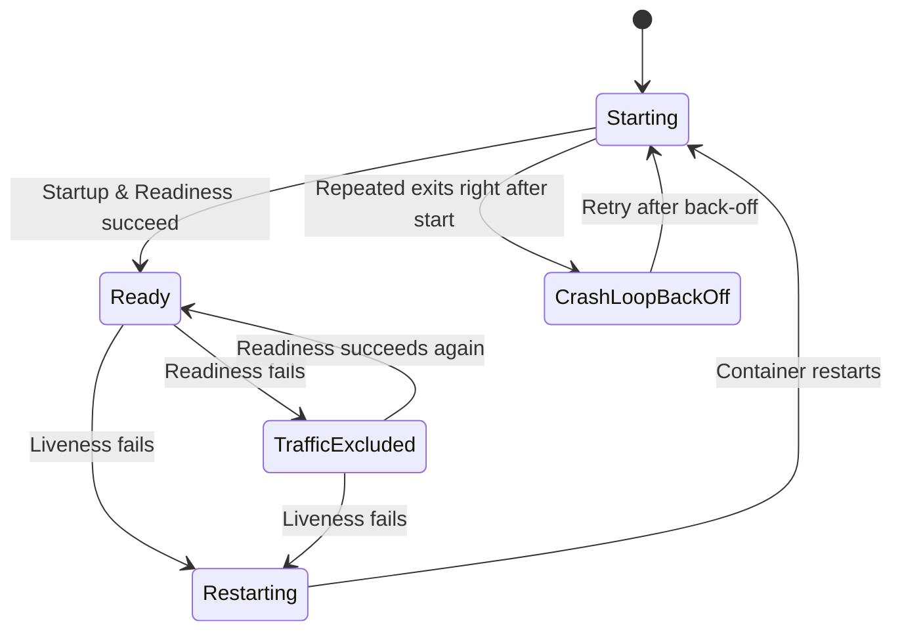
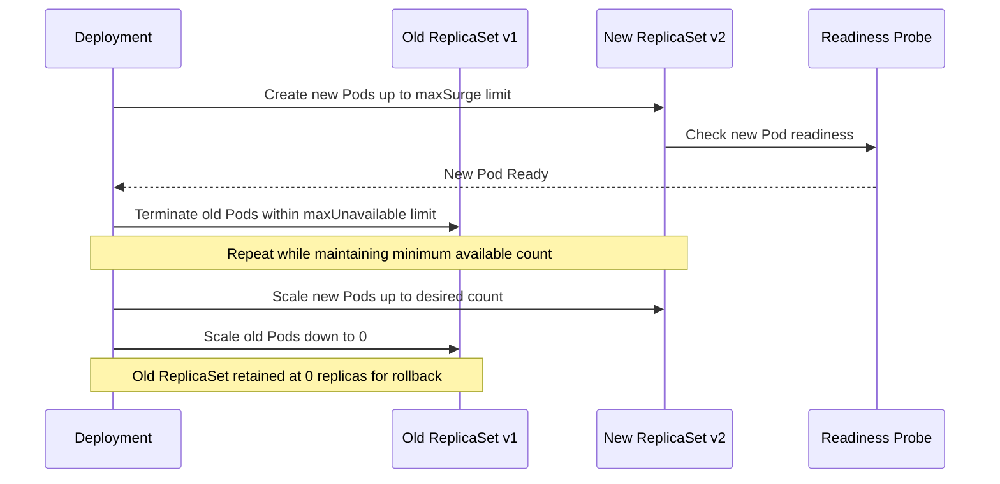

# Health Checks (Probes) and Zero-Downtime Deployment — Rolling Updates & Rollback Strategies

## Learning Objectives
- Distinguish the role and differences among Liveness, Readiness, and Startup Probes
- Understand how maxSurge and maxUnavailable control rolling update behavior
- Practice rolling back a failed deployment with `kubectl rollout` and managing revision history

## Content

### Why Health Checks and Deployment Strategies Matter

Running a Pod was covered in the introductory course. In production, however, the real challenge is keeping containers healthy and swapping in new versions — **without ever taking the service down**.

A running process does not automatically mean a "healthy" container. Just as a person who is physically moving is not necessarily healthy, a container must be able to **respond correctly to requests** to be considered healthy. Kubernetes provides **Probes** — self-healing mechanisms that handle this automatically, so engineers do not have to monitor containers around the clock. When deploying a new version, **rolling updates** guarantee zero downtime, and if something goes wrong, a **rollback** restores the previous state instantly.

These three concepts — Probes, rolling updates, and rollbacks — are the focus of this lecture.

### 1. Three Types of Probes: Liveness · Readiness · Startup

A Probe **periodically diagnoses** the state of a container and triggers automatic action by Kubernetes based on the result. There are three types, each with a distinct remediation behavior.

**Liveness Probe** — "Is this container still alive? Does it need a restart?"
- If a container enters a deadlock or becomes unresponsive, the Liveness Probe **restarts the container**.
- The goal is self-healing: recovering from transient errors or hangs through a restart.
- A Liveness Probe does exactly **one thing: trigger a restart**. When failures accumulate beyond `failureThreshold`, kubelet kills the container and starts a new one.

A common point of confusion is the relationship between Liveness Probe failures and `CrashLoopBackOff`. Let's be precise about this.

> **Liveness Probe failure ≠ CrashLoopBackOff.** A Liveness Probe failure simply triggers a container **restart**. `CrashLoopBackOff` is a separate state that occurs when a container exits abnormally right after starting, repeatedly — at which point kubelet progressively increases the delay between restart attempts (back-off), e.g., 10s → 20s → 40s. That said, an overly aggressive Liveness Probe (e.g., a very short `initialDelaySeconds` that fires before the app has had a chance to come up) can cause relentless restarts, which *eventually* lead to `CrashLoopBackOff`. The two are not directly equivalent, however — treating them as the same will cause you to misdiagnose the root cause of an incident.

**Readiness Probe** — "Is this container ready to accept traffic right now?"
- A failure does **not** restart the container. Instead, the Pod is **temporarily removed from the Service's load-balancer target list**.
- For example, if an application takes 20–30 seconds to start, the Readiness Probe prevents 5xx errors from reaching users by blocking traffic until the app is ready.
- Once the probe succeeds again, traffic is automatically routed back to the Pod.

**Startup Probe** — "Has a slow-starting application fully come up?"
- Designed for legacy or heavyweight applications with long startup times.
- While the Startup Probe is still running, **Liveness and Readiness Probes are suspended**. This prevents Liveness from repeatedly restarting an application that is still initializing.

> Key distinction: Liveness = **restart** on failure; Readiness = **block traffic** when not ready; Startup = **hold other Probes** until startup completes. Using Liveness and Readiness together is the recommended best practice in production.

The state diagram below illustrates how the same container can follow completely different paths depending on which Probe fails. Notice in particular that a Liveness failure only sends the container back to the "Starting" state — it is the repetition of exits *immediately after* restarting that eventually leads to `CrashLoopBackOff`, which is a distinct path, not a direct consequence of Liveness failure.



#### Three Probe Mechanisms: HTTP / TCP / Exec

All three Probe types check container health using one of the following three mechanisms. Choose the one that best fits your application.

- **httpGet**: Sends an HTTP request to a specified path and port; a response code of 200–399 is a success. → Best for web servers
- **tcpSocket**: Succeeds if a TCP connection to the specified port can be established. → Best for port-based services such as databases or SSH
- **exec**: Runs a command inside the container; exit code 0 is a success (any other code is a failure). → Best for custom checks such as verifying file existence

> Important: Health-check commands must be **lightweight and accurate**. Running a CPU-intensive check as a Probe can degrade application performance and cause Kubernetes to kill a perfectly healthy container.

#### HTTP Liveness Probe Example

The following manifest attaches an httpGet-based Liveness Probe to an nginx web server.

```yaml
apiVersion: v1
kind: Pod
metadata:
  name: nginx-liveness
spec:
  containers:
  - name: nginx
    image: nginx:1.14
    ports:
    - containerPort: 80
    livenessProbe:
      httpGet:
        path: /          # HTTP request to the root path
        port: 80         # on port 80
      initialDelaySeconds: 15  # wait 15 seconds after container start before first check
      periodSeconds: 10        # repeat check every 10 seconds
      timeoutSeconds: 2        # treat as failure if no response within 2 seconds
      failureThreshold: 3      # mark unhealthy after 3 consecutive failures → restart
      successThreshold: 1      # mark healthy after 1 success
```

Key field meanings:
- **initialDelaySeconds**: How long to wait before the first check, because the container may not be ready immediately after start (default: 0).
- **periodSeconds**: Check interval (default: 10s). Too long delays fault detection; too short increases load.
- **timeoutSeconds**: Response wait limit (default: 1s).
- **failureThreshold**: How many consecutive failures trigger "unhealthy" status (default: 3). A safety buffer so a single blip does not kill the container.
- **successThreshold**: How many consecutive successes trigger "healthy" status (default: 1).

A Readiness Probe uses **nearly identical syntax** — simply replace `livenessProbe` with `readinessProbe`. The key difference in behavior (traffic blocking instead of restart) is what matters.

#### Verifying with kubectl

```bash
# Create the Pod with the Probe attached
kubectl apply -f nginx-liveness.yaml

# Watch the Pod — the RESTARTS count rises when the Probe fails
kubectl get pod nginx-liveness -w

# Inspect events for Probe activity (Unhealthy / Killing / Started, etc.)
kubectl describe pod nginx-liveness
```

When Liveness begins to fail, the Events section of `describe` output will show `Liveness probe failed`, followed by `Killing container`, and then `Started` for the new container. At this point, **the Pod itself remains alive — only the container restarts** — so the Pod's IP address does not change. This distinction matters. If the container exits again immediately after restarting, and this cycle repeats, the Pod status changes to `CrashLoopBackOff` and the `RESTARTS` count climbs rapidly. This is a signal that "a restart alone cannot fix this problem" — you should investigate both the Probe configuration and the application logs.

### 2. Rolling Updates and maxSurge / maxUnavailable

Now for new-version deployments. The **default deployment strategy in a Kubernetes Deployment is a rolling update**. Even without explicit configuration, this is how Kubernetes handles updates internally.

A rolling update **replaces Pods one at a time** (or in defined batches). By cycling through — terminating old-version Pods and spinning up new ones — across the entire set, the service stays up throughout the upgrade.

The behavior is governed by a ReplicaSet and two parameters. When you create a Deployment, a ReplicaSet is created internally and delegated the responsibility of maintaining the desired Pod count. When you deploy a new version, a **new ReplicaSet** is created, and the rollout proceeds by scaling down the old ReplicaSet while scaling up the new one.

```yaml
apiVersion: apps/v1
kind: Deployment
metadata:
  name: demo
spec:
  replicas: 5
  strategy:
    type: RollingUpdate    # default value
    rollingUpdate:
      maxSurge: 1           # allow up to 1 Pod above the desired count
      maxUnavailable: 1     # allow up to 1 Pod below the desired count during rollout
  selector:
    matchLabels:
      app: demo
  template:
    metadata:
      labels:
        app: demo
    spec:
      containers:
      - name: demo
        image: myapp:v2
```

What the two parameters mean:
- **maxSurge**: The maximum number of Pods that can be created **above** the target replica count (`replicas`). Controls the upper bound — how many extra Pods can exist at once to speed up the rollout.
- **maxUnavailable**: The maximum number of Pods that can be **below** the target count during a rollout. Controls the lower bound — how much capacity can be temporarily sacrificed.

Both accept absolute numbers (`1`) or percentages (`20%`). With replicas=5 and both set to 1, the Pod count during an update stays between **4 (5−1) and 6 (5+1)**, ensuring at least 4 Pods are always running and zero downtime is guaranteed.

As shown in the sequence diagram below, maxSurge and maxUnavailable pace each step as the Deployment scales down the old ReplicaSet and scales up the new one.



> If availability is the top priority, set `maxUnavailable: 0`. Kubernetes will never terminate an old Pod until a new one is Ready, so available capacity never drops even for an instant. **However, `maxSurge` must be at least 1 in this case.** With `maxUnavailable: 0`, no existing Pod can be taken down first, so if there is no room to add a new Pod (`maxSurge`), the rollout cannot make any progress. (Setting both to 0 blocks the rollout entirely.) Additionally, a **Readiness Probe must be configured** alongside this setup — that is how Kubernetes determines whether a new Pod is genuinely ready to serve traffic before proceeding to the next replacement.

Monitor rollout progress in real time with:

```bash
kubectl apply -f deployment.yaml
kubectl rollout status deployment/demo   # streams progress until the rollout completes
kubectl get rs                            # shows both the new and old ReplicaSets
```

In the `kubectl get rs` output, the new ReplicaSet shows DESIRED=5 while the old one shows 0. **The old ReplicaSet is retained at 0 replicas to support rollbacks** — its Pod template is preserved so the system can revert instantly if needed.

### 3. Rollbacks and Revision History (kubectl rollout)

If a problem is discovered after deploying a new version, there is no need to manually re-apply the old YAML — simply revert to a revision that Kubernetes has already saved.

```bash
# View deployment history (revisions)
kubectl rollout history deployment/demo

# Immediately roll back to the previous version
kubectl rollout undo deployment/demo

# Roll back to a specific revision (e.g., revision 2)
kubectl rollout undo deployment/demo --to-revision=2

# Pause or resume an in-progress rollout
kubectl rollout pause deployment/demo
kubectl rollout resume deployment/demo
```

Each deployment is recorded with a **revision number** — revision 1 for the first deploy, revision 2 for the next, and so on. `rollout undo` scales the saved old ReplicaSet back up and scales the current one down to zero, performing the rollback **in the same rolling fashion, with zero downtime**.

To capture a meaningful change description in `kubectl rollout history`, add a `kubernetes.io/change-cause` annotation to the Deployment's `metadata.annotations`. This is the clearest approach — the deprecated `--record` flag should no longer be used.

```yaml
apiVersion: apps/v1
kind: Deployment
metadata:
  name: demo
  annotations:
    kubernetes.io/change-cause: "image v2 - fix payment timeout bug"  # appears in CHANGE-CAUSE column
spec:
  replicas: 5
  # ... (rest unchanged)
```

After running `kubectl apply`, the `CHANGE-CAUSE` column in `kubectl rollout history deployment/demo` will display this message, making it easy to identify "what was deployed in which revision" later.

The number of retained revisions is controlled by `spec.revisionHistoryLimit` in the Deployment (default: 10). Keeping this too high causes old ReplicaSets to accumulate, so set a reasonable limit.

### Common Pitfalls

- **Do not use Liveness alone without Readiness.** Without a Readiness Probe, traffic is routed to new Pods before they are ready, causing 5xx errors. The Readiness Probe is the foundation of zero-downtime deployment.
- **Do not set Liveness Probe thresholds too aggressively.** A short `initialDelaySeconds` or a low `failureThreshold` can kill a healthy application that is still starting up, triggering continuous restarts that eventually lead to `CrashLoopBackOff`. Use a Startup Probe to protect slow-starting applications.
- **Keep probe commands lightweight.** If a Probe puts load on the application, the health check itself becomes the cause of the failure.
- **Never set both maxUnavailable and maxSurge to 0.** The rollout cannot make any progress. In particular, when using `maxUnavailable: 0`, make sure `maxSurge` is at least 1.

## Key Takeaways
- Probes are Kubernetes' self-healing mechanism. **Liveness = restart**, **Readiness = block/restore traffic**, **Startup = protect slow-starting apps** — each has a distinct role. A Liveness Probe failure triggers only a restart; `CrashLoopBackOff` is a separate state that occurs when a container keeps exiting right after restarting — not a direct synonym for Liveness failure.
- Each Probe type checks health via one of three mechanisms — **httpGet / tcpSocket / exec** — with sensitivity tuned via `initialDelaySeconds`, `periodSeconds`, `failureThreshold`, and related fields.
- Rolling updates are the default Deployment strategy. **maxSurge** (how many extra Pods can exist) and **maxUnavailable** (how many Pods can be missing) define the Pod count range during a rollout to guarantee zero downtime. When `maxUnavailable: 0`, `maxSurge` must be at least 1, and a Readiness Probe is required for truly uninterrupted updates.
- Every deployment is recorded as a **revision**. Use the `kubernetes.io/change-cause` annotation to document changes, `kubectl rollout history` to view history, and `kubectl rollout undo` to perform a zero-downtime rollback.
