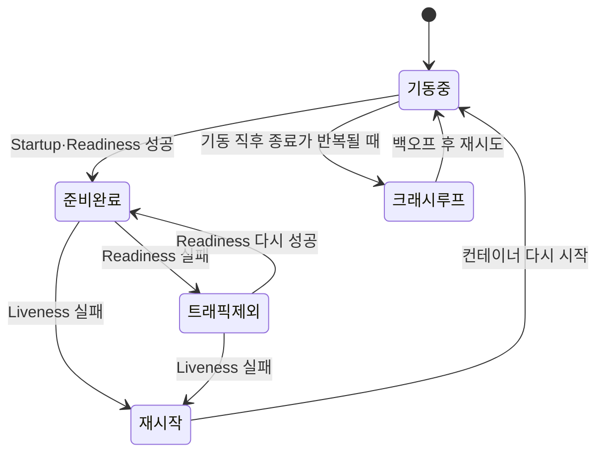
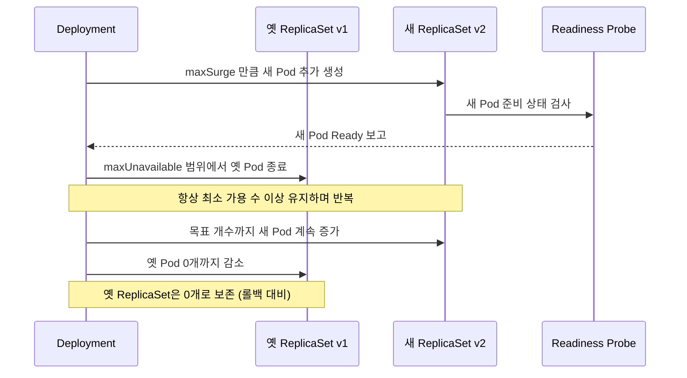

# 헬스체크(Probes)와 무중단 배포 - 롤링 업데이트·롤백 전략

## 학습 목표
- Liveness·Readiness·Startup Probe의 역할과 차이를 구분한다
- 롤링 업데이트의 maxSurge/maxUnavailable 동작 원리를 이해한다
- 배포 실패 시 kubectl rollout으로 롤백하고 이력을 관리해본다

## 본문

### 왜 헬스체크와 배포 전략을 배우는가

Pod를 띄우는 것까지는 기초 강의에서 배웠다. 하지만 운영 환경에서 진짜 어려운 건 "**서비스를 멈추지 않으면서**" 컨테이너를 건강하게 유지하고, 새 버전으로 갈아끼우는 일이다.

컨테이너는 프로세스가 떠 있다고 해서 "정상"인 게 아니다. 우리가 걸어 다닌다고 다 건강한 게 아니듯, 컨테이너도 **요청에 제대로 응답할 수 있어야** 건강한 것이다. 쿠버네티스는 이걸 사람이 밤새 모니터링하지 않아도 되도록 **Probe(프로브, 진단기)** 라는 자가 치유(self-healing) 장치를 제공한다. 그리고 새 버전을 배포할 때는 **롤링 업데이트**로 무중단을 보장하고, 문제가 생기면 **롤백**으로 이전 상태로 되돌린다.

이 세 가지 — Probe, 롤링 업데이트, 롤백 — 가 오늘의 주제다.

### 1. 세 가지 Probe: Liveness · Readiness · Startup

Probe는 컨테이너의 상태를 **주기적으로 진단**하고, 결과에 따라 쿠버네티스가 자동으로 조치를 취하게 만드는 장치다. 종류는 세 가지이며, 각각 "조치 방식"이 다르다.

**Liveness Probe (생존 진단)** — "이 컨테이너 살아 있나? 다시 켜야 하나?"
- 컨테이너가 데드락에 빠지거나 응답 불능 상태가 되면, **컨테이너를 재시작(restart)** 한다.
- 일시적 오류나 멈춤을 재시작으로 자가 치유하는 것이 목적이다.
- Liveness Probe가 하는 일은 **딱 하나, "재시작 트리거"** 뿐이다. 즉 실패가 누적되면(`failureThreshold` 초과) kubelet이 컨테이너를 죽이고 다시 띄운다.

여기서 흔히 혼동하는 것이 `CrashLoopBackOff`다. 둘의 관계를 정확히 짚자.

> **Liveness Probe 실패 ≠ CrashLoopBackOff.** Liveness Probe 실패는 컨테이너 "재시작"을 유발할 뿐이다. `CrashLoopBackOff`는 별개의 상태로, 컨테이너가 시작 직후 계속 비정상 종료될 때 kubelet이 재시작 사이의 대기 시간(back-off)을 점점 늘리는(예: 10초 → 20초 → 40초 …) 상태를 가리킨다. 다만 Liveness Probe를 너무 공격적으로 잡으면(예: `initialDelaySeconds`가 짧아 앱이 뜨기도 전에 검사 실패) 끊임없는 재시작을 유발해 *결과적으로* CrashLoopBackOff로 이어질 수 있다. 그러나 Liveness 실패 자체가 곧 CrashLoopBackOff인 것은 아니다 — 이 둘을 직접 인과로 단정하면 장애 원인을 오진하기 쉽다.

**Readiness Probe (준비 진단)** — "이 컨테이너 지금 트래픽 받아도 되나?"
- 실패해도 **재시작하지 않는다.** 대신 해당 Pod를 Service의 **로드밸런서 대상에서 잠시 제외**한다.
- 예를 들어 앱이 기동에 20~30초가 걸린다면, 그 동안 사용자에게 5xx 에러를 주지 않도록 "준비될 때까지" 트래픽을 막아 준다.
- 준비가 끝나 응답이 돌아오기 시작하면 다시 트래픽을 흘려 보낸다.

**Startup Probe (기동 진단)** — "느린 앱이 다 떠올랐나?"
- 기동이 오래 걸리는 레거시·무거운 애플리케이션을 위한 것이다.
- Startup Probe가 성공할 때까지 **Liveness/Readiness Probe를 잠시 비활성화**한다. 아직 뜨지도 않은 앱을 Liveness가 "죽었네" 하고 자꾸 재시작하는 사고를 막는다.

> 핵심 구분: Liveness는 "고장 나면 **재시작**", Readiness는 "준비 안 됐으면 **트래픽 차단**", Startup은 "다 뜰 때까지 **다른 Probe를 기다리게**" 한다. 실무에서는 Liveness와 Readiness를 함께 쓰는 것이 모범 사례다.

아래 상태 전이도처럼, 같은 컨테이너라도 어떤 Probe가 실패했느냐에 따라 쿠버네티스의 조치가 완전히 달라진다. 특히 Liveness 실패로 인한 "재시작"은 다시 기동중 상태로 돌아갈 뿐이며, CrashLoopBackOff는 그렇게 재시작된 컨테이너가 기동 직후 종료를 반복할 때 비로소 진입하는 별개의 경로임을 눈여겨보자.



#### 진단 방법 3가지 (HTTP / TCP / Exec)

세 종류의 Probe는 각각 다음 세 가지 방법 중 하나로 건강을 검사한다. 애플리케이션 성격에 맞춰 고르면 된다.

- **httpGet**: 지정한 경로·포트로 HTTP 요청을 보내 응답 코드가 200~399면 성공. → 웹 서버에 적합
- **tcpSocket**: 지정한 포트에 TCP 연결이 열리면 성공. → DB, SSH 등 포트 기반 서비스에 적합
- **exec**: 컨테이너 안에서 명령을 실행해 종료 코드 0이면 성공(0이 아니면 실패). → 특정 파일 존재 확인 등 커스텀 검사에 적합

> 주의: 건강검진 명령은 **가볍고 정확**해야 한다. CPU를 잡아먹는 무거운 검사를 Probe로 돌리면, 진단 자체가 앱 성능을 깎아 오히려 멀쩡한 컨테이너를 죽게 만든다.

#### HTTP Liveness Probe 예시

웹 서버(nginx)에 httpGet 방식의 Liveness Probe를 붙이는 매니페스트다.

```yaml
apiVersion: v1
kind: Pod
metadata:
  name: nginx-liveness
spec:
  containers:
  - name: nginx
    image: nginx:1.14
    ports:
    - containerPort: 80
    livenessProbe:
      httpGet:
        path: /          # 루트 경로로
        port: 80         # 80 포트에 HTTP 요청
      initialDelaySeconds: 15  # 컨테이너 시작 후 15초 기다렸다가 첫 검사
      periodSeconds: 10        # 이후 10초마다 반복 검사
      timeoutSeconds: 2        # 2초 안에 응답 없으면 실패 처리
      failureThreshold: 3      # 연속 3번 실패하면 비정상 판정 → 재시작
      successThreshold: 1      # 1번 성공하면 정상 판정
```

각 필드의 의미를 정확히 알아 두자.
- **initialDelaySeconds**: 컨테이너가 뜬 직후엔 아직 준비가 안 됐을 수 있으니, 첫 검사까지 기다리는 시간(기본값 0).
- **periodSeconds**: 검사 주기(기본 10초). 너무 길면 장애 감지가 늦고, 너무 짧으면 부하가 커진다.
- **timeoutSeconds**: 응답 대기 한계(기본 1초).
- **failureThreshold**: 연속 몇 번 실패해야 "비정상"으로 볼지(기본 3). 한 번 삐끗했다고 바로 죽이지 않는 안전장치다.
- **successThreshold**: 연속 몇 번 성공해야 "정상"으로 볼지(기본 1).

Readiness Probe는 **문법이 거의 동일**하다. `livenessProbe` 자리에 `readinessProbe`라고 쓰기만 하면 된다. 다만 동작이 다르다는 점(재시작 대신 트래픽 차단)을 기억하자.

#### 실습으로 확인하기

```bash
# Probe가 붙은 Pod 생성
kubectl apply -f nginx-liveness.yaml

# 상태 관찰 — 비정상이면 RESTARTS 수치가 올라간다
kubectl get pod nginx-liveness -w

# 이벤트로 Probe 동작 내역 확인 (Unhealthy / Killing / Started 등)
kubectl describe pod nginx-liveness
```

Liveness가 실패하기 시작하면 `describe` 출력의 Events에 `Liveness probe failed`, 이어서 `Killing container`, 그리고 새 컨테이너 `Started`가 찍힌다. 이때 **Pod는 그대로 살아 있고 컨테이너만 재시작**되므로, Pod의 IP는 바뀌지 않는다. 이 점이 중요하다. 만약 재시작 후에도 컨테이너가 곧장 다시 종료되기를 반복하면, 그제서야 Pod 상태가 `CrashLoopBackOff`로 바뀌고 `RESTARTS` 수치가 빠르게 누적된다 — 이는 "재시작으로 안 고쳐지는 문제"라는 신호이니 Probe 설정이나 앱 로그를 의심해야 한다.

### 2. 롤링 업데이트와 maxSurge / maxUnavailable

이제 새 버전 배포다. 쿠버네티스 Deployment의 **기본 배포 전략이 바로 롤링 업데이트**다. 별도로 설정하지 않아도 내부에서 이 방식으로 동작한다.

롤링 업데이트는 Pod를 **한 번에 하나씩(또는 정해진 묶음씩) 교체**한다. 기존 Pod를 내리고 새 버전 Pod를 띄우는 과정을 전체 Pod에 걸쳐 굴려 나가기 때문에, 서비스를 멈추지 않고 업그레이드할 수 있다.

여기서 동작을 좌우하는 게 ReplicaSet과 두 개의 손잡이다. Deployment를 만들면 내부적으로 ReplicaSet이 생성되어 "Pod 개수 맞추기"를 위임받는다. 새 버전을 배포하면 **새 ReplicaSet**이 하나 더 생기고, 기존 ReplicaSet의 Pod를 줄이면서 새 ReplicaSet의 Pod를 늘리는 식으로 교체가 진행된다.

```yaml
apiVersion: apps/v1
kind: Deployment
metadata:
  name: demo
spec:
  replicas: 5
  strategy:
    type: RollingUpdate    # 기본값
    rollingUpdate:
      maxSurge: 1           # 원하는 개수보다 최대 1개까지 더 띄울 수 있음
      maxUnavailable: 1     # 교체 중 최대 1개까지 부족해도 됨
  selector:
    matchLabels:
      app: demo
  template:
    metadata:
      labels:
        app: demo
    spec:
      containers:
      - name: demo
        image: myapp:v2
```

두 손잡이의 의미는 다음과 같다.
- **maxSurge**: 목표 개수(`replicas`)를 **초과해서** 추가로 띄울 수 있는 Pod 수의 상한. 교체 속도를 높이는 "여유 위(上)"다.
- **maxUnavailable**: 교체 중 **부족해도 되는** Pod 수의 상한. 가용량을 어디까지 깎아도 되는지의 "여유 아래(下)"다.

둘 다 절대 수(`1`)나 퍼센트(`20%`)로 줄 수 있다. replicas가 5일 때 둘 다 1이면, 업데이트 중 Pod 수는 **최소 4개(5−1) ~ 최대 6개(5+1)** 사이에서 움직이며, 항상 4개 이상이 살아 있으니 무중단이 보장된다.

아래 흐름도처럼 Deployment가 옛 ReplicaSet을 줄이고 새 ReplicaSet을 늘리는 과정을 maxSurge·maxUnavailable이 한 발짝씩 통제한다.



> 안정성이 최우선이면 `maxUnavailable: 0`으로 두자. 새 Pod가 Ready 될 때까지 기존 Pod를 절대 내리지 않으므로 가용량이 한 순간도 줄지 않는다. **단, 이 경우 `maxSurge`는 반드시 1 이상이어야 한다.** maxUnavailable이 0이면 기존 Pod를 먼저 내릴 수 없으니, 새 Pod를 추가로 띄울 여유(maxSurge)가 없으면 배포가 한 발짝도 진행되지 못하기 때문이다. (둘 다 0이면 교체 자체가 막힌다.) 또한 **Readiness Probe가 반드시 함께 설정**되어야 한다. 그래야 쿠버네티스가 "새 Pod가 진짜 트래픽을 받을 준비가 됐는지" 판단해 다음 교체로 넘어간다.

배포 진행 상황은 다음 명령으로 실시간 관찰한다.

```bash
kubectl apply -f deployment.yaml
kubectl rollout status deployment/demo   # 롤아웃이 끝날 때까지 진행 상황 출력
kubectl get rs                            # 새/옛 ReplicaSet이 함께 보임
```

`kubectl get rs`를 보면 새 ReplicaSet은 DESIRED가 5, 옛 ReplicaSet은 0으로 줄어 있다. **옛 ReplicaSet이 0개로 남아 있는 이유는 롤백 때문**이다. 이전 Pod 템플릿 정보를 보관해 두었다가 필요하면 즉시 되돌릴 수 있게 한 것이다.

### 3. 롤백과 이력 관리 (kubectl rollout)

새 버전을 배포했는데 문제가 발견됐다면? 직접 옛 YAML을 다시 적용할 필요 없이 쿠버네티스가 보관해 둔 이력으로 되돌리면 된다.

```bash
# 배포 이력(리비전) 조회
kubectl rollout history deployment/demo

# 직전 버전으로 즉시 롤백
kubectl rollout undo deployment/demo

# 특정 리비전(예: 2번)으로 롤백
kubectl rollout undo deployment/demo --to-revision=2

# 잘못 누른 진행 중 롤아웃을 일시정지/재개
kubectl rollout pause deployment/demo
kubectl rollout resume deployment/demo
```

각 배포는 **리비전(revision) 번호**로 기록된다. 첫 배포가 revision 1, 다음 배포가 revision 2… 식이다. `rollout undo`는 보관된 옛 ReplicaSet의 Pod 수를 다시 올리고 현재 것을 0으로 내려서, **롤링 업데이트와 똑같은 방식으로 무중단 롤백**을 수행한다.

`kubectl rollout history`에 "이 리비전이 무슨 변경이었는지"를 남기려면, Deployment 매니페스트의 `metadata.annotations`에 `kubernetes.io/change-cause` 어노테이션을 직접 적어 두는 것이 가장 명확하다. (과거에 쓰던 `--record` 플래그는 deprecated 되었다.)

```yaml
apiVersion: apps/v1
kind: Deployment
metadata:
  name: demo
  annotations:
    kubernetes.io/change-cause: "image v2 적용 - 결제 타임아웃 버그 수정"  # 이 줄이 history의 CHANGE-CAUSE에 표시됨
spec:
  replicas: 5
  # ... (이하 동일)
```

이렇게 두고 `kubectl apply` 하면 `kubectl rollout history deployment/demo` 출력의 `CHANGE-CAUSE` 칸에 위 문구가 그대로 표시되어, 나중에 "어느 리비전이 무엇이었는지" 한눈에 추적할 수 있다.

보관되는 리비전 개수는 Deployment의 `spec.revisionHistoryLimit`(기본 10)으로 조절한다. 너무 크게 두면 옛 ReplicaSet이 잔뜩 쌓이니 적당히 유지하는 것이 좋다.

### 주의사항 정리

- **Liveness만 쓰고 Readiness를 빼지 말 것.** Readiness가 없으면 아직 준비 안 된 새 Pod로 트래픽이 흘러 5xx가 터진다. 무중단 배포의 핵심은 Readiness Probe다.
- **Liveness Probe를 너무 공격적으로 설정하지 말 것.** `initialDelaySeconds`가 짧거나 `failureThreshold`가 작으면, 기동 중인 멀쩡한 앱을 계속 재시작시켜 결국 `CrashLoopBackOff`로 몰아넣을 수 있다. 느린 앱은 Startup Probe로 보호하라.
- **진단 명령은 가볍게.** Probe가 앱에 부하를 주면 진단이 곧 장애의 원인이 된다.
- **maxUnavailable과 maxSurge를 동시에 0으로 두지 말 것.** 배포가 한 발짝도 못 나간다. 특히 `maxUnavailable: 0`을 쓸 때는 `maxSurge`를 1 이상으로 둬야 한다.

## 핵심 요약
- Probe는 컨테이너 자가 치유 장치다. **Liveness=재시작**, **Readiness=트래픽 차단/연결**, **Startup=느린 앱 기동 보호**로 역할이 다르다. Liveness 실패는 "재시작"을 부를 뿐이며, CrashLoopBackOff는 재시작 직후 종료가 반복될 때의 별개 상태다.
- 각 Probe는 **httpGet / tcpSocket / exec** 세 방법 중 하나로 검사하며, `initialDelaySeconds`·`periodSeconds`·`failureThreshold` 등으로 민감도를 조절한다.
- 롤링 업데이트는 Deployment의 기본 전략으로, **maxSurge(초과 허용)** 와 **maxUnavailable(부족 허용)** 으로 교체 중 Pod 수 범위를 정해 무중단을 보장한다. `maxUnavailable: 0`이면 `maxSurge`가 1 이상이어야 하고, Readiness Probe와 함께 써야 진짜 무중단이 된다.
- 배포는 **리비전**으로 기록되며, `kubernetes.io/change-cause` 어노테이션으로 변경 사유를 남기고, `kubectl rollout history`로 이력을 보고 `kubectl rollout undo`로 무중단 롤백한다.
