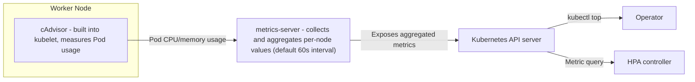
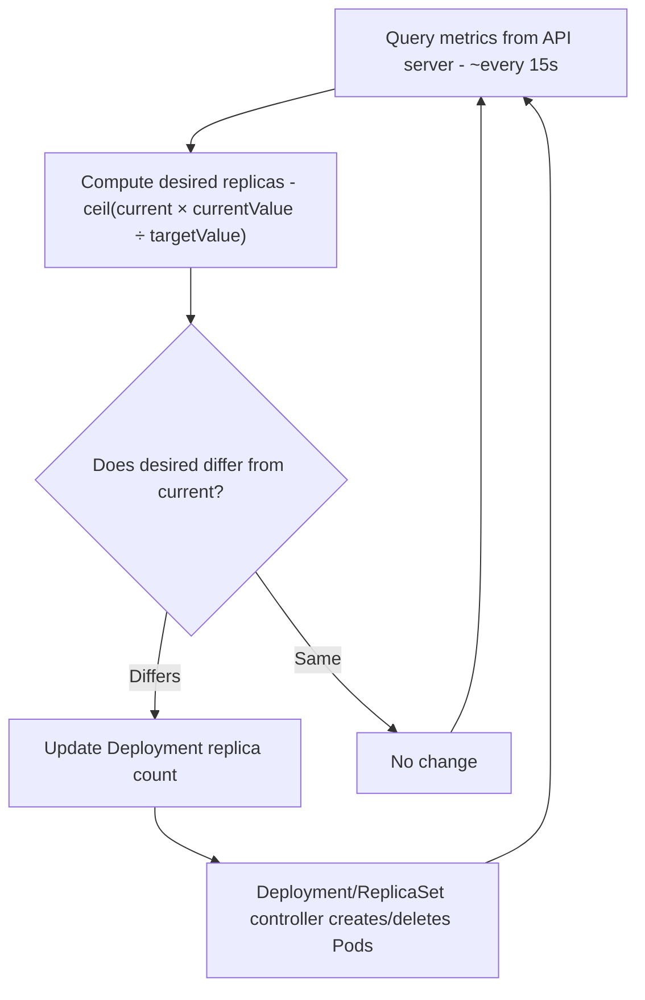

# Resource Management and Autoscaling - requests/limits and HPA

## Learning Objectives
- Understand how CPU/memory requests and limits affect scheduling, QoS class assignment, and OOMKill behavior
- Learn how the Horizontal Pod Autoscaler (HPA) adjusts the number of Pods in response to load
- Configure an HPA backed by metrics-server and verify its behavior through a load test

## Content

### Why Resource Management Matters

Running workloads in a cluster without understanding requests and limits is like spending money without knowing your budget. Two outcomes await. One is a cloud bill that silently grows, and the other is a Pod that gets killed by Kubernetes without warning.

Every application needs two resources to run: **CPU** and **memory**. Pods run on nodes (worker machines), and all Pods on the same node **share** that node's CPU and memory. When one Pod consumes resources uncontrollably, every other Pod on that node suffers. This is known as the "Noisy Neighbor" problem, and isolation is the primary reason to manage resources explicitly.

### requests and limits: What Two Numbers Do

You can set two values per container.

- **requests**: The resource amount this container is "guaranteed at minimum" for normal operation — think of it as the minimum system requirements on a game's packaging. The scheduler uses this value when selecting a node.
- **limits**: The "maximum" resource amount this container is allowed to use. Exceeding this threshold triggers Kubernetes intervention.

These values go in the `resources` section of a container spec.

```yaml
resources:
  requests:
    cpu: "250m"      # guarantee 0.25 cores
    memory: "256Mi"
  limits:
    cpu: "500m"      # cap at 0.5 cores
    memory: "512Mi"
```

Pay attention to units. **Memory is in bytes** (Mi = mebibytes, Gi = gibibytes), and **CPU is in cores**. CPU supports fractional values: `1000m` (millicores) equals one virtual CPU core, so `250m` is 0.25 cores. Fractional allocation is possible because the OS slices time (time-slicing) and distributes CPU among containers.

### requests Act at Scheduling Time, limits Act at Runtime

The key insight is that the two values operate at **different points in time**.

**requests are used at scheduling time.** When a new Pod is created, the scheduler examines the Pod's total requests and looks for a node with sufficient headroom. If a Pod requests 800Mi of memory, the scheduler finds a node with 800Mi free. If no node has room, the Pod stays in `Pending` state. (If a Cluster Autoscaler is present, a new node is provisioned and the Pod is placed there.)

**limits are enforced continuously at runtime.** Critically, CPU and memory behave very differently when a limit is exceeded.

> Memory causes OOMKill; CPU causes throttling. Exceeding a memory limit causes the container to be killed with an **OOMKilled** (Out of Memory) signal. Exceeding a CPU limit does not kill the container — it is **throttled**, meaning it receives fewer CPU cycles and simply runs slower.

This difference is what trips up operators most often. Memory overruns are obvious because the Pod restarts, but CPU throttling produces a "something feels slow but nothing is crashing" state that is hard to trace. Remembering **"memory dies, CPU slows"** makes incident analysis much easier.

### QoS Classes and Eviction Order Under Memory Pressure

requests and limits are more than resource numbers — they signal to Kubernetes **how important this application is**. Based on how these two values are set, Kubernetes automatically assigns each Pod one of three QoS (Quality of Service) classes.

- **Guaranteed**: Every container in the Pod has requests equal to limits for both CPU and memory. Resources are fully reserved from start to finish, making this the most stable class — but also the most wasteful if actual usage is lower.
- **Burstable**: Any Pod that is neither Guaranteed nor BestEffort falls here. Specifically, if **at least one value (requests or limits) is specified** — for example, requests set but no limits, or requests set lower than limits — the Pod is Burstable. It consumes up to its requests amount normally, and can burst higher when spare capacity exists. This is the most common class in practice, striking a balance between cost efficiency and stability.
- **BestEffort**: No requests **and** no limits are set on **any** container in the Pod. Even a single configured value disqualifies a Pod from this class. BestEffort Pods have the lowest priority.

The classification rule is straightforward: **neither set → BestEffort; all requests equal limits → Guaranteed; everything in between (including requests-only) → Burstable.** As shown in the classification flow below, this determination is made automatically based on how requests and limits are configured, and it directly governs the eviction order when memory runs low.

```mermaid Automatic QoS class classification and eviction order under memory pressure
flowchart TD
    A{"Are requests/limits set?"} -->|"Neither set"| BE["BestEffort - lowest priority"]
    A -->|"Set"| B{"Are requests and limits equal?"}
    B -->|"Equal"| GU["Guaranteed - most stable"]
    B -->|"requests is smaller"| BU["Burstable - middle ground, most common"]
    BE -->|"Evicted first"| EV["Eviction under memory pressure"]
    BU -->|"Evicted second"| EV
    GU -->|"Evicted last"| EV
```

This class becomes decisive when a node experiences **memory pressure**. When node memory runs low, Kubernetes **evicts and terminates Pods in order of lowest priority first**. The order is BestEffort → Burstable → Guaranteed. In other words, the more critical the service, the more important it is to set proper requests so the Pod survives.

> Never run any workload without requests and limits. Omitting them results in BestEffort class, and those Pods are the first to be sacrificed when a node comes under pressure.

You cannot know the perfect values from the start. **Start small, measure, and adjust upward** is the standard approach. Use monitoring tools (Prometheus, Grafana, Datadog, etc.) to observe real usage and tune accordingly. Setting limits too low causes throttling/OOM and makes your application suffer; setting requests too high locks up unused resources into "empty checks" that go to waste.

There is an ongoing community debate about CPU limits. The argument for omitting CPU limits goes: throttling occurs even when spare CPU is available, which is irrational, and for many web-facing services CPU is rarely the primary bottleneck. (For compute-intensive, CPU-bound workloads like video encoding or scientific computation, CPU absolutely can be the bottleneck — so the argument does not generalize.) Removing limits introduces Noisy Neighbor risk and degrades QoS class. **The recommended practice is to set limits, but do so thoughtfully.**

### metrics-server: The Eyes of Autoscaling

Now we move to automatically adjusting the number of Pods based on load. For Kubernetes to make a scaling decision, it needs to know "how much CPU is being used right now." The component that gathers this usage data is **metrics-server**.

The collection flow works like this. Inside each worker node's kubelet is an agent called **cAdvisor** that measures CPU and memory usage for each Pod. **metrics-server** collects these values from all nodes on a regular schedule, aggregates them, and exposes the results through the Kubernetes API server. The interval at which metrics-server scrapes each node is called the **metric resolution (`--metric-resolution`)**, and its **default is 60 seconds** (some tuned environments set it shorter). You can then view live usage with `kubectl top`, and the HPA controller reads the same data to make scaling decisions. As shown in the diagram below, usage data flows from nodes through the API server to both the HPA controller and operators.



metrics-server is not installed by default and must be deployed manually.

```bash
kubectl apply -f https://github.com/kubernetes-sigs/metrics-server/releases/latest/download/components.yaml

# Verify installation — usage data should appear
kubectl top nodes
kubectl top pods
```

> On minikube, `minikube addons enable metrics-server` is all you need. On local or self-hosted clusters that produce TLS errors, you may need to add `--kubelet-insecure-tls` to the metrics-server arguments (not recommended for production environments).

### How HPA Works

The **Horizontal Pod Autoscaler (HPA)** is a controller that **automatically scales the number of Pods (replicas) up and down** based on load. When usage rises, it scales out (adds Pods) to distribute the load; when load drops, it scales in (removes Pods) to save resources. Once configured properly, it requires no manual intervention.

For context, Kubernetes provides three types of autoscalers: HPA (adjusts Pod count), VPA (adjusts individual Pod requests/limits), and Cluster Autoscaler (adjusts node count). This lecture focuses on HPA, the most widely used of the three.

Understanding HPA's evaluation cycle and formula is important. The HPA controller runs in the control plane and queries the API server for metrics approximately every **15 seconds**, then calculates the desired replica count using this formula:

```
desired replicas = ceil( current replicas × (current metric value / target metric value) )
```

For example, if there are 2 Pods with an average CPU of 90% and the target is 70%, the result is `2 × (90 / 70) = 2.57`, which is **rounded up (ceil)** to 3. The key point is that fractional results are always **rounded up**. (If 1 Pod is at 240% and the target is 100%: `1 × 2.4 = 2.4`, ceil → 3, not round → 2.) When multiple metrics are specified simultaneously, each is calculated independently and the **largest result** is used.

> How can CPU utilization exceed 100%? Here, "%" is relative to the Pod's requests value. On a multi-core node, a multithreaded process inside a single Pod can simultaneously occupy multiple cores — consuming far more than the requested amount (e.g., 1 core requested but 2.4 cores actually used). Unless a CPU limit prevents this, values like 240% are entirely possible.

The HPA controller **only updates the replica count**. The actual work of creating or deleting Pods is handled by the Deployment/ReplicaSet controller. As shown in the decision loop below, the controller queries, calculates, and updates approximately every 15 seconds, delegating actual Pod management to other controllers.



One important clarification: the `maxSurge` and `maxUnavailable` fields in a Deployment's rolling update strategy control **how fast old Pods are replaced by new ones when the Pod template itself changes** (e.g., a new image or updated environment variables). They have **no bearing on HPA scale-out or scale-in**. When HPA simply increases or decreases the replica count, every Pod uses the same specification — no template change occurs, so no rolling update is triggered. If scaling feels slower than expected, do not look at `maxSurge`/`maxUnavailable`; instead, check the metrics-server collection interval, the HPA sync period, and Pod startup time, as discussed below.

### Scaling Has Latency (The Delay Between Lightning and Thunder)

HPA does not react instantaneously. Multiple delays stack up before a metric spike translates into new Pods. The largest contributor is the **metrics-server collection interval**. As noted above, the default (`--metric-resolution`) is **60 seconds**, which means the usage data HPA reads can already be up to a minute stale. Add the HPA controller's own sync cycle (approximately 15 seconds), and **with default settings it is completely normal for scale-out to take over a minute after load spikes**. It is like seeing lightning but not hearing the thunder until later. You might set a target of 80%, yet scaling may not trigger until actual load has already climbed to 85% or 90%.

> The "30–45 seconds" figures often cited online assume that metrics-server's collection interval has been tuned shorter than the default 60 seconds — typically down to 15–30 seconds. With a stock installation, plan for more than a minute, and explicitly lower `--metric-resolution` if faster response is required.

You can reduce these intervals through configuration, but pushing them too aggressively — e.g., down to 1 second — dramatically increases API server load. The recommendation is not to push these values to extremes. Instead, consider the following approaches.

- **Tune the target utilization**: An 80% target may react slowly. Lowering it to 50% triggers scaling sooner, but keeps more Pods running than necessary during normal traffic, raising costs. Calibrate the sensitivity to your traffic pattern.
- **Speed up Pod startup itself**: Image pull time, init container work, and readiness probe delays all consume startup time. Pre-caching images, avoiding heavy initialization, and minimizing readiness probe delays all make scaling faster.
- **Burstable QoS as a buffer**: Setting limits generously above requests gives the system excess capacity to absorb short bursts while scaling completes, without triggering OOM.

### Lab: Configuring HPA and Running a Load Test

Let's set up an HPA, generate load, and watch Pods scale out and back in. Start by creating a Deployment to receive the load. You must specify requests so that HPA can calculate utilization as a percentage.

```yaml
# php-apache.yaml — sample app for CPU load testing
apiVersion: apps/v1
kind: Deployment
metadata:
  name: php-apache
spec:
  replicas: 1
  selector:
    matchLabels: { app: php-apache }
  template:
    metadata:
      labels: { app: php-apache }
    spec:
      containers:
        - name: php-apache
          image: registry.k8s.io/hpa-example
          ports: [{ containerPort: 80 }]
          resources:
            requests:
              cpu: "200m"     # ← baseline for HPA utilization calculation
            limits:
              cpu: "500m"
---
apiVersion: v1
kind: Service
metadata:
  name: php-apache
spec:
  selector: { app: php-apache }
  ports: [{ port: 80 }]
```

```bash
kubectl apply -f php-apache.yaml
```

There are two ways to attach an HPA. The quick imperative way:

```bash
kubectl autoscale deployment php-apache --cpu-percent=50 --min=1 --max=10
```

Or declaratively with YAML for version-controlled management:

```yaml
# hpa.yaml
apiVersion: autoscaling/v2
kind: HorizontalPodAutoscaler
metadata:
  name: php-apache
spec:
  scaleTargetRef:
    apiVersion: apps/v1
    kind: Deployment
    name: php-apache
  minReplicas: 1            # minimum Pod count
  maxReplicas: 10           # maximum Pod count
  metrics:
    - type: Resource
      resource:
        name: cpu
        target:
          type: Utilization
          averageUtilization: 50   # target average CPU at 50%
```

`minReplicas`/`maxReplicas` define the scale floor and ceiling. `averageUtilization: 50` means "keep the average Pod CPU utilization near 50% of requests (50% of 200m = 100m)."

Now generate load by firing continuous requests at the service from a temporary Pod. Use `--restart=Never` because this is a one-shot Pod, and `--rm` so it is automatically deleted when it exits. Pass the command after `--` as shown (the older `--generator` style options have been removed).

```bash
# Separate terminal — generate continuous requests from a temporary Pod
kubectl run -i --tty load-generator --rm --image=busybox:1.28 --restart=Never -- \
  /bin/sh -c "while sleep 0.01; do wget -q -O- http://php-apache; done"
```

> For reproducibility, you can also define the load-generator Pod as a YAML manifest (`kind: Pod`) and apply it with `kubectl apply -f`. This declarative approach is cleaner for automated testing or repeated runs.

In another terminal, watch the HPA and Pods.

```bash
kubectl get hpa php-apache --watch    # REPLICAS increases when CPU% in TARGETS exceeds 50
kubectl get pods -w                    # watch Pods being added
kubectl top pods                       # check real-time usage
```

Once CPU exceeds the target, REPLICAS climbs from 1 → 4 → ... up to the ceiling of 10. Due to the collection delay described earlier, do not expect an immediate reaction — with default settings, it is normal to wait around a minute before scaling kicks in. Running `kubectl describe hpa php-apache` shows scale events recorded with reasons like "CPU resource above target." Then press `Ctrl+C` in the load generator terminal to stop the requests — after a short delay, CPU drops and HPA scales Pods back down to minReplicas.

> Scale-down applies a **stabilization window** (`behavior.scaleDown.stabilizationWindowSeconds`, default 300 seconds = 5 minutes) to prevent "flapping" — the pattern of rapidly removing Pods during a brief dip only to spin them back up. Here is exactly how it works: the HPA records the recommended replica count produced by each evaluation cycle throughout the window, and at the end of the window it picks the **highest** of all those recorded values to apply. In other words, even if lower recommendations appear mid-window, the system waits until the highest recommendation within the window has dropped sufficiently before actually scaling down. This is why Pod count stays elevated for roughly five minutes after load drops — the window's peak recommendation is still holding it in place. (By contrast, the default stabilization window for scale-up is 0 seconds, so scale-out happens promptly.)

### Where HPA Alone Is Not Enough

Even a well-configured HPA cannot guarantee service stability on its own. If a traffic surge drives a Pod to its memory or database connection limits, that Pod can no longer handle requests — yet it continues to receive traffic until it dies. This is why **health checks (readiness probes)** are essential alongside HPA. When a Pod honestly signals "I'm overloaded," Kubernetes stops routing traffic to it and directs requests only to healthy Pods. Stable autoscaling is only complete when requests/limits, HPA, and readiness probes **all work together**. (Health checks were covered in Lecture 3.)

## Key Takeaways
- **requests** define the scheduling baseline (minimum guarantee); **limits** define the runtime ceiling. Units: memory in bytes (Mi/Gi), CPU in cores (1000m = 1 core).
- **Exceeding a memory limit causes OOMKill (container dies); exceeding a CPU limit causes throttling (container slows down)** — these behaviors are fundamentally different.
- The combination of requests and limits determines the QoS class: **neither set → BestEffort; all requests equal limits → Guaranteed; everything in between (including requests-only) → Burstable.** Burstable is the most common class in practice. Under memory pressure, eviction order is BestEffort → Burstable → Guaranteed, so always set at least requests on every workload.
- HPA calculates desired Pod count as `ceil(current replicas × (current value / target value))` and depends on usage data from metrics-server (cAdvisor → aggregation → API server). `maxSurge`/`maxUnavailable` govern rolling-update replacement speed only and are completely unrelated to HPA scaling.
- metrics-server's default collection interval (`--metric-resolution`) is **60 seconds**, so with default settings it is normal for scale-out to take **over a minute** after load spikes. For faster response, lower the collection interval explicitly; also tune target utilization, accelerate Pod startup, use Burstable QoS, and add readiness probes together for stable autoscaling.
- Scale-down applies a default **300-second stabilization window** that records recommended replica counts over the window and applies the **maximum** at window end, preventing rapid flapping. Pod count will remain elevated for roughly five minutes after load drops — this is by design.
