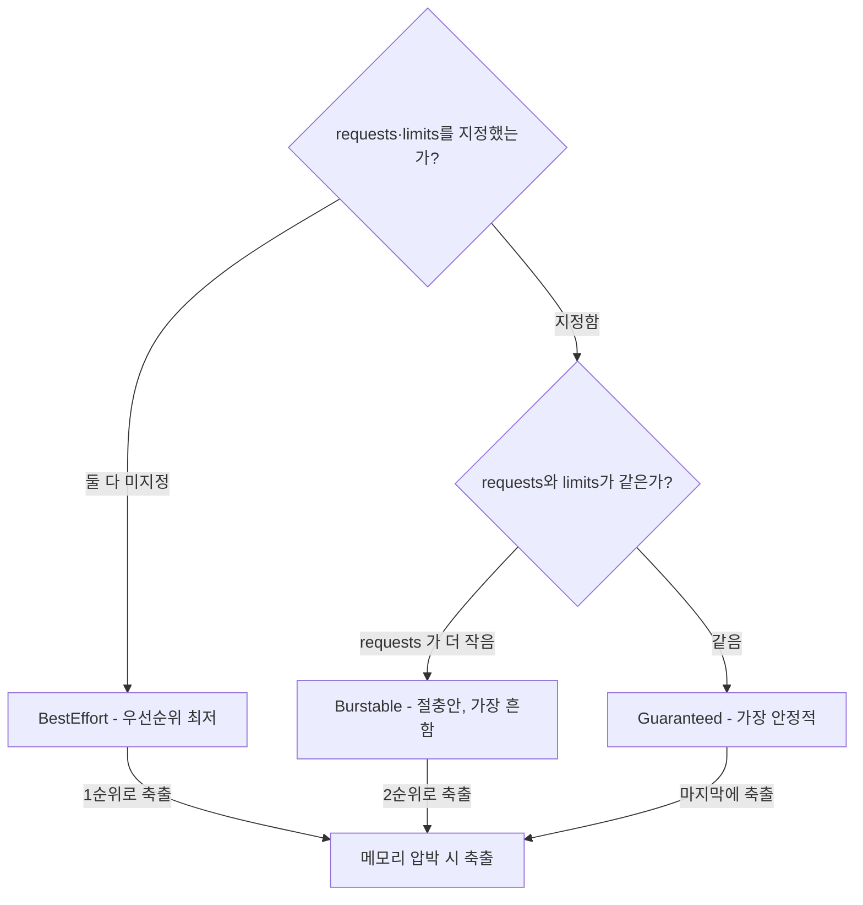
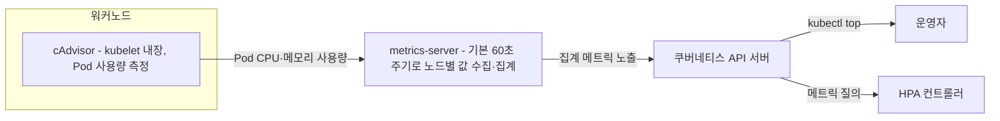
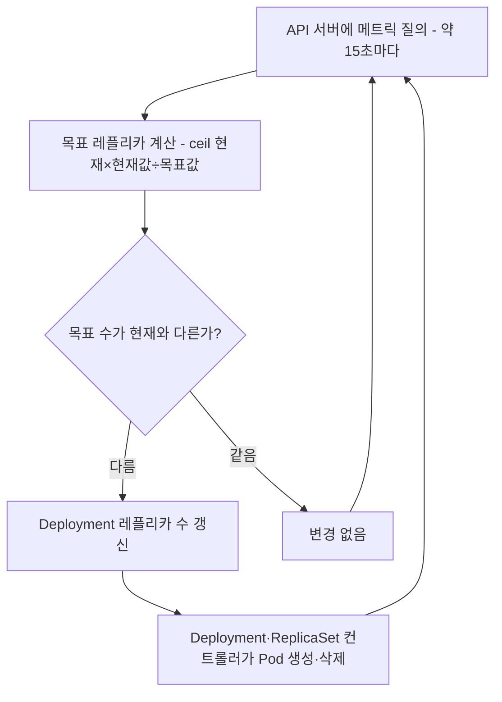

# 리소스 관리와 오토스케일링 - requests/limits와 HPA

## 학습 목표
- CPU/메모리 requests와 limits가 스케줄링·QoS·OOMKill에 미치는 영향을 이해한다
- Horizontal Pod Autoscaler(HPA)가 부하에 따라 Pod 수를 조절하는 원리를 안다
- metrics-server 기반으로 HPA를 설정하고 부하 테스트로 동작을 확인한다

## 본문

### 왜 리소스 관리가 중요한가

클러스터에서 requests와 limits를 모른 채 워크로드를 운영하는 것은, 예산을 모른 채 돈을 쓰는 것과 같다. 두 가지 결과가 기다린다. 하나는 클라우드 비용이 새는 것이고, 다른 하나는 어느 날 갑자기 Pod가 쿠버네티스에 의해 죽는 것이다.

모든 애플리케이션은 실행을 위해 **CPU**와 **메모리** 두 가지 자원을 필요로 한다. Pod는 노드(워커 머신) 위에서 돌고, 같은 노드에 있는 모든 Pod는 그 노드의 CPU·메모리를 **나눠 쓴다**. 따라서 한 Pod가 자원을 폭주시키면 같은 노드의 다른 Pod까지 피해를 본다. 이를 "시끄러운 이웃(Noisy Neighbor)" 문제라고 부른다. 리소스를 명시적으로 관리해야 하는 첫 번째 이유가 바로 이 격리다.

### requests와 limits: 두 개의 숫자가 하는 일

컨테이너마다 두 가지 값을 지정할 수 있다.

- **requests(요청)**: 이 컨테이너가 정상 동작을 위해 "최소한 보장받아야 하는" 자원. 게임을 살 때의 최소 사양과 같다. 스케줄러가 노드를 고를 때 이 값을 기준으로 삼는다.
- **limits(제한)**: 이 컨테이너가 "최대로 쓸 수 있는" 자원의 상한. 이걸 넘기면 쿠버네티스가 개입한다.

설정은 컨테이너 스펙의 `resources` 섹션에 들어간다.

```yaml
resources:
  requests:
    cpu: "250m"      # 0.25 코어 보장
    memory: "256Mi"
  limits:
    cpu: "500m"      # 최대 0.5 코어까지
    memory: "512Mi"
```

단위에 주의하자. **메모리는 바이트 단위**(Mi=메비바이트, Gi=기비바이트)이고, **CPU는 코어 단위**다. CPU는 분수도 가능한데, `1000m`(밀리코어)이 가상 CPU 1코어다. 즉 `250m`은 0.25코어다. 운영체제가 시간을 잘게 쪼개(타임 슬라이스) 여러 컨테이너에 CPU를 나눠 주기 때문에 분수 할당이 가능하다.

### requests는 스케줄링에, limits는 런타임에 작동한다

두 값이 작동하는 **시점이 다르다**는 것이 핵심이다.

**requests는 스케줄링 시점**에 쓰인다. 새 Pod가 생기면 스케줄러는 그 Pod의 requests 합계를 보고, 그만큼의 여유가 있는 노드를 찾는다. 예를 들어 메모리 800Mi를 요청하면 800Mi가 남은 노드를 찾고, 어느 노드에도 자리가 없으면 Pod는 `Pending` 상태로 대기한다. (클러스터 오토스케일러가 있으면 새 노드가 떠서 그 위에 배치된다.)

**limits는 실행 중 내내** 감시된다. 그런데 CPU와 메모리에서 한계 초과 시 동작이 완전히 다르다.

> 메모리는 OOMKill, CPU는 Throttle. 메모리 limit을 넘으면 컨테이너는 **OOMKilled**(Out Of Memory) 시그널로 죽는다. 반면 CPU limit을 넘으면 죽지 않고 **스로틀링**(throttling) — CPU 사이클을 덜 주어 그냥 느려진다.

이 차이가 운영자를 가장 괴롭힌다. 메모리 초과는 Pod가 재시작되니 금방 눈에 띄지만, CPU 스로틀링은 "어딘가 느려졌는데 죽지는 않은" 상태라 원인 추적이 어렵다. **"메모리는 죽고, CPU는 느려진다"**를 외워 두면 장애 분석이 한결 수월해진다.

### QoS 클래스와 OOM 시 축출 순서

requests/limits는 단순한 자원 숫자를 넘어, 쿠버네티스에게 **이 애플리케이션이 얼마나 중요한지**를 알려주는 신호이기도 하다. 쿠버네티스는 이 조합으로 Pod에 세 가지 QoS(Quality of Service, 서비스 품질) 클래스를 자동 부여한다.

- **Guaranteed(보장)**: Pod의 모든 컨테이너가 CPU·메모리 모두에 대해 requests = limits로 동일하게 설정된 경우. 자원이 처음부터 끝까지 예약되어 가장 안정적이지만, 실제로 다 쓰지 않으면 그만큼 낭비다.
- **Burstable(버스트 가능)**: Guaranteed도 BestEffort도 아닌 모든 경우. 즉 requests나 limits **중 적어도 하나라도 지정**돼 있으면(예: requests만 지정, 또는 requests < limits) Burstable이다. 평소엔 requests만큼 쓰다가 여유가 있을 때 limits까지 치솟을(burst) 수 있다. 비용 효율과 안정성의 절충안이며 가장 흔히 쓰인다.
- **BestEffort(최선 노력)**: Pod의 어떤 컨테이너에도 requests와 limits가 **둘 다 전혀 지정되지 않은** 경우에만 해당한다. 하나라도 지정하면 BestEffort가 아니다. 우선순위가 가장 낮다.

핵심은 분류 기준이다. **둘 다 미지정이면 BestEffort, 모두 requests=limits면 Guaranteed, 그 사이의 모든 경우(requests만 지정 포함)는 Burstable**이다. 아래 분류 흐름처럼, requests와 limits를 어떻게 지정했느냐에 따라 QoS 클래스가 자동으로 갈리고, 그것이 곧 메모리 압박 시의 축출 순서를 결정한다.



이 클래스는 노드에 **메모리 압박**이 생겼을 때 결정적으로 작동한다. 노드 메모리가 부족하면 쿠버네티스는 **우선순위가 낮은 Pod부터 축출(evict)·종료**한다. 순서는 BestEffort → Burstable → Guaranteed다. 즉 중요한 서비스일수록 requests를 제대로 채워 줘야 살아남는다.

> 어떤 워크로드든 requests와 limits 없이 운영하지 말라. 지정하지 않으면 BestEffort가 되어, 노드가 압박받는 순간 가장 먼저 희생된다.

처음부터 완벽한 값을 알 수는 없다. **작게 시작해 측정하며 올려라**가 정석이다. 모니터링 도구(Prometheus, Grafana, Datadog 등)로 실사용량을 관찰한 뒤 값을 조정한다. limit을 너무 낮게 잡으면 스로틀링/OOM으로 앱이 고통받고, request를 너무 높게 잡으면 안 쓰는 자원을 묶어 두는 "빈 수표"가 되어 낭비된다.

CPU limit을 두고는 커뮤니티 내 논쟁이 있다. "CPU limit을 설정하지 말자"는 주장인데, 여유 CPU가 있는데도 스로틀링당하는 게 비합리적이고, **많은 웹 기반 서비스 환경에서는** CPU가 주된 병목이 아니라는 이유다. (다만 영상 인코딩·과학 연산처럼 연산 집약적인 CPU-bound 워크로드에서는 CPU가 명백한 병목이 될 수 있으니 일반화는 금물이다.) limit을 빼면 시끄러운 이웃 위험과 QoS 저하가 따른다. **권장은 "limit을 설정하되 신중하게 잡는 것"**이다.

### metrics-server: 오토스케일링의 눈

이제 부하에 따라 Pod 수를 자동 조절하는 단계로 넘어간다. 그런데 쿠버네티스가 "지금 CPU를 얼마나 쓰는지"를 알아야 스케일 판단을 할 수 있다. 이 사용량 데이터를 모아 주는 컴포넌트가 **metrics-server**다.

수집 흐름은 이렇다. 각 워커 노드의 kubelet 안에는 **cAdvisor**라는 에이전트가 있어 Pod의 CPU·메모리 사용량을 측정한다. **metrics-server**는 이 값을 노드들로부터 주기적으로 긁어와 집계(aggregate)해 쿠버네티스 API 서버에 노출한다. 이때 metrics-server가 노드를 긁는 주기를 **메트릭 해상도(`--metric-resolution`)**라고 부르는데, **기본값이 60초**다(과거 일부 버전·튜닝 환경에서는 더 짧게 잡기도 한다). 그러면 우리는 `kubectl top` 명령으로 실사용량을 볼 수 있고, HPA 컨트롤러도 이 데이터를 읽어 판단한다. 아래 구성도처럼 사용량 데이터가 노드에서 API 서버를 거쳐 HPA와 사용자에게 흘러간다.



metrics-server는 기본 설치가 아니므로 직접 배포해야 한다.

```bash
kubectl apply -f https://github.com/kubernetes-sigs/metrics-server/releases/latest/download/components.yaml

# 설치 확인 — 사용량이 표시되면 정상
kubectl top nodes
kubectl top pods
```

> minikube를 쓴다면 `minikube addons enable metrics-server` 한 줄이면 된다. 로컬/자체 클러스터에서 TLS 오류가 나면 metrics-server 인자에 `--kubelet-insecure-tls`를 추가해야 할 수 있다(운영 환경에서는 권장하지 않음).

### HPA의 동작 원리

**Horizontal Pod Autoscaler(HPA)**는 부하에 따라 **Pod의 개수(레플리카)를 자동으로 늘리고 줄이는** 컨트롤러다. 사용량이 오르면 Pod를 더 띄워(scale-out) 부하를 분산하고, 부하가 빠지면 Pod를 줄여(scale-in) 자원을 아낀다. 한 번 잘 설정해 두면 사람이 손댈 필요가 없다.

참고로 쿠버네티스의 오토스케일러는 세 종류다. HPA(Pod 수 조절), VPA(개별 Pod의 requests/limits 조절), Cluster Autoscaler(노드 수 조절). 이 강의는 가장 널리 쓰이는 HPA에 집중한다.

HPA의 판단 주기와 계산식을 이해하는 게 중요하다. HPA 컨트롤러는 컨트롤 플레인에서 약 **15초마다** API 서버에 메트릭을 질의하고, 다음 공식으로 목표 레플리카 수를 계산한다.

```
원하는 레플리카 수 = ceil( 현재 레플리카 수 × (현재 메트릭 값 / 목표 메트릭 값) )
```

예를 들어 Pod가 2개이고 평균 CPU가 90%인데 목표를 70%로 잡았다면, `2 × (90 / 70) = 2.57`이고 **올림(ceil)**하여 3개로 늘린다. 여기서 핵심은 분수가 나오면 항상 **올림**한다는 점이다. (1개 Pod가 240%이고 목표 100%면 `1 × 2.4 = 2.4`, 올림하여 3개다 — 반올림 2가 아니다.) 여러 메트릭을 동시에 지정하면 각각 계산한 뒤 **가장 큰 값**을 택한다.

> CPU 사용률이 어떻게 100%를 넘을까? 여기서 "%"는 requests 대비 비율이다. 멀티코어 노드에서 한 Pod 안의 멀티스레드 프로세스가 여러 코어를 동시에 점유하면, requests로 잡은 양(예: 1코어)보다 실제로 더 많이(예: 2.4코어) 쓸 수 있다. 그래서 240% 같은 값이 나온다. limit이 이를 막지 않는 한 가능하다.

HPA 컨트롤러는 **레플리카 수만 갱신**한다. 실제 Pod를 띄우거나 지우는 일은 Deployment/ReplicaSet 컨트롤러가 처리한다. 아래 판단 루프처럼, 약 15초마다 질의·계산·갱신을 반복하고 실제 Pod 생성은 다른 컨트롤러에 위임한다.



참고로 Deployment의 롤링 업데이트 전략(`maxSurge`, `maxUnavailable`)은 **Pod 템플릿(이미지·환경변수 등)이 바뀌어 기존 Pod를 새 Pod로 교체할 때의 교체 속도**에만 관여한다. **HPA의 스케일 인/아웃과는 무관**하다. HPA가 레플리카 수만 늘리거나 줄이는 것은 동일한 사양의 Pod 개수 변경이라 롤링 업데이트가 아니기 때문이다. 따라서 스케일이 기대만큼 빠르지 않다면 `maxSurge`/`maxUnavailable`이 아니라, 뒤에서 설명할 metrics-server 수집 주기·HPA 동기화 주기·Pod 기동 시간을 점검해야 한다.

### 반응에는 지연이 있다 (천둥과 번개)

HPA는 즉각적이지 않다. 메트릭이 HPA의 판단에 닿기까지 여러 단계의 지연이 쌓인다. 가장 큰 몫은 **metrics-server의 수집 주기**다. 앞서 봤듯 기본값(`--metric-resolution`)이 **60초**이므로, HPA가 보는 사용량은 이미 최대 1분쯤 묵은 값일 수 있다. 여기에 HPA 컨트롤러의 동기화 주기(약 15초)가 더해진다. 그래서 **기본 설정 그대로라면 부하가 실제로 치솟은 뒤 스케일업 결정까지 1분 이상 걸리는 것이 정상**이다. 번개를 보고 나서 천둥소리가 늦게 들리는 것과 같다. 목표를 80%로 잡아도 실제 스케일은 부하가 85%, 90%까지 오른 뒤에 일어날 수 있다.

> 흔히 보이는 "30~45초 안에 반응한다"는 수치는 metrics-server의 수집 주기를 기본 60초보다 짧게(예: 15~30초) 튜닝한, 기본값보다 공격적인 환경을 가정한 것이다. 기본 설치 그대로라면 1분 이상을 염두에 두고, 더 빠른 반응이 필요하면 `--metric-resolution`을 명시적으로 낮춰야 한다.

이 주기를 설정으로 줄일 수는 있지만, 1초처럼 극단적으로 낮추면 API 서버 부하가 폭증하는 트레이드오프가 있다. 권장은 무리하게 줄이지 않는 것이다. 대신 다음을 고려한다.

- **목표 사용률(target utilization) 조정**: 80%는 반응이 느릴 수 있다. 50%로 낮추면 더 빨리 대응하지만, 평소에도 Pod를 여유 있게 띄우므로 비용이 늘 수 있다. 트래픽 패턴을 보며 민감도를 맞춘다.
- **스케일 속도 자체를 높이기**: 새 Pod가 뜰 때 이미지 다운로드, init 작업, readiness 체크 지연이 모두 시간을 잡아먹는다. 이미지를 미리 캐시하고, 무거운 초기화를 피하고, readiness 지연을 최소화하면 스케일이 빨라진다.
- **Burstable QoS로 버티기**: requests보다 limits를 넉넉히 잡아 두면, 스케일이 완료될 때까지의 짧은 구간을 여유 자원으로 버틸 수 있다(OOM 없이).

### 실습: HPA 설정과 부하 테스트

직접 HPA를 걸고 부하를 줘서 Pod가 늘었다 줄어드는지 확인해 보자. 부하를 받을 Deployment부터 만든다. requests를 반드시 지정해야 HPA가 사용률(%)을 계산할 수 있다.

```yaml
# php-apache.yaml — CPU 부하 테스트용 샘플 앱
apiVersion: apps/v1
kind: Deployment
metadata:
  name: php-apache
spec:
  replicas: 1
  selector:
    matchLabels: { app: php-apache }
  template:
    metadata:
      labels: { app: php-apache }
    spec:
      containers:
        - name: php-apache
          image: registry.k8s.io/hpa-example
          ports: [{ containerPort: 80 }]
          resources:
            requests:
              cpu: "200m"     # ← HPA 사용률 계산의 기준
            limits:
              cpu: "500m"
---
apiVersion: v1
kind: Service
metadata:
  name: php-apache
spec:
  selector: { app: php-apache }
  ports: [{ port: 80 }]
```

```bash
kubectl apply -f php-apache.yaml
```

HPA를 거는 방법은 두 가지다. 빠르게는 명령형으로,

```bash
kubectl autoscale deployment php-apache --cpu-percent=50 --min=1 --max=10
```

선언형(YAML)으로 관리하려면 다음과 같다.

```yaml
# hpa.yaml
apiVersion: autoscaling/v2
kind: HorizontalPodAutoscaler
metadata:
  name: php-apache
spec:
  scaleTargetRef:
    apiVersion: apps/v1
    kind: Deployment
    name: php-apache
  minReplicas: 1            # 최소 Pod 수
  maxReplicas: 10           # 최대 Pod 수
  metrics:
    - type: Resource
      resource:
        name: cpu
        target:
          type: Utilization
          averageUtilization: 50   # 평균 CPU 50% 목표
```

`minReplicas`/`maxReplicas`는 스케일 하한·상한이고, `averageUtilization: 50`은 "Pod 평균 CPU 사용률을 50%(=requests 200m의 50%인 100m) 근처로 유지하라"는 뜻이다.

이제 부하를 준다. 임시 Pod를 하나 띄워 서비스를 무한 호출한다. 부하 생성 Pod는 일회성이므로 `--restart=Never`로 만들고, `--rm`으로 종료 시 자동 삭제되게 한다. `--` 뒤에 실행할 명령을 넘기는 것이 현재 권장 형태다(과거의 `--generator` 류 옵션은 제거되었다).

```bash
# 별도 터미널 — 임시 Pod에서 무한 요청 발생
kubectl run -i --tty load-generator --rm --image=busybox:1.28 --restart=Never -- \
  /bin/sh -c "while sleep 0.01; do wget -q -O- http://php-apache; done"
```

> 일관성·재현성을 중시한다면 부하 생성 Pod도 별도 YAML(`kind: Pod`)로 정의해 `kubectl apply -f`로 띄우는 방법도 있다. 자동화 스크립트나 반복 테스트에서는 이 선언형 방식이 더 깔끔하다.

다른 터미널에서 HPA와 Pod를 관찰한다.

```bash
kubectl get hpa php-apache --watch    # TARGETS의 CPU%가 50을 넘으면 REPLICAS 증가
kubectl get pods -w                    # Pod가 늘어나는 모습 확인
kubectl top pods                       # 실제 사용량 확인
```

CPU가 목표를 넘으면 REPLICAS가 1 → 4 → ... 식으로 상한(10)까지 늘어난다. 다만 앞서 설명한 수집 지연 때문에 부하를 준 직후 바로 늘지 않고 잠시(기본 설정이면 1분 안팎) 뜸을 들인 뒤 반응하니 조급해하지 말자. `kubectl describe hpa php-apache`를 보면 "CPU resource above target" 같은 스케일 사유가 기록된다. 그다음 부하 생성 터미널에서 `Ctrl+C`로 호출을 멈추면, 잠시 뒤 CPU가 떨어지고 HPA가 Pod를 다시 minReplicas까지 줄인다.

> 스케일 다운에는 **다운스케일 안정화 창**(`behavior.scaleDown.stabilizationWindowSeconds`, 기본 300초=5분)이 적용된다. 이 창은 짧은 스파이크에 Pod를 곧장 없앴다가 다시 띄우는 "출렁임(flapping)"을 막기 위한 의도적 설계다. 동작은 이렇다 — HPA는 매 주기 계산한 권장 레플리카 값을 안정화 창 기간 동안 모두 기억해 두고, **창 끝 시점에 그중 가장 높았던 값을 선택해 적용**한다. 즉 도중에 더 낮은 권장값이 나와도 즉시 줄이지 않고, 지난 창 안의 최고치가 충분히 떨어져야 비로소 그만큼만 줄인다. 그래서 부하를 멈춰도 약 5분간은(직전 창의 최고 권장값 때문에) Pod 수가 유지되다가 줄어드는 것이 정상이다. (반대로 스케일 업의 안정화 창 기본값은 0초라 빠르게 늘린다.)

### HPA만으로는 부족한 지점

HPA를 잘 걸어도 서비스가 무너질 수 있다. 부하가 폭증해 Pod가 메모리·DB 커넥션 한계에 도달하면, 그 Pod는 더 이상 요청을 처리할 수 없는데도 트래픽을 계속 받다가 죽는다. 그래서 **헬스체크(readiness probe)**가 함께 필요하다. Pod가 "나 지금 힘들다"고 정직하게 알리면, 쿠버네티스는 그 Pod로 트래픽을 보내지 않고(라우팅 제외) 건강한 Pod로만 요청을 보낸다. 즉 안정적인 오토스케일링은 requests/limits + HPA + readiness probe가 **함께** 맞물려야 완성된다. (헬스체크는 3강에서 다뤘다.)

## 핵심 요약
- **requests**는 스케줄링 기준(최소 보장), **limits**는 런타임 상한이다. 단위는 메모리=바이트(Mi/Gi), CPU=코어(1000m=1코어).
- **메모리 limit 초과는 OOMKill(죽음), CPU limit 초과는 스로틀링(느려짐)**으로 동작이 다르다.
- requests/limits 조합으로 QoS 클래스가 정해진다: **둘 다 미지정=BestEffort, 모두 requests=limits=Guaranteed, 그 사이(requests만 지정 포함)=Burstable.** 메모리 압박 시 BestEffort부터 축출되므로, 어떤 워크로드든 최소한 requests는 지정한다.
- HPA는 `현재 레플리카 × (현재값/목표값)`을 **올림**해 Pod 수를 조절하며, metrics-server(cAdvisor→집계→API 서버)의 사용량 데이터에 의존한다. `maxSurge`/`maxUnavailable`은 롤링 업데이트 교체 속도에만 관여하며 HPA 스케일 속도와는 무관하다.
- metrics-server의 기본 수집 주기(`--metric-resolution`)는 **60초**라서, 기본 설정이면 부하 폭증 후 스케일업까지 **1분 이상** 걸리는 게 정상이다. 더 빠른 반응이 필요하면 수집 주기를 낮추되, 목표 사용률 조정·빠른 Pod 기동·Burstable QoS·readiness probe를 함께 활용해야 안정적이다.
- 스케일 다운에는 기본 300초의 **다운스케일 안정화 창**이 있어, 그 기간의 권장값을 모두 기억했다가 **창 끝에서 그중 최댓값을 적용**한다(급격한 축소·flapping 방지). 그래서 부하가 빠진 뒤에도 한동안 Pod 수가 유지된다.
