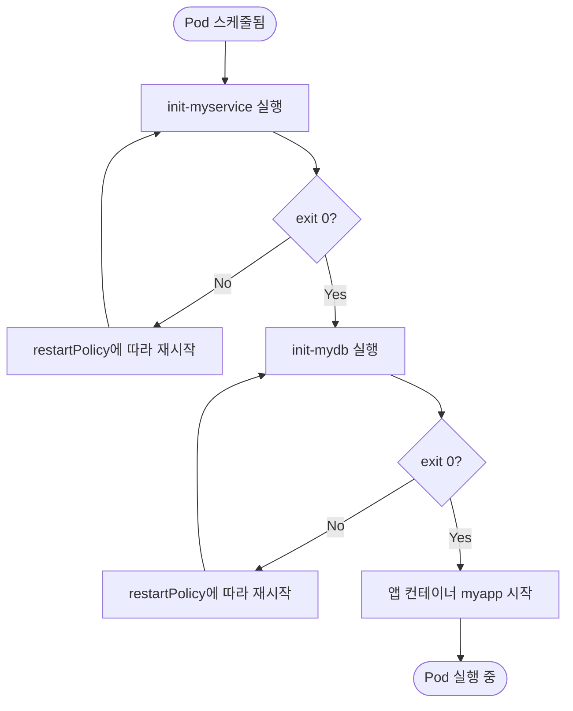
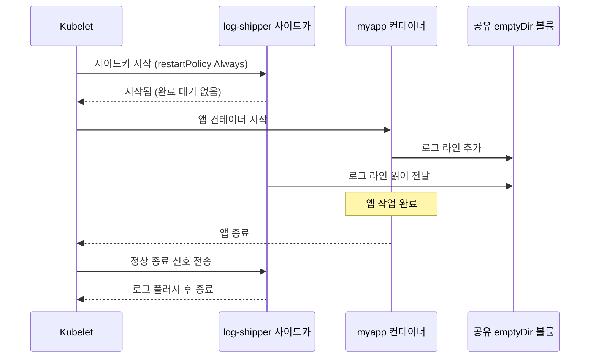

# 쿠버네티스 Init 컨테이너와 사이드카 패턴

## 학습 목표
- Init 컨테이너의 동작 원리를 설명할 수 있다. Init 컨테이너는 앱 컨테이너보다 먼저 실행되고, 정의된 순서대로 하나씩 동작하며, 각 컨테이너가 정상 종료해야 다음 컨테이너가 시작된다. 설정 준비나 의존성 대기 같은 대표적인 사용 사례도 파악한다.
- 사이드카 패턴의 개념과 대표적인 역할(로그 전송, 프록시, 설정 동기화)을 설명하고, 일반 멀티 컨테이너 Pod와의 차이를 구분한다.
- 쿠버네티스 1.28+ **네이티브 사이드카**(`restartPolicy: Always`를 가진 init 컨테이너)를 YAML로 직접 작성·검증하고, 기존 방식 대비 수명주기 측면의 이점을 설명한다.

## 본문

### 컨테이너 하나만으로는 부족한 이유

쿠버네티스 Pod는 배포 가능한 가장 작은 단위이며, 컨테이너를 여러 개 담을 수 있다. 이는 의도된 설계다. 실제 시스템에서 애플리케이션은 혼자 돌아가는 경우가 거의 없다. 설정을 미리 가져와야 할 수도 있고, 로그를 어딘가로 전송하거나, 외부 트래픽을 암호화하거나, 백그라운드에서 시크릿을 동기화해야 할 수도 있다. 이 모든 기능을 메인 이미지에 몰아넣을 수도 있지만, 그러면 관심사가 뒤엉켜 각 기능을 독립적으로 업데이트하기 어려워진다.

쿠버네티스는 이를 깔끔하게 해결하는 두 가지 도구를 제공한다. **Init 컨테이너**는 앱이 시작되기 *전에* 반드시 완료되어야 하는 일회성 준비 작업을 담당하고, **사이드카**는 앱과 *나란히* 앱의 전체 생애 동안 실행되는 보조 프로세스다. YAML 구조는 비슷해 보이지만, 각각 문제의 다른 절반을 담당한다. 하나는 시작 단계, 다른 하나는 실행 단계다. 순서대로 살펴보자.

### Init 컨테이너: Pod의 사전 점검 목록

Init 컨테이너는 Pod spec에 선언하는 시작 전용 컨테이너다. 핵심 규칙은 단순하지만 엄격하다. **Init 컨테이너가 정상 완료되지 않으면, Pod의 다른 어떤 컨테이너도 실행되지 않는다.** Init 컨테이너가 오류로 종료되면 Pod는 실패로 간주되고, 쿠버네티스는 재시작 정책에 따라 계속 재시도한다.

*비행 전 점검표*를 떠올리면 이해하기 쉽다. "본 작업"을 시작하기 전에 모든 사전 조건이 충족되었는지 확인한다. 데이터베이스에 연결 가능한가? 설정 볼륨이 채워져 있는가? 오늘 사용할 Kafka 브로커를 찾을 수 있는가? 유효한 인증 정보가 있는가? 점검 항목 중 하나라도 실패하면 진행할 이유가 없으므로, Pod는 아예 시작하지 않는다. 객체 지향 프로그래밍의 생성자와 같은 원칙이다. 절반만 초기화된 객체는 절대 허용하지 않듯, Init 컨테이너는 절반만 초기화된 Pod가 실행되는 상황을 막아준다.

> Init 컨테이너는 **선언한 순서대로 하나씩** 실행되며, 각 컨테이너가 완료된 후에야 다음 컨테이너가 시작된다. 앱 컨테이너는 *모든* Init 컨테이너가 성공한 뒤에만 시작된다.

주요 사용 사례:

- **의존성 대기** — 데이터베이스나 메시지 브로커 같은 서비스가 실제로 준비될 때까지 시작을 막아, 앱이 처음 뜨자마자 crash-loop에 빠지는 상황을 방지한다.
- **데이터·설정 준비** — 저장소를 `git clone`하거나, 공유 볼륨에 템플릿을 렌더링하거나, 앱에 필요한 에셋을 다운로드한다.
- **볼륨 초기화** — 디렉터리 구조를 생성하고 권한을 설정하거나, 앱 컨테이너가 사용할 공유 `emptyDir` 볼륨에 초기 데이터를 넣는다.

한 가지 유용한 특징이 있다. Init 컨테이너는 일반 컨테이너와 동일한 필드(`name`, `image`, `command`, `args` 등)를 사용하지만, liveness probe와 readiness probe는 지원하지 않는다. Probe는 장시간 실행되는 프로세스를 위한 것이고, Init 컨테이너는 시작해서 역할을 마치고 종료하는 것이 목적이므로 계속 상태를 확인할 필요가 없다.

아래는 애플리케이션 실행 전에 두 가지 의존성을 기다리는 Pod 예시다. 두 개의 Init 컨테이너가 각각 Service의 DNS가 해석될 때까지 반복하고, 그 뒤에 실제 앱 컨테이너가 시작된다.

```yaml
apiVersion: v1
kind: Pod
metadata:
  name: myapp-pod
  labels:
    app: myapp
spec:
  # Init 컨테이너는 이 순서대로 하나씩 실행된다.
  initContainers:
    - name: init-myservice
      image: busybox:1.36
      # "myservice"의 DNS가 해석될 때까지 반복하다가 성공하면 exit 0으로 종료.
      command: ['sh', '-c', "until nslookup myservice; do echo waiting for myservice; sleep 2; done"]
    - name: init-mydb
      image: busybox:1.36
      command: ['sh', '-c', "until nslookup mydb; do echo waiting for mydb; sleep 2; done"]
  # 두 Init 컨테이너가 모두 성공한 후에만 앱 컨테이너가 시작된다.
  containers:
    - name: myapp
      image: nginx:1.27
      ports:
        - containerPort: 80
```

`myservice`와 `mydb`에 접근할 수 없으면 Pod는 crash-loop 없이 `Init:` 상태에서 대기한다. 바로 우리가 원하는 동작이다. 이 Pod에서 Init 컨테이너가 순차적으로 실행되고, 실패하면 앱 컨테이너가 차단되는 흐름을 아래 다이어그램에서 확인할 수 있다.



### 사이드카 패턴, 그리고 그 본질

**사이드카**는 메인 애플리케이션 *옆에서* 실행되며, 메인 이미지를 변경하지 않고 기능을 확장하는 보조 컨테이너다. 이름의 유래는 오토바이 사이드카다. 오토바이에 고정된 별도의 좌석으로, 오토바이가 가는 곳이면 어디든 함께 간다.

사이드카의 대표적인 역할:

- **로그 전송** — 앱이 공유 볼륨에 로그를 기록하면, 사이드카가 해당 파일을 읽어 로깅 백엔드로 전달한다.
- **프록시 / 서비스 메시** — 사이드카(예: Envoy)가 모든 네트워크 트래픽을 가로채 상호 TLS, 재시도, 가시성(observability)을 제공한다. 앱은 이 과정을 전혀 인식하지 못한다.
- **설정 동기화** — 사이드카가 원격 설정 소스를 감시하면서 로컬 파일을 최신 상태로 유지해, 앱이 항상 최신 설정을 읽을 수 있게 한다.

일반적인 멀티 컨테이너 Pod와의 핵심 차이는 목적과 수명주기 결합 방식에 있다. 일반 멀티 컨테이너 Pod에서는 각 컨테이너가 동등한 구성원으로서 핵심 기능을 함께 담당한다. 반면 사이드카는 명백히 *종속적*이다. 메인 앱을 지원하기 위해서만 존재하며, 앱과 생사를 함께해야 한다.

### "전통적인" 사이드카의 불편한 진실

많은 사람이 처음 알게 되면 놀라는 사실이 있다. **쿠버네티스는 오랫동안 사이드카라는 개념 자체를 지원하지 않았다.** 사이드카라는 말은 항상 쓰였지만, 기술적으로는 그냥 `containers:` 목록에 추가된 두 번째 항목일 뿐이었다. 쿠버네티스는 목록의 모든 컨테이너를 동등한 구성원으로 취급하고 거의 동시에 시작했으며, 순서는 보장되지 않았다.

이 공백은 실제로 고통스러운 버그들을 낳았다.

- **시작 경쟁 조건.** 오토바이가 10마일을 달려나갔는데 사이드카는 아직 부착도 안 된 상황이 벌어졌다. 앱이 프록시 사이드카보다 먼저 시작되면 초반 요청이 실패하고, PagerDuty에 알림이 날아가고, 카나리 배포가 깨졌다. 앱이 기다리지 않았기 때문이다.
- **종료 문제.** Job에서는 메인 작업이 완료되면 Pod도 끝나야 한다. 그런데 프록시나 로깅 사이드카는 설계상 영원히 실행되기 때문에 Pod를 계속 살려두고, Job은 영원히 "완료"를 보고하지 못했다.

수년간 팀들은 이 문제를 우회하는 방법으로 버텼다. 공유 "ready" 플래그 파일, 사이드카 준비를 폴링하는 셸 루프, `preStop` 트릭 같은 것들이다. 나름 동작하긴 했지만 취약했고, 모든 팀이 같은 해결책을 제각각 다시 만들어야 했다.

### 쿠버네티스 1.28+의 네이티브 사이드카

쿠버네티스 1.28은 드디어 사이드카를 공식적으로 지원했다. 구현 방식은 놀랍도록 영리하다. `sidecars:`라는 새 필드가 생긴 것이 아니다. 대신 **`restartPolicy: Always`를 가진 init 컨테이너**로 사이드카를 선언한다.

처음에는 모순처럼 들릴 수 있으니 두 부분으로 나눠 살펴보자.

1. **Init 컨테이너이므로**, 메인 앱 컨테이너보다 *먼저* 시작된다. 시작 경쟁 조건이 해결된다. 앱은 사이드카가 올라온 뒤에만 시작이 보장된다.
2. **`restartPolicy: Always`** 가 "init 컨테이너는 완료될 때까지 기다린다"는 규칙을 바꾼다. 이제 쿠버네티스는 이 컨테이너가 종료되기를 기다리지 않고, *시작*되었음을 확인한 뒤 앱 컨테이너로 넘어간다. 재시작 정책이 `Always`이므로 사이드카는 Pod 전체 생애 동안 계속 실행되고, 크래시 시 자동으로 재시작된다.

이를 통해 얻는 수명주기 이점:

- **시작 순서 보장** — 사이드카가 앱보다 먼저 준비되므로, 첫 요청 실패가 사라진다.
- **깔끔한 종료** — 메인 앱이 종료되면 쿠버네티스가 이를 기다렸다가 사이드카에 정상 종료 신호를 보내, 로그를 플러시하고 연결을 닫을 시간을 준다.
- **Job이 정상 작동** — 사이드카가 더 이상 `containers:`의 구성원이 아니므로, Job 완료를 더 이상 막지 않는다. Job은 앱의 작업이 끝나면 완료되고, 사이드카는 그 이후에 정리된다.

네이티브 사이드카는 *절대 끝나지 않는 init 컨테이너*라고 생각할 수 있다. 나머지 Pod는 이 사이드카와 나란히 실행된다. 아래 YAML은 네이티브 방식으로 선언한 로그 전송 사이드카의 예다.

```yaml
apiVersion: v1
kind: Pod
metadata:
  name: app-with-native-sidecar
spec:
  initContainers:
    # 네이티브 사이드카: initContainers에 있지만 restartPolicy: Always 덕분에
    # 앱보다 먼저 시작되고 Pod 전체 생애 동안 계속 실행된다.
    - name: log-shipper
      image: busybox:1.36
      restartPolicy: Always   # <-- 이 필드가 사이드카로 만드는 핵심
      command: ['sh', '-c', 'tail -F /var/log/app/app.log']
      volumeMounts:
        - name: logs
          mountPath: /var/log/app
  containers:
    - name: myapp
      image: busybox:1.36
      command: ['sh', '-c', 'while true; do echo "$(date) request handled" >> /var/log/app/app.log; sleep 5; done']
      volumeMounts:
        - name: logs
          mountPath: /var/log/app
  volumes:
    - name: logs
      emptyDir: {}
```

시작 흐름은 다음과 같다. 쿠버네티스는 먼저 `log-shipper`를 시작하고, `restartPolicy: Always` 덕분에 종료를 기다리지 않고 실행 중임을 확인한 뒤 `myapp`을 시작한다. 앱은 공유 `emptyDir` 볼륨에 로그를 기록하고, 사이드카는 그 내용을 읽어 전달한다. 앱이 종료되면 사이드카도 정상 종료된다. 아래 다이어그램은 "앱보다 먼저 시작 → 나란히 실행 → 앱 종료 후 정리"라는 수명주기 흐름을 시간 순으로 보여준다.



### 비용과 더 넓은 맥락

사이드카는 강력하지만 공짜가 아니다. 완전한 서비스 메시는 *Pod마다* 프록시 컨테이너를 하나씩 추가하는데, 규모가 커지면 이 프록시들이 CPU, 메모리, 비용의 상당 부분을 차지할 수 있다. 그래서 업계에서는 Pod별 컨테이너 대신 커널 레벨에서 이 작업을 처리하는 eBPF 기반 메시 같은 경량 대안을 탐색하고 있다. 그렇다고 사이드카 패턴이 사라지는 것은 아니다. 로깅, 프록시, 설정 보조 기능으로 앱을 확장하는 방식은 여전히 핵심적이다. 다만 무거운 메시를 기본으로 선택하기보다, 실제 필요에 맞게 사이드카를 적절히 활용하는 것이 중요하다.

## 핵심 정리
- **Init 컨테이너**는 앱보다 먼저, 선언 순서대로 하나씩 실행되며, 각각 성공해야 다음 단계로 넘어간다. 의존성 대기, 설정 준비, 볼륨 초기화에 적합하다. 일반 컨테이너와 동일한 필드를 쓰지만 probe는 지원하지 않는다.
- **사이드카**는 메인 앱과 나란히 실행되며, 앱 이미지를 수정하지 않고 로깅·프록시·설정 동기화 기능을 추가하는 보조 컨테이너다. 수명주기를 앱에 종속시킨다는 점에서 일반 멀티 컨테이너 Pod와 다르다.
- **전통적인 사이드카**는 순서 보장이 없는 일반 컨테이너였기 때문에 시작 경쟁 조건과 Job 미완료 문제를 일으켰다.
- **네이티브 사이드카(1.28+)** 는 `restartPolicy: Always`를 가진 init 컨테이너다. 앱보다 먼저 시작되고, Pod 전체 생애 동안 실행되며, 크래시 시 자동 재시작되고, 정상 종료되며, Job 완료를 더 이상 막지 않는다.
