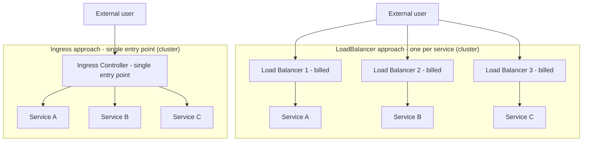

# Routing External Traffic with Ingress - L7 Routing and Domain-Based Access

## Learning Objectives
- Understand the limitations of NodePort/LoadBalancer and why Ingress is necessary
- Learn the relationship between an Ingress Controller and an Ingress resource, and how host- and path-based routing rules work
- Write an Ingress manifest to expose multiple services through a single entry point

## Content

### Why Ingress — The Limitations of NodePort/LoadBalancer

The most fundamental way to expose a Pod outside a Kubernetes cluster is to change the Service type. We already know three of them.

- **ClusterIP**: A virtual IP accessible only within the cluster. External exposure is not possible.
- **NodePort**: Opens the same port on every node (default range 30000–32767) to accept external traffic.
- **LoadBalancer**: Provisions a single external load balancer (such as an NLB) from the cloud provider and assigns an external IP.

For one or two services, this is perfectly adequate. In production, however, you quickly run into walls.

**The problem with NodePort.** Giving users an address like `http://node-ip:31080` is not practical. The port number is high (above 30000), users cannot remember it, and even if you point DNS to the node IP, you have to chase down and update the record every time a node is replaced or its IP changes. You inevitably end up standing up yet another proxy server in front just to forward port 80/443 to 31080.

**The problem with LoadBalancer.** It is clean in a cloud environment, but the rule is **one load balancer per service**. Load balancers are billed resources in the cloud, so ten services means ten load balancers — ten times the cost. On top of that, a new external IP is created every time you add a service, and routing logic ("which URL goes to which load balancer") has to be handled by yet another proxy layer. TLS certificates end up being attached to each service individually as well.

In short, a natural desire arises: route multiple services from a single entry point based on URL or domain, and manage TLS in one place — all declared in YAML alongside your other manifests. **Ingress** is Kubernetes' answer to this. As shown in the comparison diagram below, the LoadBalancer approach multiplies load balancers per service, while Ingress consolidates everything through a single entry point.



> Think of Ingress as a built-in L7 (application layer, HTTP/HTTPS) load balancer for your cluster. Where NodePort/LoadBalancer operate at L4 (IP and port), Ingress inspects the URL path and domain of each request before routing it.

### The Ingress Controller and the Ingress Resource Are Two Different Things

This is the most common point of confusion, so let's be clear. Ingress requires **two components working together**.

1. **Ingress Controller (the engine that does the actual work)**
   This is the software inside the cluster that physically receives traffic and proxies it. Several implementations exist — nginx, HAProxy, Traefik, cloud-provider controllers, and more. This lecture uses the most widely adopted one: **ingress-nginx**. The controller is deployed as a Deployment + Service (typically NodePort or LoadBalancer) inside the cluster. It watches the API server, and whenever a new Ingress rule appears, it automatically rewrites its internal nginx configuration to match.

2. **Ingress resource (the rule declaration)**
   This is a **set of rules** that says "when a request comes in for this host/path, send it to this Service." You create it like any other Kubernetes object — a YAML manifest. By itself it does nothing; it is just a declaration.

> The most common mistake: a cluster does not ship with an Ingress Controller by default. Creating an Ingress resource without a controller does nothing. On minikube, run `minikube addons enable ingress`; elsewhere, install the ingress-nginx manifest first.

The relationship between the two, and the traffic flow, works as follows. An external user accesses a domain → DNS resolves to the Ingress Controller's entry point (a LoadBalancer IP or node:NodePort) → the controller inspects the request's host and path → it forwards the request to the appropriate Service according to the rules in the Ingress resource → the Service load-balances across its Pods. The controller only needs to be exposed externally once; from that point on, all routing and TLS changes are handled simply by adding or modifying Ingress resources. The architecture diagram below shows this full flow.

```mermaid Traffic flow from an external user through the Ingress Controller to Services and Pods
flowchart TD
    user["External user"] -->|"domain access"| dns["DNS"]
    dns -->|"returns entry-point IP"| user
    user -->|"HTTP/HTTPS request"| ic["Ingress Controller - nginx"]
    rule["Ingress resource - routing rules YAML"] -.->|"provides rules"| ic
    ic -->|"host/path matching"| branch{"rule branching"}
    branch -->|"/ or shop.example.com"| svc1["marvel-service"]
    branch -->|"/pay or pay.example.com"| svc2["pay-service"]
    branch -->|"no rule matched"| def["default backend - 404"]
    svc1 -->|"load balancing"| pod1["Pod"]
    svc1 --> pod2["Pod"]
    svc2 -->|"load balancing"| pod3["Pod"]
    svc2 --> pod4["Pod"]
```

### Routing Rules: Host-Based and Path-Based

Ingress rules are built around two axes.

- **Host (domain)-based**: Route `shop.example.com` to Service A and `pay.example.com` to Service B. Point all subdomains to the same Ingress Controller IP in DNS, and the controller branches on the Host header of each request.
- **Path-based**: Route `example.com/` to the main service and `example.com/pay` to the payment service. Traffic is split by URL path within the same domain.

The two can be combined. A single host rule can contain multiple paths. Requests that match no rule fall through to the **default backend** (typically a 404 page).

You should also know the `pathType` field, which is required in the current API. Two values are used most often:
- `Prefix`: **Segment-prefix matching** — `/pay` matches `/pay` itself and any sub-paths like `/pay/card` and `/pay/history` (this is segment-level, not simple string prefix matching; `/payment` does not match `/pay`). This is by far the most common choice in production.
- `Exact`: Matches only when the path is an exact match. `/pay` matches only `/pay`, not `/pay/card`.

> When multiple path rules could match the same request, **the more specific (longer) path wins**. For example, if `/` (main) and `/pay` (payment) both exist, a request for `/pay/card` matches both, but is routed to the more specific `/pay`. This means you can safely mix a broad catch-all (`/`) with narrower paths (`/pay`) in the same Ingress and they will route as intended.

### Lab: Exposing Two Services Through a Single Entry Point

We will use a Marvel storefront as our example. Requests to `/` go to the main page (`marvel-service`); requests to `/pay` go to the payment page (`pay-service`). We assume the Deployments and Services already exist (covered in previous lectures) and focus on the Ingress resource.

```yaml
apiVersion: networking.k8s.io/v1
kind: Ingress
metadata:
  name: marvel-ingress
  annotations:
    # Replaces the entire matched path with / before forwarding to the backend
    # — sub-paths are NOT preserved; see the explanation below
    nginx.ingress.kubernetes.io/rewrite-target: /
spec:
  ingressClassName: nginx          # specifies which controller handles this Ingress
  rules:
    - http:
        paths:
          - path: /                 # main page
            pathType: Prefix
            backend:
              service:
                name: marvel-service
                port:
                  number: 80
          - path: /pay              # payment page
            pathType: Prefix
            backend:
              service:
                name: pay-service
                port:
                  number: 80
```

#### What rewrite-target Actually Does (Essential Reading)

The `nginx.ingress.kubernetes.io/rewrite-target: /` annotation in the manifest above is not decorative — it performs a **critical rewrite of the request path before it is forwarded to the backend**. Its behavior is less intuitive than it appears, so read this carefully.

> `rewrite-target: /` **replaces the entire matched path with `/`** before sending the request to the backend. This means whether the user requests `/pay` or `/pay/card`, the path that `pay-service` actually receives is **`/` in both cases**. The sub-path `card` is simply dropped — it does not get forwarded as `/card`.

Why is rewriting necessary at all? Many backend applications are built assuming they are served at the root path (`/`). When Ingress routes an incoming `/pay` request to the app without rewriting, the app receives `/pay` — a path it has no route for — and returns 404. `rewrite-target: /` bridges the gap between the externally exposed prefix (`/pay`) and the path the backend app actually expects (`/`). The trade-off is that sub-paths under `/pay` are also collapsed to `/`.

There is an equally important **caveat** in the opposite direction. If the `pay-service` backend is designed to *expect* the `/pay` prefix (i.e., its routes are registered as `/pay/...`), enabling `rewrite-target: /` will strip that prefix and deliver `/` instead — causing **404 errors**. In that case, remove the annotation, or adjust the rewrite rule to match what the backend actually expects. In short: `rewrite-target` is the bridge between the external path and the app's internal routing. **Whether to enable it — and how — depends entirely on what path the backend application expects.**

(Note: to forward the original path intact — e.g., pass `/pay`, `/pay/card` unchanged to the backend — simply omit the annotation. The `pay-service` will then receive the full original path.)

#### Preserving Sub-Paths: Regex Capture Groups

If you want `/pay/card` to reach the backend as `/card` — i.e., **strip only the prefix and keep the rest** — a simple `rewrite-target: /` cannot do that. You need a **regex capture group**. Express the path as a regular expression with `pathType: ImplementationSpecific`, capture the portion you want to keep, and reference the capture with `$number` in `rewrite-target`.

```yaml
metadata:
  annotations:
    # Keep sub-paths by restoring capture group 2 ($2)
    nginx.ingress.kubernetes.io/rewrite-target: /$2
    nginx.ingress.kubernetes.io/use-regex: "true"
spec:
  ingressClassName: nginx
  rules:
    - http:
        paths:
          - path: /pay(/|$)(.*)     # group 1: ( /|$ ), group 2: (.*)
            pathType: ImplementationSpecific
            backend:
              service:
                name: pay-service
                port:
                  number: 80
```

Here `(.*)` is the second capture group, and `rewrite-target: /$2` places its contents after `/`. The results are:
- `/pay` → backend receives `/`
- `/pay/` → backend receives `/`
- `/pay/card` → backend receives `/card`
- `/pay/card/detail` → backend receives `/card/detail`

**The key point: preserving sub-paths requires the capture-group pattern (`/$2`), not a simple `/`.** For a demo where the backend only responds at `/`, a simple `/` is fine. But if the app has sub-routes like `/card`, you need the capture-group approach.

On the flip side, watch out for the case where the backend app *itself* expects the `/pay` prefix in its routes. Enabling any rewrite in that scenario strips the prefix the app depends on, causing 404s. Always align the rewrite rule with what the backend actually expects.

> A practical note: because `rewrite-target` is a legacy ingress-nginx annotation with a history of subtle behavior changes across versions, starting with the capture-group pattern (`path: /pay(/|$)(.*)` + `rewrite-target: /$2`) from the outset is more predictable and safer than starting with a bare `/`.

> API version note: Many older examples use `apiVersion: extensions/v1beta1`, but that has been deprecated and removed. Use `networking.k8s.io/v1`, which became generally available (GA) in Kubernetes 1.19. The v1 syntax places `service.name` and `service.port.number` nested inside `backend`.

Apply and verify:

```bash
kubectl apply -f marvel-ingress.yaml

kubectl get ingress
# NAME             CLASS   HOSTS   ADDRESS        PORTS   AGE
# marvel-ingress   nginx   *       192.168.0.10   80      10s

kubectl describe ingress marvel-ingress
# Check the Rules section: /  -> marvel-service:80,  /pay -> pay-service:80
```

Once an external IP appears in the `ADDRESS` column, hit both `/` and `/pay` on that address and confirm that different pages are returned.

```bash
curl http://192.168.0.10/         # main page
curl http://192.168.0.10/pay      # payment page (backend receives / with simple rewrite-target: /)
curl http://192.168.0.10/pay/card # simple / → backend also receives / (card is dropped);
                                   # capture-group pattern → backend receives /card
```

To switch to host-based routing, add a `host` field to each entry in `rules`:

```yaml
spec:
  ingressClassName: nginx
  rules:
    - host: shop.example.com       # this domain routes to the main service
      http:
        paths:
          - path: /
            pathType: Prefix
            backend:
              service:
                name: marvel-service
                port:
                  number: 80
    - host: pay.example.com        # this domain routes to the payment service
      http:
        paths:
          - path: /
            pathType: Prefix
            backend:
              service:
                name: pay-service
                port:
                  number: 80
```

Point both domains to the same Ingress Controller IP in DNS (or in `/etc/hosts` for local testing), and the controller will branch based on the Host header. In summary: path-based routing uses multiple paths under a single rule, while host-based routing uses one rule per host. With host-based routing, each service receives requests at `/`, so `rewrite-target` is usually unnecessary.

### Commonly Used Annotations in Production

ingress-nginx exposes a wide range of behaviors through annotations. Two come up frequently in intermediate-level operations.

**Session Affinity (Sticky Sessions) — route the same user to the same Pod.** By default, a Service distributes requests evenly across all Pods. However, if an application stores session state in each Pod's memory (a legacy app that cannot externalize session storage), each request landing on a different Pod looks like the user has been logged out. Enabling **cookie-based session affinity** causes the controller to issue a cookie to each user and consistently route that user's subsequent requests to the same Pod.

```yaml
metadata:
  annotations:
    nginx.ingress.kubernetes.io/affinity: "cookie"
    nginx.ingress.kubernetes.io/affinity-mode: "persistent"
    nginx.ingress.kubernetes.io/session-cookie-name: "route"
```

> Session affinity is a **last resort for legacy applications** that cannot externalize state — it is actually an anti-pattern for stateless, horizontally scalable services. It skews load distribution toward a single Pod, and if that Pod dies, the session dies with it. For any new application, store sessions in an external store like Redis so all Pods share the state, and avoid affinity entirely.

**CORS — allow browser requests from a different origin.** If a frontend lives at `https://app.example.com` and an API lives at `https://api.example.com`, the browser's Same-Origin Policy will block cross-origin requests by default. Rather than modifying backend application code, you can add the required CORS response headers at the Ingress level with the following annotations.

```yaml
metadata:
  annotations:
    nginx.ingress.kubernetes.io/enable-cors: "true"
    nginx.ingress.kubernetes.io/cors-allow-origin: "https://app.example.com"
    nginx.ingress.kubernetes.io/cors-allow-methods: "GET, POST, PUT, DELETE, OPTIONS"
```

Using `enable-cors: "true"` alone allows all origins (`*`) by default. In production, always specify `cors-allow-origin` explicitly to narrow the allowed set.

### Important Notes and Production Tips

- **Install the controller first, then create resources.** If Ingress is not working, nine times out of ten the controller is missing or `ingressClassName` does not match.
- **Terminate TLS in one place.** Attach a Secret containing your certificate to `spec.tls` in the Ingress, and the controller handles TLS termination. Developers no longer need to implement SSL in each application.
- **`/pay/card` does not reach the backend intact — a simple `/` rewrite drops sub-paths.** `rewrite-target: /` replaces the entire matched path with `/`, so `/pay/card` arrives at the backend as `/`. To preserve sub-paths, use `path: /pay(/|$)(.*)` with `rewrite-target: /$2`.
- **If `/pay` returns 404 — check both rewrite and app routing.** If the backend expects `/pay` but is returning 404, `rewrite-target` may be stripping the prefix the app relies on. That said, many frameworks use relative paths internally, so they are largely unaffected by the incoming prefix — in those cases, 404 is more likely caused by the app's own base path configuration than by the rewrite. Do not suspect rewrite alone; check the app's route registration too. Also remember that annotation keys differ by controller (Traefik uses different keys), so always consult the documentation for the controller you are using.
- **Ingress is HTTP/HTTPS only.** Routing non-HTTP traffic — TCP/UDP or gRPC streams — is outside the scope of Ingress. Growing demand for these capabilities drove the creation of the Gateway API, which is a topic for the next level of study.

## Key Takeaways
- NodePort suffers from high port numbers and node-IP dependency; LoadBalancer creates a separate load balancer per service, which multiplies costs. Ingress consolidates L7 routing and TLS management through a single entry point.
- Ingress requires two pieces working together: the **Controller** (the actual traffic-handling engine, e.g., nginx) and the **Ingress resource** (the routing rules in YAML). The controller is not installed by default and must be set up before any Ingress resource will have any effect.
- Host-based routing splits traffic by domain; path-based routing splits it by URL path. The two can be combined. `Prefix` is segment-prefix matching; when multiple rules match, the more specific (longer) path wins. Requests matching no rule are sent to the default backend.
- A simple `rewrite-target: /` replaces the entire matched path with `/` before forwarding — so both `/pay` and `/pay/card` arrive at the backend as `/` (sub-paths are lost). To preserve sub-paths, use `path: /pay(/|$)(.*)` with `rewrite-target: /$2` so that `/pay/card` becomes `/card` at the backend. When a 404 appears, check both the rewrite rule and the app's base path configuration.
- Production annotations worth knowing: **session affinity (`affinity: cookie`)** is a last resort for legacy stateful apps, and **CORS (`enable-cors: "true"`)** allows cross-origin browser requests at the Ingress level without modifying backend code.
- Always use `networking.k8s.io/v1` in your manifests, and make sure `ingressClassName`, `pathType`, and the `service.port.number` structure are all present and correct.
