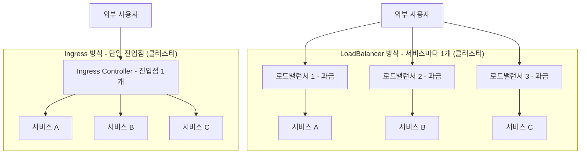
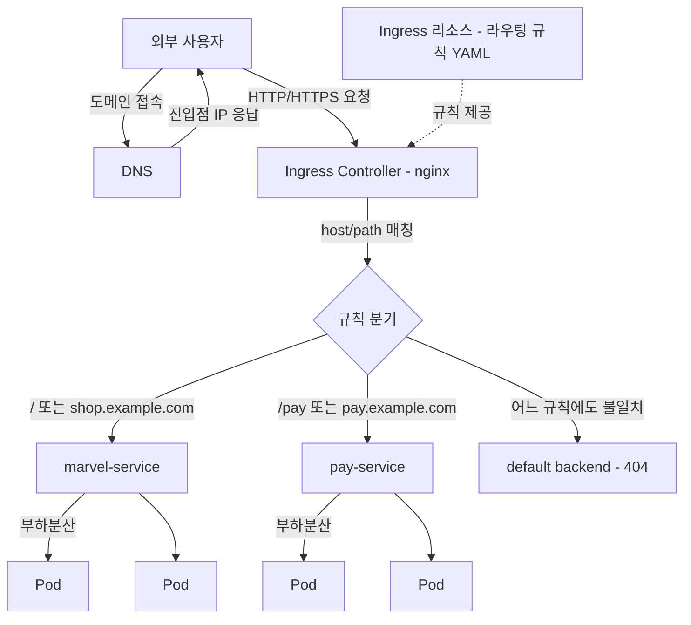

# Ingress로 외부 트래픽 라우팅하기 - L7 라우팅과 도메인 기반 접근

## 학습 목표
- NodePort/LoadBalancer의 한계와 Ingress가 필요한 이유를 이해한다
- Ingress Controller와 Ingress 리소스의 관계, 호스트·경로 기반 라우팅 규칙을 안다
- Ingress 매니페스트를 작성해 여러 서비스를 하나의 진입점으로 노출해본다

## 본문

### 왜 Ingress인가 — NodePort/LoadBalancer의 한계

쿠버네티스에서 Pod를 클러스터 밖으로 노출하는 가장 기본적인 방법은 Service의 타입을 바꾸는 것이다. 우리는 이미 세 가지를 알고 있다.

- **ClusterIP**: 클러스터 내부에서만 접근 가능한 가상 IP. 외부 노출은 불가능하다.
- **NodePort**: 모든 노드의 같은 포트(기본 30000~32767 범위)를 열어 외부 트래픽을 받는다.
- **LoadBalancer**: 클라우드 제공자에게 외부 로드밸런서(NLB 등)를 1개 프로비저닝하고 외부 IP를 부여받는다.

처음 한두 개 서비스를 띄울 때는 이걸로 충분하다. 그런데 실무로 들어가면 금세 벽에 부딪힌다.

**NodePort의 문제.** 사용자에게 `http://노드IP:31080` 같은 주소를 주는 건 현실적이지 않다. 포트 번호가 높고(30000번 이상), 사용자가 이를 기억할 수도 없다. DNS를 노드 IP로 연결하더라도 노드가 죽거나 교체되면 IP가 바뀌어 따라다니며 갱신해야 한다. 결국 앞단에 80/443 포트를 31080으로 넘겨주는 프록시 서버를 또 두게 된다.

**LoadBalancer의 문제.** 클라우드에서는 깔끔하지만, **서비스 1개당 로드밸런서 1개**가 원칙이다. 로드밸런서는 클라우드에서 과금되는 자원이라, 서비스가 10개면 로드밸런서 10개 → 비용 10배다. 게다가 새 서비스를 추가할 때마다 외부 IP가 또 생기고, "어느 URL은 어느 로드밸런서로" 같은 분기를 또 다른 프록시에서 처리해야 한다. SSL/TLS 인증서도 서비스마다 따로 붙이게 된다.

정리하면, 여러 서비스를 URL이나 도메인에 따라 한 진입점에서 나눠 보내고, TLS를 한곳에서 관리하고 싶은 욕구가 생긴다. 이걸 쿠버네티스 리소스로, 즉 다른 매니페스트들과 함께 YAML로 선언해서 관리하게 해주는 것이 바로 **Ingress**다. 아래 비교도처럼, LoadBalancer 방식은 서비스마다 로드밸런서가 늘어나지만 Ingress는 단일 진입점으로 모은다.



> Ingress는 클러스터에 내장된 L7(애플리케이션 계층, HTTP/HTTPS) 로드밸런서라고 생각하면 된다. NodePort/LoadBalancer가 L4(IP·포트) 수준이라면, Ingress는 "어떤 URL 경로/도메인이냐"까지 보고 라우팅한다.

### Ingress Controller와 Ingress 리소스는 다른 것이다

여기서 가장 많이 헷갈리는 지점을 분명히 짚자. Ingress는 **두 가지가 짝을 이뤄야** 동작한다.

1. **Ingress Controller (실제 일하는 엔진)**
   클러스터에서 실제로 트래픽을 받아 프록시하는 소프트웨어다. nginx, HAProxy, Traefik, 클라우드 제공자 컨트롤러 등 여러 구현체가 있다. 이 강의에서는 가장 널리 쓰이는 **ingress-nginx**를 기준으로 설명한다. 컨트롤러는 클러스터 안에서 하나의 Deployment + Service(보통 NodePort나 LoadBalancer)로 배포되며, API 서버를 감시(watch)하다가 새 Ingress 규칙이 생기면 그에 맞게 내부 nginx 설정을 자동으로 다시 쓴다.

2. **Ingress 리소스 (규칙 선언서)**
   "이런 호스트/경로로 들어오면 이 Service로 보내라"는 **규칙의 집합**이다. Pod·Deployment·Service처럼 YAML 매니페스트로 만든다. 그 자체로는 아무 일도 못 한다 — 규칙일 뿐이다.

> 가장 흔한 실수: 클러스터에는 Ingress Controller가 기본 탑재되어 있지 않다. 컨트롤러 없이 Ingress 리소스만 만들면 아무 일도 일어나지 않는다. minikube라면 `minikube addons enable ingress`, 그 외엔 ingress-nginx 매니페스트를 먼저 설치해야 한다.

둘의 관계와 트래픽 흐름은 다음과 같다. 외부 사용자가 도메인으로 접속하면 → DNS가 Ingress Controller의 외부 진입점(LoadBalancer IP 또는 노드:NodePort)을 가리키고 → 컨트롤러가 요청의 호스트/경로를 보고 → Ingress 리소스에 적힌 규칙대로 적절한 Service로 넘기고 → Service가 다시 Pod 중 하나로 부하분산한다. 즉 컨트롤러는 단 한 번만 외부에 노출하면 되고, 이후 모든 라우팅·TLS는 Ingress 리소스를 추가/수정하는 것으로 끝난다. 아래 구성도가 이 전체 경로를 보여준다.



### 라우팅 규칙: host 기반과 path 기반

Ingress 규칙은 두 축으로 구성된다.

- **host(도메인) 기반**: `shop.example.com`은 A 서비스로, `pay.example.com`은 B 서비스로. 서브도메인을 같은 Ingress Controller IP로 모두 DNS 연결해두면, 컨트롤러가 요청의 Host 헤더를 보고 분기한다.
- **path(경로) 기반**: `example.com/`은 메인 서비스로, `example.com/pay`는 결제 서비스로. 같은 도메인 안에서 URL 경로로 분기한다.

이 둘은 함께 쓸 수 있다. host 규칙 안에 여러 path를 둘 수 있다. 어느 규칙에도 맞지 않는 요청은 **default backend**(보통 404 페이지)로 떨어진다.

path 매칭 방식(`pathType`)도 알아두자. 현재 API에서는 명시가 필수이며 주로 두 가지를 쓴다.
- `Prefix`: 경로를 `/`로 끊은 **요소 단위 접두사 매칭**이다. `/pay`는 `/pay` 자체와 그 하위인 `/pay/card`, `/pay/history` 등을 모두 포함한다(단순 문자열 접두사가 아니라 경로 세그먼트 단위라 `/payment`는 `/pay`에 매칭되지 않는다). 실무에서 가장 많이 쓴다.
- `Exact`: 경로가 정확히 일치할 때만. `/pay`는 오직 `/pay`에만 매칭되고 `/pay/card`는 안 된다.

> 여러 path 규칙이 동시에 맞을 때는 **더 구체적인(긴) 경로가 우선**한다. 예컨대 `/`(메인)와 `/pay`(결제)가 함께 있을 때 `/pay/card` 요청은 `/`에도 `/pay`에도 걸리지만, 더 긴 `/pay`로 라우팅된다. 그래서 넓은 경로(`/`)와 좁은 경로(`/pay`)를 한 Ingress에 함께 두어도 의도대로 갈린다.

### 실습: 두 서비스를 하나의 진입점으로 노출하기

마블 쇼핑몰을 예로 든다. `/`로 들어오면 메인 페이지(`marvel-service`), `/pay`로 들어오면 결제 페이지(`pay-service`)로 보낸다. Deployment와 Service는 이미 있다고 가정하고(이전 강의에서 다룬 내용), Ingress 리소스에 집중한다.

```yaml
apiVersion: networking.k8s.io/v1
kind: Ingress
metadata:
  name: marvel-ingress
  annotations:
    # 매칭된 경로 전체를 / 로 바꿔 백엔드에 전달 — 하위 경로는 보존되지 않음(아래 설명 참고)
    nginx.ingress.kubernetes.io/rewrite-target: /
spec:
  ingressClassName: nginx          # 이 Ingress를 처리할 컨트롤러 지정
  rules:
    - http:
        paths:
          - path: /                 # 메인 페이지
            pathType: Prefix
            backend:
              service:
                name: marvel-service
                port:
                  number: 80
          - path: /pay              # 결제 페이지
            pathType: Prefix
            backend:
              service:
                name: pay-service
                port:
                  number: 80
```

#### rewrite-target은 정확히 무슨 일을 하나 (필수 이해)

위 매니페스트에서 `nginx.ingress.kubernetes.io/rewrite-target: /`는 "장식용 주석"이 아니라 **요청 경로를 백엔드로 넘기기 전에 다시 쓰는 핵심 동작**을 한다. 그런데 그 동작은 직관과 다르므로 정확히 짚어야 한다.

> 단순 `rewrite-target: /`는 **매칭된 경로 전체를 통째로 `/`로 바꿔** 백엔드에 전달한다. 즉 사용자가 `/pay`로 요청하든 `/pay/card`로 요청하든, `pay-service`가 받는 경로는 **둘 다 `/`**다. `/pay/card`라고 해서 백엔드에 `/card`로 전달되는 것이 **아니다** — 하위 경로 `card`는 그냥 사라진다.

왜 이런 재작성이 필요할까? 많은 백엔드 앱은 자신이 루트(`/`)에서 서비스된다고 가정하고 만들어진다. 그런데 Ingress에서 `/pay` 접두사를 붙여 노출하면, 재작성이 없을 경우 앱은 `/pay`라는 (자신이 모르는) 경로로 요청을 받아 404를 내기 쉽다. 단순 `rewrite-target: /`는 외부에 노출되는 접두사(`/pay`)를 떼고 앱이 기대하는 루트(`/`)로 맞춰 준다. 다만 그 대가로 `/pay` 아래의 하위 경로도 함께 날아간다는 점을 기억해야 한다.

#### 하위 경로를 보존하려면: 정규식 캡처 그룹

만약 `/pay/card` → 백엔드의 `/card`처럼 **접두사만 떼고 하위 경로는 살리고 싶다면**, 단순 `/`로는 불가능하고 **정규식 캡처 그룹**을 써야 한다. 경로를 정규식으로 적고(`pathType: ImplementationSpecific`), 캡처한 부분을 `rewrite-target`에서 `$번호`로 되살린다.

```yaml
metadata:
  annotations:
    # 캡처 그룹 2번($2)을 살려 하위 경로 보존
    nginx.ingress.kubernetes.io/rewrite-target: /$2
    nginx.ingress.kubernetes.io/use-regex: "true"
spec:
  ingressClassName: nginx
  rules:
    - http:
        paths:
          - path: /pay(/|$)(.*)     # ( /|$ )=1번, (.*)=2번 캡처
            pathType: ImplementationSpecific
            backend:
              service:
                name: pay-service
                port:
                  number: 80
```

이 패턴에서 `(.*)`가 두 번째 캡처 그룹이고, `rewrite-target: /$2`가 그 캡처 내용을 `/` 뒤에 붙인다. 결과는 다음과 같다.
- `/pay` → 백엔드 `/`
- `/pay/` → 백엔드 `/`
- `/pay/card` → 백엔드 `/card`
- `/pay/card/detail` → 백엔드 `/card/detail`

즉 **하위 경로를 보존하려면 단순 `/`가 아니라 캡처 그룹(`/$2`)이 필요하다**는 것이 핵심이다. 데모처럼 백엔드가 루트(`/`)에서만 응답하면 단순 `/`로 충분하지만, 앱이 `/card` 같은 하위 라우트를 가진다면 캡처 그룹 방식을 써야 한다.

반대로 **주의할 점**도 분명하다. 만약 `pay-service` 앱이 *스스로* `/pay` 경로를 기대하도록 만들어졌다면(즉 앱 라우트가 `/pay/...`로 정의돼 있다면), `rewrite-target: /`를 켜는 순간 경로가 `/`로 깎여 전달되므로 오히려 **404가 난다**. 이 경우에는 rewrite를 빼거나, 앱이 기대하는 경로에 맞게 재작성 규칙을 조정해야 한다. 정리하면 rewrite-target은 "외부 노출 경로와 앱 내부 경로가 다를 때 둘을 맞춰 주는 다리"이며, **켤지 말지·어떻게 쓸지는 백엔드 앱이 어떤 경로를 기대하는가에 달려 있다.**

(참고로 `/pay`처럼 접두사를 그대로 백엔드에 전달하고 싶다면 rewrite-target 주석을 아예 생략하면 된다. 그러면 `pay-service`는 `/pay`, `/pay/card` 등 원래 경로를 그대로 받는다.)

> 한 가지 덧붙이면, rewrite를 껐을 때 404가 난다고 무조건 rewrite만 의심하지는 말자. 실무의 많은 웹 프레임워크는 자산·링크 경로를 절대 경로 대신 **상대 경로**로 만들어 접두사 영향을 덜 받게 설계돼 있어, 접두사를 그대로 받아도 멀쩡히 동작하는 경우가 많다. 그래서 404의 진짜 원인은 rewrite 여부보다 **앱 자체의 라우팅(베이스 경로) 설계**, 즉 앱이 어떤 base path에서 라우트를 등록했는지인 경우가 잦다. rewrite와 앱의 base path 설정을 함께 점검하는 습관을 들이자.

> `rewrite-target`은 ingress-nginx의 레거시 어노테이션이라 버전·설정에 따라 동작이 미묘하게 달라져 온 역사가 있다. 그래서 하위 경로를 다루는 실무에서는 처음부터 **캡처 그룹(`path: /pay(/|$)(.*)` + `rewrite-target: /$2`) 패턴**을 표준으로 삼는 것이 단순 `/`보다 예측 가능하고 안전하다.

> API 버전 주의: 예전 자료에는 `apiVersion: extensions/v1beta1`로 되어 있는 경우가 많은데, 이는 폐기(deprecated)되어 제거되었다. 쿠버네티스 1.19부터 정식(GA)이 된 `networking.k8s.io/v1`을 사용해야 하며, `backend` 안에 `service.name`/`service.port.number`로 쓰는 구조가 v1 문법이다.

적용하고 확인한다.

```bash
kubectl apply -f marvel-ingress.yaml

kubectl get ingress
# NAME             CLASS   HOSTS   ADDRESS        PORTS   AGE
# marvel-ingress   nginx   *       192.168.0.10   80      10s

kubectl describe ingress marvel-ingress
# Rules 섹션에서 /  -> marvel-service:80,  /pay -> pay-service:80 확인
```

`ADDRESS`에 컨트롤러의 외부 IP가 채워졌다면, 그 주소의 `/`와 `/pay`로 접속해 서로 다른 페이지가 뜨는지 확인한다.

```bash
curl http://192.168.0.10/         # 메인 페이지
curl http://192.168.0.10/pay      # 결제 페이지 (단순 rewrite-target: / 면 백엔드엔 / 로 전달됨)
curl http://192.168.0.10/pay/card # 단순 / 면 백엔드엔 역시 / 로 전달(card 소실), 캡처 그룹 쓰면 /card
```

이제 도메인 기반으로 나누고 싶다면 `rules` 항목마다 `host`를 추가한다.

```yaml
spec:
  ingressClassName: nginx
  rules:
    - host: shop.example.com       # 이 도메인은 메인 서비스로
      http:
        paths:
          - path: /
            pathType: Prefix
            backend:
              service:
                name: marvel-service
                port:
                  number: 80
    - host: pay.example.com        # 이 도메인은 결제 서비스로
      http:
        paths:
          - path: /
            pathType: Prefix
            backend:
              service:
                name: pay-service
                port:
                  number: 80
```

두 도메인 모두 같은 Ingress Controller IP를 가리키도록 DNS(또는 로컬 테스트라면 `/etc/hosts`)를 설정하면, 컨트롤러가 Host 헤더로 분기한다. 정리하면 path 분기는 "규칙 1개에 path 여러 개", host 분기는 "host마다 규칙 1개"라는 차이다. 참고로 host 기반에서는 각 서비스가 `/`에서 받으므로 rewrite-target이 따로 필요 없는 경우가 많다.

### 실무에서 자주 쓰는 어노테이션

ingress-nginx는 어노테이션으로 라우팅 외의 동작을 미세 조정한다. 중급 운영에서 특히 자주 마주치는 두 가지를 짚는다.

**세션 어피니티(Sticky Session) — 같은 사용자를 같은 Pod로.** 기본적으로 Service는 요청을 여러 Pod에 고르게 부하분산한다. 그런데 로그인 세션을 각 Pod의 메모리에 들고 있는 앱(세션 정보를 외부 저장소로 빼지 못한 레거시 등)이라면, 매 요청이 다른 Pod로 가면 로그인이 풀린 것처럼 보인다. 이때 **쿠키 기반 세션 어피니티**를 켜면 컨트롤러가 사용자에게 쿠키를 발급하고, 같은 사용자의 후속 요청을 처음 붙은 Pod로 계속 보낸다.

```yaml
metadata:
  annotations:
    nginx.ingress.kubernetes.io/affinity: "cookie"
    nginx.ingress.kubernetes.io/affinity-mode: "persistent"
    nginx.ingress.kubernetes.io/session-cookie-name: "route"
```

> 세션 어피니티는 상태를 외부로 빼지 못한 레거시를 위한 **최후의 수단**일 뿐, 무상태(stateless)·수평 확장형 앱에는 오히려 안티패턴이다. 특정 Pod로 트래픽이 쏠려 부하분산이 한쪽으로 기울 수 있고, 그 Pod가 죽으면 세션도 끊긴다. 새로 설계하는 앱이라면 처음부터 세션을 Redis 같은 외부 저장소로 빼서 모든 Pod가 공유하게 만들고, 어피니티에 의존하지 않는 것이 정석이다.

**CORS — 다른 출처의 브라우저 요청 허용.** 프런트엔드가 `https://app.example.com`에 있고 API가 `https://api.example.com`에 있으면, 브라우저는 보안 정책(Same-Origin Policy)에 따라 이 교차 출처(cross-origin) 요청을 기본 차단한다. 백엔드 앱 코드를 고치지 않고 Ingress 레벨에서 CORS 응답 헤더를 붙여 허용하고 싶을 때 다음 어노테이션을 쓴다.

```yaml
metadata:
  annotations:
    nginx.ingress.kubernetes.io/enable-cors: "true"
    nginx.ingress.kubernetes.io/cors-allow-origin: "https://app.example.com"
    nginx.ingress.kubernetes.io/cors-allow-methods: "GET, POST, PUT, DELETE, OPTIONS"
```

`enable-cors: "true"`만 켜면 기본값으로 모든 출처(`*`)를 허용하므로, 운영에서는 `cors-allow-origin`으로 허용할 도메인을 명시해 범위를 좁히는 것이 안전하다.

### 주의사항과 실무 팁

- **컨트롤러 먼저, 리소스는 그다음.** Ingress가 동작하지 않으면 십중팔구 컨트롤러가 없거나 `ingressClassName`이 맞지 않는 경우다.
- **TLS는 한곳에서.** Ingress의 `spec.tls`에 인증서를 담은 Secret을 연결하면 HTTPS 종료(TLS termination)를 컨트롤러가 처리한다. 개발자가 앱마다 SSL을 구현할 필요가 없어진다.
- **`/pay/card`가 백엔드에 그대로 가지 않는다 — 단순 `/`는 하위 경로를 버린다.** `rewrite-target: /`은 매칭 경로 전체를 `/`로 바꾸므로 `/pay/card`도 백엔드엔 `/`로 간다. 하위 경로를 살리려면 `path: /pay(/|$)(.*)` + `rewrite-target: /$2` 캡처 그룹을 쓴다.
- **`/pay`인데 404가 난다면 — rewrite와 앱 라우팅을 함께 보라.** 백엔드 앱이 `/pay`를 기대하는데 404가 나면 rewrite가 경로를 깎은 게 원인일 수 있다. 다만 많은 프레임워크는 상대 경로를 써서 접두사 영향을 덜 받으므로, 404의 진짜 원인은 rewrite 여부보다 **앱이 어떤 베이스 경로에 라우트를 등록했는가**인 경우가 많다. rewrite만 의심하지 말고 앱의 base path 설정도 함께 확인하자. 또 annotation은 컨트롤러마다 키가 다르니(Traefik 등은 다른 키 사용) 쓰는 컨트롤러 문서를 확인한다.
- **Ingress는 HTTP/HTTPS 전용.** TCP/UDP나 gRPC 스트림 같은 비-HTTP 트래픽 라우팅은 Ingress의 범위를 벗어난다. 이런 요구가 커지면서 등장한 것이 Gateway API인데, 이는 다음 단계 학습 주제다.

## 핵심 요약
- NodePort는 높은 포트·노드 IP 의존, LoadBalancer는 서비스마다 별도 로드밸런서(비용) 문제가 있다. Ingress는 단일 진입점에서 L7 라우팅과 TLS를 통합 관리한다.
- Ingress는 **Controller(실제 트래픽을 처리하는 nginx 등 엔진)** 와 **Ingress 리소스(라우팅 규칙 YAML)** 의 짝으로 동작한다. 컨트롤러는 기본 탑재되지 않으므로 반드시 먼저 설치해야 한다.
- host 기반은 도메인으로, path 기반은 URL 경로로 분기하며 함께 쓸 수 있다. `Prefix`는 경로 세그먼트 단위 접두사 매칭이고, 여러 규칙이 맞으면 더 긴 경로가 우선한다. 어느 규칙에도 안 맞으면 default backend로 간다.
- 단순 `rewrite-target: /`은 매칭 경로 전체를 `/`로 바꿔 전달하므로 `/pay`든 `/pay/card`든 백엔드엔 모두 `/`로 간다(하위 경로 소실). 하위 경로를 보존하려면 `path: /pay(/|$)(.*)` + `rewrite-target: /$2` 캡처 그룹을 써야 `/pay/card`가 `/card`로 전달된다. 404가 나도 rewrite만 의심하지 말고 앱의 베이스 경로 설계까지 함께 점검한다.
- 실무에서는 어노테이션으로 동작을 확장한다. **세션 어피니티(`affinity: cookie`)**는 상태를 외부로 빼지 못한 레거시를 위한 최후의 수단이며, **CORS(`enable-cors: "true"`)**는 다른 출처의 브라우저 요청을 Ingress 레벨에서 허용한다.
- 매니페스트는 `networking.k8s.io/v1` 사용이 정답이며, `ingressClassName`·`pathType`·`service.port.number` 구조를 지켜야 한다.
