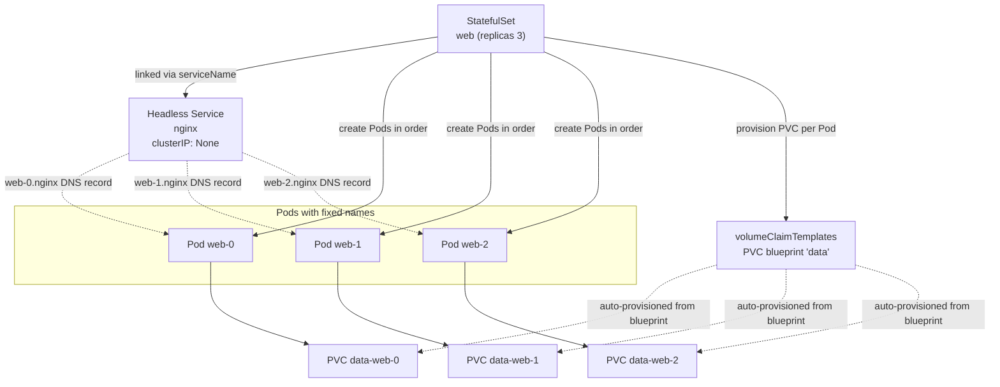

# StatefulSet and Stateful Workloads - Stable Identity and Ordered Operations

## Learning Objectives
- Understand the requirements of stateful workloads that a Deployment alone cannot satisfy
- Explain how a Headless Service assigns stable network identities to individual Pods and how ordered operations work
- Deploy a StatefulSet that uses `volumeClaimTemplates` to automatically provision a dedicated PVC per Pod

## Content

### Stateless vs. Stateful: What Is the Difference?

Throughout Kubernetes Intermediate Part 1, we ran applications primarily with **Deployments**. For workloads like web servers or APIs — where no individual Pod has a meaningful identity — a Deployment is nearly perfect. When a Pod dies, Kubernetes spins up an identical replacement, and the Service load-balances incoming requests across whichever Pods are alive. We never need to care which Pod handled a given request. This is called a **stateless** workload: one where there is no persistent data to worry about and a brief interruption causes no lasting harm.

The challenge arises with workloads that **continuously write data to disk** — databases, Kafka, Redis, and distributed storage systems. These **stateful** workloads give each Pod a distinct identity with its own data and role. If `mysql-0` is the write-capable primary and `mysql-1` is a read-only replica that syncs from it, these two Pods are not interchangeable. Yet a Deployment is built on exactly that assumption of interchangeability.

### What Happens When You Run a Database on a Deployment

Forcing a stateful workload onto a Deployment hits three walls in quick succession.

**1) Pod names change every time.** Deployment Pod names include a random hash — something like `myapp-7d9f8c-abcde` — and change entirely whenever the Pod is recreated. In a database cluster, replicas need to know the primary's address. An address that keeps changing makes cluster formation impossible.

**2) All replicas share a single volume.** This is a fundamental design limitation of Deployment. A Deployment is built to have **all replicas share the one PVC (storage claim) defined in the Pod template** — the concept of "different data per Pod" simply does not exist. Scale to two or more replicas and most default storage uses `ReadWriteOnce (RWO)`, which allows mounting on only one node at a time, so the second Pod stalls at creation. This RWO collision is just a **symptom**, not the root cause.

> A common misconception: "Can I just use `ReadWriteMany (RWX)` storage to run a database on a Deployment?" No. RWX removes the mount conflict, but then **all replicas write to the same disk simultaneously**, corrupting data. And a Deployment still provides no stable identity or startup ordering. Changing the access mode does not solve the underlying problem.

**3) You cannot control startup order.** A Deployment launches all replicas **at the same time**. But a database cluster requires the primary to be fully up before replicas can connect to it. Starting everything at once means replicas fail while searching for a primary that does not yet exist.

> The core point: stateful workloads require (1) stable names, (2) dedicated per-Pod storage, and (3) predictable startup and shutdown ordering. A Deployment guarantees none of these three. **StatefulSet** was introduced specifically to fill this gap.

### The Three Guarantees StatefulSet Provides

A StatefulSet is a controller that, like a Deployment, maintains a desired number of Pods — but it is designed to satisfy exactly the three requirements above.

**Stable identity.** StatefulSet Pods receive fixed names in the format `<name>-<ordinal>` rather than random hashes. With three replicas you get `web-0`, `web-1`, and `web-2`. If `web-1` dies and is recreated, it comes back as `web-1`. Even if rescheduled to a different node, it keeps the same name and the same volume. Each Pod gains a **permanent identity**.

**Dedicated per-Pod storage.** By defining a `volumeClaimTemplates` "PVC blueprint," StatefulSet automatically provisions a separate PVC for each Pod. `web-0` gets `data-web-0`, `web-1` gets `data-web-1`, and so on. When a Pod is recreated, it reattaches the volume matching its ordinal, preserving its data. This is the exact opposite of the single shared PVC that a Deployment uses.

**Ordered operations.** By default, a StatefulSet creates Pods **one at a time in ordinal order**. `web-1` is not created until `web-0` is fully Ready. Scale-down and deletion proceed in **reverse order** — highest ordinal first (`web-2` → `web-1` → `web-0`) — keeping the primary (ordinal 0) alive longest. As shown in the diagram below, creation and deletion are mirror images of each other.

```mermaid StatefulSet ordered operations: creation starts at 0, deletion in reverse
flowchart LR
    subgraph CREATE["Creation: one at a time, lowest ordinal first"]
        direction LR
        C0["web-0 created<br/>Wait for Ready"] --> C1["web-1 created<br/>Wait for Ready"] --> C2["web-2 created<br/>Wait for Ready"]
    end
    subgraph DELETE["Deletion / scale-down: highest ordinal first"]
        direction LR
        D2["web-2 terminated"] --> D1["web-1 terminated"] --> D0["web-0 terminated"]
    end
    CREATE -.->|"opposite direction"| DELETE
```

### Stable Network Identity and the Headless Service

The most important concept here is the **Headless Service**. A regular Service holds a single virtual IP (ClusterIP) and load-balances incoming requests across its backing Pods. That is ideal for stateless workloads, but fatal when writes must go to the primary only — a write request accidentally landing on a read-only replica breaks the system.

A Headless Service turns off that load balancing. Declaring `clusterIP: None` in the manifest means the Service receives no virtual IP; instead, DNS lookups return **individual DNS records for each Pod**. Each Pod then has a stable DNS address of the form:

```
<pod-name>.<service-name>.<namespace>.svc.cluster.local
e.g., web-0.nginx.default.svc.cluster.local
```

Even if `web-0` is rescheduled to a different node and its IP changes, this DNS name stays the same. A replica can therefore hardcode "the primary is at `mysql-0.mysql`" and connect directly. A Headless Service also creates SRV records in addition to A records (name → IP), letting some clients discover port information from DNS as well.

The diagram below shows how a StatefulSet, the Headless Service, Pods, and their dedicated PVCs all fit together.



### Hands-On Deployment

Now let's work through Learning Objective 3. Assume a practice cluster such as minikube is running, and a default StorageClass with dynamic provisioning is available (covered in Intermediate Part 1).

**Step 1: Create the Headless Service first.** Creating the Service before the StatefulSet is the standard approach, since this Service is responsible for each Pod's DNS records.

```yaml
# web-headless-svc.yaml
apiVersion: v1
kind: Service
metadata:
  name: nginx          # Becomes the middle segment of each Pod's DNS: web-0.nginx
spec:
  clusterIP: None      # This single line is what makes it Headless
  selector:
    app: nginx
  ports:
    - port: 80
      name: web
```

**Step 2: Define the StatefulSet.** The YAML looks similar to a Deployment, with two key differences: `serviceName` points to the Headless Service above, and `volumeClaimTemplates` at the bottom defines the per-Pod PVC blueprint.

```yaml
# web-statefulset.yaml
apiVersion: apps/v1
kind: StatefulSet
metadata:
  name: web
spec:
  serviceName: nginx          # Which Headless Service to use (for DNS)
  replicas: 3
  selector:
    matchLabels:
      app: nginx
  template:
    metadata:
      labels:
        app: nginx
    spec:
      containers:
        - name: nginx
          image: nginx:1.25
          ports:
            - containerPort: 80
              name: web
          volumeMounts:
            - name: data            # Must match the template name below
              mountPath: /usr/share/nginx/html
  volumeClaimTemplates:             # Blueprint that auto-provisions one PVC per Pod
    - metadata:
        name: data
      spec:
        accessModes: ["ReadWriteOnce"]
        resources:
          requests:
            storage: 1Gi
```

The key point is that `volumeClaimTemplates` is a **template (blueprint)**, not a `volumes` entry. Kubernetes reads this single blueprint and stamps out a separate PVC for each Pod it creates. Because every Pod owns its own PVC, the "single shared volume" problem that a Deployment would produce never arises.

**Step 3: Apply the manifests and watch Pods come up in order.**

```bash
kubectl apply -f web-headless-svc.yaml
kubectl apply -f web-statefulset.yaml

# The -w (watch) flag shows web-0 reaching Running before web-1 is created
kubectl get pods -l app=nginx -w
```

Confirm that Pod names are fixed as `web-0`, `web-1`, and `web-2`, appearing strictly in sequence.

**Step 4: Verify that dedicated PVCs were auto-provisioned.**

```bash
kubectl get pvc
# data-web-0   Bound   ...
# data-web-1   Bound   ...
# data-web-2   Bound   ...
```

PVC names follow the `<template-name>-<pod-name>` convention (`data-web-0`). Each Pod now has its own independent 1 Gi volume.

**Step 5: Verify stable identity and data persistence.** Write a marker file to `web-1` only, then delete the Pod. Use `kubectl wait` before reading the file — running the read command before the Pod is Ready again will fail.

```bash
kubectl exec web-1 -- sh -c 'echo "I am web-1" > /usr/share/nginx/html/id.txt'
kubectl delete pod web-1                          # Must come back as web-1
kubectl wait --for=condition=ready pod/web-1      # Wait until Ready (important)
kubectl exec web-1 -- cat /usr/share/nginx/html/id.txt   # Still "I am web-1"
```

The Pod name is still `web-1`, the same PVC (`data-web-1`) is reattached, and the file survives. This is the decisive difference from a Deployment.

### Operational Tips Worth Knowing

- **Parallel startup when ordering is not needed.** Bringing up 50 Pods one at a time can be very slow. If strict ordering is unnecessary, set `spec.podManagementPolicy: Parallel` to launch all Pods simultaneously.
- **PVCs are not automatically deleted.** Even when you delete a StatefulSet or scale it down, PVCs created by `volumeClaimTemplates` are retained for data protection. When cleaning up, **always back up and verify your data before manually running `kubectl delete pvc`.** Deleting a PVC permanently destroys the underlying volume and all its data, so add an extra verification step in production.
- **Useful even for stateless workloads.** When fixed, predictable instance names are needed — as in some distributed systems — a StatefulSet is a valid choice even if persistent storage is not involved.

## Key Takeaways
- Stateful workloads require stable names, dedicated per-Pod storage, and predictable startup/shutdown ordering — none of which a Deployment guarantees. In particular, a Deployment is designed so that **all replicas share a single PVC**, making per-Pod data impossible (the RWO conflict is just a symptom; switching to RWX does not solve the real problem). Use **StatefulSet** instead.
- StatefulSet Pods use the `<name>-<ordinal>` naming scheme (e.g., `web-0`) and retain the same name and volume across restarts and reschedules.
- A **Headless Service** (`clusterIP: None`) provides an individual DNS record per Pod (`web-0.nginx.<ns>.svc.cluster.local`) instead of load balancing, enabling direct connections to a specific Pod.
- Default behavior is **ordered**: creation goes from ordinal 0 upward one at a time; scale-down and deletion go from the highest ordinal downward. Set `podManagementPolicy: Parallel` when ordering is not required.
- `volumeClaimTemplates` auto-provisions one PVC per Pod following the `<template-name>-<pod-name>` naming convention (e.g., `data-web-0`). PVCs survive StatefulSet deletion for data protection and must be removed manually — only after backing up.

## Sources
- Anton Putra, "Kubernetes Deployment vs. StatefulSet vs. DaemonSet" — https://www.youtube.com/watch?v=30KAInyvY_o
- Raghav Dua, "Deploy a production Database in Kubernetes" — https://www.youtube.com/watch?v=UDXnyh0vtXw
- Google Cloud Tech, "What are stateful workloads?" — https://www.youtube.com/watch?v=yROFvZiV5cU
