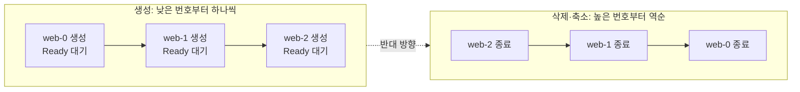
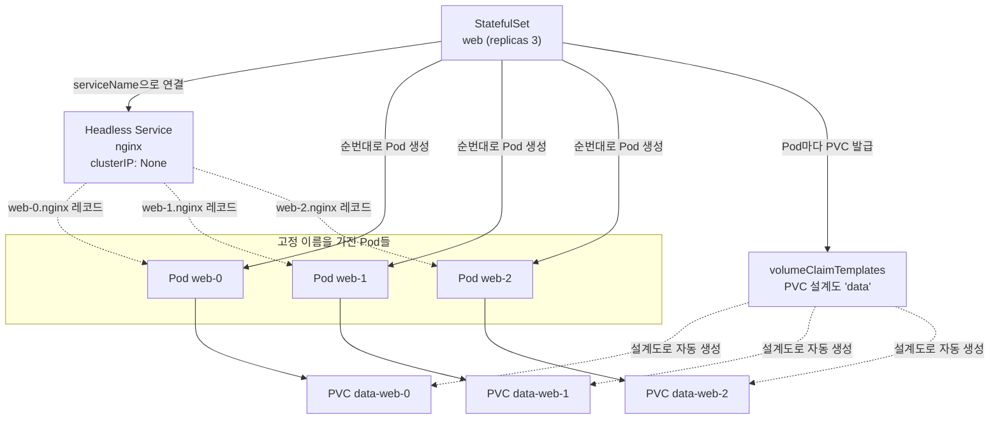

# StatefulSet과 상태있는 워크로드 - 안정적 ID와 순서 보장

## 학습 목표
- Deployment로는 부족한 상태있는(stateful) 워크로드의 요구사항을 이해한다
- Headless Service로 각 Pod에 안정적인 네트워크 ID가 부여되는 원리와 순서 보장(Ordered) 동작을 설명한다
- volumeClaimTemplates로 Pod마다 전용 PVC를 자동 생성하는 StatefulSet을 배포해본다

## 본문

### Stateless와 Stateful, 무엇이 다른가

중급1까지 우리는 주로 **Deployment**로 애플리케이션을 굴려 왔다. 웹 서버나 API처럼 특정 Pod에 정체성이 없는 워크로드라면 Deployment는 거의 완벽하다. Pod 하나가 죽으면 쿠버네티스가 똑같은 Pod를 새로 띄우고, Service가 들어오는 요청을 살아있는 Pod 중 아무 곳에나 분배한다. 우리는 "어느 Pod가 처리했는지" 신경 쓸 필요가 없다. 이런 워크로드를 **stateless(상태 없는)** 워크로드라고 부른다. 저장할 데이터가 없거나, 잠깐 끊겨도 별 탈이 없는 종류다.

문제는 데이터베이스, Kafka, Redis, 분산 스토리지처럼 **데이터를 디스크에 계속 쌓는 워크로드**다. 이런 **stateful(상태 있는)** 워크로드는 Pod 하나하나가 "자기만의 데이터와 역할"을 가진다. `mysql-0`은 쓰기를 담당하는 마스터고, `mysql-1`은 그 데이터를 복제받는 읽기 전용이라면, 이 둘은 결코 교체 가능한 부품이 아니다. 그런데 Deployment는 정확히 그 "교체 가능성"을 전제로 설계되어 있다.

### Deployment로 데이터베이스를 돌리면 벌어지는 일

stateful 워크로드를 Deployment로 억지로 돌려 보면, 다음 세 가지 벽에 차례로 부딪힌다.

**1) 이름이 매번 바뀐다.** Deployment가 만드는 Pod 이름은 `myapp-7d9f8c-abcde`처럼 무작위 해시가 붙는다. Pod가 재생성되면 이름도 통째로 바뀐다. 그런데 데이터베이스 클러스터에서는 "복제본은 마스터 주소를 알아야 한다." 주소가 매번 바뀌면 클러스터 구성 자체가 불가능하다.

**2) 모든 복제본이 단 하나의 볼륨을 공유한다.** 이것이 Deployment의 근본적인 설계 한계다. Deployment는 Pod 템플릿에 정의된 **하나의 PVC(스토리지 요청)를 모든 복제본이 똑같이 공유**하도록 만들어졌다. 즉 "Pod마다 다른 데이터"라는 개념 자체가 없다. 복제본을 2개 이상으로 늘리면, 대부분의 기본 스토리지가 `ReadWriteOnce(RWO, 한 노드에만 마운트 가능)` 모드여서 두 번째 Pod가 같은 볼륨을 못 잡고 생성 단계에서 멈춘다. 다만 이 RWO 충돌은 어디까지나 설계 한계가 드러나는 **증상**일 뿐 근본 원인이 아니다.

> 흔한 오해: "그럼 `ReadWriteMany(RWX, 여러 노드 동시 마운트)` 스토리지를 쓰면 Deployment로 DB를 돌려도 되겠네?" 아니다. 그러면 충돌은 안 나지만 **모든 복제본이 하나의 디스크에 동시에 쓰면서** 데이터가 깨진다. 게다가 Deployment에는 여전히 안정적 ID와 시작 순서 보장이 없다. 스토리지 접근 모드를 바꾼다고 해결될 문제가 아니라는 뜻이다.

**3) 시작 순서를 통제할 수 없다.** Deployment는 복제본을 **동시에** 띄운다. 하지만 DB 클러스터는 "마스터가 먼저 떠야 복제본이 그 마스터를 보고 붙는다"는 순서가 있다. 동시에 띄우면 복제본이 아직 없는 마스터를 찾다가 실패한다.

> 핵심: stateful 워크로드는 (1) 안정적인 이름, (2) Pod별 전용 스토리지, (3) 예측 가능한 시작·종료 순서, 이 세 가지를 요구한다. Deployment는 셋 다 보장하지 않는다. 바로 이 틈을 메우려고 나온 컨트롤러가 **StatefulSet**이다.

### StatefulSet이 주는 세 가지 보장

StatefulSet은 Deployment처럼 "Pod 여러 개를 원하는 개수만큼 유지"하는 컨트롤러지만, 위 세 요구사항을 정확히 충족하도록 설계되었다.

**안정적인 식별자(stable identity).** StatefulSet의 Pod는 무작위 이름이 아니라 `이름-순번` 형식의 고정 이름을 갖는다. 복제본이 3개면 `web-0`, `web-1`, `web-2`다. `web-1`이 죽었다 살아나도 다시 `web-1`이다. 다른 노드로 재배치되어도 같은 이름과 같은 볼륨을 그대로 들고 간다. 즉 Pod에 **영구적인 정체성**이 생긴다.

**Pod별 전용 스토리지.** `volumeClaimTemplates`라는 "PVC 설계도"를 정의하면, StatefulSet이 Pod마다 별도의 PVC를 자동으로 찍어낸다. `web-0`은 `data-web-0`, `web-1`은 `data-web-1`을 갖는 식이다. Pod가 재생성되어도 자기 번호에 해당하는 볼륨을 다시 붙이므로 데이터가 보존된다. (Deployment가 모든 복제본에 하나의 PVC를 공유하던 것과 정확히 반대다.)

**순서 보장(ordered).** 기본 동작에서 StatefulSet은 Pod를 **순번대로 하나씩** 생성한다. `web-0`이 완전히 Ready 상태가 된 뒤에야 `web-1`을 만든다. 삭제·축소는 반대로 **높은 번호부터** 역순으로 진행한다(`web-2` → `web-1` → `web-0`). 마스터(0번)를 마지막까지 살려두려는 자연스러운 동작이다. 아래 흐름도처럼 생성과 삭제가 정확히 거울처럼 반대 방향으로 진행된다.



### 안정적인 네트워크 ID와 Headless Service

여기서 가장 중요한 개념이 **Headless Service(헤드리스 서비스)**다. 보통의 Service는 자기 앞으로 하나의 가상 IP(ClusterIP)를 갖고, 요청이 오면 뒤에 있는 Pod 중 하나로 **로드밸런싱**해 넘긴다. stateless라면 이게 정답이지만, "마스터에게만 쓰기를 보내야 하는" 상황에서는 치명적이다. 쓰기 요청이 엉뚱하게 읽기 복제본으로 가면 안 되기 때문이다.

Headless Service는 이 로드밸런싱을 끈다. 매니페스트에서 `clusterIP: None`으로 선언하면 가상 IP를 받지 않고, DNS 조회 시 **개별 Pod 각각의 DNS 레코드**를 돌려준다. 그 결과 각 Pod는 다음과 같은 고정 DNS 주소를 얻는다.

```
<Pod이름>.<서비스이름>.<네임스페이스>.svc.cluster.local
예) web-0.nginx.default.svc.cluster.local
```

`web-0`이 다른 노드로 옮겨가 IP가 바뀌어도 이 DNS 이름은 변하지 않는다. 그래서 복제본은 "마스터는 `mysql-0.mysql`이다"라고 코드에 박아두고 직접 연결할 수 있다. 참고로 Headless Service는 각 Pod의 A 레코드(이름→IP)뿐 아니라 SRV 레코드까지 만들어 주어, 일부 클라이언트가 포트 정보까지 DNS로 찾을 수 있게 한다.

StatefulSet과 Headless Service, Pod, 전용 PVC가 어떻게 맞물리는지 전체 구조는 아래 구성도와 같다.



### 직접 배포해보기

이제 학습 목표 3번을 실습한다. minikube 같은 실습 클러스터가 떠 있고, 동적 프로비저닝(PVC 요청 시 볼륨이 자동 생성됨)이 가능한 기본 StorageClass가 있다고 가정한다(중급1에서 다룬 내용).

**1) 먼저 Headless Service를 만든다.** StatefulSet보다 Service를 먼저 두는 것이 정석이다. 각 Pod의 DNS 레코드를 이 Service가 책임지기 때문이다.

```yaml
# web-headless-svc.yaml
apiVersion: v1
kind: Service
metadata:
  name: nginx          # Pod DNS의 가운데 부분이 된다: web-0.nginx
spec:
  clusterIP: None      # 이 한 줄이 Headless로 만드는 핵심
  selector:
    app: nginx
  ports:
    - port: 80
      name: web
```

**2) StatefulSet을 정의한다.** Deployment YAML과 거의 같지만 두 가지가 다르다. `serviceName`으로 위 Headless Service를 가리키고, 맨 아래에 `volumeClaimTemplates`로 Pod별 PVC 설계도를 둔다.

```yaml
# web-statefulset.yaml
apiVersion: apps/v1
kind: StatefulSet
metadata:
  name: web
spec:
  serviceName: nginx          # 어떤 Headless Service를 쓸지 (DNS 연결)
  replicas: 3
  selector:
    matchLabels:
      app: nginx
  template:
    metadata:
      labels:
        app: nginx
    spec:
      containers:
        - name: nginx
          image: nginx:1.25
          ports:
            - containerPort: 80
              name: web
          volumeMounts:
            - name: data            # 아래 템플릿의 이름과 일치해야 함
              mountPath: /usr/share/nginx/html
  volumeClaimTemplates:             # Pod마다 PVC를 자동 생성하는 '설계도'
    - metadata:
        name: data
      spec:
        accessModes: ["ReadWriteOnce"]
        resources:
          requests:
            storage: 1Gi
```

`volumeClaimTemplates`는 `volumes`가 아니라 **템플릿(설계도)**이라는 점이 핵심이다. 쿠버네티스는 이 한 장의 설계도를 보고 Pod마다 PVC를 따로 찍어낸다. 여기서 각 Pod가 자기 전용 PVC를 갖기 때문에, Deployment에서 문제가 됐던 "단일 볼륨 공유"가 원천적으로 일어나지 않는다.

**3) 적용하고 순서대로 떠오르는 모습을 관찰한다.**

```bash
kubectl apply -f web-headless-svc.yaml
kubectl apply -f web-statefulset.yaml

# -w(watch)로 지켜보면 web-0이 Running이 된 뒤에야 web-1이 생기는 순서를 볼 수 있다
kubectl get pods -l app=nginx -w
```

이름이 `web-0`, `web-1`, `web-2`로 고정되어 순서대로 뜨는 것을 확인한다.

**4) Pod별 전용 PVC가 자동 생성되었는지 확인한다.**

```bash
kubectl get pvc
# data-web-0   Bound   ...
# data-web-1   Bound   ...
# data-web-2   Bound   ...
```

PVC 이름이 `<템플릿이름>-<Pod이름>` 규칙(`data-web-0`)으로 만들어진 것을 볼 수 있다. Pod마다 독립된 1Gi 볼륨을 갖게 된 것이다.

**5) 안정적 식별자와 데이터 보존을 검증한다.** `web-1`에만 표시 파일을 남긴 뒤 Pod를 삭제해 보자. 단, 삭제 직후 Pod가 다시 `Ready` 상태가 되기 전에 다음 명령을 실행하면 실패하므로, `kubectl wait`로 재기동을 기다린 뒤 확인하는 것이 안전하다.

```bash
kubectl exec web-1 -- sh -c 'echo "I am web-1" > /usr/share/nginx/html/id.txt'
kubectl delete pod web-1                          # 재생성되면서 다시 web-1로 떠야 한다
kubectl wait --for=condition=ready pod/web-1      # 재기동·Ready 될 때까지 대기(중요)
kubectl exec web-1 -- cat /usr/share/nginx/html/id.txt   # 여전히 "I am web-1"
```

이름도 그대로 `web-1`이고, 같은 PVC(`data-web-1`)가 다시 붙으면서 파일이 남아 있는 것을 확인할 수 있다. 이것이 Deployment와 결정적으로 다른 지점이다.

### 알아두면 좋은 운영 포인트

- **순서가 필요 없으면 병렬로.** 50개 Pod를 하나씩 순서대로 띄우면 너무 느릴 수 있다. 순서 보장이 불필요하면 `spec.podManagementPolicy: Parallel`로 두어 동시에 띄울 수 있다.
- **PVC는 자동으로 지워지지 않는다.** StatefulSet을 삭제하거나 복제본을 줄여도 `volumeClaimTemplates`로 만들어진 PVC는 데이터 보호를 위해 남는다. 정리할 때는 곧장 `kubectl delete pvc`부터 치지 말고, **반드시 데이터를 백업·확인한 뒤 수동으로** 삭제한다. PVC를 지우면 그에 묶인 볼륨과 데이터가 영구히 사라지므로, 운영 클러스터에서는 무엇을 지우는지 한 번 더 검증하는 절차를 둔다.
- **stateless에도 쓸 수 있다.** 데이터 저장이 목적이 아니더라도, "각 인스턴스에 고정된 이름이 필요한" 경우(일부 분산 시스템)에는 StatefulSet을 쓰기도 한다.

## 핵심 요약
- stateful 워크로드는 안정적인 이름, Pod별 전용 스토리지, 예측 가능한 시작·종료 순서를 요구하는데 Deployment는 셋 다 보장하지 못한다. 특히 Deployment는 **모든 복제본이 단 하나의 PVC를 공유**하도록 설계되어 있어 Pod별 데이터를 다룰 수 없다(RWO 충돌은 증상일 뿐, RWX로 바꿔도 해결되지 않는다). 이를 위해 **StatefulSet**을 쓴다.
- StatefulSet의 Pod는 `이름-순번`(예: `web-0`)으로 고정되며, 재생성·재배치되어도 같은 이름과 같은 볼륨을 유지한다.
- **Headless Service**(`clusterIP: None`)는 로드밸런싱 대신 Pod별 DNS 레코드(`web-0.nginx.<ns>.svc.cluster.local`)를 제공해 특정 Pod를 직접 가리키게 한다.
- 기본 동작은 **순서 보장**: 생성은 0번부터 하나씩, 축소·삭제는 높은 번호부터 역순. 순서가 불필요하면 `podManagementPolicy: Parallel`.
- `volumeClaimTemplates`는 Pod마다 PVC를 자동 생성(`data-web-0` 규칙)하며, StatefulSet 삭제 후에도 PVC는 데이터 보호를 위해 남는다. 정리할 때는 백업 후 수동 삭제가 원칙이다.

## 출처
- Anton Putra, "Kubernetes Deployment vs. StatefulSet vs. DaemonSet" — https://www.youtube.com/watch?v=30KAInyvY_o
- Raghav Dua, "Deploy a production Database in Kubernetes" — https://www.youtube.com/watch?v=UDXnyh0vtXw
- Google Cloud Tech, "What are stateful workloads?" — https://www.youtube.com/watch?v=yROFvZiV5cU
