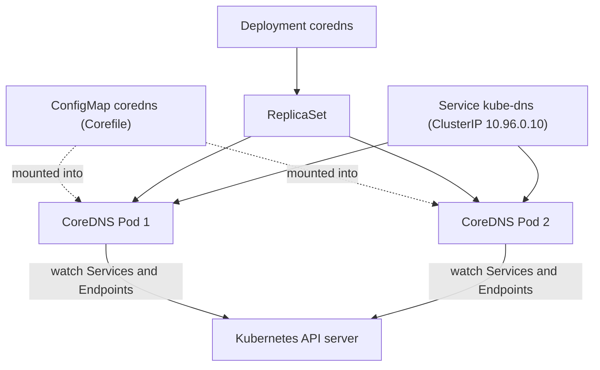
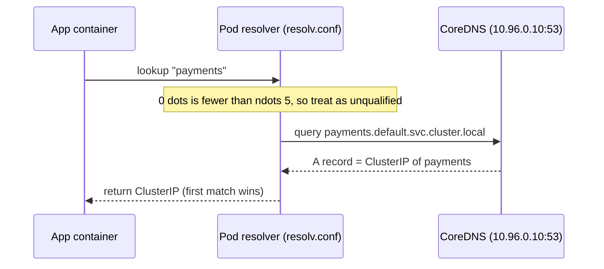

# Kubernetes DNS and Service Discovery

## Learning Objectives
- Explain how CoreDNS acts as the cluster's DNS server, and how kubelet wires up each Pod's `/etc/resolv.conf`.
- Distinguish the DNS naming rules for Services (`service.namespace.svc.cluster.local`), Pods, and headless Services, including their A and SRV records.
- Understand `dnsPolicy` (ClusterFirst, Default, and friends) and how the `search` domains and `ndots` setting drive name resolution.
- Verify service discovery yourself from inside a Pod using `nslookup` and `dig`.

## Body

### Why DNS exists in Kubernetes

A real cluster runs hundreds or thousands of objects, each with its own IP address. Worse, Pods are *ephemeral* (short-lived): when a Pod dies, its Deployment replaces it with a brand-new Pod that has a brand-new IP. If your application code hard-coded a Pod IP, it would break the moment that Pod restarted.

DNS solves this by giving you a **stable name** instead of a moving IP. You create a Service, Kubernetes assigns it one durable virtual IP (the ClusterIP), and behind the scenes that name keeps pointing at whatever healthy Pods currently back it. Your code talks to `payments` and never worries about the IPs churning underneath. This is what "service discovery" means in Kubernetes: finding a service by name, automatically.

> Treat IPs as disposable and names as stable. In Kubernetes you address Services by name; the IPs are an implementation detail that the platform manages for you.

### CoreDNS: the cluster's DNS server

DNS is a built-in, automatically launched add-on, so you do not install it yourself. Before Kubernetes 1.11 this role was filled by kube-dns; from 1.11 onward it is **CoreDNS**, an open-source DNS server written in Go and designed for cloud-native environments.

CoreDNS runs as an ordinary **Deployment** in the `kube-system` namespace (which creates a ReplicaSet, which in turn runs the CoreDNS Pods, typically 2 replicas for availability). It is fronted by a Service — named `kube-dns` for backward compatibility — that holds a fixed ClusterIP, commonly `10.96.0.10`. CoreDNS watches the Kubernetes API for Service and Endpoint changes and keeps its DNS records up to date in real time, so a new Service is resolvable almost immediately. The diagram below shows how these objects fit together.



You can see all of this directly:

```bash
# The DNS Service and its stable ClusterIP
kubectl -n kube-system get svc kube-dns

# The CoreDNS Pods doing the actual work
kubectl -n kube-system get pods -l k8s-app=kube-dns -o wide

# The Endpoints behind the Service, listening on port 53 (standard DNS port)
kubectl -n kube-system get endpoints kube-dns
```

CoreDNS is configured through a ConfigMap named `coredns`, whose key entry is the **Corefile**. Storing the config as a ConfigMap matters: if a CoreDNS Pod is recreated, the ReplicaSet re-attaches the same ConfigMap, so the configuration is never lost. A typical Corefile looks like this:

```bash
kubectl -n kube-system get configmap coredns -o yaml
```

```
.:53 {
    errors
    health { lameduck 5s }
    ready
    kubernetes cluster.local in-addr.arpa ip6.arpa {
        fallthrough in-addr.arpa ip6.arpa
    }
    prometheus :9153
    forward . /etc/resolv.conf
    cache 30
    loop
    reload
    loadbalance
}
```

A few plugins are worth knowing by name. **`kubernetes`** is what synthesizes records for the `cluster.local` zone. **`forward . /etc/resolv.conf`** sends anything *not* in the cluster (like `google.com`) up to the node's own upstream resolver. **`cache 30`** caches answers for a 30-second TTL. **`health`** exposes a check on port 8080 — `curl <coredns-pod-ip>:8080/health` returning `OK` confirms DNS is healthy.

### How kubelet wires up each Pod

When a Pod starts, **kubelet** writes its `/etc/resolv.conf` so that every container resolves names through CoreDNS by default. Look inside any Pod and you'll see something like this:

```
nameserver 10.96.0.10
search default.svc.cluster.local svc.cluster.local cluster.local
options ndots:5
```

Three lines, three jobs:
- **`nameserver`** is the CoreDNS ClusterIP — every lookup goes here first.
- **`search`** is the list of suffixes the resolver appends to short names (more on this below).
- **`options ndots:5`** controls *when* those suffixes get tried.

This is the mechanism that lets your container say `nslookup payments` instead of memorizing an IP.

### The DNS naming rules

This is the part to commit to memory, because the format must be exact.

A **Service** gets an A record in the form:

```
<service-name>.<namespace>.svc.cluster.local
```

So a Service named `front-end-svc` in namespace `core` is `front-end-svc.core.svc.cluster.local`, resolving to the Service's ClusterIP. From inside the same namespace you can shorten it to just `front-end-svc`; from another namespace, `front-end-svc.core` is enough.

A **Pod** gets an A record too, but the rule is different and easy to trip over — the Pod's IP becomes part of the name, with dots replaced by hyphens:

```
<pod-ip-with-dashes>.<namespace>.pod.cluster.local
```

A Pod at `10.244.1.5` in `default` is `10-244-1-5.default.pod.cluster.local`. Note the zone is `pod`, not `svc`. Because the IP is baked into the name, you cannot look a Pod up by an arbitrary friendly name through this record — you already need to know its IP. This is why, in practice, you address workloads through Services, not through Pod A records.

> The single most common DNS mistake: using the `svc` zone for a Pod, or expecting a Pod's name to resolve like a Service's. Services use `<name>.<ns>.svc.cluster.local`; Pod A records use `<ip-with-dashes>.<ns>.pod.cluster.local`.

### Headless Services: A records per Pod, plus SRV

A normal Service hides its Pods behind one virtual ClusterIP. Sometimes you want the *opposite* — you want DNS to hand back the individual Pod IPs directly. That is a **headless Service**: you set `clusterIP: None`, and Kubernetes gives it no virtual IP.

```yaml
apiVersion: v1
kind: Service
metadata:
  name: db
  namespace: default
spec:
  clusterIP: None        # <-- this makes it headless
  selector:
    app: db
  ports:
    - name: pg
      port: 5432
```

Now `db.default.svc.cluster.local` does not return one ClusterIP; it returns an **A record for every ready backing Pod**. The client gets the full set of Pod IPs and decides what to do with them. This is exactly what StatefulSets rely on, where each replica needs its own stable identity rather than being load-balanced anonymously.

Headless Services also expose **SRV records**, which carry the port and target alongside the name — useful when a client needs to discover *which port* a named service endpoint lives on, not just its address. The SRV query form is `_<port-name>._<protocol>.<service>.<namespace>.svc.cluster.local`, for example `_pg._tcp.db.default.svc.cluster.local`.

### `dnsPolicy`: who fills in resolv.conf

A Pod's `dnsPolicy` field decides how its `/etc/resolv.conf` gets built:

- **`ClusterFirst`** — the default. Cluster-internal names go to CoreDNS; everything else is forwarded upstream. This is what you want almost always.
- **`Default`** — the Pod inherits the *node's* resolv.conf and does **not** use CoreDNS. Cluster names won't resolve. Useful for special infrastructure Pods.
- **`ClusterFirstWithHostNet`** — the variant you need when a Pod runs with `hostNetwork: true`; without it, a host-network Pod would silently fall back to the node resolver and lose cluster DNS.
- **`None`** — you supply everything yourself via the `dnsConfig` field (custom nameservers, searches, options).

```yaml
spec:
  dnsPolicy: ClusterFirst   # the default; shown here for clarity
```

### `search` domains and the `ndots:5` rule

The `search` line and `ndots:5` together explain a behavior that surprises a lot of people.

When you query a **short** name like `payments`, the resolver counts the dots in it. If the name has **fewer than `ndots` (5) dots**, the resolver treats it as *unqualified* and tries each `search` suffix in turn before giving up:

```
payments.default.svc.cluster.local   (try 1)
payments.svc.cluster.local           (try 2)
payments.cluster.local               (try 3)
```

The first one that resolves wins. This is convenient — `payments` "just works" inside the namespace — but it has a cost: an *external* lookup like `api.github.com` has only 2 dots, so it is also treated as unqualified and fans out across all the search domains first (each failing) before the resolver finally queries it as-is. That is several wasted round-trips per external call. The sequence below traces a short-name lookup all the way to a CoreDNS answer.



You avoid the fan-out by writing a **fully qualified domain name (FQDN)** with a trailing dot, e.g. `api.github.com.` — the trailing dot tells the resolver "this is already complete, do not append anything." For latency-sensitive workloads making many external calls, FQDNs (or a tuned `dnsConfig` with a lower `ndots`) are a real optimization.

> When the cluster "feels down," nine times out of ten it is DNS, and the culprit is often `ndots:5` quietly multiplying every external lookup into five or six queries. Check `/etc/resolv.conf` before you blame the Service.

### Verifying it yourself with nslookup and dig

The whole point of this lecture is that you can prove all of it from inside a Pod. Spin up a throwaway Pod with the right tools:

```bash
kubectl run dnsutils --rm -it --restart=Never \
  --image=registry.k8s.io/e2e-test-images/agnhost:2.39 -- /bin/sh
```

(If your Pod's base image lacks the tools, install them: `apt-get update && apt-get install -y dnsutils iputils-ping`.)

Inside the Pod, walk through the checks:

```bash
# 1. Look at how kubelet configured this Pod
cat /etc/resolv.conf

# 2. Resolve a Service by short name (search domains do the work)
nslookup kubernetes
#  -> Server:  10.96.0.10
#     Address: 10.96.0.1   (the kubernetes Service ClusterIP)

# 3. Resolve a Service by its FQDN
nslookup kubernetes.default.svc.cluster.local

# 4. Resolve a Service in another namespace
nslookup kube-dns.kube-system.svc.cluster.local

# 5. For a headless Service, see one A record per backing Pod
dig +short db.default.svc.cluster.local

# 6. Ask for the SRV record (name + port) on a headless Service
dig +short SRV _pg._tcp.db.default.svc.cluster.local

# 7. Reverse lookup: IP back to name (PTR record)
dig -x 10.96.0.1 +short
```

When `nslookup kubernetes` returns the ClusterIP of the `kubernetes` Service, service discovery is working end-to-end: kubelet configured resolv.conf, the search domains expanded your short name, CoreDNS answered from the `cluster.local` zone, and the answer came back. This same resolution works from **any** Pod in **any** namespace — DNS in Kubernetes is cluster-wide, not per-Pod.

### A debugging story worth remembering

One classic outage: `nslookup` fails from Pods on worker nodes but works elsewhere. The resolv.conf looks perfect — correct nameserver, correct search domains — yet nothing resolves. The real cause is that **both CoreDNS replicas happened to be scheduled on the control-plane node**, so worker Pods had no reachable DNS server. The fix is to spread CoreDNS across nodes (anti-affinity or more replicas), not to touch resolv.conf at all. The lesson: when DNS breaks, confirm *where CoreDNS is actually running and whether it is reachable* before you start editing config.

## Key Takeaways
- CoreDNS is the cluster's built-in DNS server: a Deployment in `kube-system`, fronted by the `kube-dns` Service (ClusterIP usually `10.96.0.10`), configured by the `coredns` ConfigMap's Corefile, watching the API to keep records fresh.
- kubelet writes each Pod's `/etc/resolv.conf` — nameserver (CoreDNS), `search` suffixes, and `options ndots:5` — which is what makes short-name service discovery work.
- Services resolve as `<service>.<namespace>.svc.cluster.local`; Pod A records are `<ip-with-dashes>.<namespace>.pod.cluster.local`. The zones (`svc` vs `pod`) and formats are different and must be exact.
- A **headless** Service (`clusterIP: None`) returns an A record per backing Pod instead of one virtual IP, plus SRV records for port discovery — the backbone of StatefulSet identity.
- `dnsPolicy` (default `ClusterFirst`) decides how resolv.conf is built; `ClusterFirstWithHostNet` is required for `hostNetwork` Pods.
- `ndots:5` plus `search` domains let short names resolve but make external lookups fan out — use FQDNs with a trailing dot to avoid the cost.
- Verify everything live with `nslookup` and `dig` from inside a Pod; when the cluster "feels down," check DNS and resolv.conf first.
