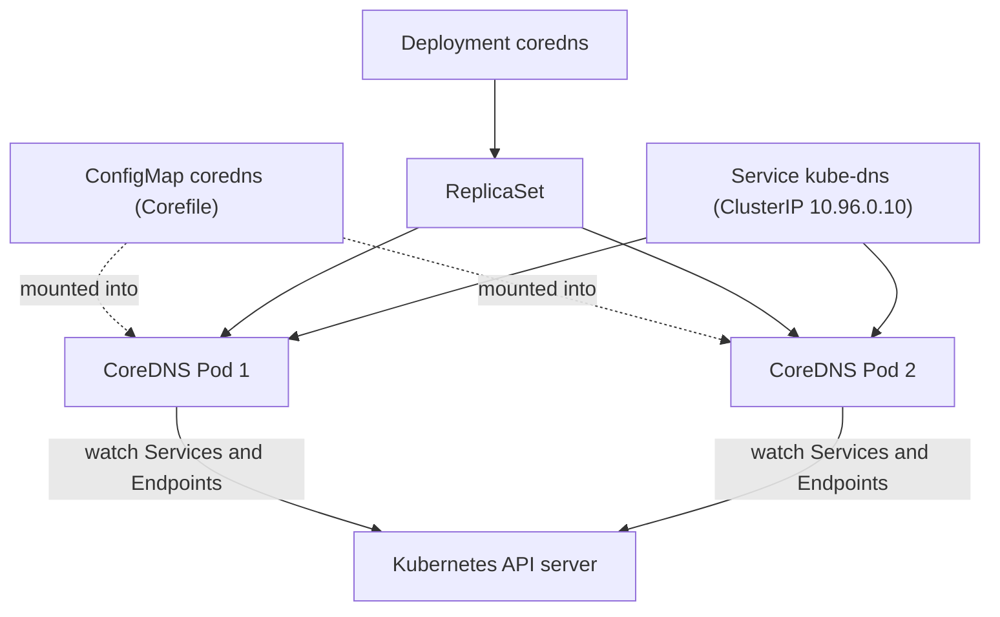
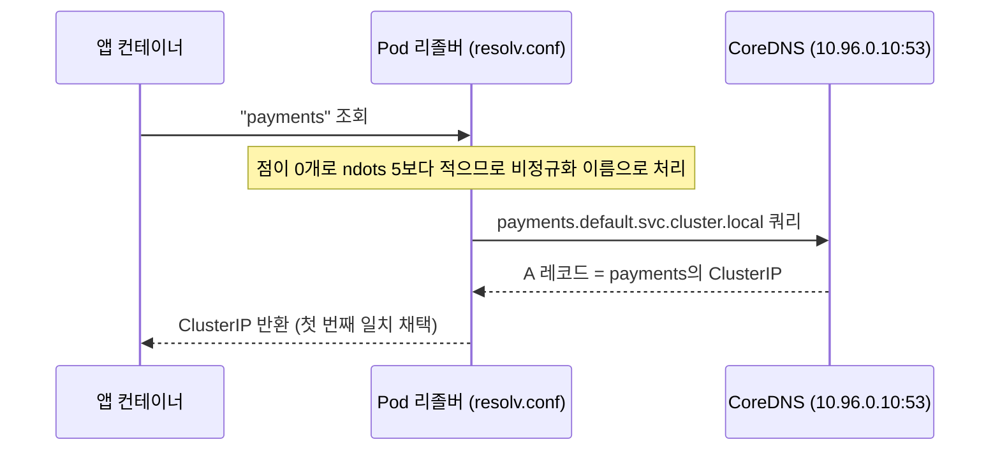

# Kubernetes DNS와 서비스 디스커버리

## 학습 목표
- CoreDNS가 클러스터 DNS 서버로 동작하는 방식과, kubelet이 각 Pod의 `/etc/resolv.conf`를 구성하는 원리를 설명할 수 있다.
- Service(`service.namespace.svc.cluster.local`), Pod, headless Service의 DNS 이름 규칙과 A 레코드·SRV 레코드의 차이를 구분할 수 있다.
- `dnsPolicy`(ClusterFirst, Default 등)와 `search` 도메인, `ndots` 설정이 이름 해석에 미치는 영향을 이해한다.
- Pod 내부에서 `nslookup`과 `dig`로 서비스 디스커버리를 직접 검증할 수 있다.

## 본문

### Kubernetes에 DNS가 필요한 이유

실제 클러스터에는 수백, 수천 개의 객체가 저마다 고유한 IP 주소를 갖고 실행된다. 더 큰 문제는 Pod가 *일시적(ephemeral)*이라는 점이다. Pod가 죽으면 Deployment가 완전히 새로운 IP를 가진 새 Pod를 만들어 대체한다. 애플리케이션 코드에 Pod IP를 직접 박아 넣었다면 Pod가 재시작되는 순간 동작이 깨진다.

DNS는 이 문제를 **안정적인 이름**으로 해결한다. Service를 만들면 Kubernetes가 지속적인 가상 IP(ClusterIP)를 하나 부여하고, 그 이름은 현재 서비스를 뒷받침하는 정상 Pod를 항상 가리킨다. 코드는 `payments`라는 이름으로 통신하면 되고, 그 아래에서 IP가 교체되는 것은 신경 쓸 필요가 없다. 이것이 Kubernetes에서 말하는 "서비스 디스커버리"다. 이름으로 서비스를 찾는 과정이 자동으로 이뤄진다.

> IP는 바뀌는 것으로, 이름은 고정된 것으로 다뤄야 한다. Kubernetes에서는 Service를 이름으로 지정하고, IP는 플랫폼이 알아서 관리하는 구현 세부사항이다.

### CoreDNS: 클러스터 DNS 서버

DNS는 별도 설치 없이 자동으로 기동되는 내장 애드온이다. Kubernetes 1.11 이전에는 kube-dns가 이 역할을 담당했지만, 1.11부터는 Go로 작성된 클라우드 네이티브 오픈소스 DNS 서버인 **CoreDNS**가 그 자리를 맡고 있다.

CoreDNS는 `kube-system` 네임스페이스에 일반 **Deployment**로 실행된다(이 Deployment가 ReplicaSet을 만들고, ReplicaSet이 보통 가용성을 위해 2개의 CoreDNS Pod를 구동한다). 앞단에는 하위 호환성을 위해 `kube-dns`라는 이름의 Service가 있으며, 고정 ClusterIP(보통 `10.96.0.10`)를 갖는다. CoreDNS는 Kubernetes API를 감시해 Service와 Endpoint 변경 사항을 실시간으로 DNS 레코드에 반영하므로, 새 Service를 만들면 거의 즉시 조회가 가능하다. 아래 다이어그램은 이 구성 요소들이 어떻게 연결되는지 보여준다.



다음 명령으로 직접 확인할 수 있다.

```bash
# DNS Service와 고정 ClusterIP 확인
kubectl -n kube-system get svc kube-dns

# 실제 동작 중인 CoreDNS Pod 확인
kubectl -n kube-system get pods -l k8s-app=kube-dns -o wide

# Service 뒤의 Endpoint 확인 (표준 DNS 포트 53번으로 수신 대기)
kubectl -n kube-system get endpoints kube-dns
```

CoreDNS는 `coredns`라는 ConfigMap으로 설정을 관리하며, 핵심 설정 파일은 **Corefile**이다. 설정을 ConfigMap으로 저장하는 이유는 CoreDNS Pod가 재생성되더라도 ReplicaSet이 동일한 ConfigMap을 다시 연결해 설정이 유실되지 않기 때문이다. 일반적인 Corefile은 다음과 같다.

```bash
kubectl -n kube-system get configmap coredns -o yaml
```

```
.:53 {
    errors
    health { lameduck 5s }
    ready
    kubernetes cluster.local in-addr.arpa ip6.arpa {
        fallthrough in-addr.arpa ip6.arpa
    }
    prometheus :9153
    forward . /etc/resolv.conf
    cache 30
    loop
    reload
    loadbalance
}
```

주요 플러그인을 알아두자. **`kubernetes`**는 `cluster.local` 존의 레코드를 생성하는 역할을 한다. **`forward . /etc/resolv.conf`**는 클러스터 내부가 아닌 이름(예: `google.com`)을 노드의 업스트림 리졸버로 전달한다. **`cache 30`**은 응답을 30초 TTL로 캐싱한다. **`health`**는 8080 포트에 헬스 체크 엔드포인트를 노출하는데, `curl <coredns-pod-ip>:8080/health`가 `OK`를 반환하면 DNS가 정상 동작 중이다.

### kubelet이 각 Pod를 연결하는 방법

Pod가 시작될 때 **kubelet**이 `/etc/resolv.conf`를 작성해 모든 컨테이너가 기본적으로 CoreDNS를 통해 이름을 해석하도록 설정한다. 어떤 Pod에서든 내부를 들여다보면 다음과 같은 내용을 볼 수 있다.

```
nameserver 10.96.0.10
search default.svc.cluster.local svc.cluster.local cluster.local
options ndots:5
```

세 줄, 세 가지 역할이다.
- **`nameserver`**는 CoreDNS ClusterIP다. 모든 조회 요청이 이곳으로 먼저 간다.
- **`search`**는 짧은 이름에 리졸버가 덧붙이는 접미사 목록이다(아래에서 자세히 다룬다).
- **`options ndots:5`**는 이 접미사를 언제 적용할지를 제어한다.

이 설정 덕분에 컨테이너 안에서 IP를 외울 필요 없이 `nslookup payments`처럼 짧은 이름으로 조회할 수 있다.

### DNS 이름 규칙

이 내용은 정확한 형식이 중요하므로 꼭 기억해 두자.

**Service**는 다음 형식의 A 레코드를 갖는다.

```
<service-name>.<namespace>.svc.cluster.local
```

예를 들어 `core` 네임스페이스에 있는 `front-end-svc` Service는 `front-end-svc.core.svc.cluster.local`로 조회되며, Service의 ClusterIP로 해석된다. 같은 네임스페이스 안에서는 `front-end-svc`만으로도 충분하고, 다른 네임스페이스에서는 `front-end-svc.core`까지만 써도 된다.

**Pod**도 A 레코드를 갖지만 규칙이 달라서 혼동하기 쉽다. Pod IP의 점(`.`)을 하이픈(`-`)으로 바꿔 이름의 일부로 사용한다.

```
<pod-ip-with-dashes>.<namespace>.pod.cluster.local
```

`default` 네임스페이스에서 `10.244.1.5` IP를 가진 Pod는 `10-244-1-5.default.pod.cluster.local`이다. 존 이름이 `svc`가 아닌 `pod`임에 주의하자. IP가 이름에 포함되어 있으므로, 이미 IP를 알고 있어야만 조회할 수 있다. 이런 이유로 실제로는 Pod A 레코드가 아닌 Service를 통해 워크로드에 접근한다.

> 가장 흔한 DNS 실수: Pod에 `svc` 존을 사용하거나, Pod 이름이 Service처럼 조회될 것이라 기대하는 것이다. Service는 `<name>.<ns>.svc.cluster.local`, Pod A 레코드는 `<ip-with-dashes>.<ns>.pod.cluster.local`이다.

### Headless Service: Pod별 A 레코드와 SRV 레코드

일반 Service는 Pod를 하나의 가상 ClusterIP 뒤에 숨긴다. 반대로 DNS가 개별 Pod IP를 직접 반환하길 원할 때도 있다. 그것이 **headless Service**다. `clusterIP: None`을 설정하면 Kubernetes는 가상 IP를 부여하지 않는다.

```yaml
apiVersion: v1
kind: Service
metadata:
  name: db
  namespace: default
spec:
  clusterIP: None        # <-- headless로 만드는 설정
  selector:
    app: db
  ports:
    - name: pg
      port: 5432
```

이렇게 하면 `db.default.svc.cluster.local`은 ClusterIP 하나를 반환하는 것이 아니라, **정상 상태(ready)인 모든 백엔드 Pod에 대한 A 레코드**를 반환한다. 클라이언트는 Pod IP 전체 목록을 받아 직접 처리 방식을 결정한다. StatefulSet이 바로 이 방식에 의존한다. 각 레플리카가 익명으로 로드밸런싱되는 것이 아니라 고유한 안정적 ID를 가져야 하기 때문이다.

headless Service는 **SRV 레코드**도 제공한다. SRV 레코드에는 이름뿐 아니라 포트와 타겟 정보도 담겨 있어, 클라이언트가 주소뿐 아니라 *포트*까지 함께 알아야 할 때 유용하다. SRV 조회 형식은 `_<port-name>._<protocol>.<service>.<namespace>.svc.cluster.local`이며, 예를 들면 `_pg._tcp.db.default.svc.cluster.local`이다.

### `dnsPolicy`: resolv.conf를 어떻게 채울 것인가

Pod의 `dnsPolicy` 필드는 `/etc/resolv.conf`의 구성 방식을 결정한다.

- **`ClusterFirst`** — 기본값. 클러스터 내부 이름은 CoreDNS로, 그 외는 업스트림으로 전달한다. 거의 항상 이것을 쓰면 된다.
- **`Default`** — Pod가 *노드*의 resolv.conf를 그대로 물려받으며, CoreDNS를 사용하지 **않는다**. 클러스터 이름이 해석되지 않는다. 특수한 인프라 Pod에 쓰인다.
- **`ClusterFirstWithHostNet`** — `hostNetwork: true`로 실행되는 Pod에 필요한 옵션이다. 이 설정 없이는 호스트 네트워크 Pod가 노드 리졸버로 자동으로 폴백되어 클러스터 DNS를 잃게 된다.
- **`None`** — `dnsConfig` 필드로 nameserver, search, options를 직접 지정한다.

```yaml
spec:
  dnsPolicy: ClusterFirst   # 기본값; 명시적으로 표시
```

### `search` 도메인과 `ndots:5` 규칙

`search` 줄과 `ndots:5`의 조합은 처음 보면 뜻밖의 동작을 일으킨다.

`payments`처럼 **짧은** 이름을 조회하면 리졸버가 이름의 점 개수를 센다. **`ndots`(5)보다 점이 적으면** 해당 이름을 *비정규화된(unqualified)* 이름으로 보고, `search` 접미사를 하나씩 붙여가며 순서대로 시도한다.

```
payments.default.svc.cluster.local   (1차 시도)
payments.svc.cluster.local           (2차 시도)
payments.cluster.local               (3차 시도)
```

가장 먼저 해석되는 것이 채택된다. 네임스페이스 안에서 `payments`가 "그냥 동작"하는 편리함이 있지만, 대가도 따른다. `api.github.com` 같은 *외부* 조회는 점이 2개뿐이라 비정규화 이름으로 처리되어 search 도메인을 모두 시도한 뒤(전부 실패) 마지막에야 원래 이름을 조회한다. 외부 호출마다 DNS 왕복이 여러 번 낭비되는 셈이다. 아래 다이어그램은 Pod 내부에서 짧은 이름을 조회할 때 CoreDNS 응답까지 이르는 전 과정을 보여준다.



fan-out을 피하려면 **완전한 도메인 이름(FQDN)**에 마침표(`.`)를 붙여 쓰면 된다. 예: `api.github.com.` — 마지막 점은 리졸버에게 "이미 완전한 이름이니 아무것도 덧붙이지 말라"는 신호다. 외부 호출이 많고 지연 시간에 민감한 워크로드라면 FQDN 사용(또는 `dnsConfig`로 `ndots`를 낮추는 것)이 실질적인 최적화가 된다.

> 클러스터가 "다운된 것 같을 때" 열 번 중 아홉 번은 DNS 문제이고, 범인은 대개 `ndots:5`가 외부 조회를 조용히 5~6개의 쿼리로 불려 보내는 것이다. Service를 탓하기 전에 `/etc/resolv.conf`부터 확인하자.

### nslookup과 dig로 직접 검증하기

이 강의의 핵심은 Pod 내부에서 직접 모든 것을 증명할 수 있다는 점이다. 필요한 도구가 포함된 임시 Pod를 실행해 보자.

```bash
kubectl run dnsutils --rm -it --restart=Never \
  --image=registry.k8s.io/e2e-test-images/agnhost:2.39 -- /bin/sh
```

(기본 이미지에 도구가 없다면 직접 설치한다: `apt-get update && apt-get install -y dnsutils iputils-ping`)

Pod 안에서 순서대로 확인해 보자.

```bash
# 1. kubelet이 이 Pod를 어떻게 설정했는지 확인
cat /etc/resolv.conf

# 2. 짧은 이름으로 Service 조회 (search 도메인이 처리)
nslookup kubernetes
#  -> Server:  10.96.0.10
#     Address: 10.96.0.1   (kubernetes Service의 ClusterIP)

# 3. FQDN으로 Service 조회
nslookup kubernetes.default.svc.cluster.local

# 4. 다른 네임스페이스의 Service 조회
nslookup kube-dns.kube-system.svc.cluster.local

# 5. headless Service의 경우 백엔드 Pod마다 A 레코드 하나씩 확인
dig +short db.default.svc.cluster.local

# 6. headless Service의 SRV 레코드 조회 (이름 + 포트)
dig +short SRV _pg._tcp.db.default.svc.cluster.local

# 7. 역방향 조회: IP → 이름 (PTR 레코드)
dig -x 10.96.0.1 +short
```

`nslookup kubernetes`가 `kubernetes` Service의 ClusterIP를 반환하면 서비스 디스커버리가 엔드투엔드로 동작하는 것이다. kubelet이 resolv.conf를 구성하고, search 도메인이 짧은 이름을 확장하고, CoreDNS가 `cluster.local` 존에서 응답하고, 결과가 돌아왔다. 이 해석은 **어떤** 네임스페이스의 **어떤** Pod에서든 동일하게 동작한다. Kubernetes의 DNS는 Pod별이 아닌 클러스터 전체를 대상으로 한다.

### 기억해 둘 만한 장애 사례

한 가지 전형적인 장애 사례가 있다. 워커 노드의 Pod에서는 `nslookup`이 실패하는데 다른 곳에서는 잘 된다. resolv.conf는 완벽해 보인다. nameserver도 맞고 search 도메인도 맞는데 아무것도 해석되지 않는다. 실제 원인은 **CoreDNS 레플리카 두 개가 우연히 모두 컨트롤플레인 노드에 스케줄링**된 것이어서, 워커 Pod가 접근할 수 있는 DNS 서버가 없었던 것이다. 해결책은 resolv.conf를 건드리는 것이 아니라 CoreDNS를 여러 노드에 분산하는 것(anti-affinity 설정 또는 레플리카 수 증가)이다. 교훈: DNS가 깨지면 설정을 수정하기 전에 먼저 *CoreDNS가 실제로 어디서 실행 중인지, 접근 가능한지*부터 확인하라.

## 핵심 정리
- CoreDNS는 클러스터 내장 DNS 서버다. `kube-system`에 Deployment로 실행되고, `kube-dns` Service(ClusterIP 보통 `10.96.0.10`)가 앞단에 있으며, `coredns` ConfigMap의 Corefile로 설정되고, API를 감시해 레코드를 최신 상태로 유지한다.
- kubelet은 각 Pod의 `/etc/resolv.conf`에 nameserver(CoreDNS), `search` 접미사, `options ndots:5`를 기록한다. 이것이 짧은 이름으로 서비스 디스커버리가 가능한 이유다.
- Service는 `<service>.<namespace>.svc.cluster.local`로 해석되고, Pod A 레코드는 `<ip-with-dashes>.<namespace>.pod.cluster.local`이다. 존 이름(`svc` vs `pod`)과 형식이 다르며, 정확히 맞아야 한다.
- **headless** Service(`clusterIP: None`)는 가상 IP 하나가 아닌 백엔드 Pod마다 A 레코드 하나씩을 반환하며, 포트 디스커버리를 위한 SRV 레코드도 제공한다. StatefulSet 고유 식별자의 핵심이다.
- `dnsPolicy`(기본값 `ClusterFirst`)가 resolv.conf 구성 방식을 결정하고, `hostNetwork` Pod에는 `ClusterFirstWithHostNet`이 필요하다.
- `ndots:5`와 `search` 도메인 덕분에 짧은 이름이 동작하지만, 외부 조회가 fan-out되는 부작용이 있다. 마침표를 붙인 FQDN으로 비용을 피할 수 있다.
- `nslookup`과 `dig`로 Pod 내부에서 직접 검증하라. 클러스터가 "다운된 것 같을 때"는 DNS와 resolv.conf부터 확인하는 것이 순서다.
