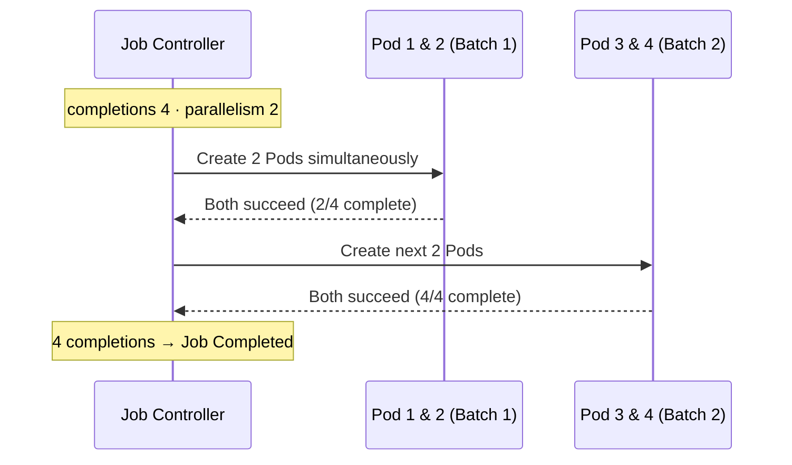
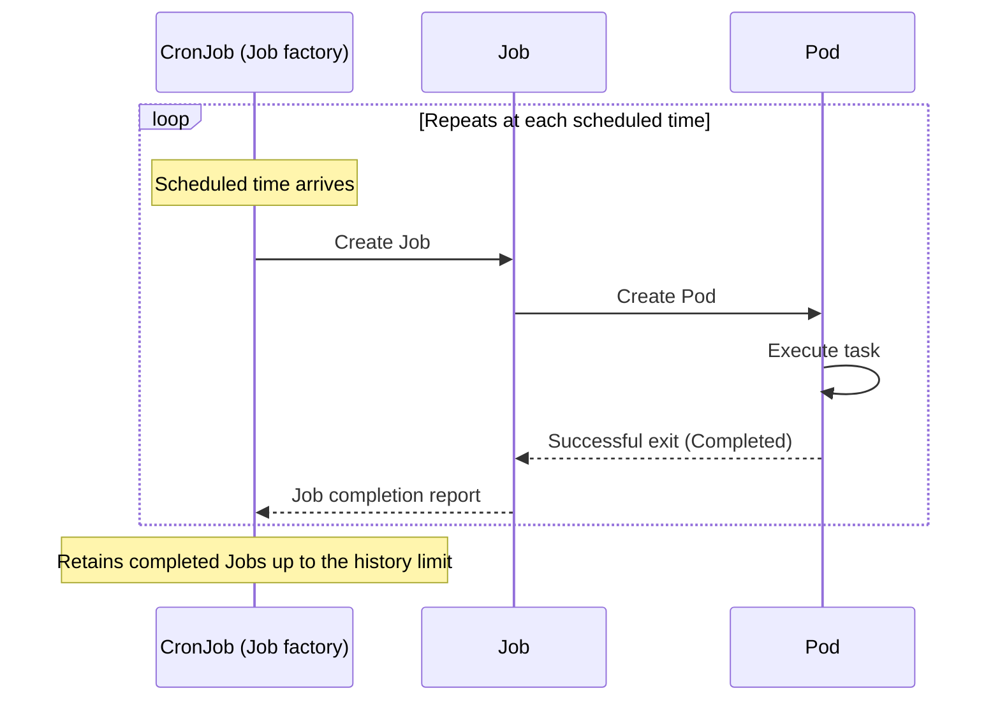
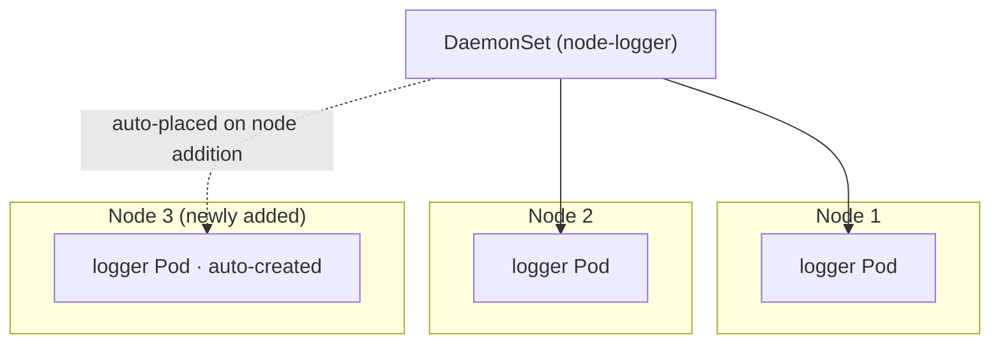
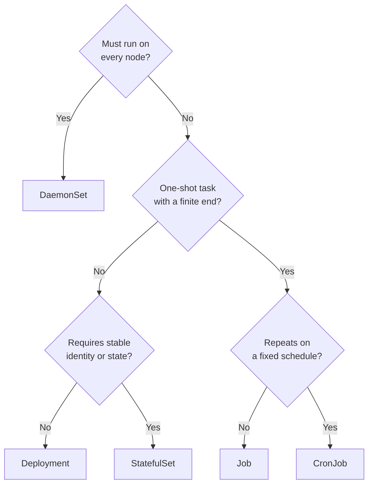

# Job, CronJob, and DaemonSet - Batch, Scheduled, and Node-level Workloads

## Learning Objectives
- Understand how Job and CronJob work, and distinguish between a one-shot run and a scheduled recurring run
- Configure the key fields: `completions`, `parallelism`, `backoffLimit`, and `schedule`
- Understand what DaemonSet is for — placing exactly one Pod per node — and deploy all three controllers hands-on

## Content

### When Deployment Alone Is Not Enough

The Deployment we have learned so far handles workloads that **must stay running continuously** — long-lived processes like web servers that wait for requests indefinitely. A Deployment's Pods must never exit on their own; the controller immediately recreates them if they do.

In practice, however, there are jobs with a fundamentally different character:

- **Run once and finish** — data migrations, batch report generation, video encoding. The Pod should disappear when the work is done.
- **Repeat on a fixed schedule** — daily database backups at 3 AM, hourly log cleanup, weekly aggregation jobs.
- **Run exactly one instance on every node** — log-scraping agents, metrics collectors, and network plugins that must be present on every machine.

Trying to simulate these patterns with a Deployment is awkward. A batch job's Pod keeps restarting after it finishes; adding nodes requires manually adjusting the replica count for node-level workloads. Kubernetes ships dedicated controllers for exactly these patterns: **Job, CronJob, and DaemonSet**. Their roles divide up as follows:

| Controller | Execution model | When finished | Typical use cases |
|------------|-----------------|---------------|-------------------|
| **Job** | Runs once; completes on success | Pod stays in `Completed` state | Batch jobs, migrations |
| **CronJob** | Creates Jobs repeatedly on a cron schedule | Each Job completes individually | Backups, log cleanup, periodic aggregation |
| **DaemonSet** | Exactly 1 Pod per node | Maintained as long as the node is alive | Log/metrics agents, CNI plugins |

### Job — A Workload That Guarantees Completion

A Job is the controller responsible for **running Pods until they have succeeded a specified number of times**. Where a Deployment's Pods target "staying alive (Running)," a Job's Pods target "successfully terminating (Succeeded)." That single difference drives all of its behavior.

Consider the simplest possible Job manifest — a one-shot task that computes pi to 2,000 decimal places:

```yaml
# simple-job.yaml
apiVersion: batch/v1        # Job/CronJob belong to the batch API group, not core
kind: Job
metadata:
  name: pi-job
spec:
  template:                 # everything here is identical to a Pod spec
    spec:
      containers:
        - name: pi
          image: perl:5.34
          command: ["perl", "-Mbignum=bpi", "-wle", "print bpi(2000)"]
      restartPolicy: Never  # Job Pods only accept Never or OnFailure
```

```bash
kubectl apply -f simple-job.yaml
kubectl get jobs            # COMPLETIONS goes from 0/1 to 1/1 on success
kubectl get pods            # completed Pod stays in Completed state
kubectl logs job/pi-job     # inspect the output (computed value of pi)
```

Here is the point where beginners most often get stuck:

> A Job's Pod **must** set `restartPolicy` to either `Never` or `OnFailure`. The Deployment default of `Always` means "restart even after a clean exit" — directly contradicting a Job's purpose of running once and finishing — and the API server rejects it.

It is important to understand precisely what `restartPolicy` controls: **whether to restart the container inside a Pod**. The two values behave differently:

- **`OnFailure`** — if the container exits with a non-zero code, **restart only that container** within the same Pod. The Pod itself remains.
- **`Never`** — do not restart the container on failure. The Pod is left in `Failed` state.

So who retries the work when `restartPolicy: Never`? The **Job controller** does. When a `Never` Pod fails, the Job controller creates a **new Pod** to try again (failed Pods accumulate, and `backoffLimit` described below caps how many attempts are allowed). This means "new Pod creation" under `Never` is not a direct effect of `restartPolicy` — it is a separate action by the Job controller to reach the target completion count. Even with `OnFailure`, if a node goes down and the Pod itself is lost, the Job controller creates a new Pod to make up the shortfall. In short, container-level restarts (`restartPolicy`) and Pod-level recreation (Job controller) are distinct mechanisms operating at different layers.

#### completions and parallelism — How Many Times, How Many at Once

When you need to run the same task multiple times (for example, processing four partitions independently) or want to finish faster by running multiple workers in parallel, use these two fields:

- **`completions`** — how many times Pods must succeed before the Job is considered complete.
- **`parallelism`** — how many Pods to run simultaneously toward that goal.

Think of `completions` as "the number of packages to deliver" and `parallelism` as "the number of couriers on the floor." More couriers (higher parallelism) means the same amount of work finishes faster.

```yaml
spec:
  completions: 4    # Job is done when 4 Pods have succeeded
  parallelism: 2    # run 2 Pods at a time -> first 2 finish, then the next 2
  template:
    spec:
      containers:
        - name: worker
          image: busybox
          command: ["sh", "-c", "echo processing; sleep 5"]
      restartPolicy: Never
```

With this configuration, 2 Pods run concurrently and finish, followed by another 2, for a total of 4 completions — at which point the Job becomes `Completed`. Running `kubectl get pods -w` lets you watch them progress in batches of two in real time. The diagram below shows how a `completions: 4`, `parallelism: 2` configuration processes work in two sequential batches.



#### backoffLimit — How Many Failures to Tolerate

When a task fails, the Job retries using an exponential back-off strategy (increasing the delay between attempts). **`backoffLimit`** sets the ceiling: "if it still fails after this many retries, mark the Job as Failed" (default: 6). Without this safeguard, a broken task retries indefinitely and drains cluster resources.

```yaml
spec:
  backoffLimit: 4              # Job is marked Failed after 4 retries
  activeDeadlineSeconds: 300   # (optional) force-terminate if it runs longer than 300 s
```

> Production tip: make it a habit to always set both `backoffLimit` (to cap retries) and `activeDeadlineSeconds` (to terminate runaway tasks). Using them together keeps failure modes well-bounded.

#### When Workers Need to Communicate — Indexed Jobs

For distributed computation workloads (e.g., MPI) where workers need to identify and communicate with each other, set `completionMode: Indexed`. Each Pod receives a fixed index from 0 to N-1, embedded in its hostname. Paired with a Headless Service (introduced in Lecture 1 of this course), workers can find each other reliably by DNS name. For now, it is enough to know that "Jobs can also cover batch workloads that require inter-worker communication."

### CronJob — A Factory That Produces Jobs on Schedule

CronJob's design is surprisingly straightforward. **A CronJob does no work itself. It is simply a "Job factory" that creates a new Job at each scheduled time.** That is why understanding Job first was essential. The full execution chain looks like this: CronJob monitors the schedule → scheduled time arrives → creates a Job → Job creates a Pod → Pod runs the task and exits.

The sequence diagram below shows the delegation chain — CronJob hands off to Job, which then hands off to Pod.



```yaml
# backup-cronjob.yaml
apiVersion: batch/v1
kind: CronJob
metadata:
  name: db-backup
spec:
  schedule: "0 3 * * *"        # every day at 03:00 (cron expression)
  jobTemplate:                 # this section is identical to the Job spec above
    spec:
      template:
        spec:
          containers:
            - name: backup
              image: busybox
              command: ["sh", "-c", "echo running backup $(date)"]
          restartPolicy: OnFailure
```

Note that everything under `jobTemplate` is exactly the same Job spec we covered earlier. Fields like `completions`, `parallelism`, and `backoffLimit` can all be placed here as well.

#### schedule — Reading the Cron Expression

The `schedule` field takes a five-field cron expression. Reading left to right: **minute / hour / day-of-month / month / day-of-week**. An asterisk `*` means "every."

```
 ┌────── minute (0-59)
 │ ┌──── hour (0-23)
 │ │ ┌── day of month (1-31)
 │ │ │ ┌ month (1-12)
 │ │ │ │ ┌ day of week (0-6, 0=Sunday)
 │ │ │ │ │
 0 3 * * *      every day at 03:00
 */5 * * * *    every 5 minutes
 0 0 * * 0      every Sunday at midnight
 0 9 1 * *      1st of every month at 09:00
```

> When a cron expression is unclear, paste it into `crontab.guru` to get a human-readable description. A single typo can turn a daily job into "every minute," hammering your cluster — a surprisingly common incident.

#### CronJob Operations — Concurrency, Suspension, and History

There are several control fields every operator must know:

- **`concurrencyPolicy`** — what to do when the next scheduled time arrives before the previous Job has finished:
  - `Allow` (default): run both. If a task takes longer than its schedule interval, **concurrent executions** can lead to data corruption.
  - `Forbid`: skip the new Job until the current one finishes.
  - `Replace`: terminate the current Job and start a new one.
- **`suspend: true`** — pause Job creation without deleting the CronJob. Use this for a temporary halt.
- **`successfulJobsHistoryLimit` / `failedJobsHistoryLimit`** — how many completed Jobs (and their Pods and logs) to retain. Defaults are 3 successful and 1 failed. Without these limits, a per-minute CronJob will accumulate an enormous number of completed Pods.

```yaml
spec:
  schedule: "*/1 * * * *"
  concurrencyPolicy: Forbid
  successfulJobsHistoryLimit: 3
  failedJobsHistoryLimit: 1
  jobTemplate:
    # ... (omitted)
```

Suspending and resuming a CronJob requires only a single command — no manifest edits needed:

```bash
kubectl patch cronjob db-backup -p '{"spec":{"suspend":true}}'   # pause
kubectl patch cronjob db-backup -p '{"spec":{"suspend":false}}'  # resume
kubectl create job --from=cronjob/db-backup test-run             # trigger one immediate run (for testing)
```

> Keep cascading deletion in mind. When you delete a CronJob, all the Jobs it created — and their Pods and logs — are deleted along with it. If you need to preserve logs, collect them into a dedicated logging stack (covered in Lecture 8) beforehand.

### DaemonSet — One Per Node

DaemonSet is a different kind of controller from the previous two. Rather than running batch work, its job is to **place and maintain exactly one Pod on every node in the cluster**. The key point is that you never set a replica count yourself. **If there are 5 nodes, there are 5 Pods. Add a node and a Pod appears on it automatically. Remove a node and its Pod disappears with it.**

As shown in the topology diagram below, a DaemonSet places an identical Pod on each node and automatically follows new nodes as they are added.



The workloads that need this behavior are those **tied to the node itself**:

- **Log collection agents** (Fluent Bit, Filebeat) — must read log files from the node where they reside.
- **Metrics collectors** (node-exporter) — scrape per-node CPU, memory, and disk stats directly from the node.
- **Network/storage plugins** (CNI, CSI, distributed storage like MinIO or Rook) — interact with the node's disks and networking stack.

```yaml
# node-logger.yaml
apiVersion: apps/v1
kind: DaemonSet
metadata:
  name: node-logger
spec:
  selector:
    matchLabels:
      app: node-logger
  template:
    metadata:
      labels:
        app: node-logger
    spec:
      tolerations:                    # required to schedule on control-plane nodes with taint
        - key: node-role.kubernetes.io/control-plane
          operator: Exists
          effect: NoSchedule
      containers:
        - name: logger
          image: busybox
          command: ["sh", "-c", "tail -f /var/log/syslog || sleep infinity"]
          volumeMounts:
            - name: varlog
              mountPath: /var/log
              readOnly: true
      volumes:
        - name: varlog
          hostPath:                   # mount the node's directory directly
            path: /var/log
```

```bash
kubectl apply -f node-logger.yaml
kubectl get daemonset                 # verify DESIRED/CURRENT matches the node count
kubectl get pods -o wide              # check the NODE column to confirm each Pod is on a different node
```

DaemonSet has two conventions specific to node-level workloads:

> **Taints and Tolerations**: Control-plane nodes normally carry a taint that prevents regular Pods from being scheduled there. Since log and metrics agents must run on those nodes too, adding `tolerations` (as shown above) lets the DaemonSet cover every node without gaps. (The full taint/toleration mechanism is covered in Lecture 5.)

Mounting the node's actual filesystem paths with `hostPath` is another pattern that appears frequently with DaemonSets. If you want to limit the DaemonSet to specific nodes, narrow the target set with `nodeSelector` or affinity rules.

### Putting It All Together — Choosing the Right Controller

The selection criteria come down to two axes: **does the work have a finite end**, and **how is it distributed**.

- **Does the work have a definite end?** → Use Job. If that work needs to **repeat on a schedule**, use CronJob.
- **Does the work need to run on every node?** → Use DaemonSet.
- Neither — the work must **keep running indefinitely** → Use Deployment (stateless) or StatefulSet (requires stable identity and state, covered in Lecture 1).

Follow the decision flowchart below to quickly identify the right controller for your workload:



## Key Takeaways
- **Job** is a one-shot controller that runs Pods until they have "successfully exited" a specified number of times. `restartPolicy` must be `Never` or `OnFailure`. `OnFailure` restarts only the container inside the same Pod; `Never` leaves the Pod in `Failed` state and the Job controller creates a new Pod to cover the missing completion. Use `completions` (total required successes), `parallelism` (concurrent Pod count), and `backoffLimit` (retry limit) to fine-tune behavior.
- **CronJob** is a "Job factory" that repeatedly creates Jobs according to a `schedule` (five-field cron expression: minute, hour, day-of-month, month, day-of-week). The key operational controls are `concurrencyPolicy` (overlap handling), `suspend` (pause without deletion), and history limits (how many completed Jobs to retain).
- **DaemonSet** places and maintains one Pod on every node. It is used for node-level workloads such as log/metrics agents and CNI plugins. You never manage replicas directly. To cover control-plane nodes, `tolerations` are required.
- Selection rule: if the work ends, use Job (recurring → CronJob); if it must be on every node, use DaemonSet; if it must run indefinitely, use Deployment or StatefulSet.

## Sources
- Google Cloud Tech, "Kubernetes jobs for batch workload" — https://www.youtube.com/watch?v=4yu2o3bpRHk
- Alta3 Research, "Kubernetes CronJobs in 8 Minutes! Schedule and Automate Like a Pro" — https://www.youtube.com/watch?v=KwyrHDEJ8LM
- Anton Putra, "Kubernetes Deployment vs. StatefulSet vs. DaemonSet" — https://www.youtube.com/watch?v=30KAInyvY_o
