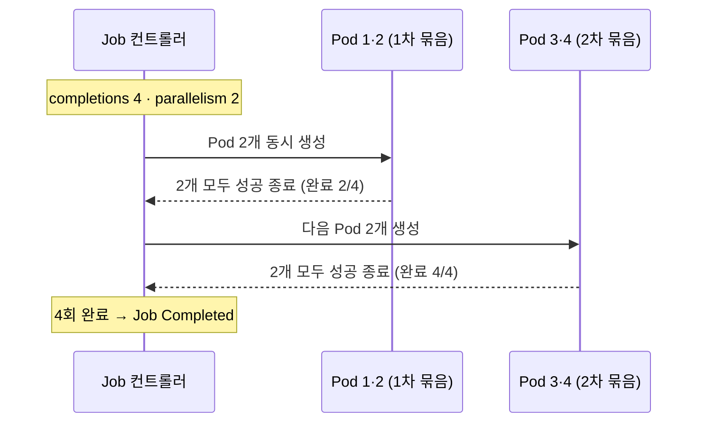
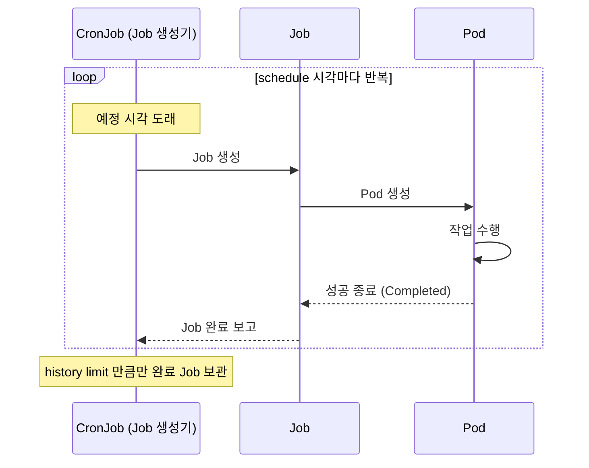
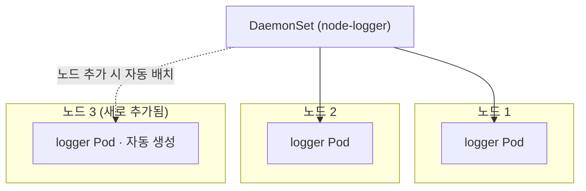
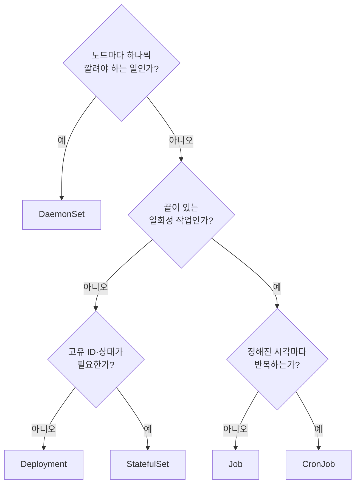

# Job·CronJob·DaemonSet - 배치·주기·노드 단위 워크로드

## 학습 목표
- 한 번 실행 후 완료되는 Job과 일정에 따라 반복하는 CronJob의 동작과 차이를 구분한다
- completions·parallelism·backoffLimit·schedule 같은 핵심 필드를 설정한다
- 모든 노드에 한 개씩 배치되는 DaemonSet의 용도를 이해하고 세 컨트롤러를 직접 배포해본다

## 본문

### Deployment만으로는 부족한 순간

지금까지 우리가 배운 Deployment는 "**계속 떠 있어야 하는**" 워크로드를 다룬다. 웹 서버처럼 요청을 기다리며 영원히 돌아가는 프로세스 말이다. 그래서 Deployment의 Pod는 작업이 끝나도 죽으면 안 되고, 죽으면 컨트롤러가 곧장 다시 살린다.

그런데 실무에는 성격이 전혀 다른 일들이 있다.

- **한 번 돌고 끝나야 하는 일** — 데이터 마이그레이션, 일괄 보고서 생성, 동영상 인코딩. 끝나면 Pod가 사라져야 정상이다.
- **정해진 시각마다 반복하는 일** — 매일 새벽 DB 백업, 매시간 로그 정리, 주간 집계 배치.
- **모든 노드에 하나씩 깔려야 하는 일** — 노드의 로그를 긁는 에이전트, 메트릭 수집기, 네트워크 플러그인.

이 세 가지를 Deployment로 억지로 흉내 내면 어색해진다. 작업이 끝났는데 Pod가 계속 재시작되거나(배치), 노드를 늘려도 수동으로 replica를 맞춰야 한다(노드 단위). 쿠버네티스는 이런 패턴에 전용 컨트롤러를 준비해 두었다. 이번 강의의 주인공인 **Job·CronJob·DaemonSet**이다. 세 컨트롤러의 역할은 다음과 같이 갈린다.

| 컨트롤러 | 실행 방식 | 끝나면 | 대표 용도 |
|----------|-----------|--------|-----------|
| **Job** | 한 번 실행, 성공하면 완료 | Pod가 `Completed` 상태로 남음 | 배치 작업, 마이그레이션 |
| **CronJob** | 일정(cron)에 따라 Job을 반복 생성 | 각 Job이 개별 완료 | 백업, 로그 정리, 주기 집계 |
| **DaemonSet** | 노드마다 정확히 1개 | 노드가 살아있는 한 유지 | 로그/메트릭 에이전트, CNI |

### Job — 완료를 보장하는 워크로드

Job은 "**지정한 횟수만큼 Pod를 성공적으로 끝내는 것**"을 책임지는 컨트롤러다. Deployment의 Pod가 "계속 살아있음(running)"을 목표로 한다면, Job의 Pod는 "성공적으로 종료됨(succeeded)"을 목표로 한다. 이 차이가 모든 동작을 결정한다.

가장 단순한 Job 매니페스트를 보자. 원주율을 소수점 2000자리까지 계산하는 한 번짜리 작업이다.

```yaml
# simple-job.yaml
apiVersion: batch/v1        # Job/CronJob 은 core 가 아니라 batch API 그룹
kind: Job
metadata:
  name: pi-job
spec:
  template:                 # 이 안은 Pod 스펙과 동일하다
    spec:
      containers:
        - name: pi
          image: perl:5.34
          command: ["perl", "-Mbignum=bpi", "-wle", "print bpi(2000)"]
      restartPolicy: Never  # Job 의 Pod 는 Never 또는 OnFailure 만 허용
```

```bash
kubectl apply -f simple-job.yaml
kubectl get jobs            # COMPLETIONS 가 0/1 -> 1/1 로 바뀌면 성공
kubectl get pods            # 완료된 Pod 는 Completed 상태로 남는다
kubectl logs job/pi-job     # 계산 결과(원주율) 확인
```

여기서 초보자가 가장 자주 막히는 부분을 짚자.

> Job의 Pod는 `restartPolicy`를 반드시 `Never` 또는 `OnFailure`로 지정해야 한다. Deployment의 기본값인 `Always`는 "끝나도 다시 켜라"는 뜻이라 "한 번 돌고 끝난다"는 Job의 본질과 모순되어 거부된다.

이때 `restartPolicy`가 결정하는 것은 **Pod 안의 컨테이너를 재시작할지 여부**라는 점을 정확히 이해하는 것이 중요하다. 두 값의 차이는 다음과 같다.

- **`OnFailure`** — 컨테이너가 실패(0이 아닌 코드로 종료)하면, **같은 Pod 안에서 그 컨테이너만 다시 시작**한다. Pod는 그대로 유지된다.
- **`Never`** — 실패해도 컨테이너를 재시작하지 않는다. 해당 Pod는 `Failed` 상태로 남는다.

그렇다면 `Never`일 때 재시도는 누가 하는가? 바로 **Job 컨트롤러**다. `Never` Pod가 실패로 끝나면, Job 컨트롤러가 `completions`를 채우기 위해 **새 Pod를 만들어** 다시 시도한다(이때 실패 Pod들이 쌓이며, 뒤에 나올 `backoffLimit`이 그 한도를 정한다). 정리하면, `Never`의 "새 Pod 생성"은 `restartPolicy`의 직접 효과가 아니라 **Job 컨트롤러가 목표 완료 횟수를 채우려는 별개의 동작**이다. 한편 `OnFailure`라도 노드가 통째로 다운되어 Pod 자체가 사라지면, 역시 Job 컨트롤러가 새 Pod를 만들어 완료 횟수를 맞춘다. 즉 컨테이너 단위 재시작(restartPolicy)과 Pod 단위 재생성(Job 컨트롤러)은 서로 다른 층의 동작이다.

#### completions와 parallelism — 몇 번, 몇 개씩

같은 작업을 여러 번 돌려야 하거나(예: 파티션 4개를 각각 처리), 여러 워커로 나눠 빨리 끝내고 싶을 때 두 필드를 쓴다.

- **`completions`** — 이 Job이 성공으로 인정받으려면 Pod가 **총 몇 번** 완료되어야 하는가.
- **`parallelism`** — 그 일을 위해 **동시에 몇 개의** Pod를 띄울 것인가.

비유하자면 completions는 "처리해야 할 택배 상자 수", parallelism은 "투입할 일꾼 수"다. 일손이 많으면(parallelism↑) 같은 양을 더 빨리 끝낸다.

```yaml
spec:
  completions: 4    # 총 4번 성공해야 Job 완료
  parallelism: 2    # 한 번에 2개씩 동시 실행 -> 2개 끝나면 다음 2개
  template:
    spec:
      containers:
        - name: worker
          image: busybox
          command: ["sh", "-c", "echo 작업 처리 중; sleep 5"]
      restartPolicy: Never
```

위 설정이면 Pod 2개가 동시에 돌아 끝나고, 이어서 나머지 2개가 돌아 총 4번 완료되면 Job이 `Completed`가 된다. `kubectl get pods -w`로 보면 두 개씩 묶여 진행되는 모습을 실시간으로 볼 수 있다. 아래 다이어그램은 `completions: 4`, `parallelism: 2` 설정이 시간순으로 어떻게 두 묶음으로 처리되는지를 보여준다.



#### backoffLimit — 실패를 몇 번까지 봐줄까

작업이 실패하면 Job은 백오프(점점 간격을 늘려가며) 방식으로 재시도한다. **`backoffLimit`**은 "이만큼 재시도해도 안 되면 Job을 실패로 확정하라"는 한계선이다(기본값 6). 이 값이 없으면 고장 난 작업이 영원히 재시도하며 자원을 갉아먹는다.

```yaml
spec:
  backoffLimit: 4              # 4회 재시도 후에도 실패하면 Job Failed
  activeDeadlineSeconds: 300   # (선택) 300초를 넘기면 강제 종료
```

> 운영 팁: 무한 재시도를 막기 위해 `backoffLimit`을, 멈추지 않는 작업을 끊기 위해 `activeDeadlineSeconds`를 함께 거는 것이 안전한 습관이다.

#### 워커끼리 통신해야 한다면 — indexed Job

분산 연산(MPI 등)처럼 워커들이 서로를 식별하고 통신해야 하는 경우, `completionMode: Indexed`를 쓰면 각 Pod에 0부터 N-1까지 **고정 인덱스**가 붙는다. 이 인덱스가 Pod 호스트네임에 들어가, Headless Service(중급2 1강에서 배운 그것)와 짝지으면 워커끼리 안정적인 DNS 이름으로 서로를 찾을 수 있다. 지금 단계에서는 "Job도 워커 간 통신이 필요한 배치까지 커버한다" 정도만 알아 두면 충분하다.

### CronJob — 일정에 맞춰 Job을 찍어내는 공장

CronJob의 정체는 의외로 단순하다. **CronJob은 그 자체로 일하지 않는다. 정해진 시각이 되면 Job을 하나 만들어내는 "Job 생성기"일 뿐이다.** 그래서 CronJob을 이해하려면 Job을 먼저 알아야 했던 것이다. 전체 동작은 다음과 같이 단계적으로 일어난다: CronJob이 일정을 감시 → 시각 도래 → Job 생성 → Job이 Pod 생성 → Pod가 작업 수행 후 종료.

아래 시퀀스 다이어그램은 CronJob이 직접 일하지 않고 Job을 거쳐 Pod로 이어지는 위임 구조를 한눈에 보여준다.



```yaml
# backup-cronjob.yaml
apiVersion: batch/v1
kind: CronJob
metadata:
  name: db-backup
spec:
  schedule: "0 3 * * *"        # 매일 새벽 3시 (cron 표현식)
  jobTemplate:                 # 이 안은 위에서 본 Job 스펙과 똑같다
    spec:
      template:
        spec:
          containers:
            - name: backup
              image: busybox
              command: ["sh", "-c", "echo 백업 실행 $(date)"]
          restartPolicy: OnFailure
```

`jobTemplate` 아래가 앞에서 다룬 Job 그대로라는 점에 주목하자. `completions`·`parallelism`·`backoffLimit`도 여기에 똑같이 넣을 수 있다.

#### schedule — cron 표현식 읽는 법

`schedule`은 다섯 자리 cron 표현식이다. 왼쪽부터 **분 / 시 / 일 / 월 / 요일** 순이고, `*`은 "매번"을 뜻한다.

```
 ┌────── 분 (0-59)
 │ ┌──── 시 (0-23)
 │ │ ┌── 일 (1-31)
 │ │ │ ┌ 월 (1-12)
 │ │ │ │ ┌ 요일 (0-6, 0=일요일)
 │ │ │ │ │
 0 3 * * *      매일 03:00
 */5 * * * *    5분마다
 0 0 * * 0      매주 일요일 자정
 0 9 1 * *      매월 1일 09:00
```

> 표현식이 헷갈릴 때는 `crontab.guru` 사이트에 입력해 자연어 설명으로 검증하는 습관을 들이자. 한 자리 실수로 "매분 실행"이 되어 클러스터를 두드리는 사고가 흔하다.

#### CronJob 운영의 핵심 — 동시성·일시정지·이력

CronJob에는 운영자가 반드시 알아야 할 제어 필드가 있다.

- **`concurrencyPolicy`** — 이전 실행이 아직 안 끝났는데 다음 시각이 됐을 때의 정책이다.
  - `Allow`(기본): 그냥 둘 다 돌린다. 작업이 1분 넘게 걸리는데 1분마다 도는 일정이면 **겹쳐 실행**되어 데이터 충돌이 날 수 있다.
  - `Forbid`: 이전 것이 끝날 때까지 새 Job을 만들지 않는다(건너뜀).
  - `Replace`: 이전 Job을 죽이고 새 것으로 교체한다.
- **`suspend: true`** — Job 생성을 일시 중단한다. 삭제하지 않고 잠시 멈추고 싶을 때 쓴다.
- **`successfulJobsHistoryLimit` / `failedJobsHistoryLimit`** — 완료된 Job(과 그 Pod·로그)을 몇 개나 보관할지. 기본은 성공 3개·실패 1개다. 이걸 두지 않으면 매분 도는 CronJob이 완료 Pod를 산더미처럼 쌓는다.

```yaml
spec:
  schedule: "*/1 * * * *"
  concurrencyPolicy: Forbid
  successfulJobsHistoryLimit: 3
  failedJobsHistoryLimit: 1
  jobTemplate:
    # ... (생략)
```

일시정지는 매니페스트를 고치지 않고도 명령 한 줄로 가능하다.

```bash
kubectl patch cronjob db-backup -p '{"spec":{"suspend":true}}'   # 멈춤
kubectl patch cronjob db-backup -p '{"spec":{"suspend":false}}'  # 재개
kubectl create job --from=cronjob/db-backup test-run             # 일정 기다리지 말고 즉시 1회 실행(테스트)
```

> 정리(cascading delete) 동작도 기억하자. CronJob을 지우면 그것이 만든 Job들과 그 Pod·로그까지 모두 함께 정리된다. 로그를 남기고 싶다면 별도 로깅 스택(8강)으로 미리 수집해야 한다.

### DaemonSet — 노드마다 한 개씩

DaemonSet은 앞의 둘과 결이 다르다. 배치 작업이 아니라 "**클러스터의 모든 노드에 Pod를 정확히 하나씩 배치하고 유지**"하는 컨트롤러다. replica 개수를 우리가 정하지 않는다는 점이 핵심이다. **노드가 5개면 5개, 노드를 추가하면 자동으로 그 노드에도 하나가 더 뜬다.** 노드를 빼면 그 위의 Pod도 함께 사라진다.

아래 구성도처럼 DaemonSet은 노드마다 동일한 Pod를 하나씩 깔고, 노드가 늘면 자동으로 따라 붙는다.



이런 동작이 필요한 워크로드는 "노드 자체에 종속된 일"이다.

- **로그 수집 에이전트** (Fluent Bit, Filebeat) — 각 노드의 로그 파일을 그 노드에서 읽어야 한다.
- **메트릭 수집기** (node-exporter) — 노드별 CPU·메모리·디스크 상태를 노드에서 직접 긁는다.
- **네트워크/스토리지 플러그인** (CNI, CSI, MinIO·Rook 같은 분산 스토리지) — 노드의 디스크나 네트워크를 다룬다.

```yaml
# node-logger.yaml
apiVersion: apps/v1
kind: DaemonSet
metadata:
  name: node-logger
spec:
  selector:
    matchLabels:
      app: node-logger
  template:
    metadata:
      labels:
        app: node-logger
    spec:
      tolerations:                    # control-plane 노드에도 배치하려면 taint 를 허용
        - key: node-role.kubernetes.io/control-plane
          operator: Exists
          effect: NoSchedule
      containers:
        - name: logger
          image: busybox
          command: ["sh", "-c", "tail -f /var/log/syslog || sleep infinity"]
          volumeMounts:
            - name: varlog
              mountPath: /var/log
              readOnly: true
      volumes:
        - name: varlog
          hostPath:                   # 노드의 디렉터리를 직접 마운트
            path: /var/log
```

```bash
kubectl apply -f node-logger.yaml
kubectl get daemonset                 # DESIRED/CURRENT 가 노드 수와 같은지 확인
kubectl get pods -o wide              # 각 Pod 가 서로 다른 노드에 흩어져 있는지 NODE 열로 확인
```

DaemonSet에는 노드 단위 워크로드 특유의 관용이 두 가지 있다.

> **Taint와 Toleration**: 보통 control-plane 노드에는 일반 Pod가 안 뜨도록 taint(얼룩)가 발려 있다. 그런데 로그·메트릭 에이전트는 그 노드에서도 떠야 하므로, 위 예시처럼 `tolerations`로 taint를 허용해 모든 노드를 빠짐없이 덮는다. (taint/toleration의 자세한 메커니즘은 5강에서 다룬다.)

`hostPath`로 노드의 실제 경로를 마운트하는 패턴도 DaemonSet에서 자주 등장한다. 특정 노드에만 깔고 싶다면 `nodeSelector`나 affinity로 대상을 좁힐 수 있다.

### 셋을 한눈에 — 어떤 일에 무엇을 쓰나

선택 기준은 "작업의 수명과 배치 방식" 두 축으로 정리된다.

- **끝이 있는 일인가?** → 그렇다면 Job. 그 일을 **시각에 맞춰 반복**해야 하면 CronJob.
- **노드마다 하나씩 깔려야 하는 일인가?** → DaemonSet.
- 둘 다 아니고 "계속 떠 있어야" 하면 → Deployment(상태 없음) 또는 StatefulSet(상태·ID 필요, 1강).

아래 결정 흐름도를 따라가면 워크로드 성격에 맞는 컨트롤러를 빠르게 고를 수 있다.



## 핵심 요약
- **Job**은 Pod를 지정 횟수만큼 "성공 종료"시키는 일회성 컨트롤러다. `restartPolicy`는 `Never`/`OnFailure`만 허용된다. `OnFailure`는 같은 Pod 안에서 컨테이너만 재시작하고, `Never`는 재시작하지 않으며, 모자란 완료 횟수는 **Job 컨트롤러가 새 Pod를 만들어** 채운다. `completions`(총 완료 횟수)·`parallelism`(동시 실행 수)·`backoffLimit`(실패 재시도 한계)로 동작을 조정한다.
- **CronJob**은 `schedule`(cron 표현식, 분·시·일·월·요일)에 따라 Job을 반복 생성하는 "Job 생성기"다. `concurrencyPolicy`(겹침 처리)·`suspend`(일시정지)·history limit(완료 Job 보관 수)이 운영의 핵심이다.
- **DaemonSet**은 모든 노드에 Pod를 하나씩 배치·유지하며, 로그/메트릭 에이전트·CNI 같은 노드 단위 워크로드에 쓴다. replica를 직접 관리하지 않고, control-plane까지 덮으려면 `tolerations`가 필요하다.
- 선택 기준: 끝나는 일이면 Job(반복이면 CronJob), 노드마다 필요하면 DaemonSet, 계속 떠 있어야 하면 Deployment/StatefulSet.

## 출처
- Google Cloud Tech, "Kubernetes jobs for batch workload" — https://www.youtube.com/watch?v=4yu2o3bpRHk
- Alta3 Research, "Kubernetes CronJobs in 8 Minutes! Schedule and Automate Like a Pro" — https://www.youtube.com/watch?v=KwyrHDEJ8LM
- Anton Putra, "Kubernetes Deployment vs. StatefulSet vs. DaemonSet" — https://www.youtube.com/watch?v=30KAInyvY_o
