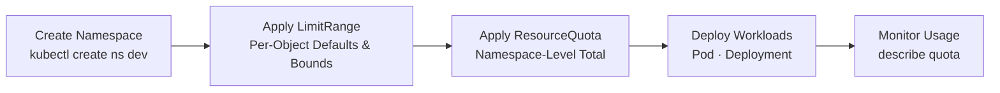

# Namespaces and Multi-Tenancy - Resource Isolation and Usage Limits

## Learning Objectives
- Understand how to logically partition a cluster using Namespaces and configure multi-tenancy
- Limit the total resource consumption of an entire namespace using ResourceQuota
- Enforce default values and upper/lower bounds on Pods and containers using LimitRange

## Content

### Why You Need to Partition a Cluster

Up until now, we have been creating Pods and Deployments as if we had the entire cluster to ourselves. In practice, however, a cluster is typically a **shared resource used by multiple teams and multiple environments simultaneously**. A development team, a data team, and CI jobs all share the same nodes, and dev, staging, and prod environments often coexist within a single cluster.

What happens when everyone dumps their objects into the same space with no partitioning at all?

- **Name collisions occur.** Team A's `web` Service and Team B's `web` Service clash in the same space.
- **Ownership becomes tangled.** A single `kubectl get pods` floods the screen with every team's Pods at once.
- **One team monopolizes cluster resources.** If someone accidentally spins up hundreds of Pods, other teams' Pods fail to schedule due to resource exhaustion.

Kubernetes addresses this problem with **Namespaces**. A Namespace is a logical partition that divides a single physical cluster into multiple **virtual clusters**. Just as containers isolate multiple applications on a single OS, Namespaces isolate multiple groups of objects on a single cluster.

> Namespace isolation is "logical isolation," not the strong isolation that containers provide. With sufficient permissions, objects in other namespaces remain accessible. True security boundaries are established in combination with RBAC and NetworkPolicy, which we will cover in the next lecture.

### Built-in Namespaces and Multi-Tenancy

Kubernetes ships with four namespaces out of the box.

```bash
kubectl get namespace   # shorthand: kubectl get ns
```

| Namespace | Purpose |
|------|------|
| `default` | The default space where objects land when no namespace is specified |
| `kube-system` | Objects created by Kubernetes itself (scheduler, DNS, etc.) |
| `kube-public` | Resources that should be publicly readable across the entire cluster |
| `kube-node-lease` | Lease objects for improving the performance of node heartbeat signals |

`default` is like a kitchen junk drawer — easy to toss things into — but in real-world operations it is standard practice to create dedicated namespaces per team and environment. The pattern of sharing a single cluster across multiple isolated user groups is called **multi-tenancy**. Each tenant has its own independent resources, policies, and constraints within its namespace.

The overall picture of a multi-tenant cluster looks like the diagram below. A single physical cluster is divided into per-team namespaces acting as partitions, with resource usage limit rules (ResourceQuota and LimitRange) applied to each namespace.

```mermaid Multi-Tenant Cluster Architecture - Per-Team Namespace Isolation and Usage Limits
flowchart TB
    subgraph CLUSTER["Single Physical Kubernetes Cluster"]
        direction LR
        subgraph NSDEV["Namespace: dev"]
            QD["ResourceQuota Total Resource Cap"]
            LD["LimitRange Per-Object Defaults & Bounds"]
            PD["Pod / Service / ConfigMap"]
            QD --- PD
            LD --- PD
        end
        subgraph NSPROD["Namespace: prod"]
            QP["ResourceQuota Total Resource Cap"]
            LP["LimitRange Per-Object Defaults & Bounds"]
            PP["Pod / Service / ConfigMap"]
            QP --- PP
            LP --- PP
        end
        subgraph NSSYS["Namespace: kube-system"]
            SYS["Scheduler / DNS and Other System Objects"]
        end
    end
    A["Dev Team"] --> NSDEV
    B["Ops Team"] --> NSPROD
```

### Creating and Managing Namespaces

A Namespace is itself a Kubernetes object, so you manage it with `create`/`delete`.

```bash
kubectl create namespace dev      # imperative creation
```

Or declare it in a manifest.

```yaml
# namespace.yaml
apiVersion: v1
kind: Namespace
metadata:
  name: dev
```

```bash
kubectl apply -f namespace.yaml
```

The key difference is that **nearly every command now requires you to specify which namespace to target**. Use the `-n` (or `--namespace`) flag.

```bash
kubectl get pods -n dev                # list only Pods in the dev namespace
kubectl run web --image=nginx -n dev   # create a Pod inside dev
kubectl get pods --all-namespaces      # view all namespaces at once (shorthand: -A)
```

If typing `-n dev` on every command becomes tedious, you can **change the default namespace for the current context** so it is applied automatically to subsequent commands.

```bash
kubectl config set-context --current --namespace=dev
# From here on, commands run against the dev namespace without needing -n
```

> Deleting a namespace removes everything inside it along with it. A single `kubectl delete ns dev` wipes out all Pods, Services, and ConfigMaps in dev — be especially careful with production namespaces.

### ResourceQuota — Capping the Total Resources of an Entire Namespace

Even after partitioning with Namespaces, the resource-monopolization problem is still there. If the dev team keeps spinning up Pods without limit, the entire cluster can still grind to a halt. `ResourceQuota` addresses this by placing a **ceiling on the total amount of resources that may be consumed within a namespace**.

Recall the per-Pod `requests`/`limits` you learned in Intermediate Level 1. Those were **the resource requests and limits for a single Pod**; a ResourceQuota is the **budget for the entire namespace**. It defines an aggregate ceiling such as "the dev team may use a combined total of 2 CPU cores, 2 Gi of memory, and up to 10 Pods."

```yaml
# resource-quota.yaml
apiVersion: v1
kind: ResourceQuota
metadata:
  name: dev-quota
  namespace: dev
spec:
  hard:
    requests.cpu: "2"          # sum of CPU requests across all Pods ≤ 2 cores
    requests.memory: 2Gi       # sum of memory requests ≤ 2 Gi
    limits.cpu: "4"            # sum of CPU limits ≤ 4 cores
    limits.memory: 4Gi         # sum of memory limits ≤ 4 Gi
    pods: "10"                # number of Pods ≤ 10
```

```bash
kubectl apply -f resource-quota.yaml
kubectl describe quota dev-quota -n dev   # check current usage against limits
```

`hard` defines an absolute ceiling that can never be exceeded. You can restrict not only CPU and memory, but also the **count** of objects such as `pods`, `services`, `persistentvolumeclaims`, `secrets`, and `configmaps`.

What happens the moment the quota is exceeded? **New Pod creation is rejected.** Let's observe this directly by trying to create a Pod that requests 3 cores when the limit is 2 cores. Specify the resource request in the manifest's `resources.requests` field and apply it with `kubectl apply`.

```yaml
# big-pod.yaml — deliberately exceeds the quota (2 cores) by requesting 3 cores
apiVersion: v1
kind: Pod
metadata:
  name: big
  namespace: dev
spec:
  containers:
    - name: nginx
      image: nginx
      resources:
        requests:
          cpu: "3"        # exceeds the quota limit (requests.cpu=2)
        limits:
          cpu: "3"
```

```bash
kubectl apply -f big-pod.yaml
# Error from server (Forbidden): error when creating "big-pod.yaml": pods "big" is forbidden:
# exceeded quota: dev-quota, requested: requests.cpu=3, used: requests.cpu=0, limited: requests.cpu=2
```

> The `kubectl run big --image=nginx --requests=cpu=3` syntax seen in older tutorials and documentation no longer works. The `--requests`/`--limits` flags were deprecated in kubectl 1.18 and fully removed in 1.21 — running them today produces an `unknown flag: --requests` error. The current standard is to specify resource requests and limits in the manifest's `resources` field and apply it with `kubectl apply`, as shown above.

If you try to create 11 Pods against a limit of 10, only the Pods up to the limit are created and the rest fail with a quota exceeded error. This is how Kubernetes proactively prevents any one team from starving others of resources.

> Once a **compute resource** such as `requests.cpu` or `limits.memory` is set in a ResourceQuota, every container in that namespace **must explicitly specify** the corresponding field. Pods that omit requests/limits are rejected. The object that fills this gap is LimitRange, covered next.

### LimitRange — Default Values and Bounds for Individual Pods and Containers

After applying a ResourceQuota, a new problem emerges: if a developer forgets to include requests/limits in a manifest, the Pod simply fails to create. Expecting every developer to always get the resource values exactly right is unrealistic.

`LimitRange` fills this gap. Think of it as a **corporate hotel booking policy**. Employees choose their own hotel, but the company sets the rule: "maximum $150 per night; if unspecified, the default is $100." LimitRange enforces three things for each individual **container or Pod** in a namespace.

- **Default values (`default` / `defaultRequest`)**: Automatically filled in if the user omits requests/limits.
- **Maximum (`max`)**: The upper bound a single container may request.
- **Minimum (`min`)**: The lower bound a single container must request.

```yaml
# limit-range.yaml
apiVersion: v1
kind: LimitRange
metadata:
  name: dev-limits
  namespace: dev
spec:
  limits:
    - type: Container
      default:              # default upper limit applied when limits are not specified
        cpu: 500m
        memory: 512Mi
      defaultRequest:       # default request applied when requests are not specified
        cpu: 250m
        memory: 256Mi
      max:                  # maximum allowed value for a single container
        cpu: "1"
        memory: 1Gi
      min:                  # minimum required value for a single container
        cpu: 100m
        memory: 128Mi
```

```bash
kubectl apply -f limit-range.yaml
kubectl describe limitrange dev-limits -n dev
```

Now try creating a Pod in dev with **no resource fields at all**.

```bash
kubectl run test --image=nginx -n dev
kubectl describe pod test -n dev | grep -A4 Limits
```

Even though no resources were specified, the describe output shows the container has `requests: cpu=250m, memory=256Mi` and `limits: cpu=500m, memory=512Mi` **filled in automatically** — the LimitRange defaults were injected. As a side effect, this naturally satisfies the ResourceQuota's requirement that requests/limits be explicitly present.

Conversely, a container that exceeds `max` (e.g., 2 CPU cores) or falls below `min` is rejected at creation time. The upper and lower bounds prevent containers from being set either too large or too small.

### ResourceQuota and LimitRange Are a Pair

The two objects have different scopes and only work fully when used together. Here is a clear breakdown of the differences.

| | ResourceQuota | LimitRange |
|------|---------------|------------|
| Scope | Aggregate totals for the **entire namespace** | Each **individual container or Pod** |
| Role | Total budget ceiling | Fill in defaults + enforce per-object bounds |
| Analogy | Team budget | Per-person spending rule |
| When it blocks | Pod creation that pushes the aggregate over the limit | Pod creation with missing values or bound violations |

The recommended production pattern is to **apply both together**. LimitRange enforces sensible defaults and bounds on every Pod, so even if a developer omits resource values, they are filled in safely. ResourceQuota then guards the namespace-level total on top of that. The result is a fair, safe multi-tenant cluster where developers, data scientists, and CI jobs each receive a reasonable share.

The typical configuration sequence is shown in the flow below. Create the namespace, lay down per-object rules with LimitRange, set the team budget with ResourceQuota, and then deploy workloads within those constraints.



```bash
kubectl create ns dev
kubectl apply -f limit-range.yaml      # per-object defaults and bounds
kubectl apply -f resource-quota.yaml   # namespace-level total cap
kubectl describe quota dev-quota -n dev   # monitor usage in operation
```

## Key Takeaways
- **Namespace** is a logical partition that divides a single physical cluster into multiple virtual clusters — the fundamental unit of per-team, per-environment multi-tenancy. Nearly every command requires the `-n` flag, and you can change the default namespace with `set-context`.
- **ResourceQuota** places a ceiling (`hard`) on the total resources and object counts for an entire namespace. Pod creation that would push the aggregate over the limit is rejected, preventing any one team from monopolizing resources.
- When compute resources are constrained by a ResourceQuota, every container in that namespace must explicitly specify requests/limits.
- **LimitRange** enforces default values (`default`/`defaultRequest`) and upper/lower bounds (`max`/`min`) on individual containers and Pods. It automatically fills in defaults for Pods that omit resource fields, satisfying the ResourceQuota requirement transparently.
- The two are a pair. ResourceQuota is the "team budget"; LimitRange is the "per-person spending rule." Both are needed for a fair and safe multi-tenant cluster.

## Sources
- Google Cloud Tech, "Namespaces in Kubernetes" — https://www.youtube.com/watch?v=plB3kyZLHe8
- Techi Nik, "Kubernetes LimitRange Explained | Default Resource Limits & Requests + Resource Quota Demo" — https://www.youtube.com/watch?v=tyoaLuaVyuQ
- Techi Nik, "What Happens When You Don't Use Kubernetes Resource Quotas?" — https://www.youtube.com/watch?v=dYLRW0DZVGk
