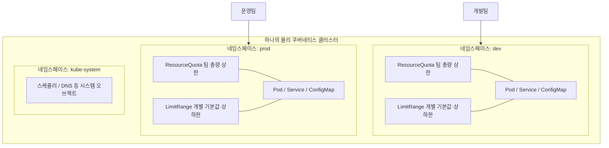

# Namespace와 멀티테넌시 - 리소스 격리와 사용량 제한

## 학습 목표
- Namespace로 클러스터를 논리적으로 분리하고 멀티테넌시를 구성하는 방법을 이해한다
- ResourceQuota로 네임스페이스 전체의 리소스 총량을 제한한다
- LimitRange로 Pod·컨테이너의 기본값과 상·하한을 강제해본다

## 본문

### 왜 클러스터를 나눠야 하나

지금까지는 마치 클러스터에 나 혼자 있는 것처럼 Pod와 Deployment를 만들어 왔다. 하지만 실무 클러스터는 보통 **여러 팀, 여러 환경이 함께 쓰는 공유 자원**이다. 개발팀·데이터팀·CI 잡이 같은 노드를 나눠 쓰고, dev·staging·prod 환경이 한 클러스터 안에 공존하기도 한다.

이때 아무 칸막이 없이 모두가 같은 공간에 오브젝트를 쏟아 넣으면 어떻게 될까?

- **이름이 충돌한다.** A팀의 `web` 서비스와 B팀의 `web` 서비스가 한 공간에서 부딪힌다.
- **누가 무엇을 만들었는지 뒤섞인다.** `kubectl get pods` 한 번에 모든 팀의 Pod가 한 화면에 쏟아진다.
- **한 팀이 클러스터 자원을 독식한다.** 누군가 실수로 Pod를 수백 개 띄우면, 다른 팀의 Pod가 자원 부족으로 뜨지 못한다.

쿠버네티스는 이 문제를 **Namespace(네임스페이스)** 로 해결한다. 네임스페이스는 하나의 물리 클러스터를 여러 개의 **가상 클러스터(virtual cluster)** 로 논리적으로 쪼개는 칸막이다. 컨테이너가 하나의 OS 위에서 여러 애플리케이션을 격리하듯, 네임스페이스는 하나의 클러스터 위에서 여러 오브젝트 그룹을 격리한다.

> 네임스페이스 격리는 "논리적 격리"이지 컨테이너처럼 강한 격리가 아니다. 권한만 있으면 다른 네임스페이스의 오브젝트에 접근할 수 있다. 진짜 보안 경계는 다음 강의에서 배울 RBAC과 NetworkPolicy로 함께 세운다.

### 기본 제공 네임스페이스와 멀티테넌시

쿠버네티스는 설치 시 네 개의 네임스페이스를 기본으로 갖는다.

```bash
kubectl get namespace   # 줄여서 kubectl get ns
```

| 네임스페이스 | 용도 |
|------|------|
| `default` | 네임스페이스를 지정하지 않은 오브젝트가 들어가는 기본 공간 |
| `kube-system` | 쿠버네티스 시스템이 만든 오브젝트(스케줄러, DNS 등) |
| `kube-public` | 클러스터 전체에 공개적으로 읽혀야 하는 리소스용 |
| `kube-node-lease` | 노드 하트비트(생존 신호) 성능 개선용 lease 오브젝트 |

`default`는 부엌 서랍 같은 공간이라 아무거나 던져 넣기 쉽지만, 실무에서는 팀·환경별로 네임스페이스를 따로 만들어 쓰는 것이 정석이다. 이렇게 한 클러스터를 여러 사용자 그룹이 격리된 채로 나눠 쓰는 구조를 **멀티테넌시(multi-tenancy)** 라고 한다. 각 테넌트(입주자)는 자기 네임스페이스 안에서 독립된 리소스·정책·제약을 갖는다.

멀티테넌트 클러스터의 전체 그림은 다음과 같다. 아래 구성도처럼 하나의 물리 클러스터 안에 팀별 네임스페이스가 칸막이로 나뉘고, 각 네임스페이스에 사용량 제한 규칙(ResourceQuota·LimitRange)이 걸린다.



### 네임스페이스 만들고 다루기

네임스페이스도 하나의 쿠버네티스 오브젝트이므로 `create`/`delete`로 다룬다.

```bash
kubectl create namespace dev      # 명령형 생성
```

또는 매니페스트로 선언한다.

```yaml
# namespace.yaml
apiVersion: v1
kind: Namespace
metadata:
  name: dev
```

```bash
kubectl apply -f namespace.yaml
```

핵심 차이는 **이제 거의 모든 명령에 어느 네임스페이스인지 알려줘야 한다**는 점이다. `-n`(또는 `--namespace`) 플래그를 붙인다.

```bash
kubectl get pods -n dev                # dev 네임스페이스의 Pod만 조회
kubectl run web --image=nginx -n dev   # dev 안에 Pod 생성
kubectl get pods --all-namespaces      # 전체 네임스페이스 한꺼번에 보기 (-A 로 축약)
```

매번 `-n dev`를 치기 번거롭다면, **현재 컨텍스트의 기본 네임스페이스를 바꿔** 이후 명령에 자동 적용되게 할 수 있다.

```bash
kubectl config set-context --current --namespace=dev
# 이제 -n 없이 실행해도 dev 네임스페이스를 사용한다
```

> 네임스페이스를 삭제하면 그 안의 모든 오브젝트가 함께 삭제된다. `kubectl delete ns dev` 한 줄로 dev 안의 Pod·Service·ConfigMap이 전부 사라지므로 운영 네임스페이스에는 각별히 주의한다.

### ResourceQuota — 네임스페이스 전체의 총량 제한

네임스페이스로 칸막이를 쳤어도 자원 독식 문제는 아직 남아 있다. dev 팀이 Pod를 무한정 띄우면 여전히 클러스터 전체가 마비된다. 그래서 **네임스페이스 단위로 쓸 수 있는 자원의 총량에 상한**을 거는 것이 `ResourceQuota`다.

중급1에서 배운 Pod 하나하나의 `requests`/`limits`를 떠올려 보자. 그것이 **개별 Pod의 자원 요청·상한**이었다면, ResourceQuota는 **네임스페이스 전체에 걸린 예산(budget)** 이다. "dev 팀은 통틀어 CPU 2코어, 메모리 2Gi, Pod 10개까지"처럼 합산 사용량의 천장을 정한다.

```yaml
# resource-quota.yaml
apiVersion: v1
kind: ResourceQuota
metadata:
  name: dev-quota
  namespace: dev
spec:
  hard:
    requests.cpu: "2"          # 이 네임스페이스 Pod들의 CPU request 합 ≤ 2코어
    requests.memory: 2Gi       # 메모리 request 합 ≤ 2Gi
    limits.cpu: "4"            # CPU limit 합 ≤ 4코어
    limits.memory: 4Gi         # 메모리 limit 합 ≤ 4Gi
    pods: "10"                # Pod 개수 ≤ 10개
```

```bash
kubectl apply -f resource-quota.yaml
kubectl describe quota dev-quota -n dev   # 현재 사용량/한도 확인
```

`hard`는 절대 넘을 수 없는 상한이다. CPU·메모리뿐 아니라 `pods`, `services`, `persistentvolumeclaims`, `secrets`, `configmaps` 같은 오브젝트 **개수**도 제한할 수 있다.

쿼터를 초과하는 순간 어떤 일이 벌어질까? **새 Pod 생성이 거부된다.** 한도가 CPU 2코어인데 3코어를 요청하는 Pod를 만들어 직접 확인해 보자. 요청량은 매니페스트의 `resources.requests`로 명시하고 `kubectl apply`로 적용한다.

```yaml
# big-pod.yaml — CPU request 3코어를 요청해 쿼터(2코어)를 일부러 초과시킨다
apiVersion: v1
kind: Pod
metadata:
  name: big
  namespace: dev
spec:
  containers:
    - name: nginx
      image: nginx
      resources:
        requests:
          cpu: "3"        # 쿼터 한도(requests.cpu=2)를 넘는 요청
        limits:
          cpu: "3"
```

```bash
kubectl apply -f big-pod.yaml
# Error from server (Forbidden): error when creating "big-pod.yaml": pods "big" is forbidden:
# exceeded quota: dev-quota, requested: requests.cpu=3, used: requests.cpu=0, limited: requests.cpu=2
```

> 예전 강의·문서에서 보이는 `kubectl run big --image=nginx --requests=cpu=3` 방식은 더 이상 동작하지 않는다. `--requests`/`--limits` 플래그는 kubectl 1.18에서 deprecated, 1.21에서 완전히 제거되어 지금 실행하면 `unknown flag: --requests` 에러가 난다. 자원 요청·상한은 위처럼 매니페스트의 `resources`에 적고 `kubectl apply`로 적용하는 것이 현재 표준이다.

10개 한도에서 Pod 11개를 한꺼번에 만들면, 한도에 닿기 전까지만 생성되고 나머지는 쿼터 초과로 실패한다. 이렇게 쿠버네티스는 한 팀이 자원을 독식해 다른 팀을 굶기는 상황을 미리 차단한다.

> ResourceQuota에 `requests.cpu`나 `limits.memory` 같은 **연산 자원**을 한 번이라도 걸면, 그 네임스페이스의 모든 컨테이너는 해당 항목을 **반드시 명시**해야 한다. requests/limits를 빠뜨린 Pod는 생성이 거부된다. 이 함정을 메워 주는 것이 바로 다음에 볼 LimitRange다.

### LimitRange — 개별 Pod·컨테이너의 기본값과 상·하한

ResourceQuota를 걸었더니 새로운 문제가 생긴다. 개발자가 매니페스트에서 requests/limits 쓰는 걸 깜빡하면 Pod가 아예 안 뜬다. 매번 모든 개발자가 자원 값을 정확히 적기를 기대하기는 어렵다.

`LimitRange`는 이 빈틈을 메운다. 비유하자면 **출장 호텔 예약 규칙**과 같다. 직원이 호텔을 직접 고르되 "1박 최대 5만 원, 미지정 시 기본 3만 원"이라는 규칙을 회사가 정해 두는 것이다. LimitRange는 네임스페이스 안 **개별 컨테이너·Pod**에 대해 세 가지를 강제한다.

- **기본값(default / defaultRequest)**: 사용자가 requests/limits를 안 적으면 자동으로 채워 넣는다.
- **최댓값(max)**: 컨테이너 하나가 요청할 수 있는 상한.
- **최솟값(min)**: 컨테이너 하나가 최소한 요청해야 하는 하한.

```yaml
# limit-range.yaml
apiVersion: v1
kind: LimitRange
metadata:
  name: dev-limits
  namespace: dev
spec:
  limits:
    - type: Container
      default:              # limits 미지정 시 적용될 기본 상한
        cpu: 500m
        memory: 512Mi
      defaultRequest:       # requests 미지정 시 적용될 기본 요청량
        cpu: 250m
        memory: 256Mi
      max:                  # 컨테이너 하나의 최대 허용치
        cpu: "1"
        memory: 1Gi
      min:                  # 컨테이너 하나의 최소 요청치
        cpu: 100m
        memory: 128Mi
```

```bash
kubectl apply -f limit-range.yaml
kubectl describe limitrange dev-limits -n dev
```

이제 requests/limits를 **하나도 적지 않은** Pod를 dev에 만들어 보자.

```bash
kubectl run test --image=nginx -n dev
kubectl describe pod test -n dev | grep -A4 Limits
```

분명 자원을 지정하지 않았는데, describe 결과에는 컨테이너에 `requests: cpu=250m, memory=256Mi`, `limits: cpu=500m, memory=512Mi`가 **자동으로 채워져 있다.** LimitRange의 기본값이 입혀진 것이다. 덕분에 ResourceQuota가 요구하는 "requests/limits 필수" 조건도 자연히 충족된다.

반대로 `max`를 넘는 컨테이너(예: CPU 2코어)나 `min`에 못 미치는 컨테이너는 생성이 거부된다. 너무 크게도, 너무 작게도 잡지 못하게 상·하한으로 가둔다.

### ResourceQuota와 LimitRange는 짝이다

두 오브젝트는 적용 범위가 다르고, 함께 써야 완성된다. 그 차이를 분명히 정리하자.

| 구분 | ResourceQuota | LimitRange |
|------|---------------|------------|
| 적용 범위 | **네임스페이스 전체**의 합산 총량 | **개별 컨테이너·Pod** 하나하나 |
| 역할 | 총 예산 상한 (천장) | 기본값 채우기 + 개별 상·하한 |
| 비유 | 팀 전체 예산 | 1인당 지출 규칙 |
| 막는 시점 | 합산이 한도를 넘는 Pod 생성 | 값 누락·상하한 위반 Pod 생성 |

실무 권장 패턴은 **둘을 함께 거는 것**이다. LimitRange로 모든 Pod에 합리적인 기본값과 상·하한을 강제하면, 개발자가 자원 값을 빠뜨려도 안전하게 채워지고, 그 위에서 ResourceQuota가 네임스페이스 총량을 지킨다. 그러면 개발자든 데이터 사이언티스트든 CI 잡이든 누구나 공정한 몫을 받는, 안전한 멀티테넌트 클러스터가 완성된다.

전형적인 구성 순서는 아래 흐름과 같다. 네임스페이스를 만들고 → LimitRange로 1인당 규칙을 깔고 → ResourceQuota로 팀 예산을 건 뒤 → 그 안에서 워크로드를 배포한다.


```bash
kubectl create ns dev
kubectl apply -f limit-range.yaml      # 개별 기본값·상하한
kubectl apply -f resource-quota.yaml   # 네임스페이스 총량
kubectl describe quota dev-quota -n dev   # 운영 중 사용량 모니터링
```

## 핵심 요약
- **Namespace**는 하나의 물리 클러스터를 여러 가상 클러스터로 나누는 논리적 칸막이로, 팀·환경별 멀티테넌시의 기본 단위다. 거의 모든 명령에 `-n` 플래그가 필요하며, `set-context`로 기본 네임스페이스를 바꿀 수 있다.
- **ResourceQuota**는 네임스페이스 전체의 자원·오브젝트 총량에 상한(`hard`)을 거는 예산이다. 한도를 넘는 Pod 생성은 거부되어 한 팀의 자원 독식을 막는다.
- ResourceQuota로 연산 자원을 제한하면 그 네임스페이스의 모든 컨테이너는 requests/limits를 반드시 명시해야 한다.
- **LimitRange**는 개별 컨테이너·Pod에 기본값(default/defaultRequest)과 상·하한(max/min)을 강제한다. 값을 빠뜨린 Pod에 기본값을 자동으로 채워 ResourceQuota의 필수 조건을 메워 준다.
- 둘은 짝이다. ResourceQuota는 "팀 예산", LimitRange는 "1인당 규칙". 함께 걸어야 공정하고 안전한 멀티테넌트 클러스터가 된다.

## 출처
- Google Cloud Tech, "Namespaces in Kubernetes" — https://www.youtube.com/watch?v=plB3kyZLHe8
- Techi Nik, "Kubernetes LimitRange Explained | Default Resource Limits & Requests + Resource Quota Demo" — https://www.youtube.com/watch?v=tyoaLuaVyuQ
- Techi Nik, "What Happens When You Don't Use Kubernetes Resource Quotas?" — https://www.youtube.com/watch?v=dYLRW0DZVGk
