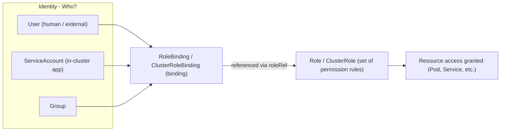

# RBAC and ServiceAccount - Who Can Do What

## Learning Objectives
- Understand the difference between Authentication and Authorization, and grasp the concept of Role-Based Access Control (RBAC)
- Explain the structure that grants permissions via Role/ClusterRole and RoleBinding/ClusterRoleBinding
- Assign least-privilege permissions to a ServiceAccount and verify them with `kubectl auth can-i`

## Content

### Introduction — What Happens Behind a Single `kubectl apply`

In the previous lecture we used Namespaces to divide the cluster logically and ResourceQuotas to limit resource consumption. But "dividing the space" alone is not enough. **If a member of development team A can freely delete Pods in the production namespace**, that isolation is meaningless. Controlling who can do what, where — that is the subject of this lecture: **RBAC (Role-Based Access Control)**.

The story starts with the `kubectl apply -f pod.yaml` command we type every day. When you run that command, kubectl reads your local configuration, connects to the API server, validates the YAML, and sends the request. But **kube-apiserver**, the brain of the cluster, does not immediately write the request to the etcd database. First, it passes the request through two gates.

> Gate 1 — **Authentication**: "Who are you?" The identity of the requesting party is verified. Failure returns `401 Unauthorized`.
> Gate 2 — **Authorization**: "Are you allowed to do that?" Once identity is confirmed, the cluster checks whether the principal has permission to perform that action. Failure returns `403 Forbidden`.

These two steps are often confused, but they are entirely separate. Think of it as the difference between showing your ID to receive an access badge (authentication) and having your badge restrict which rooms you can enter (authorization). **Being able to connect to the cluster does not mean you can create or read every resource.** You can pass authentication and still be blocked by authorization. RBAC is the most common mechanism responsible for that second gate.

As shown in the diagram below, a single request must pass through both authentication and authorization in sequence before it is written to etcd.

```mermaid Two gates — Authentication and Authorization — that a kube-apiserver request must pass through
flowchart LR
    K["kubectl apply request"] --> A{"Authentication: Who are you?"}
    A -->|"Identity verification failed"| E1["401 Unauthorized"]
    A -->|"Identity verified"| Z{"Authorization RBAC: Are you allowed?"}
    Z -->|"No permission"| E2["403 Forbidden"]
    Z -->|"Permission granted"| S["Stored in etcd and processed"]
```

### Why Have a "Role" Layer at All?

Imagine designing a permission management system from scratch. The simplest approach is a single table with three columns: `User | Permission | Resource` — entries like "John has read/write on app1, Robert has read on app2." That works fine at small scale.

The problem appears as things grow. If Robert and Jennifer are on the same team and both need read access to app1, you add two rows. As the number of people and resources multiplies, the table explodes combinatorially, and nowhere in the table is the fact captured that "these two share the same role."

The solution is **to stop linking users directly to permissions and instead insert a "role" layer between them**.

- First, define a container for permissions — a **Role**. (Example: the "viewer" role = permission to read Pods.)
- Permissions are assigned to the role, not to users.
- Finally, **bind** the role to users.

This separation means that when a new member joins, you simply bind them to an existing role — no need to duplicate permission definitions. The larger the organization, the more dramatically this decoupling simplifies security management. Kubernetes RBAC follows exactly this model, using the following three elements:

- **Identity** — Who? → User, **ServiceAccount**, Group
- **Permission** — What can be done? → **Role / ClusterRole**
- **Binding** — Who gets that permission? → **RoleBinding / ClusterRoleBinding**

The structure connecting identity to resource access in RBAC is shown below. As the diagram illustrates, identity and permissions are never linked directly — they must always connect through a Binding.



### Identity — The Critical Differences Among User, ServiceAccount, and Group

First, let's look at "who" — the identity side. Kubernetes has three types, and understanding their differences is critical in practice.

A **User** represents a human or an external system. Surprisingly, **Kubernetes has no object that represents a User.** There is no `kubectl create user` command. Instead, any principal holding a valid certificate signed by the cluster's Certificate Authority (CA) is treated as an authenticated user, and the Common Name (CN) field in the certificate becomes the username. In other words, Users are a concept managed entirely outside the cluster.

A **ServiceAccount (SA)** is an **identity for applications running inside the cluster, primarily Pods**. It works similarly to a User, but with one crucial difference: it is **a Kubernetes-native object managed directly by Kubernetes**, so it can be created from a YAML manifest like any other resource. When a Pod needs to call the Kubernetes API — for example, Prometheus discovering scrape targets, or the Nginx Ingress controller querying backend endpoint lists — it makes those calls under the permissions of its assigned SA.

A **Group** is a concept for bundling multiple identities together so you can grant permissions to all of them at once. Like User, **Group is not a Kubernetes object you can directly manage.** There is no `kubectl create group` command. Instead, group membership is typically conveyed by an **external authentication system (such as OIDC or LDAP) via a claim in the authentication token** (for example, a `groups` field in the token). The cluster simply receives the group name from the external identity provider and uses it as the subject in a Binding. In short, "this user belongs to the `dev-team` group" is declared by the external identity provider, not by Kubernetes.

> To summarize: **Users and Groups are managed outside the cluster; ServiceAccounts are the only identities managed directly as Kubernetes objects.** The exercises in this lecture use SAs because impersonating a human user account in a single-cluster environment like minikube is inconvenient — but the permission logic applies identically to Users and Groups.

Creating a ServiceAccount is as simple as any other resource:

```yaml
# qa-sa.yaml
apiVersion: v1
kind: ServiceAccount
metadata:
  name: qa
  namespace: staging
```

```bash
kubectl apply -f qa-sa.yaml
```

### Permission — What Does a Role's `rules` Express?

Next, "what can be done." What Kubernetes RBAC controls is **access to resources** such as Pods, Services, and Deployments. Because all of these resources are accessed through API endpoints, permissions are expressed in terms of two things: **which resources** and **which operations** are allowed.

- **resources**: targets such as `pods`, `services`, `pods/log`
- **verbs**: operation types such as `get`, `list`, `watch`, `create`, `update`, `patch`, `delete`
- **apiGroups**: the API group the resource belongs to. Core resources like Pod and Service use an **empty string `""`** (the core group); Deployments belong to `apps`; custom resources have their own groups.

A single combination of `apiGroups + resources + verbs` is called a **Rule**, and a collection of rules is a **Role**. For example, permission to "read (get/list) Pods and Services and access Pod logs" looks like this:

```yaml
# qa-role.yaml — valid only within the staging namespace
apiVersion: rbac.authorization.k8s.io/v1
kind: Role
metadata:
  name: qa-read
  namespace: staging
rules:
  - apiGroups: [""]                 # core group (Pod, Service, etc.)
    resources: ["pods", "services"]
    verbs: ["get", "list"]
  - apiGroups: [""]
    resources: ["pods/log"]         # Pod logs are a separate sub-resource
    verbs: ["get"]
```

Here, **anything not explicitly listed is denied.** RBAC uses a "deny by default" model. Because `create` and `delete` are absent from the rules above, a principal holding this Role cannot create or delete Pods. This is the starting point of the **principle of least privilege**.

### Role vs ClusterRole — The Scope Difference

The difference between Role and ClusterRole is exactly one thing: **the scope of the permissions**.

- **Role**: Valid **only within a specific namespace**. Can only be applied to namespace-scoped resources like Pods and Services.
- **ClusterRole**: **Not tied to any namespace.** Used when you need to access cluster-scoped resources like Nodes and PersistentVolumes, or when you need permissions that span all namespaces.

A common pitfall: Node and PersistentVolume are **cluster-scoped resources**, so listing them in a Role simply does not work — a Role handles only namespace-scoped resources. The fix is to change `kind: Role` to `kind: ClusterRole` (everything else stays the same).

```yaml
apiVersion: rbac.authorization.k8s.io/v1
kind: ClusterRole              # no namespace field
metadata:
  name: node-reader
rules:
  - apiGroups: [""]
    resources: ["nodes", "persistentvolumes"]
    verbs: ["get", "list"]
```

Another advantage of ClusterRole is **reusability**. If you define a common permission like "read Pods" as a ClusterRole once, multiple namespaces can pull it in via their own RoleBindings — no need to duplicate the same Role in every namespace.

### Binding — RoleBinding and ClusterRoleBinding

Now for the final piece that connects identity to permissions: the **Binding**. A RoleBinding has two essential fields:

- `roleRef`: which Role or ClusterRole to reference
- `subjects`: who (which User, ServiceAccount, or Group) receives the permission

```yaml
# qa-binding.yaml — grants the qa-read role to the qa SA in staging
apiVersion: rbac.authorization.k8s.io/v1
kind: RoleBinding
metadata:
  name: qa-read-binding
  namespace: staging
subjects:
  - kind: ServiceAccount
    name: qa
    # namespace can be omitted when it matches the RoleBinding's namespace (staging)
roleRef:
  kind: Role
  name: qa-read
  apiGroup: rbac.authorization.k8s.io
```

In the example above, the `namespace` field is intentionally left out of `subjects`. Because the `qa` SA lives in the same namespace as the RoleBinding (`staging`), **the field can be omitted**, and omitting it is more common in practice. You only need to specify it explicitly when pointing to a ServiceAccount in a different namespace.

The moment this RoleBinding is applied, the `qa` SA can read Pods and Services and access Pod logs within `staging`. **Deleting the binding removes the permission immediately, but the Role itself remains** and can be reused by other bindings. Once again, the separation between defining a permission and granting it is clear.

Understanding the rules for Binding combinations prevents a lot of confusion:

| Combination | Scope of permissions |
|---|---|
| **Role + RoleBinding** | Inside the namespace where the RoleBinding is located |
| **ClusterRole + RoleBinding** | **Restricted to the single namespace** where the RoleBinding is located (the ClusterRole behaves like a Role) |
| **ClusterRole + ClusterRoleBinding** | **Cluster-wide** across all namespaces |

The middle row is particularly important. **When you bind a ClusterRole via a RoleBinding, the permissions are scoped to the namespace containing that RoleBinding.** This makes it possible to define a single shared ClusterRole like "read Pods" and let each team safely reuse it by creating their own RoleBinding in their own namespace. By contrast, a `ClusterRoleBinding` grants permissions across the entire cluster with no namespace boundary, so use it sparingly and only when truly necessary. (Note: a ClusterRoleBinding cannot reference a Role, because Roles are namespace-scoped.)

The full binding structure and scope differences are summarized in the diagram below. As illustrated, the same ClusterRole can result in very different permission scopes depending on which type of Binding is used.

```mermaid Permission scope differences based on Role/ClusterRole and Binding combinations
flowchart TD
    R["Role (namespace-scoped)"] --> RB1["RoleBinding"]
    RB1 --> S1["Scope: within that namespace"]

    CR["ClusterRole (cluster-scoped)"] --> RB2["RoleBinding"]
    CR --> CRB["ClusterRoleBinding"]
    RB2 --> S2["Scope: restricted to one namespace"]
    CRB --> S3["Scope: cluster-wide, all namespaces"]

    RB3X["ClusterRoleBinding cannot reference Role"] -.->|"not allowed"| R
```

### Verifying Permissions — `kubectl auth can-i`

Once permissions have been granted, you need to **verify that they actually work as intended.** You do not need to spin up a Pod as the SA every time — the `kubectl auth can-i` command combined with impersonation gives you an immediate answer.

Use the `--as` flag to send a request impersonating a specific SA. The string format for impersonating a ServiceAccount is fixed: `system:serviceaccount:<namespace>:<sa-name>`.

```bash
# Can the qa SA in staging get Pods in staging?
kubectl auth can-i get pods \
  --namespace staging \
  --as system:serviceaccount:staging:qa
# Output: yes

# Can the same SA get Pods in production?
kubectl auth can-i get pods \
  --namespace production \
  --as system:serviceaccount:staging:qa
# Output: no   (the qa-read Role exists only in staging)

# Can it read Pod logs?
kubectl auth can-i get pods/log \
  --namespace staging \
  --as system:serviceaccount:staging:qa
# Output: yes

# What about delete, which was never granted?
kubectl auth can-i delete pods \
  --namespace staging \
  --as system:serviceaccount:staging:qa
# Output: no   (delete verb is not in the rules, so it is denied)
```

You can also quickly check your own permissions without `--as`.

```bash
kubectl auth can-i create deployments --namespace staging   # check my own permission
kubectl auth can-i --list --namespace staging               # list my permissions in that namespace
```

> Important: `kubectl auth can-i --list` shows only the permissions in the **current context's namespace** (or the one specified with `--namespace`) — not your entire permission set across the cluster. The command above shows only what you can do within `staging`. Permissions on cluster-scoped resources like Nodes or PersistentVolumes, or permissions in other namespaces, may not appear. Do not assume "this is everything I can do." Check each namespace you care about explicitly to avoid misreading your access during a security audit.

> Pro tip: After granting or revoking permissions, always use `auth can-i` to verify **both directions** — "what should be allowed returns yes, what should be blocked returns no." Checking only what you granted and forgetting to verify what you blocked is how over-permissioning slips through.

### Exploring Kubernetes Built-in Roles

Kubernetes ships with several useful ClusterRoles out of the box. The most notable are `cluster-admin` (full access), `admin`, `edit`, and `view` (read-only). Roles managed by the control plane typically carry the `system:` prefix.

```bash
# Linux/macOS (bash) — filter with grep
kubectl get clusterroles | grep -E "cluster-admin|^edit|^view"

# Windows (PowerShell / CMD) — use findstr instead of grep
kubectl get clusterroles | findstr /R /C:"cluster-admin" /C:"^edit" /C:"^view"

kubectl describe clusterrole view      # inspect what permissions the view role contains (all OS)
```

> OS compatibility note: `grep` is a Linux/macOS shell utility and is not built into Windows PowerShell or CMD. On Windows, use `findstr` (regex with `/R`, search terms with `/C:"pattern"`) or, in PowerShell, `kubectl get clusterroles | Select-String "cluster-admin|edit|view"`. kubectl commands that do not involve a pipe — such as `get` or `describe` — work identically on all operating systems.

Before writing a custom Role, check whether one of these built-in roles already covers your needs — it can save you from unnecessary definitions. That said, never casually bind `cluster-admin` to a user or application with a ClusterRoleBinding; it grants unrestricted access to the entire cluster.

### Least-Privilege Design Checklist

When applying RBAC in production, keep the following principles in mind:

- **Grant only the verbs and resources you actually need.** Avoid wildcard `*` and `verbs: ["*"]` wherever possible.
- **Assign an appropriate ServiceAccount to each Pod.** If none is specified, the namespace's `default` SA is used. For Pods that never call the Kubernetes API, set `automountServiceAccountToken: false` to disable automatic token mounting and reduce the attack surface.
- **Keep scope as narrow as possible.** Do not use ClusterRoleBinding for permissions that only need to apply within a single namespace.
- **Always verify after granting.** Use `kubectl auth can-i` to confirm both allowed and denied cases, specifying the target namespace explicitly.

## Key Takeaways
- **Authentication (who are you, 401) and Authorization (are you allowed, 403) are separate steps.** RBAC handles authorization, inserting a "role" layer between identities and permissions to simplify access management.
- Identities come in three types: **User (human/external, managed outside the cluster)**, **Group (external groups delivered as claims by OIDC/LDAP, not a Kubernetes object)**, and **ServiceAccount (in-cluster app, a Kubernetes object managed via YAML)**. Only ServiceAccounts are managed directly by Kubernetes.
- Permissions are defined as **Role (namespace-scoped)** / **ClusterRole (cluster-wide)** — each a collection of `apiGroups + resources + verbs` rules. RBAC is deny by default.
- Bindings are **RoleBinding / ClusterRoleBinding**. Binding a ClusterRole via a RoleBinding restricts the permission to that namespace, enabling safe reuse of a common role across teams. The `namespace` field in `subjects` can be omitted when it matches the RoleBinding's own namespace.
- Always verify permissions with `kubectl auth can-i ... --as system:serviceaccount:<ns>:<sa>`, checking both the allowed and denied cases. `--list` shows only the specified namespace — do not treat it as your complete permission set. Follow the principle of least privilege.

## Sources
- Anton Putra, "Kubernetes RBAC Explained" — https://www.youtube.com/watch?v=iE9Qb8dHqWI
- Google Cloud Tech, "What are Service Accounts?" — https://www.youtube.com/watch?v=xXk1YlkKW_k
