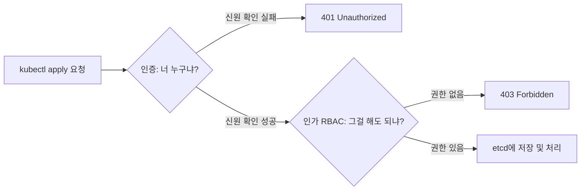
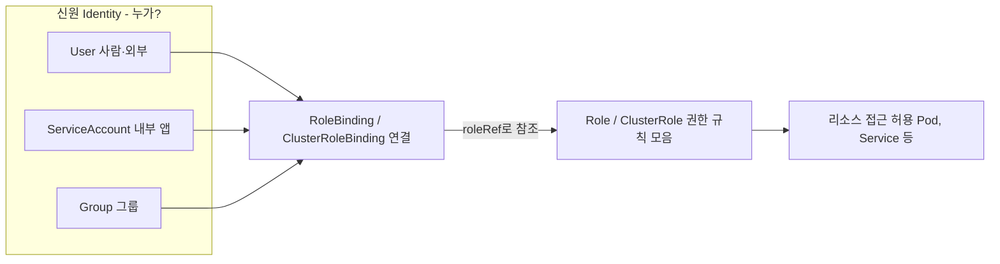
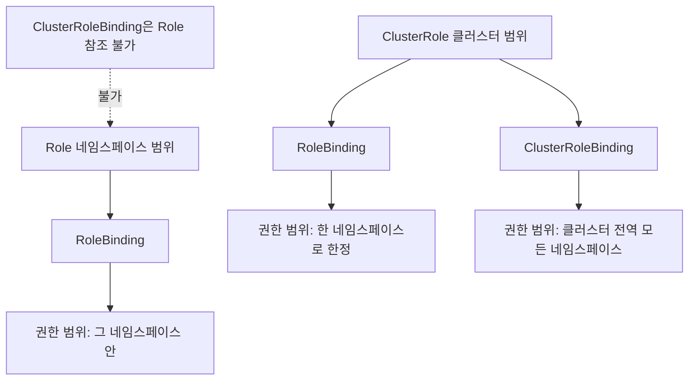

# RBAC와 ServiceAccount - 누가 무엇을 할 수 있는가

## 학습 목표
- 인증(Authentication)과 인가(Authorization)의 차이, RBAC의 역할 기반 접근 제어 개념을 이해한다
- Role/ClusterRole과 RoleBinding/ClusterRoleBinding으로 권한을 부여하는 구조를 설명한다
- ServiceAccount에 최소 권한을 부여하고 kubectl auth can-i로 권한을 검증해본다

## 본문

### 들어가며 — kubectl apply 한 줄 뒤에서 벌어지는 일

앞 강의에서 우리는 Namespace로 클러스터를 논리적으로 나누고 ResourceQuota로 사용량을 제한했다. 그런데 "공간을 나누는 것"만으로는 부족하다. **개발팀 A의 멤버가 운영(production) 네임스페이스의 Pod를 멋대로 지울 수 있다면** 격리는 의미가 없다. 누가 어디서 무엇을 할 수 있는지를 통제하는 것, 그것이 이번 강의의 주제인 **RBAC(Role-Based Access Control, 역할 기반 접근 제어)** 다.

이야기는 우리가 매일 치는 `kubectl apply -f pod.yaml` 한 줄에서 시작한다. 이 명령을 입력하면 kubectl은 로컬 설정을 읽어 API 서버에 접속하고, YAML을 검증한 뒤 요청을 보낸다. 그런데 클러스터의 두뇌인 **kube-apiserver**는 이 요청을 받자마자 곧장 etcd 데이터베이스에 저장하지 않는다. 그 전에 두 개의 문을 통과시킨다.

> 1번 문 — **인증(Authentication)**: "너 누구냐?" 요청한 주체가 누구인지 신원을 확인한다. 실패하면 `401 Unauthorized`.
> 2번 문 — **인가(Authorization)**: "그걸 해도 되냐?" 신원이 확인된 주체에게 그 작업을 할 권한이 있는지 확인한다. 실패하면 `403 Forbidden`.

이 둘은 자주 헷갈리지만 전혀 다른 단계다. 신분증을 보여 출입증을 받는 것(인증)과, 그 출입증으로 들어갈 수 있는 방이 정해져 있는 것(인가)의 차이다. **클러스터에 접속할 수 있다고 해서 모든 리소스를 만들거나 읽을 수 있는 건 아니다.** 인증을 통과해도 인가에서 막힐 수 있다. 이 2번 문, 즉 인가를 담당하는 가장 대표적인 방식이 RBAC다.

아래 흐름처럼 하나의 요청은 인증과 인가라는 두 관문을 순서대로 통과해야 비로소 etcd에 반영된다.



### 왜 "역할(Role)"이라는 단계를 두는가

권한 관리 시스템을 맨바닥부터 설계한다고 상상해 보자. 가장 단순한 방법은 표 하나를 만드는 것이다. `사용자 | 권한 | 리소스` 세 칸으로, "John은 app1에 읽기/쓰기, Robert는 app2에 읽기"처럼 적는다. 사용자와 리소스가 적을 땐 잘 돌아간다.

문제는 규모가 커질 때다. Robert와 Jennifer가 같은 팀이라 둘 다 app1 읽기 권한을 줘야 한다면 행을 두 줄 추가해야 한다. 사람이 늘고 리소스가 늘수록 행은 곱하기로 폭발하고, "이 둘이 같은 팀이라 같은 권한"이라는 의미는 표에서 드러나지 않는다.

해법은 **사용자와 권한을 직접 묶지 않고 그 사이에 '역할'이라는 그릇을 끼워 넣는 것**이다.

- 먼저 권한들을 담는 그릇 = **역할(Role)** 을 정의한다. (예: "viewer" 역할 = Pod 읽기 권한)
- 권한은 사용자가 아니라 역할에 부여한다.
- 마지막으로 역할을 사용자에게 **연결(binding)** 한다.

이렇게 분리하면 새 멤버가 들어와도 기존 역할에 연결만 하면 된다. 권한 정의를 복제할 필요가 없다. 큰 조직일수록 이 분리(decoupling)가 보안 관리를 극적으로 단순하게 만든다. 쿠버네티스의 RBAC도 정확히 이 모델을 따르며, 세 요소를 다음과 같이 부른다.

- **신원(Identity)** — 누가? → User, **ServiceAccount**, Group
- **권한(Permission)** — 무엇을 할 수 있나? → **Role / ClusterRole**
- **연결(Binding)** — 누구에게 그 권한을? → **RoleBinding / ClusterRoleBinding**

RBAC가 신원에서 리소스 접근까지 이어지는 구조는 다음과 같다. 아래 구성도처럼 신원과 권한은 직접 연결되지 않고 반드시 Binding을 거쳐 이어진다.



### 신원(Identity) — User와 ServiceAccount의 결정적 차이

먼저 "누가"에 해당하는 신원이다. 쿠버네티스에는 세 종류가 있고, 그중 User와 ServiceAccount의 차이가 실무에서 매우 중요하다.

**User(사용자)** 는 사람이나 클러스터 외부 시스템을 위한 신원이다. 그런데 놀랍게도 **쿠버네티스에는 User를 나타내는 오브젝트가 없다.** `kubectl create user` 같은 명령은 존재하지 않는다. 대신 클러스터 인증 기관(CA)이 서명한 유효한 인증서를 가진 주체를 인증된 사용자로 간주하고, 인증서의 이름 필드(Common Name)를 사용자 이름으로 삼는다. 즉 User는 외부에서 관리되는 개념이다.

**ServiceAccount(SA, 서비스 어카운트)** 는 **클러스터 내부에서 동작하는 애플리케이션(주로 Pod)을 위한 신원**이다. User와 거의 같지만 결정적으로 **쿠버네티스가 직접 관리하는 오브젝트**라서, 다른 리소스처럼 YAML로 만들 수 있다. Pod가 쿠버네티스 API를 호출해야 할 때(예: Prometheus가 모니터링 대상을 탐색, Nginx Ingress 컨트롤러가 백엔드 엔드포인트 목록 조회) 바로 이 SA의 권한으로 호출한다.

**Group(그룹)** 은 여러 신원을 묶어 한 번에 권한을 주기 위한 개념이다. User와 마찬가지로 **쿠버네티스가 직접 관리하는 오브젝트가 아니다.** `kubectl create group` 같은 명령은 없으며, 그룹 정보는 보통 **외부 인증 시스템(예: OIDC, LDAP)이 인증 토큰에 담아 보내는 claim**(예: 토큰의 `groups` 필드)으로 전달된다. 즉 "이 사용자는 `dev-team` 그룹 소속"이라는 사실은 클러스터 바깥의 인증 공급자가 알려주고, 쿠버네티스는 그 그룹 이름을 Binding의 주체로 받아 권한을 적용한다.

> 정리하면, **사람·외부 시스템은 User, 외부 그룹은 Group, 클러스터 안에서 도는 앱은 ServiceAccount** 다. User와 Group은 클러스터 외부에서 관리되고, ServiceAccount만 쿠버네티스 오브젝트로 직접 만든다. 이번 실습은 minikube 같은 단일 클러스터에서 사람 계정을 흉내 내기 어렵기 때문에 SA로 진행하지만, 권한이 적용되는 논리는 User·Group에도 똑같다.

ServiceAccount 생성은 다른 리소스만큼 간단하다.

```yaml
# qa-sa.yaml
apiVersion: v1
kind: ServiceAccount
metadata:
  name: qa
  namespace: staging
```

```bash
kubectl apply -f qa-sa.yaml
```

### 권한(Permission) — Role의 rules는 무엇을 표현하나

다음은 "무엇을 할 수 있나"다. 쿠버네티스에서 우리가 통제하려는 것은 Pod, Service, Deployment 같은 **리소스에 대한 접근**이다. 이 리소스들은 모두 API 엔드포인트를 통해 접근되므로, 권한은 결국 **"어떤 리소스에 어떤 동작을 허용할지"** 두 가지로 표현된다.

- **resources(리소스)**: `pods`, `services`, `pods/log` 등 대상
- **verbs(동사)**: `get`, `list`, `watch`, `create`, `update`, `patch`, `delete` 등 동작 종류
- **apiGroups(API 그룹)**: 리소스가 속한 API 묶음. Pod·Service 같은 핵심 리소스는 **빈 문자열 `""`**(core 그룹)이고, Deployment는 `apps`, 커스텀 리소스는 각자의 그룹을 가진다.

이 `apiGroups + resources + verbs` 한 묶음을 **규칙(Rule)** 이라 하고, 규칙들의 모음이 바로 **Role** 이다. 예를 들어 "Pod와 Service를 조회(get/list)하고, Pod의 로그를 읽을 수 있는" 권한은 이렇게 쓴다.

```yaml
# qa-role.yaml — staging 네임스페이스 안에서만 유효
apiVersion: rbac.authorization.k8s.io/v1
kind: Role
metadata:
  name: qa-read
  namespace: staging
rules:
  - apiGroups: [""]                 # core 그룹 (Pod, Service 등)
    resources: ["pods", "services"]
    verbs: ["get", "list"]
  - apiGroups: [""]
    resources: ["pods/log"]         # Pod의 로그는 별도 하위 리소스
    verbs: ["get"]
```

여기서 **명시하지 않은 것은 모두 거부된다.** RBAC는 "기본 거부(deny by default)" 모델이다. 위 Role에는 `create`나 `delete`가 없으므로 이 역할을 가진 주체는 Pod를 만들거나 지울 수 없다. 이것이 **최소 권한 원칙(least privilege)** 의 출발점이다.

### Role vs ClusterRole — 범위(scope)의 차이

Role과 ClusterRole의 차이는 단 하나, **권한이 미치는 범위**다.

- **Role**: 특정 **네임스페이스 안에서만** 유효. Pod, Service 같은 네임스페이스 소속 리소스에만 쓸 수 있다.
- **ClusterRole**: **네임스페이스에 속하지 않는다.** Node, PersistentVolume처럼 클러스터 전역 리소스(cluster-scoped)에 접근하거나, 모든 네임스페이스에 걸친 권한을 줄 때 쓴다.

흔한 함정이 있다. Node나 PersistentVolume은 **클러스터 전역 리소스**라서 Role에 적어 넣어도 동작하지 않는다. Role은 네임스페이스 범위 리소스만 다루기 때문이다. 이때는 `kind: Role`을 `kind: ClusterRole`로 바꾸기만 하면 된다(나머지는 동일).

```yaml
apiVersion: rbac.authorization.k8s.io/v1
kind: ClusterRole              # 네임스페이스 필드 없음
metadata:
  name: node-reader
rules:
  - apiGroups: [""]
    resources: ["nodes", "persistentvolumes"]
    verbs: ["get", "list"]
```

ClusterRole의 또 다른 장점은 **재사용성**이다. "Pod 읽기" 같은 공통 권한을 ClusterRole로 한 번만 정의해 두면, 여러 네임스페이스에서 같은 권한을 RoleBinding으로 끌어다 쓸 수 있어 동일한 Role을 네임스페이스마다 복제할 필요가 없다.

### 연결(Binding) — RoleBinding과 ClusterRoleBinding

이제 신원과 권한을 잇는 마지막 조각, **연결**이다. RoleBinding에는 두 개의 핵심 필드가 있다.

- `roleRef`: 어떤 Role/ClusterRole을 참조할지
- `subjects`: 누구에게(어떤 User/ServiceAccount/Group) 줄지

```yaml
# qa-binding.yaml — staging의 qa SA에게 qa-read 역할을 부여
apiVersion: rbac.authorization.k8s.io/v1
kind: RoleBinding
metadata:
  name: qa-read-binding
  namespace: staging
subjects:
  - kind: ServiceAccount
    name: qa
    # RoleBinding과 같은 네임스페이스(staging)이므로 namespace 필드는 생략
roleRef:
  kind: Role
  name: qa-read
  apiGroup: rbac.authorization.k8s.io
```

위 예시에서 `subjects`에는 `namespace` 필드를 일부러 적지 않았다. 주체인 qa SA가 RoleBinding 자신이 위치한 네임스페이스(`staging`)와 같기 때문에 **생략할 수 있고**, 실무에서는 생략하는 경우가 더 흔하다. **다른 네임스페이스의 ServiceAccount를 주체로 지정할 때만** `namespace: <대상 네임스페이스>`를 명시하면 된다.

이 RoleBinding을 적용하는 순간 qa SA는 staging 안에서 Pod·Service를 조회하고 로그를 읽을 수 있게 된다. **연결을 지우면 권한도 즉시 사라지지만 Role 자체는 그대로 남아** 다른 binding에 재사용될 수 있다. 권한 정의와 부여가 분리되어 있다는 점이 다시 한번 드러난다.

여기서 Binding 조합의 규칙을 알아야 헷갈리지 않는다.

| 조합 | 권한이 미치는 범위 |
|------|------|
| **Role + RoleBinding** | RoleBinding이 위치한 그 네임스페이스 안 |
| **ClusterRole + RoleBinding** | RoleBinding이 위치한 **한 네임스페이스 안**으로 한정됨 (ClusterRole이지만 마치 Role처럼 동작) |
| **ClusterRole + ClusterRoleBinding** | 클러스터 **전역** 모든 네임스페이스 |

특히 중간 행이 핵심이다. **ClusterRole을 RoleBinding으로 연결하면, 권한은 그 RoleBinding이 있는 네임스페이스로만 제한된다.** 이 덕분에 "Pod 읽기" 같은 공통 ClusterRole 하나를 만들어 두고, 팀마다 자기 네임스페이스에 RoleBinding만 걸어 동일 권한을 안전하게 나눠 줄 수 있다. 반대로 `ClusterRoleBinding`은 네임스페이스 개념이 없어 권한을 클러스터 전체에 부여하므로, 꼭 필요한 경우에만 신중히 쓴다. (참고: ClusterRoleBinding은 Role을 참조할 수 없다. Role은 네임스페이스에 속하기 때문이다.)

전체 연결 구조와 범위 차이는 다음 그림으로 정리된다. 아래 그림처럼 같은 ClusterRole이라도 어떤 Binding으로 연결하느냐에 따라 권한이 미치는 범위가 달라진다.



### 권한 검증 — kubectl auth can-i

권한을 부여했다면 **실제로 의도대로 동작하는지 검증**해야 한다. 매번 SA로 Pod를 띄워 시험할 필요 없이, `kubectl auth can-i`와 사용자 가장(impersonation) 기능을 조합하면 즉시 확인할 수 있다.

`--as` 플래그로 특정 SA인 척(impersonate) 요청을 보내 본다. ServiceAccount를 가장할 때 문자열 형식은 정해져 있다: `system:serviceaccount:<네임스페이스>:<SA이름>`.

```bash
# staging의 qa SA가 staging에서 Pod를 조회할 수 있는가?
kubectl auth can-i get pods \
  --namespace staging \
  --as system:serviceaccount:staging:qa
# 출력: yes

# 같은 SA가 production의 Pod를 조회할 수 있는가?
kubectl auth can-i get pods \
  --namespace production \
  --as system:serviceaccount:staging:qa
# 출력: no   (qa-read Role은 staging에만 존재)

# 로그는 읽을 수 있는가?
kubectl auth can-i get pods/log \
  --namespace staging \
  --as system:serviceaccount:staging:qa
# 출력: yes

# 부여하지 않은 삭제 권한은?
kubectl auth can-i delete pods \
  --namespace staging \
  --as system:serviceaccount:staging:qa
# 출력: no   (rules에 delete verb가 없으므로 거부)
```

`--as` 없이 자기 자신의 권한을 빠르게 점검할 수도 있다.

```bash
kubectl auth can-i create deployments --namespace staging   # 내 권한 확인
kubectl auth can-i --list --namespace staging               # 지정한 네임스페이스 안에서 내가 가진 권한 나열
```

> 주의: `kubectl auth can-i --list`는 **클러스터 전체 권한이 아니라, 현재 컨텍스트의 네임스페이스(또는 `--namespace`로 지정한 네임스페이스) 안에서의 권한만** 나열한다. 즉 위 명령은 `staging` 네임스페이스 한정 결과다. Node·PersistentVolume 같은 클러스터 전역 리소스 권한이나 다른 네임스페이스의 권한은 여기에 나타나지 않을 수 있으므로, "이게 내 전부 권한"이라고 단정하면 보안 점검에서 오판하기 쉽다. 네임스페이스를 바꿔 가며 확인하거나 대상 네임스페이스를 명시해 점검하라.

> 실무 팁: 새 권한을 부여하거나 회수한 직후에는 반드시 `auth can-i`로 "허용해야 할 것은 yes, 막아야 할 것은 no"를 양쪽 다 확인하라. "주는 것"만 확인하고 "막는 것"을 빼먹으면 과잉 권한이 새어 나간다.

### 쿠버네티스 기본 제공 역할 살펴보기

쿠버네티스는 클러스터 생성 시 유용한 ClusterRole 몇 가지를 기본 제공한다. `cluster-admin`(전권), `admin`, `edit`, `view`(읽기 전용) 등이 대표적이다. 컨트롤 플레인이 관리하는 역할은 보통 `system:` 접두사를 가진다.

```bash
# Linux/macOS (bash) — grep으로 필터링
kubectl get clusterroles | grep -E "cluster-admin|^edit|^view"

# Windows (PowerShell / CMD) — grep이 없으므로 findstr로 대체
kubectl get clusterroles | findstr /R /C:"cluster-admin" /C:"^edit" /C:"^view"

kubectl describe clusterrole view      # view 역할이 어떤 권한을 담고 있는지 확인 (OS 공통)
```

> OS 호환 팁: `grep`은 Linux·macOS 셸 도구라 Windows의 PowerShell/CMD에는 기본 탑재되어 있지 않다. Windows에서는 `findstr`(정규식은 `/R`, 검색어는 `/C:"패턴"`)을 쓰거나, PowerShell이라면 `kubectl get clusterroles | Select-String "cluster-admin|edit|view"` 처럼 `Select-String`을 써도 된다. 단순 조회·describe처럼 파이프(`|`)가 없는 kubectl 명령은 모든 OS에서 그대로 동작한다.

직접 Role을 짜기 전에 이 기본 역할로 충분한지 먼저 살펴보면 불필요한 정의를 줄일 수 있다. 다만 `cluster-admin`은 말 그대로 전권이므로 사람이나 앱에 함부로 ClusterRoleBinding으로 붙이지 않는다.

### 최소 권한 설계 체크리스트

RBAC를 실무에 적용할 때 지킬 원칙을 정리하면 다음과 같다.

- **꼭 필요한 verb·resource만 부여한다.** `*`(모든 권한)와 `verbs: ["*"]`는 가능한 한 피한다.
- **Pod마다 적절한 ServiceAccount를 지정한다.** 지정하지 않으면 네임스페이스의 `default` SA가 쓰인다. API를 호출할 필요 없는 Pod라면 `automountServiceAccountToken: false`로 토큰 자동 마운트를 꺼 공격 표면을 줄인다.
- **범위는 좁게.** 한 네임스페이스면 충분한 권한에 ClusterRoleBinding을 쓰지 않는다.
- **부여 후 반드시 검증한다.** `kubectl auth can-i`로 허용/거부 양쪽을, 점검하려는 네임스페이스를 명시해 확인한다.

## 핵심 요약
- **인증(누구냐, 401)과 인가(해도 되냐, 403)는 다른 단계**다. RBAC는 인가를 담당하며, 사용자와 권한 사이에 '역할'을 끼워 넣어 권한 관리를 단순화한다.
- 신원은 **User(사람·외부)** · **Group(외부 그룹, OIDC 등 외부 시스템의 claim으로 전달)** · **ServiceAccount(클러스터 내부 앱, 쿠버네티스가 YAML로 관리)** 로 나뉜다. User·Group은 클러스터 외부에서 관리되고 SA만 쿠버네티스 오브젝트다.
- 권한은 `apiGroups + resources + verbs` 규칙의 모음인 **Role(네임스페이스 범위)** / **ClusterRole(클러스터 전역)** 으로 정의하며, RBAC는 기본 거부 모델이다.
- 연결은 **RoleBinding/ClusterRoleBinding**. 특히 ClusterRole을 RoleBinding으로 연결하면 권한이 해당 네임스페이스로 한정되어 공통 역할을 안전하게 재사용할 수 있다. subjects의 namespace는 RoleBinding과 같으면 생략 가능하다.
- 권한은 반드시 `kubectl auth can-i ... --as system:serviceaccount:<ns>:<sa>` 로 허용·거부를 함께 검증한다. `--list`는 지정한 네임스페이스 범위만 보여주므로 전체 권한으로 오해하지 않는다. 최소 권한 원칙을 지킨다.

## 출처
- Anton Putra, "Kubernetes RBAC Explained" — https://www.youtube.com/watch?v=iE9Qb8dHqWI
- Google Cloud Tech, "What are Service Accounts?" — https://www.youtube.com/watch?v=xXk1YlkKW_k
