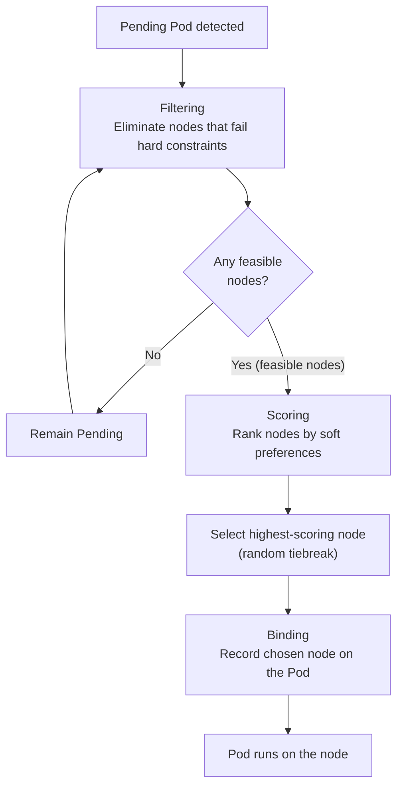

# Scheduling Control - Affinity and Taints/Tolerations

## Learning Objectives
- Understand how the scheduler places Pods onto nodes, and recognize situations where explicit placement control is needed
- Express placement rules using nodeSelector and Node/Pod Affinity and Anti-Affinity
- Configure scheduling hands-on: use Taints to restrict nodes and Tolerations to grant exceptions

## Content

### How the Scheduler Places a Pod onto a Node

One of Kubernetes' greatest strengths is that it abstracts away individual servers. You simply create a Pod without worrying about which machine it runs on, and the **scheduler (kube-scheduler)** — built into the cluster — examines the current CPU and memory state of each node and decides where to place it.

This decision happens in two phases.

1. **Filtering (Predicates)** — Hard constraints that cannot be violated are used to eliminate candidate nodes. For example, if a Pod requests 2 CPU and 4 Gi of memory, any node that cannot satisfy those requirements is removed from consideration entirely. The nodes that survive are called **feasible nodes**.
2. **Scoring (Priorities)** — The remaining feasible nodes are ranked by score. **Soft preferences** — such as spreading workloads evenly across nodes — are factored in here. The node with the highest score is selected; ties are broken randomly.

The final act of recording the chosen node on the Pod object is called **binding**. Until then, the Pod floats in a Pending state with no assigned node, and the scheduler continuously watches for such unscheduled Pods. The flow is illustrated in the diagram below.



> The key distinction: **filtering enforces rules that cannot be broken; scoring reflects preferences that can be.** Every placement rule you write ultimately belongs to one of these two phases.

### Why You Need to Give the Scheduler Extra Instructions

The default scheduler is smart, but it has no knowledge of your **business intent**. Real-world clusters contain nodes with very different characteristics.

- **Spot nodes** — cheap, but can be reclaimed at any time. Only interruption-tolerant workloads should run here.
- **GPU nodes** — designed for machine learning jobs. These are expensive; letting arbitrary Pods land on them is wasteful.
- **Local SSD nodes** — reserved for I/O-intensive workloads like Kafka that demand disk performance.
- **ARM (Graviton) nodes** — cost-effective, but only images built for that architecture will run on them.

Without explicit guidance, the default scheduler might place an ordinary web Pod on a GPU node, or put two replicas of a critical service on the same node — so that when that node fails, the entire service goes down. That is why we express **placement rules** explicitly.

Kubernetes offers two broad categories of control. One is a **"pull" approach — attracting Pods toward specific nodes** (nodeSelector, Affinity). The other is a **"push" approach — having nodes repel Pods** (Taints/Tolerations). Both start with **labels attached to nodes**.

```bash
# View all labels currently on nodes (there are many built-in labels)
kubectl get nodes --show-labels

# Manually add a label to a node (in production, use Terraform or similar tools for bulk application)
kubectl label nodes <node-name> disktype=ssd
kubectl label nodes <node-name> price=spot
```

> In production, labels are not applied to nodes one by one by hand. On cloud platforms, they are assigned in bulk at node-group creation time using tools like Terraform or eksctl. Manual labeling is for learning and testing.

### nodeSelector — The Simplest Pull

This is the oldest and simplest approach. Add a single key-value entry to the PodSpec, and the Pod will only be placed on nodes that carry **all** of those labels.

```yaml
apiVersion: apps/v1
kind: Deployment
metadata:
  name: ssd-app
spec:
  replicas: 1
  selector:
    matchLabels: { app: ssd-app }
  template:
    metadata:
      labels: { app: ssd-app }
    spec:
      nodeSelector:
        disktype: ssd        # place only on nodes with the disktype=ssd label
      containers:
        - name: app
          image: nginx
```

Check which node the Pod landed on using `-o wide`.

```bash
kubectl get pods -o wide
```

nodeSelector is powerful but **inflexible**. It cannot express "this label OR that label" (OR) or "nodes without this label" (NOT). If no node satisfies the constraint, the Pod gets stuck in Pending. A typo in the label name has the same effect — use `describe` to diagnose the cause.

```bash
kubectl describe pod <pod-name>
# Look for a message like "didn't match Pod's node affinity/selector" in the Events section
```

### Node Affinity — A More Expressive Pull

Node Affinity does the same job as nodeSelector — placing Pods based on node labels — but with far greater expressiveness. The names are long, but the structure is straightforward once you understand it. There are two types.

- `requiredDuringSchedulingIgnoredDuringExecution` — **Hard constraint.** If no node matches, the Pod stays Pending. (= Filtering phase)
- `preferredDuringSchedulingIgnoredDuringExecution` — **Soft preference.** Honored when possible; if not, the Pod is placed on another available node. (= Scoring phase)

The `IgnoredDuringExecution` suffix means **"this rule is not re-evaluated for Pods that are already running."** If a node's labels change or are removed after a Pod is scheduled there, the running Pod is not evicted. The rule is evaluated only at scheduling time.

Here is the earlier nodeSelector example rewritten as a hard Node Affinity rule.

```yaml
spec:
  affinity:
    nodeAffinity:
      requiredDuringSchedulingIgnoredDuringExecution:
        nodeSelectorTerms:
          - matchExpressions:
              - key: disktype
                operator: In        # In, NotIn, Exists, DoesNotExist, Gt, Lt
                values: ["ssd"]
```

Listing multiple values inside `values` is an **OR** within that list (either `ssd` or `nvme` will match). By contrast, listing multiple entries under `matchExpressions` is an **AND** — every condition must be satisfied. If a node does not carry all of those labels, the Pod will be stuck Pending, so be careful.

A soft preference uses `weight` (1–100) to express the strength of preference. Nodes that score higher are preferred, but failing to match does not cause Pending.

```yaml
spec:
  affinity:
    nodeAffinity:
      preferredDuringSchedulingIgnoredDuringExecution:
        - weight: 80
          preference:
            matchExpressions:
              - key: price
                operator: In
                values: ["spot"]   # prefer cheaper spot nodes when available
```

> Production recommendation: favor Node Affinity over nodeSelector, and default to `preferred` (soft) within Node Affinity. Hard constraints can reduce availability by leaving Pods stuck in Pending when resources are scarce.

### Pod Affinity / Anti-Affinity — Placement Based on Pod Relationships

You can also base placement decisions on **the labels of other Pods** rather than node labels. There are two motivations.

- **Anti-Affinity (spread apart)** — Distribute Pods of the same role across different nodes. If one node fails or is drained, replicas on other nodes remain alive. Commonly used for workloads like Nginx Ingress controllers that must never all go down together.
- **Affinity (co-locate)** — Place Pods that communicate frequently on the same node to reduce latency. Example: scheduling Kafka and ZooKeeper on the same node.

A concept you must understand here is **topologyKey** — the **label key on nodes that defines what counts as "same" and "different" for the purposes of the rule**. The most common value is `kubernetes.io/hostname` (node-level granularity); using `topology.kubernetes.io/zone` shifts the boundary to availability zones.

A common misunderstanding: topologyKey does not require all nodes to share the same **value** for that label. Instead, the scheduler groups nodes whose label value is identical into a single **topology domain** (for example, nodes with the same hostname are in the same domain, nodes in the same zone are in the same zone domain), and then evaluates whether two Pods land in the same or different domains. For this to work, **candidate nodes must actually carry that label key**. If a node is missing the key entirely, the scheduler cannot determine which domain it belongs to and simply **excludes it from that rule's evaluation** — no error is raised. This is why using labels that Kubernetes automatically applies to every node, like `kubernetes.io/hostname`, is the safest choice.

Here is an Anti-Affinity example that spreads two replicas across different nodes.

```yaml
spec:
  replicas: 2
  template:
    metadata:
      labels: { app: web }
    spec:
      affinity:
        podAntiAffinity:
          requiredDuringSchedulingIgnoredDuringExecution:
            - labelSelector:
                matchLabels: { app: web }   # reject any node that already has an app=web Pod
              topologyKey: kubernetes.io/hostname
      containers:
        - name: web
          image: nginx
```

Using `required` means that if there are fewer nodes than replicas, the excess Pods get stuck in Pending. If spreading is a preference rather than a hard requirement, switch to `preferred` — this allows co-location when no other option is available.

Swapping `podAntiAffinity` for `podAffinity` reverses the logic, pulling Pods with matching labels onto the same node. One important caveat: Affinity and Anti-Affinity evaluate Pods within **the same namespace by default**. To evaluate across namespaces, add `namespaceSelector: {}` (an empty object matches all namespaces).

> Pod Affinity is computationally expensive for the scheduler. Use it thoughtfully in large clusters with hundreds of nodes.

### Taints and Tolerations — Nodes That Repel Pods

Everything covered so far has been about "pulling" Pods toward nodes. **A Taint is the opposite — the node pushes Pods away.** It is used to prevent arbitrary Pods from landing on special-purpose nodes like GPU instances or spot nodes.

Once a Taint is applied to a node, only Pods that carry a matching **Toleration** are permitted to run there. Think of it as a lock (Taint) and a key (Toleration).

A Taint takes the form `key=value:effect`. There are three effects.

- `NoSchedule` — Pods without a matching Toleration are **not scheduled** on this node (existing Pods are unaffected).
- `PreferNoSchedule` — Pods are steered away from this node when possible, but may still be placed here if no alternatives exist (soft).
- `NoExecute` — New Pods without a Toleration are blocked **and existing Pods on this node that lack a Toleration are evicted**.

```bash
# Apply a Taint to a node
kubectl taint nodes <node-name> dedicated=gpu:NoSchedule

# Verify the Taint
kubectl describe node <node-name> | grep -i taint

# Remove a Taint (append a hyphen after the key)
kubectl taint nodes <node-name> dedicated=gpu:NoSchedule-
```

To allow a desired Pod to run on that tainted node, add a Toleration to the Pod.

```yaml
spec:
  tolerations:
    - key: "dedicated"
      operator: "Equal"
      value: "gpu"
      effect: "NoSchedule"
  containers:
    - name: gpu-job
      image: my-ml-image
```

There is one common misconception worth addressing directly.

> A Toleration is a **permission** — "this Pod is allowed on this node" — not a directive. A Pod with only a Toleration can land on a GPU node or on any ordinary node. If you want a Pod to be **bound exclusively** to the GPU node, you need Toleration (to withstand the repulsion) **plus** Node Affinity or nodeSelector (to actively attract the Pod there).

The most familiar example of a Taint is the **control plane (master) node**. Kubernetes applies a Taint to control-plane nodes by default to prevent general workloads from running there (though single-node environments like minikube may not enforce this).

Logging and monitoring agents (e.g., Fluent Bit) sometimes need to run on **every node regardless of Taints**. For those cases, a broad catch-all Toleration can be used.

```yaml
spec:
  tolerations:
    - operator: "Exists"   # tolerates all Taints without specifying key/value/effect
```

### Summary of the Three Control Mechanisms

| Mechanism | Direction | Basis | When the condition cannot be met |
|-----------|-----------|-------|----------------------------------|
| nodeSelector | Pod selects a node (pull) | Node labels (AND only) | Pod stays Pending |
| Node Affinity | Pod selects a node (pull) | Node labels (AND/OR/soft) | `required` → Pending; `preferred` → placed elsewhere |
| Pod Affinity / Anti-Affinity | Co-locate or spread Pods | Other Pods' labels + topologyKey | `required` → Pending; `preferred` → relaxed |
| Taints / Tolerations | Node repels Pods (push) | Node Taint ↔ Pod Toleration | Pod cannot be placed on that node without a matching Toleration |

The key distinction is **direction**. Affinity-based mechanisms are a "pull" — the Pod wants to go somewhere. Taints are a "push" — the node refuses to accept Pods. As shown in the diagram below, the two directions work in opposite ways. To run a truly dedicated node, you need **both together**: Taint to block outside Pods, Affinity to attract your Pods in.

```mermaid Pull (Affinity) vs. push (Taint/Toleration) — direction comparison
flowchart LR
    subgraph PULL["Pull — Pod selects a node"]
        direction LR
        P1["Pod<br/>(nodeSelector / Affinity)"] -->|"I want to go to this node"| N1["Target Node"]
    end
    subgraph PUSH["Push — Node blocks Pods"]
        direction LR
        N2["Node (Taint applied)"] -.->|"Rejected without Toleration"| P2["Pod with no Toleration"]
        P3["Pod with Toleration"] -->|"Withstands the repulsion and lands"| N2
    end
    PULL --- COMBO["Dedicated Node<br/>= Taint (block outsiders) + Affinity (attract our Pods)"]
    PUSH --- COMBO
```

## Key Takeaways
- The scheduler decides placement in three steps: **Filtering (hard constraints narrow the candidate list) → Scoring (soft preferences rank the candidates) → Binding**. Every placement rule you write plugs into one of these two phases.
- **nodeSelector** is the simplest option but supports only AND/hard conditions. **Node Affinity** adds OR/NOT and soft preferences (`preferred` + `weight`), making it the standard choice in production. The `IgnoredDuringExecution` suffix means the rule is evaluated only at scheduling time, not while the Pod is running.
- Use **Pod Anti-Affinity** to spread replicas across nodes or zones for higher availability; use **Pod Affinity** to co-locate frequently communicating Pods to reduce latency. The reference point is the labels of other Pods combined with **topologyKey**. topologyKey requires that candidate nodes carry that label key — nodes missing the key are simply excluded from the rule evaluation (no error), which is why using a Kubernetes-assigned key like `kubernetes.io/hostname` is safest.
- **Taints (on nodes)** repel Pods; **Tolerations (on Pods)** withstand that repulsion. The three effects are `NoSchedule`, `PreferNoSchedule`, and `NoExecute`. A Toleration is permission, not a forced placement directive — for a truly dedicated node, always pair Taint with Affinity.

## Sources
- Anton Putra, "Kubernetes Node Selector vs Node Affinity vs Pod Affinity vs Taints & Tolerations" — https://www.youtube.com/watch?v=rX4v_L0k4Hc
- Anton Putra, "Kubernetes Affinity and Anti Affinity vs NodeSelector (Examples)" — https://www.youtube.com/watch?v=DKLMzDD3xqA
- Microsoft Azure, "How the Kubernetes scheduler works" — https://www.youtube.com/watch?v=rDCWxkvPlAw
