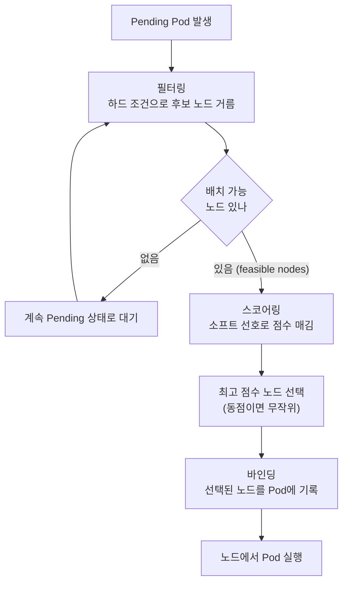
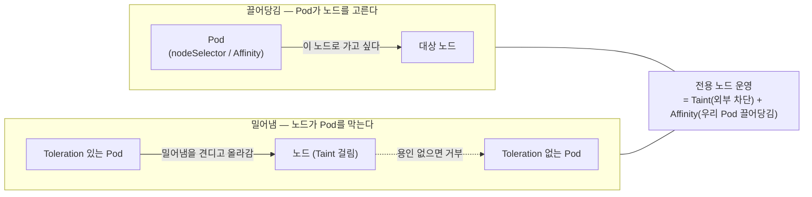

# 스케줄링 제어 - Affinity와 Taints/Tolerations

## 학습 목표
- 스케줄러가 Pod를 노드에 배치하는 과정과 배치를 제어해야 하는 상황을 이해한다
- nodeSelector와 Node/Pod Affinity·Anti-Affinity로 배치 규칙을 표현한다
- Taints로 노드를 차단하고 Tolerations로 예외를 허용하는 스케줄링을 직접 구성해본다

## 본문

### 스케줄러는 어떻게 Pod를 노드에 앉히나

쿠버네티스의 가장 큰 가치는 개별 서버를 추상화해 준다는 점이다. 우리는 "어느 머신에서 돌릴지"를 신경 쓰지 않고 그냥 Pod를 만든다. 그러면 클러스터에 내장된 **스케줄러(kube-scheduler)** 가 각 노드의 CPU·메모리 현황을 보고 알아서 배치할 곳을 정한다.

이 결정은 두 단계로 이뤄진다.

1. **필터링(Filtering / Predicates)** — "절대 어겨선 안 되는 하드 조건"으로 후보 노드를 걸러낸다. 예를 들어 Pod가 2 CPU·4Gi 메모리를 요청하면, 그만한 여유가 없는 노드는 후보에서 통째로 제외된다. 살아남은 노드를 **feasible node(배치 가능 노드)** 라 부른다.
2. **스코어링(Scoring / Priorities)** — 남은 노드들에 점수를 매긴다. "워크로드가 노드마다 골고루 퍼지면 좋다" 같은 **소프트 선호**가 여기 반영된다. 점수가 가장 높은 노드가 선택되고, 동점이면 무작위로 하나를 고른다.

선택된 노드를 Pod 객체에 기록하는 마지막 동작을 **바인딩(binding)** 이라 한다. 그 전까지 Pod는 노드가 정해지지 않은(Pending) 상태로 떠 있고, 스케줄러는 계속 이런 미배치 Pod와 노드 상태를 감시한다. 이 흐름은 아래 순서도와 같다.



> 핵심은 "필터링은 못 어기는 규칙, 스코어링은 어겨도 되는 선호"라는 점이다. 우리가 작성할 배치 규칙도 결국 이 둘 중 하나에 끼워 넣는 작업이다.

### 왜 스케줄러에게 추가 지시를 줘야 하나

기본 스케줄러는 똑똑하지만 "비즈니스 의도"까지는 모른다. 실무 클러스터에는 성격이 다른 노드가 섞여 있기 때문이다.

- **스팟(spot) 노드** — 저렴하지만 언제든 회수될 수 있다. 중단돼도 괜찮은 워크로드만 올려야 한다.
- **GPU 노드** — 머신러닝 작업용. 비싼 자원이라 아무 Pod나 올라오면 낭비다.
- **로컬 SSD 노드** — Kafka처럼 디스크 성능이 중요한 워크로드를 위해 둔다.
- **ARM(Graviton) 노드** — 저렴하지만 그 아키텍처용으로 빌드된 이미지만 돈다.

이런 환경에서 기본 스케줄러에게만 맡기면 GPU 노드에 평범한 웹 Pod가 올라가거나, 중요한 복제본 두 개가 같은 노드에 몰려 그 노드가 죽으면 서비스가 통째로 멈추는 사고가 난다. 그래서 우리는 **배치 규칙**을 직접 표현한다.

쿠버네티스가 제공하는 제어 수단은 크게 두 종류다. 하나는 **"Pod가 특정 노드를 골라 가도록 끌어당기는"** 방식(nodeSelector, Affinity)이고, 다른 하나는 **"노드가 Pod를 밀어내도록 막는"** 방식(Taints/Tolerations)이다. 모든 방식의 출발점은 **노드에 붙은 라벨(label)** 이다.

```bash
# 노드에 어떤 라벨이 붙어 있는지 확인 (기본 라벨도 많이 보인다)
kubectl get nodes --show-labels

# 노드에 라벨을 수동으로 붙이기 (실무에선 Terraform 등으로 노드 그룹 단위로 부여)
kubectl label nodes <노드이름> disktype=ssd
kubectl label nodes <노드이름> price=spot
```

> 실무에서는 라벨을 노드 한 대씩 손으로 붙이지 않는다. 클라우드라면 노드 그룹(인스턴스 그룹)을 만들 때 Terraform·eksctl 같은 도구로 일괄 부여한다. 수동 라벨은 학습·테스트용이다.

### nodeSelector — 가장 단순한 끌어당김

가장 오래되고 단순한 방법이다. PodSpec에 key-value 한 줄을 넣으면, 그 라벨을 **모두** 가진 노드에만 Pod가 배치된다.

```yaml
apiVersion: apps/v1
kind: Deployment
metadata:
  name: ssd-app
spec:
  replicas: 1
  selector:
    matchLabels: { app: ssd-app }
  template:
    metadata:
      labels: { app: ssd-app }
    spec:
      nodeSelector:
        disktype: ssd        # disktype=ssd 라벨을 가진 노드에만 배치
      containers:
        - name: app
          image: nginx
```

배치 결과는 `-o wide`로 어느 노드에 올랐는지 확인한다.

```bash
kubectl get pods -o wide
```

nodeSelector는 강력하지만 **유연하지 않다.** "이 라벨이거나 저 라벨"(OR), "이 라벨이 없는 노드"(NOT) 같은 표현이 불가능하고, 조건을 못 맞추면 Pod는 그냥 Pending에 갇힌다. 만약 라벨 이름에 오타를 내면 어떻게 될까? Pod가 Pending에서 멈춘다. 이때 원인은 `describe`로 잡는다.

```bash
kubectl describe pod <pod-name>
# Events 에 "didn't match Pod's node affinity/selector" 같은 메시지가 보인다
```

### Node Affinity — 유연한 끌어당김

Node Affinity는 nodeSelector와 같은 일(노드 라벨 기반 배치)을 하지만 훨씬 표현력이 풍부하다. 이름이 길지만 구조만 잡으면 어렵지 않다. 두 가지 유형이 있다.

- `requiredDuringSchedulingIgnoredDuringExecution` — **하드 조건.** 못 맞추면 Pending. (= 필터링 단계)
- `preferredDuringSchedulingIgnoredDuringExecution` — **소프트 조건.** 가능하면 따르고, 안 되면 다른 노드에라도 올린다. (= 스코어링 단계)

이름 뒤의 `IgnoredDuringExecution`은 "**이미 떠 있는 Pod에는 적용하지 않는다**"는 뜻이다. 즉 배치된 뒤 노드 라벨이 바뀌거나 사라져도, 실행 중인 Pod는 쫓겨나지 않는다. 규칙은 오직 스케줄링 순간에만 평가된다.

먼저 앞의 nodeSelector를 하드 Node Affinity로 옮겨 보자.

```yaml
spec:
  affinity:
    nodeAffinity:
      requiredDuringSchedulingIgnoredDuringExecution:
        nodeSelectorTerms:
          - matchExpressions:
              - key: disktype
                operator: In        # In, NotIn, Exists, DoesNotExist, Gt, Lt
                values: ["ssd"]
```

`values`에 값을 여러 개 넣으면 그 안에서는 **OR**다(`ssd` 또는 `nvme` 중 하나만 있으면 됨). 반면 `matchExpressions` 아래에 조건을 여러 줄 나열하면 그 조건들은 **AND**라서 전부 만족해야 한다 — 한 노드가 그 라벨들을 다 갖고 있지 못하면 Pending에 빠지니 주의한다.

소프트 조건은 `weight`(1~100)로 선호 강도를 준다. 점수가 높은 노드일수록 우선 선택되지만, 못 맞춰도 Pending에 빠지지 않는다.

```yaml
spec:
  affinity:
    nodeAffinity:
      preferredDuringSchedulingIgnoredDuringExecution:
        - weight: 80
          preference:
            matchExpressions:
              - key: price
                operator: In
                values: ["spot"]   # 가능하면 저렴한 spot 노드에 우선 배치
```

> 실무 권장: 가급적 nodeSelector보다 Node Affinity를, 그중에서도 `preferred`(소프트)를 기본값으로 쓴다. 하드 조건은 자원이 부족할 때 Pod를 Pending에 묶어 버려 가용성을 떨어뜨릴 수 있기 때문이다.

### Pod Affinity / Anti-Affinity — Pod끼리의 관계로 배치

노드 라벨이 아니라 **다른 Pod의 라벨**을 기준으로 배치할 수도 있다. 두 가지 의도가 있다.

- **Anti-Affinity(서로 떨어뜨리기)** — 같은 역할의 Pod를 서로 다른 노드에 흩어 놓는다. 노드 하나가 죽거나 업그레이드돼도 다른 노드의 복제본이 살아 있게 하기 위함이다. Nginx Ingress 컨트롤러처럼 절대 다 같이 죽으면 안 되는 워크로드에 자주 쓴다.
- **Affinity(같이 붙이기)** — 서로 통신이 잦은 Pod를 같은 노드에 모아 지연(latency)을 줄인다. 예: Kafka와 Zookeeper를 한 노드에 배치.

여기서 반드시 이해해야 할 개념이 **topologyKey** 다. "같다/다르다"를 판단하는 **기준이 되는 노드 라벨의 키**다. 가장 흔한 값은 `kubernetes.io/hostname`(= 노드 단위)이고, `topology.kubernetes.io/zone`을 쓰면 가용 영역(AZ) 단위가 된다.

여기서 흔히 오해하는 점을 정확히 짚자. topologyKey가 요구하는 것은 "모든 노드가 같은 **값**을 가져야 한다"가 아니다. 스케줄러는 이 라벨의 **값이 같은 노드들을 하나의 토폴로지 도메인**(예: 같은 호스트, 같은 존)으로 묶어 "같은 도메인인지 다른 도메인인지"를 판단한다. 따라서 **스케줄링 후보 노드들에 해당 라벨 키가 존재해야** 그 노드를 어느 도메인에 속하는지 식별할 수 있다. 만약 어떤 노드에 그 키 자체가 없으면, 그 노드는 도메인을 정할 수 없어 해당 규칙 평가에서 **제외될 뿐**이다(에러가 나는 것이 아니다). 정리하면 "해당 라벨 키가 후보 노드들에 존재해야 토폴로지 도메인을 정의할 수 있다"가 정확한 설명이다. `kubernetes.io/hostname`처럼 쿠버네티스가 모든 노드에 기본으로 붙이는 키를 쓰면 이 문제를 겪지 않는다.

복제본 두 개를 서로 다른 노드에 흩는 Anti-Affinity 예시다.

```yaml
spec:
  replicas: 2
  template:
    metadata:
      labels: { app: web }
    spec:
      affinity:
        podAntiAffinity:
          requiredDuringSchedulingIgnoredDuringExecution:
            - labelSelector:
                matchLabels: { app: web }   # 같은 app=web Pod가
              topologyKey: kubernetes.io/hostname   # 같은 노드에 또 오면 거부
      containers:
        - name: web
          image: nginx
```

`required`로 쓰면 노드 수가 복제본 수보다 적을 때 남는 Pod가 Pending에 갇힌다. 흩는 것이 "필수가 아니라 선호"라면 `preferred`로 바꾼다. 그러면 노드가 부족해도 같은 노드에 겹쳐서라도 배치된다.

`podAntiAffinity`를 `podAffinity`로 바꾸면 정반대로, 라벨이 일치하는 Pod들을 같은 노드로 모은다. 한 가지 주의점: Affinity/Anti-Affinity는 기본적으로 **배포된 네임스페이스 안에서만** 다른 Pod를 본다. 네임스페이스를 넘어 평가하려면 `namespaceSelector: {}`(빈 객체 = 모든 네임스페이스)를 추가한다.

> Pod Affinity는 스케줄러에 부담이 큰 계산이다. 노드가 수백 대를 넘는 대형 클러스터에서는 성능을 고려해 신중히 쓴다.

### Taints와 Tolerations — 노드가 Pod를 밀어내기

지금까지가 "Pod를 끌어당기는" 쪽이었다면, **Taint는 노드가 Pod를 밀어내는** 정반대 방향의 제어다. GPU 노드나 스팟 노드처럼 특수한 노드에 아무 Pod나 흘러들지 않게 막을 때 쓴다.

노드에 Taint를 걸면, 그에 대응하는 **Toleration(용인)** 을 가진 Pod만 그 노드에 올라올 수 있다. 자물쇠(Taint)와 열쇠(Toleration)의 관계로 생각하면 쉽다.

Taint는 `key=value:effect` 형태이고, `effect`는 세 가지다.

- `NoSchedule` — 용인 없는 Pod는 **새로 배치 안 됨**(이미 떠 있던 건 유지).
- `PreferNoSchedule` — 되도록 피하지만 자리 없으면 배치(소프트).
- `NoExecute` — 새 배치 차단 + **기존에 떠 있던 용인 없는 Pod도 쫓아냄(축출)**.

```bash
# 노드에 Taint 걸기
kubectl taint nodes <노드이름> dedicated=gpu:NoSchedule

# Taint 확인
kubectl describe node <노드이름> | grep -i taint

# Taint 제거 (key 뒤에 - 를 붙인다)
kubectl taint nodes <노드이름> dedicated=gpu:NoSchedule-
```

이제 이 노드에 올리고 싶은 Pod에는 Toleration을 넣는다.

```yaml
spec:
  tolerations:
    - key: "dedicated"
      operator: "Equal"
      value: "gpu"
      effect: "NoSchedule"
  containers:
    - name: gpu-job
      image: my-ml-image
```

여기서 자주 하는 오해 하나를 짚자.

> Toleration은 "이 노드에 올라올 **수 있다**"는 허가일 뿐, "반드시 이 노드로 가라"는 명령이 아니다. Toleration만 단 Pod는 GPU 노드에도, 평범한 노드에도 갈 수 있다. 진짜로 GPU 노드에 **묶고 싶다면** Toleration(밀어냄을 견딤) + Node Affinity 또는 nodeSelector(끌어당김)를 **함께** 써야 한다.

가장 익숙한 Taint 예시는 **컨트롤 플레인(마스터) 노드**다. 쿠버네티스는 기본적으로 마스터에 Taint를 걸어 일반 워크로드가 올라가지 못하게 막는다(단, minikube처럼 단일 노드 환경에는 적용되지 않을 수 있다).

반대로 로깅·모니터링 에이전트(Fluent Bit 등)는 **모든 노드의 모든 Taint를 견디고** 어디든 올라가야 할 때가 있다. 그럴 땐 모든 Taint를 용인하는 광범위 Toleration을 쓴다.

```yaml
spec:
  tolerations:
    - operator: "Exists"   # key/value/effect 명시 없이 모든 Taint를 견딤
```

### 세 가지 제어 수단 정리

| 수단 | 방향 | 기준 | 못 맞추면 |
|------|------|------|-----------|
| nodeSelector | Pod가 노드를 선택(끌어당김) | 노드 라벨(AND만) | Pending |
| Node Affinity | Pod가 노드를 선택(끌어당김) | 노드 라벨(AND/OR/소프트) | required면 Pending, preferred면 다른 노드 |
| Pod Affinity / Anti-Affinity | Pod끼리 모으기/흩기 | 다른 Pod 라벨 + topologyKey | required면 Pending, preferred면 완화 |
| Taints / Tolerations | 노드가 Pod를 밀어냄 | 노드 Taint ↔ Pod Toleration | 용인 없으면 그 노드에 못 올라감 |

핵심은 **방향**이다. Affinity 계열은 "Pod가 가고 싶어 하는" 끌어당김이고, Taint는 "노드가 받지 않으려는" 밀어냄이다. 아래 그림처럼 두 방향은 정반대로 작동하며, 특수 노드를 전용으로 운영할 때는 두 방향을 **함께** 써야 의도대로 묶인다 — Taint로 외부 Pod를 막고, Affinity로 우리 Pod만 그곳으로 끌어당긴다.



## 핵심 요약
- 스케줄러는 **필터링(하드 조건으로 후보 노드 추림) → 스코어링(소프트 선호로 점수 매김) → 바인딩** 순으로 배치를 결정한다. 우리의 배치 규칙은 이 두 단계 중 하나에 들어간다.
- **nodeSelector**는 가장 단순하지만 AND·하드 조건만 가능하다. **Node Affinity**는 OR/NOT, 소프트(`preferred`+`weight`) 선호까지 표현하며 실무 기본 선택이다. `IgnoredDuringExecution`은 규칙이 배치 순간에만 평가된다는 뜻이다.
- **Pod Anti-Affinity**로 복제본을 노드/영역에 흩어 가용성을 높이고, **Pod Affinity**로 통신 잦은 Pod를 모아 지연을 줄인다. 기준은 다른 Pod의 라벨과 **topologyKey**이며, topologyKey는 후보 노드들에 그 라벨 '키'가 존재해야 토폴로지 도메인(호스트·존 등)을 정의할 수 있다(키가 없는 노드는 평가에서 제외).
- **Taint(노드)**는 Pod를 밀어내고, **Toleration(Pod)**은 그 밀어냄을 견딘다. `NoSchedule`/`PreferNoSchedule`/`NoExecute` 세 effect가 있다. Toleration은 허가일 뿐 강제 배치가 아니므로, 전용 노드는 Taint+Affinity를 함께 쓴다.

## 출처
- Anton Putra, "Kubernetes Node Selector vs Node Affinity vs Pod Affinity vs Taints & Tolerations" — https://www.youtube.com/watch?v=rX4v_L0k4Hc
- Anton Putra, "Kubernetes Affinity and Anti Affinity vs NodeSelector (Examples)" — https://www.youtube.com/watch?v=DKLMzDD3xqA
- Microsoft Azure, "How the Kubernetes scheduler works" — https://www.youtube.com/watch?v=rDCWxkvPlAw
