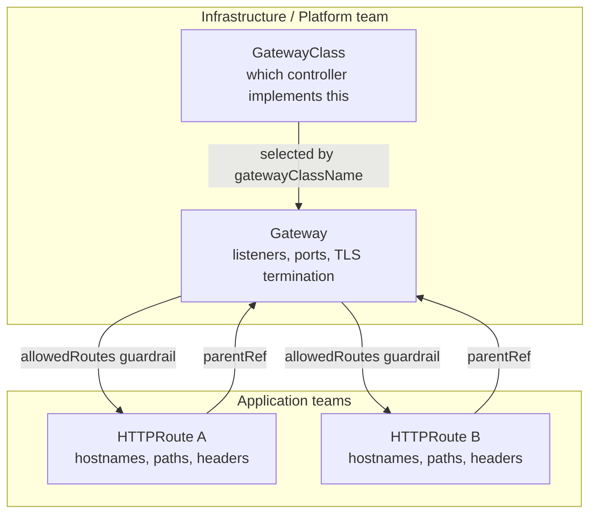
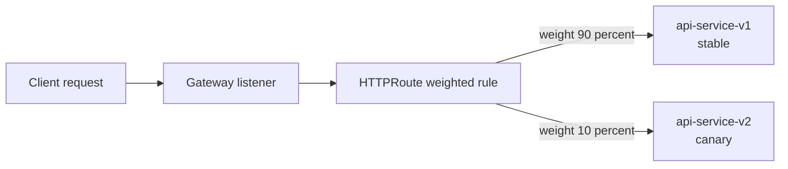

# Kubernetes Gateway API: The Next-Generation Standard for Traffic Routing Beyond Ingress

## Learning Objectives
- Describe the Gateway API resource model (GatewayClass, Gateway, HTTPRoute), understand where each resource's responsibility begins and ends, and explain which Ingress limitations it solves.
- Explain how role separation — infrastructure admins owning GatewayClass and Gateway, while application developers own HTTPRoute — pays off for multi-tenancy and day-to-day operations.
- Write manifests for path-based and header-based routing, and for weighted traffic splitting, so you can apply them to canary and blue-green deployments.

## Body

### Why Ingress eventually hits a wall

If you have run Kubernetes in production for any length of time, you have written an Ingress. It works — until your cluster grows. The trouble is that the classic `Ingress` object is **monolithic**: a single YAML file tries to do everything at once. Hostnames, paths, backend services, TLS certificates, redirects, rewrites — all of it crammed into one resource. And because the standard Ingress spec is so thin, anything beyond the basics gets bolted on through **controller-specific annotations** (those long `nginx.ingress.kubernetes.io/...` strings). Those annotations are not portable: an Ingress tuned for NGINX will not behave the same on Traefik or a cloud load balancer.

This becomes painful the moment you have more than one app or more than one team. Everyone edits the same kind of object, the configuration grows into a tangled block, and a single careless change can break routing for an unrelated service. There is no clean line between "the person who owns the load balancer" and "the person who owns this app's routes."

> The Gateway API is the Kubernetes community's official, vendor-neutral successor to Ingress. Ingress is now effectively in maintenance mode — new networking features land in the Gateway API, so learning it is no longer optional for a platform engineer.

### The resource model: three layers, three owners

The Gateway API solves the monolith problem by **splitting one big object into three focused resources**, each with a clear responsibility and, crucially, a clear owner. The structure is as follows.

**1. GatewayClass — "which controller implements this?"**
A `GatewayClass` is the cluster-wide template that says *which implementation* will fulfill your gateways — for example NGINX Gateway Fabric, Istio, or a cloud provider's controller. Think of it as the analogue of a `StorageClass`. You typically install it once with the controller, and most app teams never touch it. It is owned by the infrastructure team or the platform provider.

**2. Gateway — the front door (listeners, ports, TLS)**
A `Gateway` is the actual entry point into the cluster. It defines **listeners**: which ports are open, which protocols (HTTP/HTTPS), and where TLS is terminated. It is the resource that gets a public IP from your cloud's load balancer. A useful mental model: the Gateway is the *door* to the building. It decides who can knock and on which port, but it does not decide where inside the building each visitor goes. The Gateway is owned by the infrastructure / platform team.

**3. HTTPRoute — the routing rules**
An `HTTPRoute` is the *rule book* that decides how traffic flows once it is through the door. It matches on hostname, path, and headers, and forwards to one or more backend Services. This is where application developers live. They attach their HTTPRoute to a Gateway via a `parentRef` and define their own routing — without ever editing the shared Gateway. HTTPRoute is owned by the application team.

This split is the heart of the Gateway API. The relationship is **GatewayClass → Gateway → HTTPRoute**, flowing from infrastructure down to application, with each layer owned by a different team, as the diagram below makes explicit.



### Why role separation matters in practice

Mapping each layer to a different owner is not just tidy diagram-drawing — it directly enables safe **multi-tenancy**. Picture a shared cluster with two teams. With Ingress, both teams edit Ingress objects, and one team's mistake can take the other down with nobody intending any harm. With the Gateway API, the platform team owns a single shared Gateway (and the TLS certificate on it), and each team owns only its own HTTPRoute in its own namespace.

The Gateway then controls *who is allowed to attach* through its `allowedRoutes` field — typically gated by a namespace label. A team simply cannot attach a route unless the platform has granted permission. That single guardrail prevents the accidental cross-team outages that plague shared Ingress setups. The contract is clean: **the platform owns the gateway and the TLS, the tenant owns only the route.** As the saying goes in platform engineering, this is not a demo pattern — it is how real multi-tenant platforms are built.

### A minimal working example

Let's make this concrete. First, the Gateway. Note that it declares a `gatewayClassName` (the controller to use) and two listeners — one HTTP, one HTTPS — with TLS terminated **on the Gateway, not on the route**.

```yaml
apiVersion: gateway.networking.k8s.io/v1
kind: Gateway
metadata:
  name: main-gateway
  namespace: default
spec:
  gatewayClassName: nginx          # which controller implements this Gateway
  listeners:
    - name: http
      protocol: HTTP
      port: 80
      allowedRoutes:
        namespaces:
          from: Same               # only routes in this namespace may attach
    - name: https
      protocol: HTTPS
      port: 443
      tls:
        mode: Terminate            # the Gateway decrypts TLS here
        certificateRefs:
          - name: app-tls          # reuse your existing TLS Secret
      allowedRoutes:
        namespaces:
          from: Same
```

> A common point of confusion: in the Gateway API, TLS **always** lives on the Gateway listener, never inside the HTTPRoute. When migrating from Ingress, the `tls:` block moves to the Gateway, and the routing rules move to the HTTPRoute.

Now the HTTPRoute. It attaches to the Gateway via `parentRefs`, matches a hostname, and routes by path to backend Services:

```yaml
apiVersion: gateway.networking.k8s.io/v1
kind: HTTPRoute
metadata:
  name: app-route
  namespace: default
spec:
  parentRefs:
    - name: main-gateway           # attach to the Gateway above
  hostnames:
    - "app.example.com"
  rules:
    - matches:
        - path:
            type: PathPrefix
            value: /api
      backendRefs:
        - name: api-service
          port: 80
    - matches:
        - path:
            type: PathPrefix
            value: /
      backendRefs:
        - name: frontend-service
          port: 80
```

Apply both with `kubectl apply -f`, then verify with `kubectl get gateway` and `kubectl get httproute`. A request to `app.example.com/api` reaches `api-service`; everything else reaches `frontend-service`. That single HTTPRoute fully replaces the routing logic that an Ingress would have buried in annotations.

### Header-based routing and weighted traffic splitting

Two capabilities that were awkward or impossible with stock Ingress become first-class here.

**Header matching** lets you route on request headers — perfect for internal testing or feature flags. The same `matches` block accepts a `headers` condition:

```yaml
rules:
  - matches:
      - headers:
          - name: x-env
            value: canary
    backendRefs:
      - name: api-service-v2
        port: 80
```

Any request carrying the header `x-env: canary` is sent to the new version, while everyone else stays on the stable one.

**Weighted backends** are the killer feature for progressive delivery. A single rule can list multiple `backendRefs`, each with a `weight`, and the controller splits traffic proportionally. This is how you run a **canary** release — sending, say, 10% of traffic to a new version — or a **blue-green** cutover by flipping the weights:

```yaml
rules:
  - matches:
      - path:
          type: PathPrefix
          value: /
    backendRefs:
      - name: api-service-v1
        port: 80
        weight: 90               # 90% to the stable version
      - name: api-service-v2
        port: 80
        weight: 10               # 10% to the canary
```

The diagram below shows how that single rule fans traffic out across the two backends by weight.



Roll the weights from 90/10 to 50/50 to 0/100 as your confidence grows, then remove the old backend. No annotations, no controller-specific tricks — just a standard, portable field.

### Migrating without downtime

The best part of moving from Ingress is that you do not have to do it in one risky leap. **A Gateway and an Ingress can serve the same app at the same time.** The safe migration path is: read your existing Ingress, build an equivalent Gateway (ports + TLS) and HTTPRoute (hostnames + paths), reuse the *same* TLS Secret so certificates carry over seamlessly, then test the Gateway side by side while the Ingress still serves live traffic. Only once you are fully confident — and after pointing DNS at the new entry point — do you delete the old Ingress. Test first, delete last; that is what makes it zero-downtime.

## Key Takeaways
- The Gateway API replaces the monolithic Ingress with three focused resources: **GatewayClass** (which controller), **Gateway** (listeners, ports, TLS — the front door), and **HTTPRoute** (the routing rules).
- That split maps cleanly to owners — infrastructure teams own GatewayClass and Gateway, app teams own HTTPRoute — which enables safe multi-tenancy through `allowedRoutes` guardrails.
- TLS always terminates on the **Gateway listener**, never inside the HTTPRoute.
- HTTPRoute supports portable, standardized **path and header matching** and **weighted backends**, making canary and blue-green deployments straightforward without controller-specific annotations.
- You can migrate from Ingress with **zero downtime** by running both side by side, reusing the same TLS Secret, testing the Gateway, and deleting the Ingress only after DNS has cut over.
