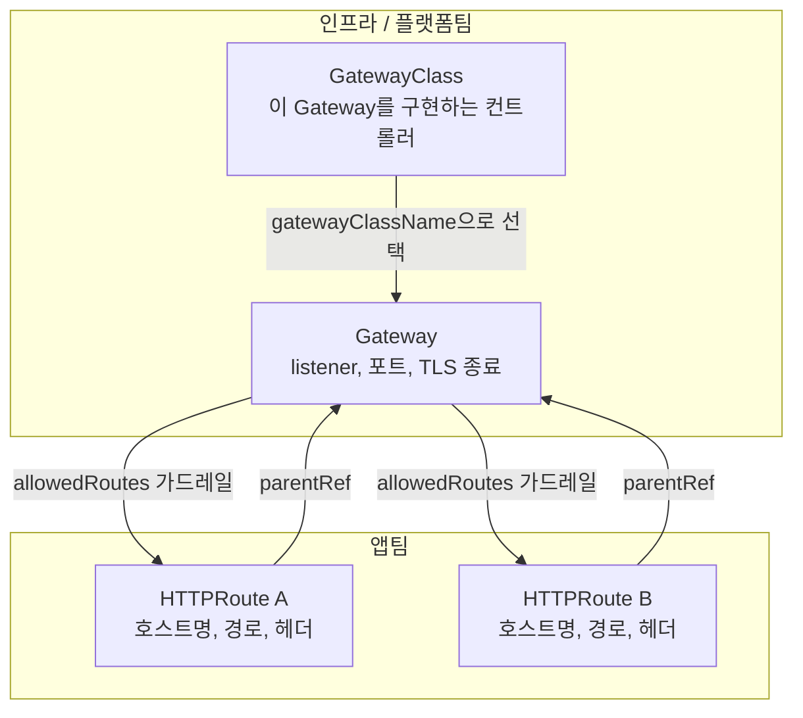
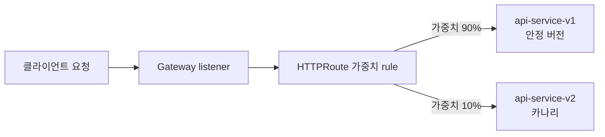

# Kubernetes Gateway API 입문: Ingress를 넘어선 차세대 트래픽 라우팅 표준

## 학습 목표
- Gateway API의 핵심 리소스 모델(GatewayClass, Gateway, HTTPRoute)을 이해하고, 각 리소스의 책임 경계를 설명하며 Ingress의 어떤 한계를 해결하는지 파악한다.
- 인프라 관리자가 GatewayClass·Gateway를 소유하고 앱 개발자가 HTTPRoute를 소유하는 역할 분리 구조가 멀티테넌시와 일상 운영에 주는 이점을 설명한다.
- path 기반·header 기반 라우팅과 가중치 기반 트래픽 분할(weighted backend) 매니페스트를 직접 작성해 카나리·블루-그린 배포에 적용한다.

## 본문

### Ingress가 한계에 부딪히는 이유

프로덕션에서 Kubernetes를 운영해봤다면 Ingress는 이미 익숙할 것이다. 처음에는 잘 동작하지만 클러스터 규모가 커지면 문제가 드러난다. 전통적인 `Ingress` 오브젝트는 **단일 구조(monolithic)**다. 호스트명, 경로, 백엔드 서비스, TLS 인증서, 리다이렉트, URL 재작성 등 모든 설정이 하나의 리소스에 몰려 있다. 표준 Ingress 스펙이 너무 단순하기 때문에, 기본 기능 이상의 동작은 **컨트롤러 전용 어노테이션**(긴 `nginx.ingress.kubernetes.io/...` 문자열)으로 처리할 수밖에 없다. 이 어노테이션은 이식성이 없다. NGINX에 맞춰 작성한 Ingress는 Traefik이나 클라우드 로드밸런서에서 다르게 동작한다.

앱이 여러 개이거나 팀이 여럿이면 문제는 더 커진다. 모두가 같은 종류의 오브젝트를 편집하게 되고, 설정은 점점 뒤엉키며, 누군가의 실수 하나로 전혀 다른 서비스의 라우팅이 끊길 수 있다. "로드밸런서를 관리하는 사람"과 "이 앱의 라우팅 규칙을 담당하는 사람" 사이의 경계가 명확하지 않기 때문이다.

> Gateway API는 Kubernetes 커뮤니티가 Ingress의 공식 후속으로 만든 벤더 중립 표준이다. Ingress는 사실상 유지보수 모드에 들어갔으며, 새로운 네트워킹 기능은 Gateway API에 추가된다. 플랫폼 엔지니어라면 더 이상 선택이 아니다.

### 리소스 모델: 세 계층, 세 소유자

Gateway API는 **하나의 거대한 오브젝트를 세 개의 집중된 리소스로 분리**하는 방식으로 모놀리식 구조 문제를 해결한다. 각 리소스는 명확한 책임을 갖고, 더 중요하게는 명확한 소유자가 있다.

**1. GatewayClass — "이 Gateway를 구현하는 컨트롤러는 무엇인가?"**
`GatewayClass`는 클러스터 전체 범위의 템플릿으로, 어떤 구현체(NGINX Gateway Fabric, Istio, 클라우드 프로바이더 컨트롤러 등)가 Gateway를 처리할지 선언한다. `StorageClass`와 유사한 개념이다. 컨트롤러 설치 시 한 번 만들어두면 대부분의 앱 팀은 건드릴 일이 없다. 인프라팀 또는 플랫폼 프로바이더가 소유한다.

**2. Gateway — 클러스터의 현관문(listener, 포트, TLS)**
`Gateway`는 클러스터 진입점 그 자체다. **listener**를 정의하는 리소스로, 어떤 포트를 열고 어떤 프로토콜(HTTP/HTTPS)을 사용하며 TLS를 어디서 종료할지를 지정한다. 클라우드의 로드밸런서로부터 공인 IP를 할당받는 리소스이기도 하다. 직관적인 비유를 들자면, Gateway는 건물의 *현관문*이다. 누가 어느 포트로 들어올 수 있는지를 결정하되, 건물 안에서 각 방문객이 어디로 가는지는 관여하지 않는다. 인프라/플랫폼팀이 소유한다.

**3. HTTPRoute — 라우팅 규칙**
`HTTPRoute`는 문 안으로 들어온 트래픽이 어디로 흐를지 결정하는 *규칙집*이다. 호스트명, 경로, 헤더를 기준으로 매칭해 하나 이상의 백엔드 Service로 전달한다. 앱 개발자의 영역이다. `parentRef`를 통해 HTTPRoute를 Gateway에 연결하면, 공유 Gateway를 건드리지 않고도 자신의 라우팅 규칙을 독립적으로 정의할 수 있다. 앱팀이 소유한다.

이 분리가 Gateway API의 핵심이다. **GatewayClass → Gateway → HTTPRoute** 순으로 인프라에서 앱으로 흐르며, 각 계층은 서로 다른 팀이 소유한다. 아래 다이어그램이 이 관계를 명시적으로 보여준다.



### 역할 분리가 실제로 중요한 이유

각 계층을 서로 다른 소유자에게 매핑하는 것은 단순히 다이어그램을 깔끔하게 그리기 위한 게 아니다. 안전한 **멀티테넌시**를 직접적으로 가능하게 한다. 두 팀이 공유 클러스터를 쓰는 상황을 떠올려보자. Ingress 방식에서는 두 팀 모두 Ingress 오브젝트를 편집하므로, 한 팀의 실수가 의도치 않게 다른 팀에 영향을 줄 수 있다. Gateway API에서는 플랫폼팀이 공유 Gateway 하나를 소유하고(TLS 인증서 포함), 각 팀은 자신의 네임스페이스에서 HTTPRoute만 관리한다.

Gateway는 `allowedRoutes` 필드로 *누가 연결할 수 있는지*를 제어한다. 보통 네임스페이스 레이블로 조건을 건다. 플랫폼이 허가하지 않은 팀은 라우트를 연결할 수 없다. 이 단 하나의 가드레일이, 공유 Ingress 환경에서 흔히 발생하는 팀 간 연쇄 장애를 막아준다. 계약은 단순하다. **플랫폼팀은 Gateway와 TLS를 소유하고, 테넌트는 라우트만 소유한다.** 플랫폼 엔지니어링 세계에서 이 구조는 데모용 패턴이 아니라, 실제 멀티테넌트 플랫폼이 구축되는 방식이다.

### 최소 동작 예제

구체적인 예제로 살펴보자. 먼저 Gateway다. `gatewayClassName`(사용할 컨트롤러)을 선언하고, HTTP와 HTTPS 두 개의 listener를 정의한다. TLS는 **Route가 아닌 Gateway에서 종료**된다는 점에 유의한다.

```yaml
apiVersion: gateway.networking.k8s.io/v1
kind: Gateway
metadata:
  name: main-gateway
  namespace: default
spec:
  gatewayClassName: nginx          # 이 Gateway를 구현하는 컨트롤러
  listeners:
    - name: http
      protocol: HTTP
      port: 80
      allowedRoutes:
        namespaces:
          from: Same               # 같은 네임스페이스의 Route만 연결 가능
    - name: https
      protocol: HTTPS
      port: 443
      tls:
        mode: Terminate            # Gateway에서 TLS 복호화
        certificateRefs:
          - name: app-tls          # 기존 TLS Secret 재사용
      allowedRoutes:
        namespaces:
          from: Same
```

> 자주 헷갈리는 부분: Gateway API에서 TLS는 **항상** Gateway listener에 위치하며, HTTPRoute 안에는 들어가지 않는다. Ingress에서 마이그레이션할 때 `tls:` 블록은 Gateway로, 라우팅 규칙은 HTTPRoute로 이동한다.

다음은 HTTPRoute다. `parentRefs`로 Gateway에 연결하고, 호스트명을 매칭한 뒤 경로에 따라 백엔드 Service로 라우팅한다.

```yaml
apiVersion: gateway.networking.k8s.io/v1
kind: HTTPRoute
metadata:
  name: app-route
  namespace: default
spec:
  parentRefs:
    - name: main-gateway           # 위의 Gateway에 연결
  hostnames:
    - "app.example.com"
  rules:
    - matches:
        - path:
            type: PathPrefix
            value: /api
      backendRefs:
        - name: api-service
          port: 80
    - matches:
        - path:
            type: PathPrefix
            value: /
      backendRefs:
        - name: frontend-service
          port: 80
```

`kubectl apply -f`로 둘 다 적용한 뒤, `kubectl get gateway`와 `kubectl get httproute`로 상태를 확인한다. `app.example.com/api` 요청은 `api-service`로, 그 외 모든 요청은 `frontend-service`로 전달된다. 이 HTTPRoute 하나가 Ingress에서 어노테이션으로 처리하던 라우팅 로직 전체를 대체한다.

### header 기반 라우팅과 가중치 기반 트래픽 분할

기존 Ingress로는 구현이 번거롭거나 불가능했던 두 가지 기능이 여기서는 기본으로 제공된다.

**헤더 매칭**을 사용하면 요청 헤더를 기준으로 라우팅할 수 있다. 내부 테스트나 피처 플래그에 유용하다. `matches` 블록에 `headers` 조건을 추가하면 된다.

```yaml
rules:
  - matches:
      - headers:
          - name: x-env
            value: canary
    backendRefs:
      - name: api-service-v2
        port: 80
```

`x-env: canary` 헤더가 붙은 요청은 새 버전으로, 그렇지 않은 요청은 기존 버전으로 전달된다.

**가중치 기반 백엔드(weighted backend)**는 점진적 배포를 위한 핵심 기능이다. 하나의 rule에 여러 `backendRefs`를 나열하고 각각 `weight`를 지정하면, 컨트롤러가 비율에 맞게 트래픽을 분배한다. 새 버전에 트래픽의 10%를 보내는 **카나리** 배포나, 가중치를 전환해 수행하는 **블루-그린** 배포를 이렇게 구현한다.

```yaml
rules:
  - matches:
      - path:
          type: PathPrefix
          value: /
    backendRefs:
      - name: api-service-v1
        port: 80
        weight: 90               # 안정 버전에 90%
      - name: api-service-v2
        port: 80
        weight: 10               # 카나리에 10%
```

아래 다이어그램은 이 단일 rule이 가중치에 따라 두 백엔드로 트래픽을 분배하는 흐름을 보여준다.



자신감이 쌓이면 가중치를 90/10 → 50/50 → 0/100으로 점진적으로 조정한 뒤, 구 버전 백엔드를 제거한다. 어노테이션도, 컨트롤러 전용 설정도 필요 없다. 표준화된 이식 가능한 필드 하나로 전부 해결된다.

### 무중단 마이그레이션

Ingress에서 Gateway API로 전환할 때 가장 좋은 점은, 한꺼번에 위험하게 바꿀 필요가 없다는 것이다. **Gateway와 Ingress는 같은 앱에 동시에 서비스할 수 있다.** 안전한 마이그레이션 절차는 다음과 같다. 기존 Ingress를 파악하고, 동등한 Gateway(포트 + TLS)와 HTTPRoute(호스트명 + 경로)를 만든다. *동일한* TLS Secret을 재사용해 인증서가 끊김 없이 이어지게 한다. Ingress가 실제 트래픽을 처리하는 동안 Gateway를 병렬로 테스트한다. 충분히 검증된 뒤 DNS를 새 진입점으로 전환하고, 최종적으로 기존 Ingress를 삭제한다. 먼저 테스트하고 마지막에 삭제하는 것이 무중단 마이그레이션의 핵심이다.

## 핵심 정리
- Gateway API는 모놀리식 Ingress를 세 개의 집중된 리소스로 대체한다. **GatewayClass**(사용할 컨트롤러), **Gateway**(listener·포트·TLS, 현관문), **HTTPRoute**(라우팅 규칙).
- 이 분리는 소유자 구조와 맞물린다. 인프라/플랫폼팀이 GatewayClass와 Gateway를 소유하고, 앱팀이 HTTPRoute를 소유한다. `allowedRoutes` 가드레일로 안전한 멀티테넌시를 구현한다.
- TLS는 항상 **Gateway listener**에서 종료되며, HTTPRoute 안에는 들어가지 않는다.
- HTTPRoute는 이식 가능한 표준 방식으로 **path·header 매칭**과 **가중치 기반 백엔드**를 지원하므로, 컨트롤러 전용 어노테이션 없이 카나리·블루-그린 배포를 구현할 수 있다.
- 기존 Ingress와 새 Gateway를 **병렬로 운영**하고, 같은 TLS Secret을 재사용하며, Gateway 검증 후 DNS를 전환하고 Ingress를 삭제하는 순서로 **무중단 마이그레이션**이 가능하다.
