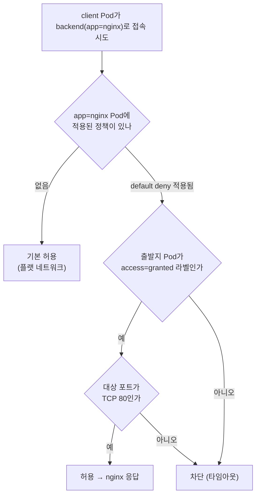
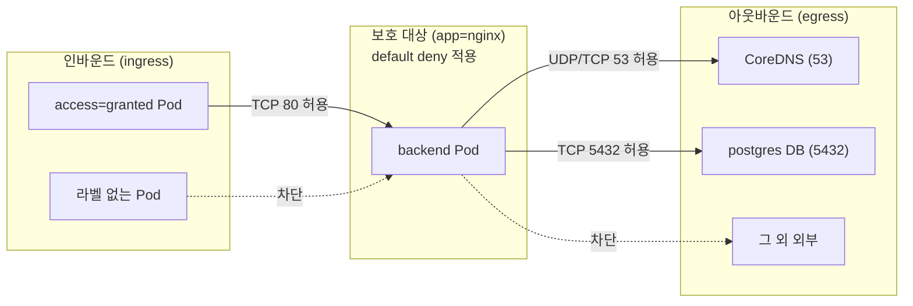

# NetworkPolicy - 파드 간 트래픽 통제와 기본 차단

## 학습 목표
- 기본적으로 모든 트래픽이 허용되는 클러스터 네트워크 모델과 통제 필요성을 이해한다
- 라벨 셀렉터 기반 ingress·egress 규칙으로 허용 트래픽을 정의한다
- 기본 차단(default deny) 정책을 적용한 뒤 특정 통신만 허용하는 NetworkPolicy를 실습한다

## 본문

### 기본값은 "모두 통한다" — 평평한 네트워크의 위험

쿠버네티스 네트워크에는 한 가지 단순한 대전제가 있다. **클러스터 안의 모든 Pod는 서로 자유롭게 통신할 수 있다.** Pod마다 고유한 IP가 부여되고, 네임스페이스가 다르든 노드가 다르든 상관없이 어떤 Pod든 다른 Pod의 IP나 Service로 트래픽을 보낼 수 있다. 이를 "플랫(flat) 네트워크 모델"이라고 부른다.

처음 배울 때는 편하다. 별도 설정 없이 프론트엔드가 백엔드를, 백엔드가 데이터베이스를 호출할 수 있으니까. 하지만 운영 관점에서 보면 이건 **잠금장치 없는 사무실**과 같다. 결제 서비스의 DB Pod에, 아무 관계도 없는 다른 팀의 테스트 Pod가 마음대로 접속할 수 있다는 뜻이기 때문이다.

> 기본 네트워크 모델은 "막을 이유가 없으면 통과"가 아니라 "허용 여부와 무관하게 전부 통과"다. 보안 사고가 한 Pod에서 시작되면, 평평한 네트워크는 공격자가 클러스터 전체로 옆걸음질(lateral movement, 측면 이동)하는 고속도로가 된다.

실제로 컨테이너 보안의 핵심 원칙은 **제로 트러스트(zero-trust)** — "기본적으로 아무도 믿지 않고, 명시적으로 허용한 통신만 연다"이다. 이를 쿠버네티스에서 구현하는 도구가 바로 **NetworkPolicy**다. NetworkPolicy는 "어떤 Pod가, 누구로부터(ingress) 또는 누구에게로(egress) 트래픽을 주고받을 수 있는가"를 라벨 기반 규칙으로 선언하는 오브젝트다.

### NetworkPolicy의 자리 — Ingress(L7)와는 다른 층이다

중급1에서 배운 **Ingress**와 헷갈리기 쉬우니 먼저 선을 긋자. 둘 다 "트래픽 통제"처럼 들리지만 동작하는 계층이 다르다.

| 구분 | Ingress (중급1) | NetworkPolicy (이번 강의) |
|------|-----------------|---------------------------|
| 계층 | L7 (HTTP/HTTPS 경로·호스트) | L3/L4 (IP·포트·프로토콜) |
| 방향 | 클러스터 **외부 → 내부** 진입 라우팅 | 클러스터 **내부 Pod 간** 트래픽 허용/차단 |
| 질문 | "이 URL은 어느 Service로?" | "이 Pod는 누구와 통신해도 되나?" |
| 비유 | 건물 정문의 안내 데스크 | 각 사무실 문의 출입 통제 |

즉 Ingress는 외부 요청을 HTTP 경로에 따라 적절한 Service로 **안내**하는 라우터이고, NetworkPolicy는 내부에서 오가는 패킷을 IP와 포트 수준에서 **허용하거나 끊는** 방화벽이다. 둘은 경쟁 관계가 아니라 서로 다른 층에서 함께 동작한다.

### 반드시 짚을 전제 — CNI가 지원해야 작동한다

NetworkPolicy를 배울 때 가장 흔히 빠지는 함정이 있다. **NetworkPolicy 오브젝트를 만들어도, 그것을 실제로 강제하는 것은 쿠버네티스 본체가 아니라 CNI 플러그인이다.** CNI(Container Network Interface)는 Pod에 네트워크를 연결해 주는 플러그인 규격을 말한다.

쿠버네티스 API 서버는 NetworkPolicy를 받아 저장만 할 뿐, 실제로 패킷을 막는 일은 CNI가 한다. 그래서 **NetworkPolicy를 지원하지 않는 CNI**(예: 기본 설정의 일부 플러그인)를 쓰면, 정책을 아무리 정교하게 작성해도 **조용히 무시되어** 모든 트래픽이 그대로 통한다. 에러도 나지 않기 때문에 "정책을 걸었는데 왜 안 막히지?"로 한참 헤매게 된다.

> NetworkPolicy를 적용하기 전, 클러스터의 CNI가 이를 지원하는지 반드시 확인하라. **Calico, Cilium, Weave Net** 등은 지원하고, 관리형 서비스라면 AKS의 Azure Network Policy/Calico, EKS의 VPC CNI + 정책 엔진처럼 옵션을 켜야 동작하는 경우가 많다. minikube는 `--cni=calico` 옵션으로 기동하면 실습할 수 있다.

```bash
# 실습용으로 Calico CNI를 켠 minikube 클러스터 시작
minikube start --cni=calico

# Calico Pod가 떠 있는지 확인
kubectl get pods -n kube-system | grep calico
```

### 실습 준비 — 테스트할 대상 만들기

정책을 걸 "보호 대상"부터 띄우자. 실무에서는 워크로드를 **단일 Pod로 직접 띄우지 않고 Deployment로 관리한다.** Deployment가 ReplicaSet을 통해 Pod 수를 유지하고, Pod가 죽으면 재생성하며, 롤아웃·롤백도 가능하기 때문이다. 그러니 이번 보호 대상도 권장 방식인 **Deployment**로 만든다. 실습 전용 네임스페이스에서 진행한다.

```bash
kubectl create namespace demo
```

보호할 백엔드를 nginx Deployment로 만들고, 다른 Pod가 접속할 수 있도록 Service로 노출한다. NetworkPolicy는 Pod의 **라벨**로 대상을 고르므로, Pod에 `app=nginx` 라벨이 붙도록 만드는 것이 핵심이다.

방법 1 — 명령형 두 단계(`kubectl create deployment` + `kubectl expose`):

```bash
# 1) 백엔드 Deployment 생성
kubectl create deployment backend --image=nginx -n demo

# 2) Pod에 app=nginx 라벨 부여 (정책 셀렉터와 맞추기 위함)
#    create deployment의 기본 라벨은 app=backend이므로 명시적으로 덧붙인다
kubectl label deployment backend app=nginx --overwrite -n demo
kubectl rollout restart deployment backend -n demo   # 새 라벨을 Pod에 반영

# 3) Deployment를 backend 라는 이름의 Service로 노출
kubectl expose deployment backend --name=backend --port=80 -n demo
```

방법 2 — YAML 매니페스트(라벨을 처음부터 정확히 지정할 수 있어 더 깔끔하다):

```yaml
# backend-deploy.yaml
apiVersion: apps/v1
kind: Deployment
metadata:
  name: backend
  namespace: demo
spec:
  replicas: 1
  selector:
    matchLabels:
      app: nginx
  template:
    metadata:
      labels:
        app: nginx         # ← NetworkPolicy가 고를 대상 라벨
    spec:
      containers:
        - name: nginx
          image: nginx
          ports:
            - containerPort: 80
```

```bash
kubectl apply -f backend-deploy.yaml
kubectl expose deployment backend --name=backend --port=80 -n demo
```

> 단일 Pod(`kubectl run`)는 빠르게 한 개만 띄워 개념을 확인하기 좋은 **학습용**이지만, 재시작·복제·롤아웃을 컨트롤러가 관리하지 않아 실무에서는 거의 쓰지 않는다. 이 강의도 보호 대상은 Deployment로 만든다. 다만 잠깐 떴다 사라지는 일회성 클라이언트(아래 `client`)는 `--rm`으로 띄우는 단일 Pod로 충분하다.

이제 접속을 시도할 클라이언트 Pod를 띄운다. 이쪽은 테스트가 끝나면 바로 지울 일회성이라 단일 Pod로 띄운다.

```bash
# 접속을 시도할 클라이언트 Pod (curl 가능한 이미지)
kubectl run client --image=curlimages/curl -n demo -it --rm -- sh
```

`client` Pod 안에서 backend Service로 접속해 보면, 아직 정책이 없으므로 nginx 환영 페이지가 정상적으로 돌아온다. 이것이 "기본 허용" 상태의 증거다.

```sh
# client 컨테이너 셸 안에서
curl backend     # nginx 기본 페이지 HTML이 출력됨 → 통신 가능
```

### 1단계: 기본 차단(default deny) 정책 적용하기

보안을 강화하는 정석은 **"일단 전부 막고, 필요한 것만 연다"**이다. 먼저 모든 인바운드(ingress) 트래픽을 차단하는 default deny 정책을 건다.

핵심은 두 필드다. `podSelector`는 **이 정책이 적용될 대상 Pod**를 고르고, `policyTypes`는 **막을 방향**(Ingress/Egress)을 지정한다. 그리고 **ingress 규칙을 한 줄도 적지 않으면**, 그 자체가 "허용된 인바운드가 없음 = 전부 차단"을 의미한다.

```yaml
# default-deny.yaml
apiVersion: networking.k8s.io/v1
kind: NetworkPolicy
metadata:
  name: default-deny-ingress
  namespace: demo
spec:
  podSelector: {}          # {} = 네임스페이스의 모든 Pod에 적용
  policyTypes:
    - Ingress              # 인바운드 방향을 통제
  # ingress 규칙 없음 → 들어오는 트래픽 전부 차단
```

```bash
kubectl apply -f default-deny.yaml
```

이제 다시 `client`에서 `curl backend`를 실행하면 응답이 오지 않고 **멈췄다가 타임아웃**된다. NetworkPolicy가 제 역할을 하기 시작한 것이다.

> `podSelector: {}` (빈 셀렉터)는 "라벨 조건 없음 = 네임스페이스 안의 모든 Pod 선택"을 뜻한다. 한 Pod라도 정책의 selector에 걸리면, 그 Pod의 해당 방향 트래픽은 "명시적으로 허용된 것만 통과"로 전환된다. NetworkPolicy는 **화이트리스트(허용 목록) 방식**이라는 점을 기억하자.

### 2단계: 특정 통신만 허용하기 (ingress 규칙)

이제 빗장을 걸었으니, 정말 필요한 통신 하나만 문을 열어준다. "`access=granted` 라벨을 가진 Pod만 nginx(`app=nginx`)에 접속할 수 있다"는 규칙을 만들어 보자.

```yaml
# allow-frontend.yaml
apiVersion: networking.k8s.io/v1
kind: NetworkPolicy
metadata:
  name: allow-to-nginx
  namespace: demo
spec:
  podSelector:
    matchLabels:
      app: nginx           # 보호 대상: app=nginx 인 Pod
  policyTypes:
    - Ingress
  ingress:
    - from:
        - podSelector:
            matchLabels:
              access: granted   # 이 라벨을 가진 Pod에서 오는 트래픽만 허용
      ports:
        - protocol: TCP
          port: 80              # 80번 포트로만
```

```bash
kubectl apply -f allow-frontend.yaml
```

이제 라벨을 비교 실험해 보면 정책이 정확히 작동함을 확인할 수 있다.

```bash
# (가) 올바른 라벨을 단 클라이언트 → 접속 성공
kubectl run good --image=curlimages/curl --labels="access=granted" \
  -n demo -it --rm -- curl --max-time 5 backend
# → nginx HTML 반환

# (나) 라벨 없는 클라이언트 → 차단(타임아웃)
kubectl run bad --image=curlimages/curl \
  -n demo -it --rm -- curl --max-time 5 backend
# → 응답 없음, 타임아웃
```

`access=granted` 라벨이 곧 "출입증" 역할을 한다. 정책은 IP나 Pod 이름이 아니라 **라벨**을 기준으로 판단하므로, Pod가 죽고 새 IP로 재생성되어도 라벨만 맞으면 규칙이 그대로 유효하다. 이것이 동적인 쿠버네티스 환경에서 라벨 셀렉터 기반 통제가 강력한 이유다. 특히 백엔드를 Deployment로 운영하면 Pod가 교체될 때마다 IP가 바뀌지만, Pod 템플릿의 `app=nginx` 라벨은 그대로 유지되므로 정책이 끊김 없이 적용된다. 아래 판단 흐름처럼, default deny가 깔린 상태에서는 라벨이 맞는 트래픽만 통과하고 나머지는 모두 차단된다.



`from` 블록에는 `podSelector` 외에도 다음을 조합할 수 있다.

- `namespaceSelector` — 특정 라벨을 가진 **네임스페이스**에서 오는 트래픽 허용 (예: `team=frontend` 네임스페이스만)
- `ipBlock` — 특정 **IP/CIDR 대역** 허용 (외부 시스템·노드 IP 등)

> `from` 항목을 **하나의 리스트 원소** 안에서 `podSelector`와 `namespaceSelector`를 함께 쓰면 "그 네임스페이스 **안의** 해당 Pod"라는 AND 조건이 된다. 반대로 둘을 **별도의 리스트 원소**로 나누면 "이 Pod **또는** 저 네임스페이스"라는 OR 조건이 된다. YAML 들여쓰기 한 칸 차이로 의미가 완전히 달라지므로 주의한다.

### 3단계: egress(나가는 트래픽)도 통제하기

지금까지는 "누가 들어오는가(ingress)"를 다뤘다. 보안을 더 조이려면 "이 Pod가 **어디로 나갈 수 있는가**(egress)"도 제한해야 한다. 예를 들어 애플리케이션 Pod가 알 수 없는 외부로 데이터를 빼돌리는 것(data exfiltration)을 막을 때 쓴다.

egress 통제에서 가장 흔한 함정은 **DNS**다. egress를 막으면 Pod는 도메인 이름을 IP로 변환하는 DNS 조회(쿠버네티스의 CoreDNS, 보통 53번 포트)조차 못 하게 되어, "이름으로는 아무 데도 접속이 안 되는" 증상이 생긴다. 그래서 egress를 잠글 때는 **DNS 포트(UDP/TCP 53)를 반드시 함께 열어준다.**

여기서 흔히 저지르는 보안 실수가, DNS를 열겠다고 `to: - namespaceSelector: {}`처럼 **모든 네임스페이스의 모든 Pod로 53번을 허용**해 버리는 것이다. 이는 사실상 클러스터 전역으로 53번 통신을 여는 것이라 최소 권한 원칙에 어긋난다. DNS 질의는 보통 `kube-system` 네임스페이스의 **CoreDNS Pod로만** 필요하므로, 목적지를 그 Pod로 정확히 좁혀야 안전하다. CoreDNS Pod에는 보통 `k8s-app: kube-dns` 라벨이 붙어 있고, `kube-system` 네임스페이스를 식별하려면 그 네임스페이스에 라벨(예: `kubernetes.io/metadata.name: kube-system`)이 있어야 한다.

> 버전·배포판 호환 주의: 아래 예시는 `kube-system` 네임스페이스에 `kubernetes.io/metadata.name: kube-system` 라벨이, CoreDNS Pod에 `k8s-app: kube-dns` 라벨이 있다고 가정한다. `kubernetes.io/metadata.name` 라벨은 **쿠버네티스 1.21+(베타) / 1.22 GA부터 모든 네임스페이스에 자동 부여**되지만, 이전 버전이나 일부 커스텀 환경·배포판에서는 없을 수 있고, DNS Pod 라벨도 배포판에 따라 다를 수 있다. 적용 전 `kubectl get ns kube-system --show-labels` 와 `kubectl get pods -n kube-system --show-labels | findstr dns`(Linux/macOS는 `grep dns`)로 **실제 환경의 라벨을 먼저 확인**하라. 라벨이 없다면 `kubectl label namespace kube-system kubernetes.io/metadata.name=kube-system` 로 직접 부여하거나, 예시의 셀렉터를 실제 라벨에 맞게 고친다.

```yaml
# allow-egress.yaml — backend는 CoreDNS와 특정 DB(예: 5432)로만 나갈 수 있다
apiVersion: networking.k8s.io/v1
kind: NetworkPolicy
metadata:
  name: backend-egress
  namespace: demo
spec:
  podSelector:
    matchLabels:
      app: nginx
  policyTypes:
    - Egress
  egress:
    - to:                       # DNS 조회 허용 — kube-system의 CoreDNS Pod로만 한정
        - namespaceSelector:
            matchLabels:
              kubernetes.io/metadata.name: kube-system
          podSelector:
            matchLabels:
              k8s-app: kube-dns
      ports:
        - protocol: UDP
          port: 53
        - protocol: TCP
          port: 53
    - to:                       # 데이터베이스로의 통신만 추가 허용
        - podSelector:
            matchLabels:
              app: postgres
      ports:
        - protocol: TCP
          port: 5432
```

DNS를 허용하는 첫 번째 `to` 블록에서 `namespaceSelector`와 `podSelector`를 **하나의 리스트 원소 안에** 함께 둔 점에 주목하자. 앞서 설명한 AND 조건이라, "kube-system 네임스페이스 **안의** CoreDNS Pod"로 목적지가 정확히 좁혀진다.

전체 그림을 정리하면, default deny로 모든 문을 잠근 뒤 ingress·egress 규칙으로 필요한 통로만 한 줄씩 다시 여는 구조다. NetworkPolicy가 Pod의 양방향 트래픽을 통제하는 흐름은 다음과 같다.



### 흔히 겪는 함정 (gotchas)

- **CNI 미지원이면 침묵한다.** 앞서 강조했듯 지원하지 않는 CNI에서는 정책이 무시되고 에러도 없다. 막혀야 할 트래픽이 통과한다면 가장 먼저 CNI를 의심하라.
- **정책은 네임스페이스 범위다.** NetworkPolicy는 metadata의 `namespace`에 속한 Pod에만 적용된다. 다른 네임스페이스 Pod를 막으려면 그 네임스페이스에 정책을 따로 만들거나 `namespaceSelector`로 참조해야 한다.
- **여러 정책은 합쳐진다(OR/덧셈).** 한 Pod에 여러 NetworkPolicy가 걸리면, 각 정책이 허용한 트래픽의 **합집합**이 허용된다. NetworkPolicy에는 "거부(deny)" 규칙이 없고 오직 허용만 누적된다. "막기"는 default deny 후 허용을 좁히는 방식으로만 표현한다.
- **방향마다 별도다.** ingress를 막아도 egress는 그대로 열려 있다(그 반대도 마찬가지). 양방향을 통제하려면 `policyTypes`에 둘 다 명시해야 한다.
- **DNS 허용 목적지를 너무 넓히지 말 것.** egress용 DNS는 `kube-system`의 CoreDNS(`k8s-app: kube-dns`)로만 좁혀라. `namespaceSelector: {}`로 모든 Pod에 53번을 열면 보안상 위험하다. 단, 셀렉터에 쓰는 네임스페이스·Pod 라벨은 환경마다 다를 수 있으니 적용 전 실제 라벨을 확인한다.
- **port를 생략하면 모든 포트 허용.** `from`/`to`만 쓰고 `ports`를 비우면 해당 출발지의 모든 포트가 열린다. 꼭 필요한 포트만 명시하는 습관을 들인다.

## 핵심 요약
- 쿠버네티스 기본 네트워크는 **모든 Pod가 서로 통신 가능한 플랫 모델**이다. 보안을 위해 제로 트러스트 원칙으로 통제가 필요하며, 그 도구가 **NetworkPolicy(L3/L4)**다. Ingress(L7, 외부 진입 라우팅)와는 다른 계층이다.
- NetworkPolicy는 **CNI 플러그인(Calico·Cilium·Weave 등)이 지원·강제**해야 작동한다. 미지원 CNI에서는 조용히 무시되므로 사전 확인이 필수다.
- 정책은 **화이트리스트** 방식이다. `podSelector`로 대상 Pod를, `policyTypes`로 방향을 정하고, 규칙을 비워두면 그 방향을 전부 차단한다(default deny).
- 실무에서는 보호 대상 워크로드를 **Deployment로 만들어 라벨(`app=nginx`)로 정책을 건다.** 단일 Pod(`kubectl run`)는 학습·일회성 테스트용이며, Pod가 재생성돼도 라벨이 유지되므로 IP 변화와 무관하게 정책이 적용된다.
- 허용 규칙은 **라벨 셀렉터**(`podSelector`/`namespaceSelector`)와 `ipBlock`, 포트로 정의한다. IP가 아닌 라벨 기준이라 Pod가 재생성되어도 규칙이 유지된다.
- egress를 막을 때는 **DNS(53번 포트)를 함께 열되, kube-system의 CoreDNS(`k8s-app: kube-dns`)로 목적지를 좁혀야** 안전하다. `namespaceSelector: {}`로 전부 여는 것은 위험하다. 단, `kubernetes.io/metadata.name` 라벨은 1.21+에서 자동 부여되므로 구버전·커스텀 환경에서는 실제 라벨을 확인한다. 여러 정책은 허용의 합집합으로 동작한다.

## 출처
- Alta3 Research, "Navigating Kubernetes Networking: Tips and Tricks for Developers" — https://www.youtube.com/watch?v=IYB7fpBjXgA
- Microsoft Azure, "Securing traffic between pods using policies in Azure Kubernetes Service | Azure Tips and Tricks" — https://www.youtube.com/watch?v=knnn2fPEL0M
