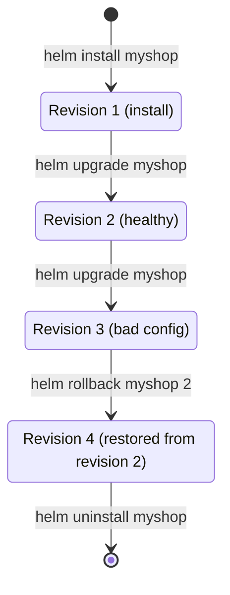

# Packaging Applications with Helm - Charts, Values, and Release Management

## Learning Objectives
- Understand the pain points of managing repetitive manifests and the problem Helm solves
- Describe the Chart structure (templates, values.yaml, Chart.yaml) and how template variable substitution works
- Deploy, upgrade, and roll back a release using `helm install`, `helm upgrade`, and `helm rollback`

## Content

### Why Package Manifests Together

Up to this point, we have been writing each Kubernetes object — Deployment, Service, ConfigMap, Ingress — as its own YAML file and deploying it with `kubectl apply`. For a small application, that works fine. In real-world operations, however, a single application rarely fits in one file.

Consider deploying a Node.js backend for an e-commerce site. To handle traffic you need a **Deployment (2 replicas)**, a **MongoDB** instance for data storage, a **Service** for external access, and a **ConfigMap** for environment-specific configuration — four or five manifests in total. Two problems immediately surface.

- **Values differ across environments.** In development you want 1 replica and `NodePort`; in production you want 5 replicas and `LoadBalancer`. That means copying nearly identical YAML files and changing a handful of values for each environment.
- **Nobody knows what to change or where.** The original author knows that "the replica count is on line 23 of deployment.yaml." But when ownership changes, the next maintainer has to hunt through scattered files to find what needs updating.

**Helm is the package manager for Kubernetes.** Just as `apt` on Ubuntu or `brew` on macOS installs, upgrades, and removes complex programs with a single command, Helm bundles a collection of manifests into **one package (a Chart)** and deploys it to a cluster with a single command. The core idea is simple: **separate the unchanging structure (templates) from the values that vary per environment (configuration).**

### The Two Pillars of Helm: Chart (Templates) and Values (Configuration)

Helm splits an application stack into two concerns.

- **Chart** — a bundle of all the manifest templates that make up the application. It holds the **structure (the mold)** — "this app consists of a Deployment + Service + ..."
- **Values** — the **configuration** that fills in the blanks of that mold. These are the environment-specific values that change: replica count, image tag, service type, and so on.

Combining the two produces the final manifests that are applied to the cluster. By plugging different values into the same Chart, you can stamp out development and production environments from the exact same template.

> The key insight is "build the Chart once, reuse it everywhere by swapping only the values." Replace the habit of copy-pasting manifests with the mindset of extracting anything that changes into `values.yaml`.

One term worth defining up front: when a Chart is installed into a cluster, each **installed instance is called a "Release."** The same Chart can create multiple releases such as `frontend-dev` and `frontend-prod`. Every upgrade to a release increments a revision number (revision 1, 2, 3 …), and that revision history is exactly what makes rollback possible.

### Tiller Is Gone (Helm 3)

If you search for Helm, you will often see the word "Tiller." **In the older Helm 2, a server component called Tiller ran inside the cluster**, acting as a middleman that received commands from the Helm client and forwarded them to the Kubernetes API. The problem was that Tiller operated with broad cluster-wide permissions, making it an easy security vulnerability.

**Helm 3 removes Tiller entirely.** The Helm client now communicates **directly with the Kubernetes API** using the permissions from your `kubeconfig` (the cluster access configuration file). There is no separate server to install, and the security model is clear: "Helm can only do what your kubectl can do." Release history is no longer stored in a separate location — it is stored as **Secrets in the namespace where the release is deployed**.

Since we are using Helm 3, the only thing to keep in mind is that `helm init` (the old Tiller installation command you see in older articles) is no longer needed.

As shown in the diagram below, Helm 3 combines the Chart templates with the values to produce completed manifests and sends them directly to the Kubernetes API for deployment.

```mermaid How Helm 3 combines a Chart and values and deploys to the cluster
flowchart LR
    C["Chart<br/>templates/*.yaml"] --> R["Helm Client<br/>Template Rendering"]
    V["values.yaml<br/>Environment-specific config"] --> R
    R -->|"Completed manifests"| API["Kubernetes API<br/>Direct communication, no Tiller"]
    API --> K["Deploy to cluster<br/>= Release created"]
    K -.->|"History stored as Secrets"| H["Revision 1, 2, 3 ...<br/>Rollback reference"]
```

### Inside the Chart Structure

You can scaffold an empty Chart with a single command.

```bash
helm create myapp
```

This generates the following directory. Focus on the key files.

```
myapp/
├── Chart.yaml          # Metadata: chart name, version, etc.
├── values.yaml         # Default values (configuration) to fill into the templates
├── templates/          # Manifest templates where variable substitution occurs
│   ├── deployment.yaml
│   ├── service.yaml
│   ├── _helpers.tpl    # Reusable name and label snippets
│   └── ...
└── charts/             # Sub-charts this chart depends on
```

- **`Chart.yaml`** — the identity card of the package. It holds the chart name, chart version (`version`), and application version (`appVersion`).
- **`values.yaml`** — the **default values** for all configuration. Users can use these as-is or override individual values.
- **`templates/`** — standard manifests, but with blanks marked by `{{ ... }}` expressions that pull values from `values.yaml`.

A typical `Chart.yaml` looks like this:

```yaml
apiVersion: v2
name: myapp
description: Our company's shopping backend
version: 0.1.0        # version of the chart itself
appVersion: "1.0.0"   # version of the application being packaged
```

### How Template Variable Substitution Works

The core mechanic is **replacing hard-coded values in `templates/` manifests with `{{ .Values.<path> }}`**. `.Values` refers to the contents of `values.yaml`.

Define the values that vary per environment in `values.yaml`:

```yaml
# values.yaml
replicaCount: 2
image:
  repository: myorg/node-shop
  tag: "1.0.0"
service:
  type: NodePort
  port: 8080
```

Then reference those values in `templates/deployment.yaml`:

```yaml
# templates/deployment.yaml (excerpt)
spec:
  replicas: {{ .Values.replicaCount }}          # → substituted with 2
  template:
    spec:
      containers:
        - name: app
          image: "{{ .Values.image.repository }}:{{ .Values.image.tag }}"
          ports:
            - containerPort: {{ .Values.service.port }}
```

At `helm install` time, Helm reads the templates and substitutes `{{ .Values.replicaCount }}` with `2` and `{{ .Values.image.tag }}` with `"1.0.0"`, producing **ordinary, fully-formed Kubernetes manifests** that are then applied to the cluster.

> To preview the generated manifests before deploying, use `helm template myapp/` or `helm install myapp ./myapp --dry-run --debug`. Making a habit of reviewing the rendered output before applying dramatically reduces mistakes.

Now suppose you want production to run 5 replicas with a LoadBalancer service. Do not touch the templates — **change only the values**. Keeping overrides in a separate file is the cleanest approach.

```yaml
# values-prod.yaml — only the values that differ in production
replicaCount: 5
service:
  type: LoadBalancer
```

### Hands-On: Deploying, Upgrading, and Rolling Back a Release

With a Chart ready, let's deploy it to a real cluster. The examples assume a local cluster (minikube, Docker Desktop Kubernetes, etc.) is up and running.

**Step 1: Install — `helm install`**

Starting with Helm 3, you must always specify the release name explicitly (auto-generated names are no longer the default).

```bash
# helm install <release-name> <chart-path>
helm install myshop ./myapp

# Override with a production values file using -f
helm install myshop ./myapp -f values-prod.yaml

# Override one or two values quickly with --set
helm install myshop ./myapp --set replicaCount=3
```

Verify the installed release.

```bash
helm list                 # list releases in the current namespace
helm list --all-namespaces  # list releases across all namespaces
kubectl get pods            # confirm the Pods were actually created
```

> Caution: Helm 3 does not automatically create namespaces that do not exist. If you deploy with `-n team-a`, you must first run `kubectl create namespace team-a` or add the `--create-namespace` flag. This is a common pitfall in CI/CD pipelines.

**Step 2: Upgrade — `helm upgrade`**

Traffic has dropped after the holidays, so you want to reduce the replica count. There is no need to tear down and redeploy the entire application — just change `install` to `upgrade`.

```bash
helm upgrade myshop ./myapp --set replicaCount=1
```

Helm calculates the diff and applies it to the cluster, incrementing the release's revision number by 1. Every upgrade is preserved as a new revision in the history.

```bash
helm history myshop   # revision history for this release (who deployed what, and when)
```

In automation scripts where it is uncertain whether an initial install has already occurred, use the `helm upgrade --install myshop ./myapp` idiom. It installs if the release does not exist, and upgrades if it does.

**Step 3: Rollback — `helm rollback`**

Something went wrong with the upgraded configuration? Because Helm retains a complete revision history, you can revert to any previous revision with a single command.

Say you installed (revision 1), then upgraded twice, and are now at **revision 3** — but that revision 3 has a bad configuration. You want to return to the last known-good state, **revision 2**. First check `helm history` to confirm which revision was healthy, then roll back to that number.

```bash
# Check the history to identify the healthy revision
helm history myshop

# helm rollback <release-name> <target-revision-number>
helm rollback myshop 2     # restore to revision 2, the last known-good state

helm history myshop        # the rollback is itself recorded as a new revision (revision 4 here)
```

This is the core reason Helm is more powerful than manually reverting scattered YAML files with `kubectl apply`. You can **return to the last known-good state in a single line.**

The release lifecycle flows like the state diagram below. Revisions accumulate with each upgrade, and when something breaks, a rollback restores the healthy revision. The rollback itself becomes a new revision (revision 4 in this example), preserving the full audit trail.



**Step 4: Uninstall — `helm uninstall`**

```bash
helm uninstall myshop      # removes all objects created by the release
```

(Helm 2's `helm delete --purge` is unified into `helm uninstall` in Helm 3. Add `--keep-history` to preserve the revision history after removal.)

### Using Charts Others Have Built — Repositories

You do not have to build every Chart yourself. Well-known software like nginx, Prometheus, and Jenkins has already been packaged into Charts and published in **Chart repositories**. This is exactly the same concept as a package repository on an operating system.

```bash
# Add a repository (Helm 3 ships with no default repos, so you must add them manually)
helm repo add bitnami https://charts.bitnami.com/bitnami
helm repo update                       # refresh the local index
helm search repo nginx                 # search for a chart
helm install web bitnami/nginx         # install the chart you found
```

Your own Charts can be packaged with `helm package myapp` and published to an internal repository, allowing other teams to reproduce the exact same configuration with the same one-line command — no more handing off manifests with a note saying "change this value here."

## Key Takeaways
- When manifests multiply and values differ across environments, copy-and-paste management becomes unmanageable. Helm is a Kubernetes package manager that bundles them into a **package (Chart)** and handles everything with a single command.
- Helm separates the **unchanging structure (Chart/templates)** from the **environment-specific values (values.yaml)**. The `{{ .Values.<path> }}` placeholders in templates are substituted with values at install time to produce the final manifests.
- The core of a Chart is `Chart.yaml` (metadata), `values.yaml` (default configuration), and `templates/` (the substitutable manifests).
- An installed Chart instance is called a **release**. Use `helm install` to deploy, `helm upgrade` to update (increments the revision), `helm rollback <number>` to restore a healthy revision (e.g., if revision 3 is broken, run `helm rollback myshop 2`), and `helm history` to inspect the revision log.
- Helm 3 **removes Tiller** and communicates with the API directly using your kubeconfig permissions. Namespaces are not auto-created — use `--create-namespace` when needed.
- Fetch well-known software with `helm repo add` followed by a search and install. Share your own Charts via `helm package`.

## Sources
- IBM Technology, "What is Helm?" — https://www.youtube.com/watch?v=fy8SHvNZGeE
- Docker, "Hands-On Helm" — https://www.youtube.com/watch?v=6d6L4-ADF-M
