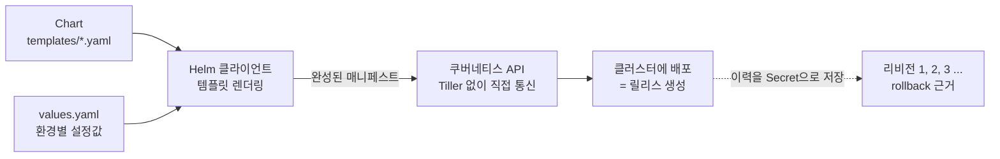
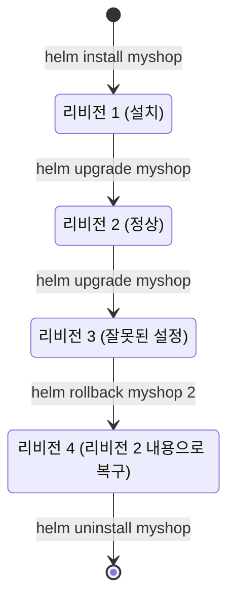

# Helm으로 애플리케이션 패키징 - Chart·values·릴리스 관리

## 학습 목표
- 반복되는 매니페스트 관리의 어려움과 Helm이 해결하는 문제를 이해한다
- Chart 구조(templates·values.yaml·Chart.yaml)와 템플릿 변수 치환 방식을 설명한다
- helm install/upgrade/rollback으로 릴리스를 배포·업그레이드·롤백해본다

## 본문

### 왜 매니페스트를 "패키지"로 묶어야 하나

지금까지 우리는 Deployment, Service, ConfigMap, Ingress 같은 오브젝트를 각각 YAML 파일로 작성해 `kubectl apply`로 배포했다. 작은 앱 하나라면 충분하다. 그런데 실무에서는 하나의 애플리케이션이 좀처럼 파일 하나로 끝나지 않는다.

예를 들어 쇼핑몰의 Node.js 백엔드를 배포한다고 하자. 트래픽을 견디려 **Deployment(레플리카 2개)** 가 필요하고, 데이터를 담을 **MongoDB**, 외부에서 접근할 **Service**, 환경별 설정을 담을 **ConfigMap**까지 합쳐 매니페스트가 4~5개로 불어난다. 여기서 두 가지 골치 아픈 문제가 생긴다.

- **환경마다 값이 다르다.** 개발에서는 레플리카 1개·`NodePort`, 운영에서는 레플리카 5개·`LoadBalancer`를 쓰고 싶다. 그러면 거의 똑같은 YAML을 환경 수만큼 복사해 숫자와 타입만 바꿔야 한다.
- **나중에 누가 무엇을 어디서 바꿔야 할지 모른다.** 처음 작성한 사람은 "레플리카는 deployment.yaml 23번째 줄"을 안다. 하지만 그가 다른 팀으로 옮기고 다음 담당자가 받으면, 흩어진 파일들 속에서 바꿀 값을 찾아 헤맨다.

**Helm은 쿠버네티스의 패키지 매니저다.** 운영체제에 비유하면, 우분투의 `apt`나 macOS의 `brew`가 복잡한 프로그램을 한 줄 명령으로 설치·업그레이드·삭제해 주듯이, Helm은 여러 개의 매니페스트 묶음을 **하나의 패키지(Chart)** 로 다루고 한 줄 명령으로 클러스터에 올린다. 핵심 발상은 단순하다. **"변하지 않는 틀(템플릿)"과 "환경마다 바뀌는 값(설정)"을 분리하는 것**이다.

### Helm의 두 축: Chart(템플릿)와 values(설정)

Helm은 애플리케이션 스택을 두 가지로 나눠 생각한다.

- **Chart** — 앱을 구성하는 모든 매니페스트 템플릿의 묶음. "이 앱은 Deployment + Service + ... 로 이루어진다"는 **구조(틀)** 를 담는다.
- **values** — 그 틀의 빈칸을 채우는 **설정값**. 레플리카 개수, 이미지 태그, 서비스 타입 같은 환경별로 바뀌는 값이다.

이 둘을 합치면 실제로 클러스터에 적용할 최종 매니페스트가 만들어진다. 같은 Chart에 다른 values만 끼워 넣으면 개발·운영 환경을 같은 틀로 찍어낼 수 있다.

> 핵심은 "한 번 만든 Chart를 values만 바꿔 어디서든 재사용"하는 것이다. 매니페스트를 복사·붙여넣기 하던 습관을 버리고, 변하는 값만 values.yaml로 빼는 사고방식으로 전환하자.

용어 하나를 미리 정리하자. Chart를 클러스터에 설치하면 그 **설치된 인스턴스 하나하나를 "릴리스(Release)"** 라고 부른다. 같은 Chart로 `frontend-dev`, `frontend-prod` 같은 여러 릴리스를 만들 수 있다. 릴리스는 업그레이드할 때마다 리비전 번호(revision 1, 2, 3 …)가 쌓이며, 이 이력이 곧 롤백의 근거가 된다.

### Tiller는 이제 없다 (Helm 3)

Helm을 검색하면 "Tiller"라는 단어가 자주 보인다. **과거 Helm 2에는 클러스터 안에 Tiller라는 서버 컴포넌트가 상주**하면서, Helm 클라이언트의 명령을 받아 쿠버네티스 API로 전달하는 중개자 역할을 했다. 문제는 이 Tiller가 광범위한 권한을 가진 채 돌아 보안 구멍이 되기 쉬웠다는 점이다.

**Helm 3에서는 Tiller가 완전히 제거됐다.** 이제 Helm 클라이언트가 여러분의 `kubeconfig`(클러스터 접속 설정 파일) 권한을 그대로 사용해 **쿠버네티스 API와 직접 통신**한다. 덕분에 별도 서버를 설치할 필요가 없고, "내 kubectl이 할 수 있는 만큼만 Helm도 할 수 있다"는 명확한 보안 모델이 된다. 릴리스 이력도 예전처럼 별도 공간이 아니라 **릴리스가 배포된 네임스페이스에 Secret 형태로 저장**된다.

지금 우리가 쓰는 것은 Helm 3이므로, 오래된 글에 나오는 `helm init`(Tiller 설치 명령)은 더 이상 필요 없다는 점만 기억하면 된다.

아래 구성도처럼, Helm 3는 Chart 템플릿과 values를 결합해 완성된 매니페스트를 만들고 이를 쿠버네티스 API로 직접 보내 배포한다.



### Chart 구조 들여다보기

빈 Chart의 뼈대는 한 줄로 만든다.

```bash
helm create myapp
```

그러면 다음과 같은 디렉터리가 생긴다. 핵심 파일만 보면 된다.

```
myapp/
├── Chart.yaml          # 이 차트의 이름·버전 등 메타데이터
├── values.yaml         # 템플릿에 채워 넣을 기본값(설정)
├── templates/          # 변수 치환이 일어나는 매니페스트 템플릿들
│   ├── deployment.yaml
│   ├── service.yaml
│   ├── _helpers.tpl    # 재사용 가능한 이름·라벨 조각
│   └── ...
└── charts/             # 이 차트가 의존하는 다른 차트(서브차트)
```

- **`Chart.yaml`** — 패키지의 신분증이다. 차트 이름, 차트 버전(`version`), 앱 버전(`appVersion`)을 적는다.
- **`values.yaml`** — 모든 설정의 **기본값**. 사용자는 이 값을 그대로 쓰거나 일부만 덮어쓴다.
- **`templates/`** — 실제 매니페스트지만, 군데군데 값이 비어 있고 그 자리에 `{{ ... }}` 표기로 values를 끌어다 쓴다.

`Chart.yaml`은 예를 들면 이렇다.

```yaml
apiVersion: v2
name: myapp
description: 우리 회사 쇼핑 백엔드
version: 0.1.0        # 차트 자체의 버전
appVersion: "1.0.0"   # 패키징하는 앱의 버전
```

### 템플릿 변수 치환이 일어나는 방식

핵심은 `templates/` 안의 매니페스트에서 **하드코딩하던 값을 `{{ .Values.경로 }}`로 바꾸는 것**이다. `.Values`는 values.yaml의 내용을 가리키는 변수다.

`values.yaml`에 환경별로 바뀔 값을 정의하고:

```yaml
# values.yaml
replicaCount: 2
image:
  repository: myorg/node-shop
  tag: "1.0.0"
service:
  type: NodePort
  port: 8080
```

`templates/deployment.yaml`에서는 그 값을 끌어다 쓴다.

```yaml
# templates/deployment.yaml (일부)
spec:
  replicas: {{ .Values.replicaCount }}          # → 2 로 치환됨
  template:
    spec:
      containers:
        - name: app
          image: "{{ .Values.image.repository }}:{{ .Values.image.tag }}"
          ports:
            - containerPort: {{ .Values.service.port }}
```

`helm install` 시점에 Helm이 템플릿을 읽으며 `{{ .Values.replicaCount }}` 자리를 values의 `2`로, `{{ .Values.image.tag }}`를 `"1.0.0"`으로 채워 **완성된 평범한 쿠버네티스 매니페스트**를 만들어 낸다. 이렇게 만들어진 결과물을 클러스터에 적용하는 것이다.

> 실제로 적용 전에 어떤 매니페스트가 생성되는지 미리 보고 싶다면 `helm template myapp/` 또는 `helm install myapp ./myapp --dry-run --debug`를 쓴다. 치환이 의도대로 됐는지 눈으로 확인하는 습관이 실수를 크게 줄인다.

이제 운영 환경에 레플리카를 5개로, 서비스를 LoadBalancer로 바꾸고 싶다면? 템플릿은 손대지 않고 **값만** 바꾼다. 별도 파일로 빼서 관리하면 깔끔하다.

```yaml
# values-prod.yaml — 운영 환경에서 덮어쓸 값만 적는다
replicaCount: 5
service:
  type: LoadBalancer
```

### 릴리스 배포·업그레이드·롤백 실습

Chart가 준비됐으면 본격적으로 클러스터에 올려 본다. 실습 클러스터(minikube, Docker Desktop의 Kubernetes 등)가 떠 있다고 가정한다.

**1) 설치 — `helm install`**

Helm 3부터는 릴리스 이름을 반드시 직접 지정해야 한다(과거의 자동 이름 생성은 기본이 아니다).

```bash
# helm install <릴리스이름> <차트경로>
helm install myshop ./myapp

# 운영 값을 덮어쓰며 설치하려면 -f 로 추가 values 파일을 지정
helm install myshop ./myapp -f values-prod.yaml

# 값 한두 개만 빠르게 바꾸려면 --set
helm install myshop ./myapp --set replicaCount=3
```

설치된 릴리스를 확인한다.

```bash
helm list                 # 현재 네임스페이스의 릴리스 목록
helm list --all-namespaces  # 모든 네임스페이스
kubectl get pods            # 실제로 생성된 Pod 확인
```

> 주의: Helm 3는 존재하지 않는 네임스페이스를 자동으로 만들어 주지 않는다. `-n team-a` 같이 네임스페이스를 지정해 배포하려면 `kubectl create namespace team-a`로 먼저 만들거나 `--create-namespace` 플래그를 붙여야 한다. CI/CD 파이프라인에서 자주 걸리는 함정이다.

**2) 업그레이드 — `helm upgrade`**

연휴가 끝나 트래픽이 줄었으니 레플리카를 줄인다고 하자. 앱을 통째로 내렸다가 다시 올릴 필요 없이, `install`을 `upgrade`로 바꾸기만 하면 된다.

```bash
helm upgrade myshop ./myapp --set replicaCount=1
```

Helm이 변경분을 계산해 클러스터에 반영하고, 릴리스의 리비전 번호가 1 증가한다. 매번 새 리비전이 이력으로 남는다.

```bash
helm history myshop   # 이 릴리스의 리비전 이력(누가 언제 무엇으로 배포했는지)
```

처음 설치 여부가 불확실한 자동화 스크립트에서는 `helm upgrade --install myshop ./myapp` 관용구를 쓴다. 없으면 설치하고, 있으면 업그레이드한다.

**3) 롤백 — `helm rollback`**

업그레이드한 설정에 문제가 생겼다면? Helm이 모든 리비전 이력을 보관하므로, 직전(또는 원하는) 리비전으로 되돌릴 수 있다.

예를 들어 설치(리비전 1)에 이어 두 번 업그레이드해 현재 **리비전 3**까지 왔는데, 그 리비전 3의 설정이 잘못됐다고 하자. 그러면 마지막으로 정상이던 **리비전 2**로 되돌린다. 먼저 `helm history`로 어느 리비전이 정상이었는지 확인한 뒤 그 번호를 지정한다.

```bash
# 먼저 이력을 보고 정상 리비전 번호를 확인
helm history myshop

# helm rollback <릴리스이름> <돌아갈 리비전 번호>
helm rollback myshop 2     # 직전 정상 상태인 2번 리비전으로 복구

helm history myshop        # 롤백도 새 리비전(여기서는 4번)으로 기록된다
```

이것이 흩어진 YAML을 일일이 `kubectl apply`로 되돌리는 것보다 Helm이 강력한 핵심 이유다. **"마지막으로 정상 동작하던 상태"로 한 줄에 복귀**할 수 있다.

릴리스의 한살이(생애주기)는 아래 상태도처럼 흐른다. 업그레이드마다 리비전이 쌓이고, 문제가 생기면 정상 리비전(여기서는 리비전 2)으로 돌아간다. 이때 롤백은 리비전 2의 내용을 그대로 복구하면서 그 자체로 새 리비전(리비전 4)을 만든다.



**4) 삭제 — `helm uninstall`**

```bash
helm uninstall myshop      # 릴리스가 만든 모든 오브젝트 제거
```

(Helm 2의 `helm delete --purge`가 Helm 3에서는 `helm uninstall`로 통합됐다. 이력까지 남기고 싶으면 `--keep-history`를 붙인다.)

### 남이 만든 Chart 가져다 쓰기 — 리포지토리

직접 만들 필요 없이, nginx·Prometheus·Jenkins 같은 유명 소프트웨어는 이미 누군가 Chart로 패키징해 **차트 리포지토리(Repository)** 에 올려 두었다. 운영체제의 패키지 저장소와 똑같은 개념이다.

```bash
# 리포지토리 추가 (Helm 3는 기본 리포가 없으므로 직접 추가해야 한다)
helm repo add bitnami https://charts.bitnami.com/bitnami
helm repo update                       # 목록 최신화
helm search repo nginx                 # 차트 검색
helm install web bitnami/nginx         # 검색한 차트를 바로 설치
```

내가 만든 Chart도 `helm package myapp`로 압축한 뒤 사내 리포지토리에 올리면, 다른 팀이 똑같은 한 줄 명령으로 동일한 구성을 재현할 수 있다. 매니페스트를 주고받으며 "여기 값을 이렇게 바꾸세요"라고 설명할 필요가 사라진다.

## 핵심 요약
- 매니페스트가 여러 개로 불어나고 환경마다 값이 달라지면 복사·관리가 어려워진다. Helm은 이를 **패키지(Chart)** 로 묶어 한 줄 명령으로 다루는 쿠버네티스 패키지 매니저다.
- Helm은 **변하지 않는 틀(Chart/templates)** 과 **환경마다 바뀌는 값(values.yaml)** 을 분리한다. 템플릿의 `{{ .Values.경로 }}`가 install 시점에 values로 치환돼 최종 매니페스트가 만들어진다.
- Chart의 핵심은 `Chart.yaml`(메타데이터)·`values.yaml`(기본 설정값)·`templates/`(치환되는 매니페스트)다.
- 설치된 인스턴스를 **릴리스**라 하며, `helm install`로 배포, `helm upgrade`로 업그레이드(리비전 증가), `helm rollback <번호>`로 정상 리비전으로 복구한다(예: 리비전 3이 잘못됐으면 직전 정상인 `helm rollback myshop 2`). `helm history`로 이력을 확인한다.
- Helm 3는 **Tiller가 제거되어** kubeconfig 권한으로 API와 직접 통신한다. 네임스페이스 자동 생성이 안 되므로 `--create-namespace`를 기억하자.
- 유명 소프트웨어는 `helm repo add` 후 검색·설치로 가져다 쓰고, 내 Chart는 `helm package`로 공유한다.

## 출처
- IBM Technology, "What is Helm?" — https://www.youtube.com/watch?v=fy8SHvNZGeE
- Docker, "Hands-On Helm" — https://www.youtube.com/watch?v=6d6L4-ADF-M
