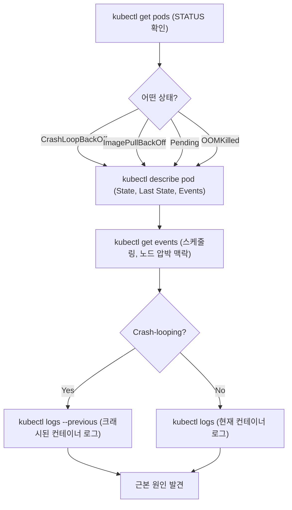

# Pod 장애 진단과 디버깅: CrashLoopBackOff부터 ephemeral container까지

## 학습 목표
- 대표적인 Pod 장애 상태인 CrashLoopBackOff, ImagePullBackOff, Pending, OOMKilled의 의미와 각각의 근본 원인을 구분해 설명할 수 있다.
- `kubectl describe`, events, `kubectl logs --previous`를 조합한 표준 진단 흐름으로 Pod 장애 원인을 체계적으로 좁혀 나갈 수 있다.
- `kubectl debug`와 ephemeral container(임시 컨테이너)를 활용해 실행 중인 Pod를 라이브로 디버깅할 수 있다. shell이 없는 Pod도 포함된다.

## 본문

### 왜 이 내용을 배워야 하는가

Kubernetes를 운영하다 보면 어느 순간 꼼짝도 하지 않는 Pod를 마주치게 된다. Deployment는 멀쩡해 보이고 YAML도 오류 없이 적용됐는데, `kubectl get pods`를 치면 원하지 않던 상태가 찍혀 있다. `CrashLoopBackOff`, `ImagePullBackOff`, `Pending`, 혹은 방금 `OOMKilled`된 컨테이너. 다행인 점은 Kubernetes가 무슨 일이 일어났는지 꽤 솔직하게 알려준다는 것이다. 정보는 대부분 이미 거기 있다. 핵심은 **어디를, 어떤 순서로 봐야 하는지** 아는 것이다.

황금률은 **아래에서 위로(bottom-up) 디버깅**하는 것이다. 가장 작은 작업 단위인 Pod부터 확인하고, Pod가 실제로 Running·Ready 상태임을 확인한 뒤에야 Service와 Ingress로 올라간다. Pod가 crash-looping 중인데 Ingress부터 뒤지는 건 시간 낭비다. 이 bottom-up 원칙은 Deployment, StatefulSet, DaemonSet, Job, CronJob 모두에 동일하게 적용된다.

이번 강의에서는 먼저 네 가지 대표 장애 상태를 읽는 법을 익히고, 표준 진단 흐름을 단계별로 따라간 뒤, 로그만으로 원인을 찾지 못할 때 쓸 수 있는 라이브 디버깅 도구까지 살펴본다.

### STATUS 컬럼이 첫 번째 단서다

아래 명령을 실행하고 `STATUS` 컬럼을 꼼꼼히 읽는다. 지금 가진 신호 중 가장 유용한 것이 여기 있다.

```bash
kubectl get pods
kubectl get pods -o wide        # 노드와 Pod IP 추가 표시
kubectl get pods -w             # 실시간으로 상태 변화 감시
```

각 상태는 원인 계열이 다르다. 하나씩 살펴보자.

#### CrashLoopBackOff — 시작 후 컨테이너가 계속 죽는다

Pod에는 **restart policy**가 있고 기본값은 `Always`다. 컨테이너가 종료되면 Kubernetes는 앱을 유지하기 위해 충실하게 재시작한다. 그런데 컨테이너가 시작하자마자 또 크래시가 난다면 — 예컨대 새 빌드가 초기화 중 예외를 던진다면 — 시작→크래시→재시작→크래시의 루프에 빠진다. 시스템에 부하를 주지 않으려고 Kubernetes는 재시작 간격을 점점 늘린다. 대략 몇 초, 10초, 1분 순으로 늘어나다 5분에서 고정된다. 이 늘어나는 대기 시간이 **back-off**이고, 전체 시작-크래시-재시작 사이클을 STATUS 컬럼이 `CrashLoopBackOff`로 표시하는 것이다.

> CrashLoopBackOff는 오류 그 자체가 아니라 증상이다. 컨테이너가 시작은 되지만 반복해서 종료된다는 뜻이다. 실제 버그는 컨테이너가 *왜* 종료되느냐에 있으며, 그 답은 거의 항상 크래시된 컨테이너의 로그에 있다.

주요 원인: 애플리케이션 코드 버그, 누락된 환경 변수나 설정 파일, 시작 시 DB 연결 실패, 잘못 설정된 command/entrypoint, 실제로는 정상이지만 부팅이 느린 컨테이너를 죽여버리는 liveness probe 오설정 등.

#### ImagePullBackOff (및 ErrImagePull) — 이미지가 도착하지 않는다

컨테이너가 시작조차 못 하는 상태다. kubelet이 이미지를 pull하지 못한 것이다. `ErrImagePull`은 첫 번째 시도 실패이고, `ImagePullBackOff`는 이미 back-off 상태로 재시도 중임을 뜻한다. 흔한 원인: 이미지 이름이나 태그 오타, 존재하지 않는 이미지 태그, `imagePullSecret`이 설정되지 않은 private 레지스트리, 레지스트리에 도달하지 못하는 네트워크 문제 또는 rate limit. 해결책은 거의 언제나 이미지 참조나 레지스트리 인증 정보에 있다. 애플리케이션 코드와는 무관하다.

#### Pending — Pod가 스케줄링되지 못한다

`Pending` 상태의 Pod는 클러스터에 수락됐지만 아직 노드에 배치되지 않은 것이다. 스케줄러가 Pod의 요구사항을 만족하는 노드를 찾지 못했다. 주요 원인: 전체 노드에 CPU나 메모리가 부족한 경우, 어떤 노드도 만족시키지 못하는 nodeSelector/affinity/taint 설정, 바인딩이 안 되는 PersistentVolumeClaim 등. Pending은 *스케줄링* 문제다. 따라서 단서는 Pod의 events와 노드 용량에 있지, 컨테이너 이미지나 코드에 있지 않다.

#### OOMKilled — 컨테이너가 메모리 한도를 초과했다

컨테이너가 설정된 `limits.memory`를 초과하면 Linux 커널의 OOM killer가 프로세스를 종료하고, Kubernetes는 그 이유를 `OOMKilled`(종료 코드 137)로 기록한다. 컨테이너가 재시작 후 다시 부하 하에 종료되기 때문에 crash loop처럼 보이는 경우가 많다. 해결책은 메모리 limit을 올리거나, 앱의 메모리 누수를 고치거나, 워크로드를 적절히 조정하는 것이다. 실제 애플리케이션 크래시와 OOM kill을 구분하려면 항상 컨테이너의 `State`와 `Last State` reason을 확인해야 한다.

### 표준 진단 흐름

STATUS가 무엇이든 진단은 동일한 세 단계로 진행된다. 한 번 익혀두면 오랫동안 쓸 수 있다.

**1단계 — Pod를 `describe`한다.** 가장 풍부한 정보 원천이다. 각 컨테이너의 현재 `State`, `Last State`(종료 코드와 이유 포함 — `OOMKilled`를 확인하는 곳이 바로 여기다), 재시작 횟수, 적용된 이미지, probe 설정, 그리고 가장 중요한 하단의 **Events** 섹션이 모두 나온다.

```bash
kubectl describe pod <pod-name>
```

Events 섹션을 아래에서 위로 읽는다. `Failed to pull image`, `Insufficient memory`, `Back-off restarting failed container`, `Liveness probe failed` 같은 메시지가 각각 해당 장애 계열로 곧장 안내한다.

**2단계 — events를 읽는다. 더 넓은 맥락도 함께.** Pod 수준의 events는 `describe`에 있지만, 클러스터 전체 events는 더 넓은 맥락을 준다(예: 스케줄링 실패나 노드 압박 상황).

```bash
kubectl get events --sort-by=.lastTimestamp
kubectl get events --field-selector involvedObject.name=<pod-name>
```

**3단계 — 로그를 읽는다. *이전* 컨테이너 로그도 확인한다.** CrashLoopBackOff 상태에서는 현재 컨테이너가 막 재시작된 직후라 유용한 로그가 없을 수 있다. 필요한 예외 메시지는 *방금 죽은* 컨테이너 인스턴스에 있다. 그걸 보여주는 것이 바로 `--previous`다.

```bash
kubectl logs <pod-name>                      # 현재 컨테이너 인스턴스
kubectl logs <pod-name> --previous           # 방금 크래시된 컨테이너 — CrashLoopBackOff의 핵심
kubectl logs <pod-name> -c <container-name>  # 멀티 컨테이너 Pod의 특정 컨테이너
kubectl logs <pod-name> -f                   # 실시간 follow
```

> CrashLoopBackOff에서는 `kubectl logs --previous`가 답을 건네주는 경우가 가장 많다. 현재 컨테이너에는 아직 아무것도 없고, 크래시된 컨테이너에 스택 트레이스가 있다.

정리하면, **STATUS**로 장애 계열을 파악하고, **describe**로 상태와 events를 확인하고, **logs(`--previous` 포함)**로 실제 오류 메시지를 읽는다. Pod 문제 대부분은 이 세 명령으로 해결된다. 아래 다이어그램이 이 흐름을 한눈에 보여준다.



### 로그만으로 부족할 때: `kubectl debug`로 라이브 디버깅

로그가 침묵을 지키는 경우도 있다. 실행 중인 Pod 내부로 들어가 어떤 프로세스가 살아 있는지 확인하거나, 다른 서비스로의 네트워크 연결을 테스트하거나, 파일을 들여다볼 필요가 생긴다. 가장 익숙한 방법은 `kubectl exec -it <pod> -- sh`다. 그런데 프로덕션 환경에서 점점 흔해지는 함정이 있다. **distroless 이미지에는 shell이 없다.**

distroless 컨테이너는 애플리케이션 바이너리만 남기고 나머지를 걷어낸 이미지다. 용량이 작고 pull이 빠르고 시작도 빠르다는 장점이 있지만, `sh`, `curl`, `ps`가 없으니 `exec`으로 들어갈 수 있는 게 아무것도 없다. 그렇다면 shell이 없는 라이브 Pod를 어떻게 디버깅할까?

답은 **ephemeral container(임시 컨테이너)**이며, `kubectl debug`로 구동한다. Pod를 내리지 않고 기존 Pod에 *임시 컨테이너를 붙이는* 방식이다. 이 debug 컨테이너는 busybox, curl, ps, netcat 등 원하는 도구를 직접 가져오고, 같은 Pod 안에 합류하기 때문에 네트워크 네임스페이스를 공유한다. shared process namespace가 활성화되어 있으면 문제 컨테이너의 프로세스도 볼 수 있다. 복제본이 아닌 *실제* 문제 Pod를 직접 디버깅하는 것이다.

```bash
# 실행 중인 Pod에 busybox debug 컨테이너를 붙이고 shell에 진입
kubectl debug -it <pod-name> --image=busybox --target=<container-name>
```

`--target` 플래그는 ephemeral container가 대상 컨테이너의 프로세스 네임스페이스를 공유하도록 지정한다. 진입 후 라이브 상태를 바로 확인할 수 있다.

```bash
# ephemeral container 내부에서:
ps aux                          # 대상 컨테이너의 프로세스 확인
nslookup my-service             # 다른 Service로의 DNS 확인
wget -qO- http://my-service:80  # 다른 Pod/Service로의 연결 테스트
```

ephemeral container는 문제 컨테이너와 같은 네트워크 컨텍스트에 있기 때문에, ping이나 telnet으로 앱이 의존하는 서비스에 왜 연결이 안 되는지 추적할 수 있다. `kubectl debug` 계열 명령은 안전한 실험을 위해 Pod를 복사하거나, 노드에 debug shell을 붙이는 용도로도 쓸 수 있다. 하지만 일상적으로 가장 유용한 기능은 Pod를 재시작하지 않고 shell 없는 라이브 Pod를 검사하는 것이다.

### 더 큰 그림과의 연결

Pod가 진정으로 Running·Ready 상태가 된 *다음*에 비로소 상위 계층으로 올라간다. 그래도 앱이 응답하지 않는다면 Service를 의심한다(selector가 Pod label과 일치하는지, endpoints가 채워져 있는지 확인). 그 다음은 Ingress(`service.name`과 `service.port`를 검증하고 backend가 비어 있지 않은지 확인). Ingress나 인프라 문제를 빠르게 격리하는 방법은 Pod 또는 Ingress controller Pod로 `kubectl port-forward`를 걸어 외부 계층을 우회했을 때 앱이 응답하는지 확인하는 것이다. 하지만 이건 *다음 단계*다. bottom-up 흐름으로 Pod 자체가 정상임을 확인한 뒤에야 이 단계를 밟을 자격이 생긴다.

## 핵심 정리
- **STATUS를 먼저 읽는다.** CrashLoopBackOff = 시작 후 반복 종료, ImagePullBackOff = 이미지 pull 실패, Pending = 스케줄러가 Pod를 배치하지 못함, OOMKilled = 컨테이너가 메모리 한도를 초과(종료 코드 137).
- **CrashLoopBackOff는 버그가 아니라 증상이다.** 실제 원인은 크래시된 컨테이너의 로그에 있다. `kubectl logs --previous`를 쓴다.
- **반복 가능한 흐름을 따른다:** `kubectl describe pod`(state + events) → `kubectl get events` → `kubectl logs [--previous]`. Pod 장애 대부분은 이 세 명령으로 해결된다.
- **아래에서 위로 디버깅한다.** Service나 Ingress를 추적하기 전에 Pod가 Running·Ready 상태인지 먼저 확인한다.
- **shell 없는 라이브 Pod는 `kubectl debug`와 ephemeral container를 쓴다.** 도구가 갖춰진 컨테이너를 실행 중인 Pod에 붙여 네트워크·프로세스 네임스페이스를 공유하며 실제 문제를 그 자리에서 디버깅한다. shell도 필요 없고 Pod 재시작도 없다.
