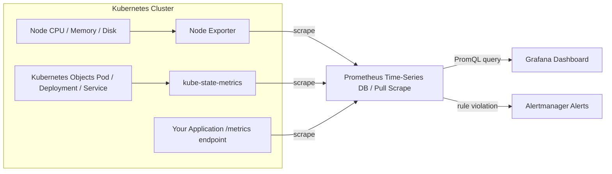
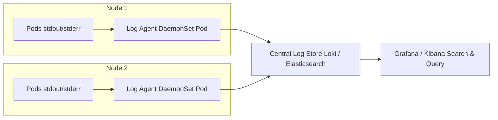

# Monitoring and Logging - Prometheus, Grafana, and Log Collection

## Learning Objectives
- Understand why observing cluster and workload health matters, and how metrics and logs each play a distinct role
- Explain the monitoring flow in which Prometheus collects metrics and Grafana visualizes them
- Deploy a monitoring stack, explore its dashboards, and practice log collection hands-on

## Content

### Why Your Cluster Needs to Be Observable

So far we have learned how to deploy workloads, divide permissions, and control traffic. Once you move into actual operations, the question you will hear most often is: **"Is our cluster actually healthy right now?"**

A Pod being up does not mean everything is fine. CPU could be approaching its limit, memory might be leaking, or some Pod could be silently restarting every five minutes. If you only notice something is wrong after users start complaining about slow responses, it is already too late. **Observability** is the practice of making a system's internal state visible from the outside.

The two pillars of observability are **metrics** and **logs**. They answer different questions.

- **Metrics answer "how much."** They are numbers that change over time — CPU utilization at 73%, 1,200 requests per second, 47 Pods currently running. Metrics are well suited for spotting trends and firing alerts when thresholds are crossed.
- **Logs answer "what happened."** They are records of discrete events at a specific point in time — for example, "14:32:07 payment request failed, NullPointerException." Logs are well suited for digging into root causes after something has gone wrong.

> Use metrics to detect that something looks off, and logs to figure out why. The two are not in competition — they divide the work. Any production environment needs both.

In the Kubernetes ecosystem, the de facto standard for metrics is the **Prometheus + Grafana** combination. For log collection, **Loki** and the **Fluentd/Fluent Bit** family are widely used. This lecture covers both areas in turn.

### How Prometheus Works — Pull-Based Collection and the Time-Series Database

Prometheus is an open-source metrics monitoring system maintained by the CNCF (Cloud Native Computing Foundation) and written in Go. Its core operating principle can be summarized in one word: **Pull.**

Many monitoring tools have each server "push" data to a central location. Prometheus works the other way around. The Prometheus server periodically (typically every 15 seconds) reaches out to each monitored target via HTTP and **scrapes** its metrics. Each monitored target is called a **target**.

A target exposes its current values in plain-text format at an HTTP endpoint like `/metrics`. A single line looks like this:

```text
http_requests_total{method="GET", path="/", status="200"} 1027
```

This one line captures the essential data model:

- **Metric name** (`http_requests_total`): what is being measured.
- **Labels** (`method`, `path`, `status`): key-value pairs that slice the same metric along multiple dimensions. This makes it possible to query precisely — "only GET requests" or "only 500 errors."
- **Value** (`1027`): the current measurement. Recorded together with a timestamp on every scrape.

The sequence of values accumulated over time is called a **time series**, and Prometheus stores them in its own **time-series database (TSDB)**.

What about targets that cannot natively expose a `/metrics` endpoint, such as a database or a Linux node? In those cases, you run an **exporter** alongside the target. The exporter translates the target's state into the format Prometheus understands and exposes it, and Prometheus scrapes the exporter. Node Exporter (CPU, memory, and disk metrics for a node), MySQL Exporter, and MongoDB Exporter are typical examples.

The last puzzle piece is **"how does Prometheus know what to monitor?"** You could list every target in a static config file, but that is impractical in Kubernetes where Pods come and go constantly. Instead, Prometheus uses **service discovery** to integrate with the Kubernetes API and automatically discover and refresh its list of targets.

Once data is collected, it needs to be put to use. Prometheus provides a dedicated query language called **PromQL** for retrieving and computing time-series data. The results can drive alerts (via Alertmanager) or dashboards (via Grafana).

### Installing kube-prometheus-stack with Helm

Do you remember Helm from Lecture 7? It is the tool that bundles multiple manifests into a package (chart) for one-step deployment and management. A monitoring stack has many moving parts — this is exactly where Helm earns its keep.

The chart we will use is **kube-prometheus-stack**, maintained by the Prometheus community. First, add the chart repository.

```bash
# Add the Prometheus community Helm repository (prometheus-community is the alias we assign)
helm repo add prometheus-community https://prometheus-community.github.io/helm-charts
helm repo update

# Search for charts and versions in the repository
helm search repo prometheus-community/kube-prometheus-stack --versions
```

Now deploy the chart to the cluster. In Helm, a single installation of a chart is called a **release**.

```bash
# Install as a release named "prometheus" into the monitoring namespace
# --create-namespace : creates the namespace first if it does not already exist
helm install prometheus prometheus-community/kube-prometheus-stack \
  --namespace monitoring \
  --create-namespace
```

That single command brings the entire monitoring stack up in the cluster. kube-prometheus-stack deploys four key components:

- **Prometheus Operator**: A controller that automates the creation of Prometheus instances and Alertmanager. An Operator is a special controller that extends the Kubernetes API to watch and manage custom resources (such as the ServiceMonitor introduced later) rather than built-in objects.
- **Prometheus instance**: The time-series database that stores metrics.
- **Node Exporter + kube-state-metrics**: Two exporters that feed infrastructure metrics into Prometheus. Node Exporter collects system-level metrics from each node (CPU, memory, disk), while kube-state-metrics collects the state, count, and availability of Kubernetes objects such as Pods, Deployments, and Services.
- **Grafana**: The dashboard tool for visualizing collected metrics.

Once installation finishes, verify that the Pods are up.

```bash
kubectl get pods -n monitoring
```

The key insight: **these two exporters are deployed alongside Prometheus, which is pre-configured to scrape them automatically — so infrastructure monitoring works out of the box with no additional setup.** Truly "out of the box" monitoring.

### Accessing the Prometheus UI and Grafana Dashboard

Let's first open the Prometheus UI to confirm that data is actually being collected. To access it locally without external exposure, use `port-forward`.

```bash
# Forward the Prometheus web UI to local port 9090
kubectl port-forward -n monitoring svc/prometheus-kube-prometheus-prometheus 9090:9090
```

Open `localhost:9090` in a browser and type a PromQL expression into the query box.

```promql
# Running state of each Pod container (1 = running, 0 = not running)
kube_pod_container_status_running
```

This metric is collected by kube-state-metrics and gives you the status of nearly every Pod in the cluster at a glance. However, staring at a vector of numbers makes it hard to read trends — which is exactly why Grafana exists.

```bash
# Forward Grafana to local port 3000 (internal port 80 -> local 3000)
kubectl port-forward -n monitoring svc/prometheus-grafana 3000:80
```

Navigating to `localhost:3000` brings up the login screen. The default username is `admin`. **The password is randomly generated at install time** (the fixed default `prom-operator` from older versions should no longer be trusted), so do not guess — treat **decoding it from the Secret as the standard procedure**. Recall the base64 decoding practiced in Lecture 4 and intermediate courses, and retrieve the actual password with the command below.

```bash
# Decode the Grafana admin password from the Secret (randomly generated at install)
kubectl get secret -n monitoring prometheus-grafana \
  -o jsonpath="{.data.admin-password}" | base64 --decode ; echo
```

The string printed is the password for the `admin` account. Use it to log in.

Grafana comes with **several dashboards pre-configured out of the box**. Each panel is essentially a single PromQL query sent to the Prometheus database, with its results drawn as a graph along a time axis. You can check per-namespace Pod counts and per-node CPU and memory utilization with just a few clicks.

The full metrics monitoring flow is summarized in the architecture diagram below. Monitored targets inside the cluster are funneled through exporters into Prometheus, and that data then flows out to Grafana dashboards and Alertmanager notifications.



### Monitoring Your Own Application — ServiceMonitor

Infrastructure metrics are captured automatically, but what about the metrics from **your own app**? Two steps are required.

First, make the application expose metrics in Prometheus format. Most popular frameworks — Spring Boot, Flask, FastAPI, NestJS — have Prometheus client libraries available. Adding one creates a `/metrics` endpoint automatically.

Second, tell Prometheus to scrape the app. This is where the **ServiceMonitor** custom resource provided by the Operator comes in. A ServiceMonitor uses label matching to bind to a specific Service and tells Prometheus which port and path to scrape (for example, port `web`, path `/metrics`).

```yaml
apiVersion: monitoring.coreos.com/v1
kind: ServiceMonitor
metadata:
  name: myapp-monitor
  labels:
    release: prometheus      # this label is required for Prometheus to discover this resource
spec:
  selector:
    matchLabels:
      app: myapp             # monitor Services carrying this label
  endpoints:
    - port: web              # the port name defined in the Service
      path: /metrics
      interval: 15s
```

> Prometheus installed via kube-prometheus-stack is typically configured to discover only ServiceMonitors that carry the `release: prometheus` label. If you leave this label out, you will define a ServiceMonitor that never actually collects any data — a very common pitfall. Always check the Status > Targets page at `localhost:9090` to confirm the target state is `UP`.

### Metrics Are Not Enough — Log Collection

Metrics will tell you "there are 5 errors per second," but they will not tell you "what exactly those errors were." The answer lives in the logs.

In Kubernetes, container logs go to standard output (stdout/stderr) and are temporarily stored as files on the node. For a single Pod, a simple command will do.

```bash
kubectl logs <pod-name>                 # current logs
kubectl logs <pod-name> -f              # live stream (like tail -f)
kubectl logs <pod-name> --previous      # logs from the container before its last restart
```

However, this approach has a critical flaw: **when a Pod is gone, its logs are gone too.** Pods can be deleted or rescheduled at any time, and the log files retained on a node have limited capacity. On top of that, trawling through dozens of Pods with individual `kubectl logs` calls is simply not feasible. A dedicated pipeline that **centralizes log storage and enables search** is necessary.

The standard architecture is to run **one collection agent per node**. Remember the **DaemonSet** from Lecture 2? The controller that places exactly one Pod on every node is the perfect fit for deploying log collectors. Each node's agent reads all the container logs on that node and forwards them to a central store.

Common tool combinations include:

- **Fluentd / Fluent Bit**: Collectors that read, process, and forward logs. Fluent Bit is the lighter-weight option. Logs are typically sent to Elasticsearch and viewed through Kibana (the EFK stack).
- **Loki + Promtail / Grafana Alloy**: The Grafana-native lightweight log system. Loki indexes only labels rather than the full log text, which keeps costs low. Its biggest advantage is that you can query both metrics and logs in the **same Grafana view** — a natural fit if you are already running Grafana.

The architecture diagram below illustrates centralized log collection: a DaemonSet agent running on each node reads every Pod's logs and ships them to a single central store, where they can be searched and viewed in one place.



### Hands-On — Building a Centralized Log Collection Pipeline

Describing this problem abstractly makes it hard to feel the "logs disappear when the Pod dies" pain. This section walks through **actually deploying the Loki stack**, collecting scattered Pod logs centrally, and querying them alongside metrics in the Grafana instance already running. Loki is the right choice here because it attaches naturally to the Grafana we installed earlier, letting you see metrics and logs in the same view.

**Step 1: Add and install the Loki stack chart.** The `grafana/loki-stack` chart deploys both **Loki** (the log store) and **Promtail** (a DaemonSet that collects and ships logs from every node). Install it into the existing `monitoring` namespace.

```bash
# Add the Grafana community repository
helm repo add grafana https://grafana.github.io/helm-charts
helm repo update

# Install Loki + Promtail (disable loki-stack's bundled Grafana since ours is already running)
helm install loki grafana/loki-stack \
  --namespace monitoring \
  --set promtail.enabled=true \
  --set grafana.enabled=false
```

**Step 2: Verify the deployment.** Check that Promtail is running as a DaemonSet with one Pod per node, and that the Loki Pod is up. (As you saw in Lecture 2, Promtail's DESIRED count should equal the number of nodes.)

```bash
kubectl get pods -n monitoring | grep -E "loki|promtail"
kubectl get daemonset -n monitoring        # verify DESIRED/CURRENT for promtail
```

**Step 3: Connect Loki as a data source in Grafana.** In the Grafana UI you opened earlier (`localhost:3000`), go to Connections > Data sources > Add data source > **Loki**, then enter the cluster-internal address. The Service created by the Loki chart is typically named `loki`, so the URL is:

```text
http://loki.monitoring.svc.cluster.local:3100
```

Click **Save & test** — a success message means Grafana can reach Loki.

**Step 4: Query logs to validate the setup.** In Grafana's left-hand **Explore** panel, switch the data source to Loki and run a **LogQL** query (similar in syntax to PromQL) to retrieve logs from the monitoring namespace:

```logql
{namespace="monitoring"}
```

Now for the key verification step that proves the point. Run a test Pod that emits logs, then delete it:

```bash
kubectl run logtest --image=busybox -n monitoring \
  -- sh -c 'for i in $(seq 1 20); do echo "hello from logtest $i"; sleep 1; done'
# Wait a moment, then:
kubectl delete pod logtest -n monitoring
```

Because the Pod is gone, `kubectl logs logtest` no longer works. But in Grafana Explore, querying `{pod="logtest"}` returns **the deleted Pod's logs, still intact in Loki**. This is what centralized collection solves — the lifecycle of the log is decoupled from the lifecycle of the Pod. With this setup, metrics (Prometheus) and logs (Loki) can be queried together in **a single Grafana view**, giving you a complete observability environment.

> If your practice cluster is resource-constrained, the Loki chart may be too heavy. In that case, install it in single-binary mode (lighter footprint), or simply confirm that Promtail is running as a DaemonSet and that logs are arriving in Loki — that is sufficient to understand the concept.

## Key Takeaways
- The two pillars of observability are **metrics** (how much — trends and alerts) and **logs** (what happened — root-cause tracing). Use metrics to detect anomalies and logs to investigate them.
- **Prometheus** uses a pull-based model to scrape `/metrics` from targets on a schedule and stores the results in a time-series database. Targets that cannot natively expose `/metrics` are covered by **exporters**. Data is queried with **PromQL**.
- A single `helm install` of **kube-prometheus-stack** brings up the Prometheus Operator, Node Exporter, kube-state-metrics, and Grafana together, enabling infrastructure monitoring immediately. Use `port-forward` to reach the Prometheus UI (9090) and Grafana (3000). **The Grafana password is randomly generated at install time — always retrieve it from the Secret by decoding it with `base64 --decode`.**
- To monitor your own app, expose Prometheus-format metrics from it and connect it with a **ServiceMonitor**. The `release` label match and a `UP` status on the Targets page are the key things to verify.
- Logs can be viewed instantly with `kubectl logs`, but they disappear when the Pod does. Deploy a **DaemonSet** agent (Promtail/Fluent Bit) on every node to collect logs centrally and ship them to **Loki or Elasticsearch** for searchable, persistent storage. In the hands-on exercise, installing `grafana/loki-stack` and adding Loki as a Grafana data source lets you query deleted Pods' logs alongside metrics in a single Grafana view.

## Sources
- Rayan Slim, "Prometheus, Grafana & Kubernetes: Installation + Monitoring" — https://www.youtube.com/watch?v=r45DkTMMouc
- PromLabs (Julius Volz), "Introduction to the Prometheus Monitoring System | Key Concepts and Features" — https://www.youtube.com/watch?v=STVMGrYIlfg
- PromLabs (Julius Volz), "Creating Grafana Dashboards for Prometheus | Grafana Setup & Simple Dashboard" — https://www.youtube.com/watch?v=EGgtJUjky8w
