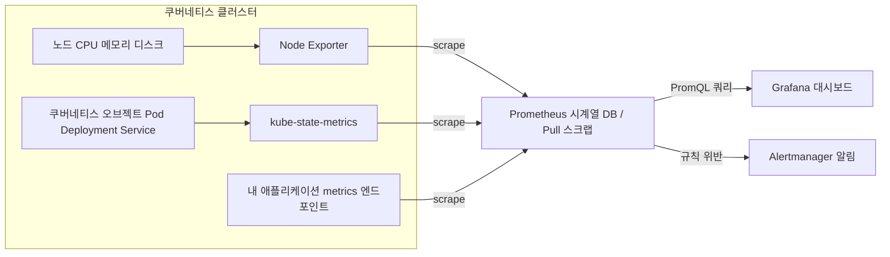
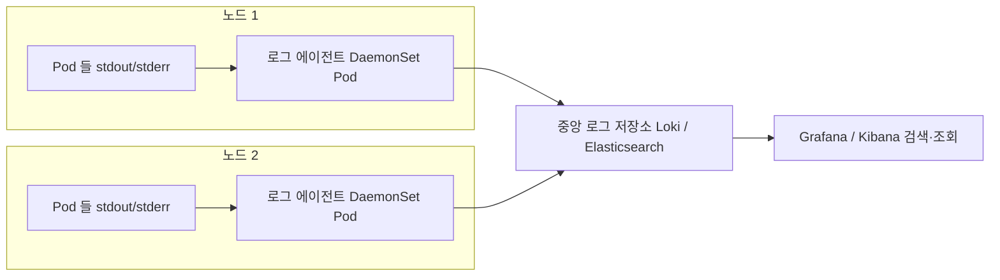

# 모니터링과 로깅 - Prometheus·Grafana와 로그 수집

## 학습 목표
- 클러스터·워크로드 상태를 관측해야 하는 이유와 메트릭·로그의 역할을 이해한다
- Prometheus가 메트릭을 수집하고 Grafana로 시각화하는 모니터링 흐름을 설명한다
- 모니터링 스택을 배포해 대시보드를 확인하고 Pod 로그 수집 개념을 실습한다

## 본문

### 왜 클러스터를 "관측"해야 하나

지금까지 우리는 워크로드를 배포하고, 권한을 나누고, 트래픽을 통제하는 법을 배웠다. 그런데 막상 운영을 시작하면 가장 자주 듣는 질문은 이것이다. **"지금 우리 클러스터, 괜찮은 거 맞아?"**

Pod가 떠 있다고 해서 정상은 아니다. CPU가 한계에 다다랐을 수도 있고, 메모리가 새고 있을 수도 있고, 어떤 Pod가 5분마다 조용히 재시작하고 있을 수도 있다. 사용자 화면이 느려진 뒤에야 알아차린다면 이미 늦었다. **관측 가능성(Observability)** 이란, 시스템이 내부에서 무슨 일을 겪고 있는지를 밖에서 들여다볼 수 있게 만드는 것이다.

관측의 두 기둥은 **메트릭(metrics)** 과 **로그(logs)** 다. 둘은 답하는 질문이 다르다.

- **메트릭은 "얼마나"에 답한다.** 시간에 따라 변하는 숫자다. CPU 사용률 73%, 초당 요청 수 1,200, 실행 중인 Pod 47개 같은 값. 추세를 보고, 임계치를 넘으면 알림을 울리기에 적합하다.
- **로그는 "무슨 일이"에 답한다.** 특정 시점에 일어난 사건의 기록이다. "14:32:07 결제 요청 실패, NullPointerException" 같은 텍스트. 문제가 터졌을 때 원인을 파고들기에 적합하다.

> 메트릭으로 "이상하다"를 감지하고, 로그로 "왜 그런지"를 파헤친다. 둘은 경쟁이 아니라 역할 분담이다. 운영 환경이라면 둘 다 갖춰야 한다.

쿠버네티스 생태계에서 메트릭의 사실상 표준은 **Prometheus + Grafana** 조합이고, 로그 수집은 **Loki**나 **Fluentd/Fluent Bit** 계열이 널리 쓰인다. 이번 강의에서는 두 영역을 차례로 다룬다.

### Prometheus는 어떻게 동작하나 — Pull 방식과 시계열 DB

Prometheus는 CNCF(Cloud Native Computing Foundation)가 관리하는 오픈소스 메트릭 모니터링 시스템으로, Go로 작성되었다. 핵심 동작 원리는 한 단어로 요약된다. **Pull(끌어오기).**

많은 모니터링 도구가 각 서버에서 중앙으로 데이터를 "밀어 보내는(push)" 방식인 데 반해, Prometheus는 반대다. Prometheus 서버가 주기적으로(보통 15초마다) 감시 대상에게 HTTP로 찾아가 메트릭을 **긁어온다(scrape).** 이렇게 감시하는 각 대상을 **타깃(target)** 이라 부른다.

타깃은 `/metrics` 같은 HTTP 엔드포인트에서 텍스트 형식으로 현재 값을 노출한다. 한 줄을 예로 보면 이렇게 생겼다.

```text
http_requests_total{method="GET", path="/", status="200"} 1027
```

이 한 줄에 핵심 데이터 모델이 다 담겨 있다.

- **메트릭 이름**(`http_requests_total`): 무엇을 재는지.
- **라벨**(`method`, `path`, `status`): 같은 메트릭을 차원별로 쪼개는 key-value 쌍. 덕분에 "GET 요청만", "500 에러만" 식으로 정밀하게 골라낼 수 있다.
- **값**(`1027`): 현재 측정값. 스크랩할 때마다 타임스탬프와 함께 기록된다.

이렇게 시간에 따라 쌓인 값의 연속을 **시계열(time series)** 이라 하고, Prometheus는 이를 자체 **시계열 데이터베이스(TSDB)** 에 저장한다.

그렇다면 데이터베이스나 리눅스 노드처럼 `/metrics`를 직접 내보내지 못하는 대상은 어떻게 감시할까? 이때 **익스포터(exporter)** 라는 중계 프로세스를 옆에 둔다. 익스포터가 대상의 상태를 Prometheus가 이해하는 형식으로 번역해 노출하고, Prometheus는 그 익스포터를 스크랩한다. Node Exporter(노드의 CPU·메모리·디스크), MySQL Exporter, MongoDB Exporter 등이 그 예다.

마지막 퍼즐은 **"무엇을 감시할지 어떻게 아느냐"** 다. 타깃 목록을 설정 파일에 일일이 적을 수도 있지만, Pod가 수시로 뜨고 사라지는 쿠버네티스에선 비현실적이다. 그래서 Prometheus는 **서비스 디스커버리(service discovery)** 로 쿠버네티스 API와 연동해 감시 대상을 자동으로 발견하고 갱신한다.

데이터를 모았으면 활용해야 한다. Prometheus는 **PromQL**이라는 전용 질의 언어를 제공해 시계열을 조회·계산하고, 그 결과로 알림을 만들거나(Alertmanager) 대시보드를 그린다(Grafana).

### kube-prometheus-stack을 Helm으로 설치하기

7강에서 배운 Helm을 기억하는가? 여러 매니페스트를 패키지(차트)로 묶어 한 번에 배포·관리하는 도구였다. 모니터링 스택은 컴포넌트가 여럿이라 손으로 설치하면 매우 번거로운데, 바로 여기서 Helm의 진가가 드러난다.

우리가 쓸 차트는 **kube-prometheus-stack** 으로, Prometheus 커뮤니티가 관리한다. 먼저 차트가 든 저장소(repository)를 추가한다.

```bash
# Prometheus 커뮤니티 Helm 저장소 추가 (prometheus-community 는 우리가 붙인 별칭)
helm repo add prometheus-community https://prometheus-community.github.io/helm-charts
helm repo update

# 저장소 안의 차트와 버전 검색
helm search repo prometheus-community/kube-prometheus-stack --versions
```

이제 차트를 클러스터에 배포한다. Helm에서는 차트 한 번의 설치를 **릴리스(release)** 라 불렀다.

```bash
# prometheus 라는 이름의 릴리스로 monitoring 네임스페이스에 설치
# --create-namespace : 네임스페이스가 없으면 먼저 만든다
helm install prometheus prometheus-community/kube-prometheus-stack \
  --namespace monitoring \
  --create-namespace
```

이 한 줄로 정교한 모니터링 스택 전체가 클러스터에 올라간다. kube-prometheus-stack이 배포하는 주요 컴포넌트는 네 가지다.

- **Prometheus Operator**: Prometheus 인스턴스와 Alertmanager 생성을 자동화하는 컨트롤러. Operator란 쿠버네티스 API를 확장해, 기본 오브젝트가 아닌 커스텀 리소스(예: 뒤에 나올 ServiceMonitor)를 감시·관리하는 특수 컨트롤러다.
- **Prometheus 인스턴스**: 메트릭을 저장하는 시계열 DB 본체.
- **Node Exporter + kube-state-metrics**: 인프라 메트릭을 끌어오는 두 익스포터. Node Exporter는 노드의 CPU·메모리·디스크 같은 시스템 메트릭을, kube-state-metrics는 Pod·Deployment·Service 같은 쿠버네티스 오브젝트의 상태·개수·가용성을 수집한다.
- **Grafana**: 수집된 메트릭을 시각화하는 대시보드 도구.

설치가 끝나면 Pod가 잘 떴는지 확인한다.

```bash
kubectl get pods -n monitoring
```

핵심은 이것이다. **이 두 익스포터가 함께 배포되고 Prometheus가 자동으로 그들을 스크랩하도록 미리 설정되어, 별다른 작업 없이 클러스터 인프라 모니터링이 곧바로 동작한다.** 말 그대로 "out of the box" 모니터링이다.

### Prometheus UI와 Grafana 대시보드 확인하기

먼저 Prometheus UI에 접속해 데이터가 실제로 쌓이는지 보자. 외부 노출 없이 로컬에서 확인하려면 `port-forward`를 쓴다.

```bash
# Prometheus 웹 UI 를 로컬 9090 포트로 연결
kubectl port-forward -n monitoring svc/prometheus-kube-prometheus-prometheus 9090:9090
```

브라우저에서 `localhost:9090`에 접속한 뒤 쿼리 창에 PromQL을 입력해 본다.

```promql
# 각 Pod 컨테이너의 실행 상태 (1=실행 중, 0=비정상)
kube_pod_container_status_running
```

이 메트릭은 kube-state-metrics가 수집한 것으로, 클러스터 거의 모든 Pod의 상태가 한눈에 나온다. 다만 이렇게 숫자 벡터로만 보면 추세를 읽기 어렵다. 그래서 Grafana가 필요하다.

```bash
# Grafana 를 로컬 3000 포트로 연결 (내부 80 포트 -> 로컬 3000)
kubectl port-forward -n monitoring svc/prometheus-grafana 3000:80
```

`localhost:3000`에 접속하면 로그인 화면이 나온다. 기본 사용자명은 `admin`이다. **비밀번호는 차트가 설치 시점에 무작위로 생성**하므로(과거 버전에서 쓰이던 고정값 `prom-operator`는 더 이상 신뢰하면 안 된다), 추측하지 말고 **Secret에서 직접 꺼내는 것을 기본 절차로** 삼는다. 4강·중급1에서 다룬 Secret의 base64 인코딩을 떠올려, 아래 명령으로 실제 비밀번호를 디코딩해 확인한다.

```bash
# Grafana 관리자 비밀번호를 Secret에서 꺼내 디코딩 (설치 시 무작위 생성됨)
kubectl get secret -n monitoring prometheus-grafana \
  -o jsonpath="{.data.admin-password}" | base64 --decode ; echo
```

출력된 문자열이 `admin` 계정의 비밀번호다. 이 값으로 로그인한다.

Grafana에는 **이미 여러 대시보드가 사전 구성되어** 있다. 각 패널(panel)은 사실 Prometheus DB에 던지는 PromQL 쿼리 하나이며, 그 결과를 시간 축 위에 그래프로 그려 준다. 네임스페이스별 Pod 수, 노드별 CPU·메모리 사용률 등을 클릭 몇 번으로 확인할 수 있다.

지금까지의 메트릭 모니터링 흐름을 아래 구성도처럼 정리할 수 있다. 클러스터 안의 감시 대상이 익스포터를 거쳐 Prometheus로 끌어올려지고, 그 데이터가 Grafana 대시보드와 Alertmanager 알림으로 흘러가는 전체 그림이다.



### 내 애플리케이션 직접 감시하기 — ServiceMonitor

인프라는 자동으로 잡히지만, **내가 만든 앱**의 메트릭은 어떻게 모을까? 두 단계가 필요하다.

첫째, 애플리케이션이 Prometheus 형식의 메트릭을 노출하도록 만든다. Spring Boot, Flask, FastAPI, NestJS 같은 프레임워크에는 대부분 Prometheus 클라이언트 라이브러리가 있어, 붙이기만 하면 `/metrics` 엔드포인트가 생긴다.

둘째, Prometheus에게 "이 앱을 스크랩하라"고 알려준다. 여기서 Operator가 제공하는 커스텀 리소스 **ServiceMonitor** 가 등장한다. ServiceMonitor는 라벨 매칭으로 특정 Service에 연결되어, Prometheus에게 어느 포트의 어느 경로(예: 포트 `web`, 경로 `/metrics`)를 긁으면 되는지 알려준다.

```yaml
apiVersion: monitoring.coreos.com/v1
kind: ServiceMonitor
metadata:
  name: myapp-monitor
  labels:
    release: prometheus      # Prometheus 가 발견하려면 이 라벨이 필수
spec:
  selector:
    matchLabels:
      app: myapp             # 이 라벨을 가진 Service 를 감시
  endpoints:
    - port: web              # Service 가 정의한 포트 이름
      path: /metrics
      interval: 15s
```

> kube-prometheus-stack으로 설치한 Prometheus는 보통 `release: prometheus` 라벨이 붙은 ServiceMonitor만 발견하도록 설정된다. 이 라벨을 빠뜨리면 정의만 해두고 정작 수집은 안 되는 흔한 함정에 빠진다. `localhost:9090`의 Status > Targets 화면에서 타깃 상태가 `UP`인지 꼭 확인하자.

### 메트릭만으로는 부족하다 — 로그 수집

메트릭은 "초당 에러가 5건"이라고 알려주지만, "그 에러가 정확히 무엇이었는지"는 알려주지 않는다. 그 답은 로그에 있다.

쿠버네티스에서 컨테이너 로그는 표준 출력(stdout/stderr)으로 나가고, 노드에 파일로 잠시 저장된다. 단일 Pod라면 명령 하나로 바로 볼 수 있다.

```bash
kubectl logs <pod-name>                 # 현재 로그
kubectl logs <pod-name> -f              # 실시간 추적(tail -f 처럼)
kubectl logs <pod-name> --previous      # 재시작 직전(죽은) 컨테이너의 로그
```

하지만 이 방식엔 치명적 약점이 있다. **Pod가 사라지면 로그도 사라진다.** Pod는 언제든 삭제·재스케줄될 수 있고, 노드가 보관하는 로그에도 용량 제한이 있다. 게다가 수십 개 Pod의 로그를 일일이 `kubectl logs`로 뒤지는 것은 불가능하다. 그래서 로그를 **중앙으로 모아 저장·검색**하는 별도 파이프라인이 필요하다.

전형적인 구조는 **노드마다 수집 에이전트를 하나씩** 띄우는 것이다. 2강에서 배운 **DaemonSet**을 기억하는가? 모든 노드에 Pod를 정확히 하나씩 배치하는 그 컨트롤러가, 바로 로그 수집기를 배포하기에 딱 맞는 도구다. 각 노드의 에이전트가 그 노드 위 모든 컨테이너의 로그를 읽어, 중앙 저장소로 전송한다.

대표적인 도구 조합은 다음과 같다.

- **Fluentd / Fluent Bit**: 로그를 읽고 가공해 전달하는 수집기. Fluent Bit은 더 가볍다. 보통 Elasticsearch로 보내 Kibana로 본다(EFK 스택).
- **Loki + Promtail / Grafana Alloy**: Grafana 진영의 경량 로그 시스템. Loki는 로그 본문 대신 라벨만 인덱싱해 비용이 낮고, **메트릭과 똑같이 Grafana 한 화면에서** 조회할 수 있는 것이 큰 장점이다. 이미 Grafana를 쓰고 있다면 자연스러운 선택이다.

중앙 집중식 로그 수집의 흐름을 아래 구성도로 정리하면, 노드마다 뜬 DaemonSet 에이전트가 각자의 Pod 로그를 읽어 하나의 중앙 저장소로 모으고, 거기서 통합 조회하는 모습이 드러난다.



### 실습 — 중앙 집중식 로그 수집 파이프라인 구축하기

개념만으로는 "Pod가 사라지면 로그도 사라진다"는 문제가 와닿지 않는다. 이번에는 **Loki 스택을 실제로 배포**해, 흩어진 Pod 로그를 중앙으로 모으고 이미 떠 있는 Grafana에서 메트릭과 함께 조회하는 파이프라인을 직접 만들어 본다. Loki를 고른 이유는 앞서 설치한 Grafana에 그대로 붙어, 메트릭·로그를 한 화면에서 볼 수 있기 때문이다.

**1) Loki 스택 차트 추가·설치.** `grafana/loki-stack` 차트는 로그 저장소인 **Loki**와, 노드마다 로그를 긁어 보내는 **Promtail(DaemonSet)** 을 함께 배포한다. 위에서 만든 `monitoring` 네임스페이스에 같이 올린다.

```bash
# Grafana 커뮤니티 저장소 추가
helm repo add grafana https://grafana.github.io/helm-charts
helm repo update

# Loki + Promtail 설치 (이미 Grafana가 있으니 loki-stack의 Grafana는 끈다)
helm install loki grafana/loki-stack \
  --namespace monitoring \
  --set promtail.enabled=true \
  --set grafana.enabled=false
```

**2) 배포 결과 확인.** Promtail이 DaemonSet으로 노드마다 한 개씩 떴는지, Loki Pod가 올라왔는지 본다. (2강에서 본 그대로, Promtail의 DESIRED 수는 노드 수와 같아야 한다.)

```bash
kubectl get pods -n monitoring | grep -E "loki|promtail"
kubectl get daemonset -n monitoring        # promtail 의 DESIRED/CURRENT 확인
```

**3) Grafana에 Loki를 데이터 소스로 연결.** 앞서 접속한 Grafana(`localhost:3000`)에서 좌측 메뉴의 Connections > Data sources > Add data source > **Loki** 를 고르고, URL에 클러스터 내부 주소를 넣는다. Loki 차트가 만든 Service 이름은 보통 `loki`이므로 다음과 같다.

```text
http://loki.monitoring.svc.cluster.local:3100
```

저장(Save & test)이 성공하면 Grafana가 Loki를 인식한 것이다.

**4) 로그 질의로 검증.** Grafana 좌측의 **Explore** 화면에서 데이터 소스를 Loki로 바꾸고, **LogQL**(Loki의 질의 언어, PromQL과 형태가 비슷하다)로 특정 네임스페이스의 로그를 조회해 본다.

```logql
{namespace="monitoring"}
```

여기서 진짜 효과를 확인하는 핵심 단계가 있다. 아무 테스트 Pod나 띄워 로그를 남긴 뒤 **그 Pod를 삭제**해 보자.

```bash
kubectl run logtest --image=busybox -n monitoring \
  -- sh -c 'for i in $(seq 1 20); do echo "hello from logtest $i"; sleep 1; done'
# 잠시 기다린 뒤
kubectl delete pod logtest -n monitoring
```

Pod를 지웠으니 `kubectl logs logtest`는 더 이상 동작하지 않는다. 하지만 Grafana Explore에서 `{pod="logtest"}`로 조회하면 **삭제된 Pod의 로그가 Loki에 그대로 남아** 검색된다. 바로 이것이 중앙 집중식 수집이 해결하는 문제다 — Pod의 수명과 로그의 수명을 분리한 것이다. 이로써 메트릭(Prometheus)과 로그(Loki)를 **한 Grafana 화면에서** 함께 다루는 관측 환경이 완성된다.

> 실습 클러스터의 자원이 빠듯하다면 Loki 차트가 무거울 수 있다. 그럴 때는 컴포넌트가 더 가벼운 단일 바이너리 모드로 설치하거나, 학습 목적상 Promtail이 DaemonSet으로 뜨고 Loki에 로그가 쌓이는 것만 확인해도 충분하다.

## 핵심 요약
- 관측의 두 기둥은 **메트릭**(얼마나 — 추세·알림)과 **로그**(무슨 일이 — 원인 추적)다. 메트릭으로 감지하고 로그로 파헤친다.
- **Prometheus**는 Pull 방식으로 타깃의 `/metrics`를 주기적으로 스크랩해 시계열 DB에 저장하고, `/metrics`가 없는 대상은 **익스포터**로 중계한다. 데이터는 **PromQL**로 조회한다.
- **kube-prometheus-stack**을 `helm install` 한 번으로 배포하면 Prometheus Operator·Node Exporter·kube-state-metrics·Grafana가 함께 올라가 인프라 모니터링이 즉시 동작한다. `port-forward`로 Prometheus UI(9090)와 Grafana(3000)에 접속하고, Grafana 비밀번호는 **무작위 생성되므로 Secret에서 디코딩해** 로그인한다.
- 내 앱을 감시하려면 앱이 Prometheus 메트릭을 노출하게 만들고 **ServiceMonitor**로 연결한다. `release` 라벨 매칭과 Targets `UP` 확인이 관건이다.
- 로그는 `kubectl logs`로 즉시 볼 수 있으나 Pod가 사라지면 함께 사라진다. **DaemonSet** 에이전트(Promtail/Fluent Bit)로 노드마다 수집해 **Loki·Elasticsearch** 같은 중앙 저장소로 모으면 검색·보존이 가능하다. 실습에서 `grafana/loki-stack`을 설치해 Promtail로 로그를 모으고 Grafana에 Loki를 데이터 소스로 붙이면, 삭제된 Pod의 로그까지 메트릭과 한 화면에서 조회할 수 있다.

## 출처
- Rayan Slim, "Prometheus, Grafana & Kubernetes: Installation + Monitoring" — https://www.youtube.com/watch?v=r45DkTMMouc
- PromLabs (Julius Volz), "Introduction to the Prometheus Monitoring System | Key Concepts and Features" — https://www.youtube.com/watch?v=STVMGrYIlfg
- PromLabs (Julius Volz), "Creating Grafana Dashboards for Prometheus | Grafana Setup & Simple Dashboard" — https://www.youtube.com/watch?v=EGgtJUjky8w
