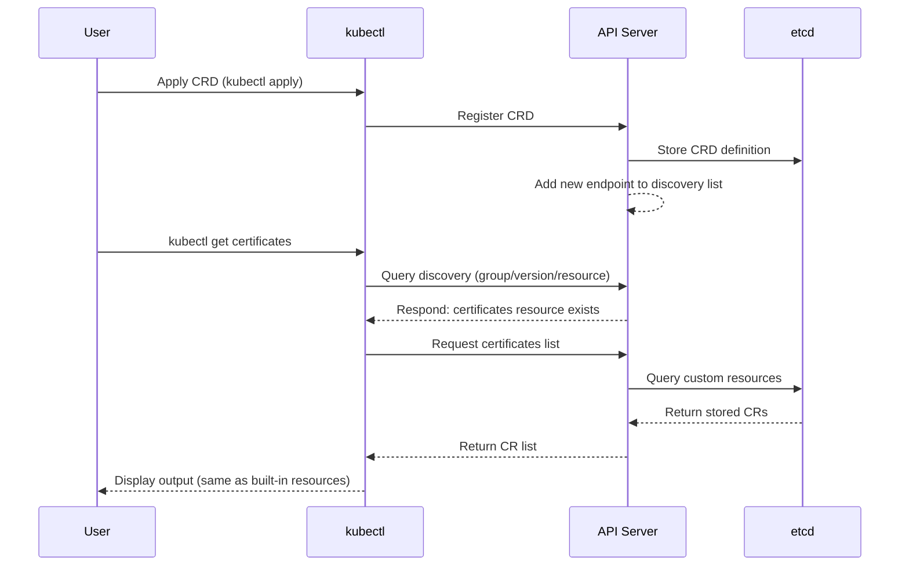

# CRDs and Custom Resources — Extending the Kubernetes API

## Learning Objectives
- Understand the structure of a CustomResourceDefinition (CRD) and its OpenAPI v3 schema validation, and be able to define one from scratch
- Create custom resources (CRs) and interact with them using `kubectl get`, `describe`, and `explain` just as you would with built-in resources
- Explain what it means to extend the Kubernetes API, and describe why CRDs behave identically to built-in resources

## Content

### Why Extend the API?

By now you're comfortable working with built-in resources like Pods, Deployments, and Services. But as you operate Kubernetes in production, you'll eventually reach a point where you think: "I wish there were a resource type that maps directly to our domain." Instead of expressing concepts like `Database`, `Certificate`, or `BackupJob` as a combination of Deployments, ConfigMaps, and CronJobs every time, you want each of them to stand as a **first-class resource** in its own right.

Think of it like object-oriented programming. You can't build an entire application using only built-in types like `String` and `Array` — you define your own classes. In Kubernetes, a CRD is that **class definition**, and each instance created from that class is a custom resource (CR).

Once you register a CRD, the Kubernetes API server exposes a new endpoint. From that point on, your custom resource gains **every capability that built-in resources enjoy**: `kubectl get`, `describe`, RBAC, label selectors, watches, and storage in etcd. That is the real meaning of "extending the API."

> A CRD is nothing more than a **data model registration**. The controller that actually watches that resource and drives behavior is a separate concern. Registering a CRD on its own gives you a neatly stored object in etcd — but nothing actually happens. Attaching behavior is the job of an Operator, which is the topic of the next lecture.

### The Structure of a CRD Manifest

A CRD is itself a Kubernetes resource, belonging to the `apiextensions.k8s.io/v1` group. Let's walk through its key fields.

```yaml
apiVersion: apiextensions.k8s.io/v1
kind: CustomResourceDefinition
metadata:
  # The name must follow the <plural>.<group> format
  name: certificates.training.example.com
spec:
  group: training.example.com        # API group (analogous to a "package" in OOP)
  scope: Namespaced                  # Namespaced or Cluster
  names:
    plural: certificates             # kubectl get certificates
    singular: certificate
    kind: Certificate                # The kind value used in manifests
    shortNames: ["cert"]             # kubectl get cert (optional alias)
  versions:
    - name: v1
      served: true                   # Whether the API server serves this version
      storage: true                  # Whether this version is the stored canonical form
      subresources:
        status: {}                   # Enable the status subresource (explained below)
      schema:
        openAPIV3Schema:
          type: object
          properties:
            spec:                    # The desired state declared by the user
              type: object
              properties:
                commonName:
                  type: string
                dnsNames:
                  type: array
                  items:
                    type: string
                renewBefore:
                  type: integer
                  minimum: 1
                  maximum: 90
                  default: 30        # API server injects this value if the field is omitted
              required: ["commonName"]
            status:                  # The actual state recorded by the controller
              type: object
              properties:
                phase:
                  type: string       # Pending / Ready / Expired, etc.
                expiresAt:
                  type: string
                message:
                  type: string
```

Here are the key points to understand:

- **group / names**: The resource's identity. The `name` field must be in the `<plural>.<group>` format for registration to succeed.
- **scope**: `Namespaced` means the resource belongs to a namespace (like a Pod); `Cluster` means it is cluster-scoped (like a Node or ClusterRole).
- **versions**: You can define multiple versions of the same resource (`v1alpha1`, `v1beta1`, `v1`) simultaneously. `served` controls whether the API server responds to requests for that version; `storage` designates the canonical version stored in etcd. **Exactly one version may have `storage: true`.**
- **schema.openAPIV3Schema**: Declares field types, required constraints, and validation rules in OpenAPI v3 format. This is the heart of schema validation. When a `default` value is provided — as with `renewBefore` above — the API server automatically injects it when the field is omitted.

### spec and status — The Real Core of the CRD Pattern

The fact that the schema above places `spec` and `status` side by side is the most important thing to notice. Every core Kubernetes resource is split into these two sections:

- **`spec` (desired state)**: Where users declare "this is what I want." Written by humans.
- **`status` (actual state)**: Where the controller records "this is what it actually is right now." **Written by the controller; humans only read it.**

For example, with a `Certificate` CR, the user only declares `spec.commonName: web.example.com`. Whether the certificate was actually issued (`status.phase: Ready`), when it expires (`status.expiresAt`), or why it failed if it did (`status.message`) — all of that is written by the controller into `status`. An operator can run `kubectl get certificate` and immediately see whether it is `Pending`, `Ready`, or `Expired`. **Without status, a CRD is just an input form — there is no way to observe what the resource is actually doing.**

To use this properly, you must declare **`subresources.status: {}`** to activate status as a subresource, as shown in the example above. This produces two important changes:

1. **Separation of authority** — `spec` (modified by users) and `status` (modified by the controller) are split into separate endpoints (`/status`). Users cannot accidentally modify status, and controllers cannot arbitrarily overwrite spec.
2. **Conflict prevention** — A user's spec update and a controller's status update no longer overwrite each other.

> The separation of spec and status is the foundation of Kubernetes' declarative model. **Users speak through spec to declare desired state; controllers report through status to record actual state.** The reconciliation work that controllers and Operators perform — reading spec, aligning reality with it, then writing the result to status — is exactly the subject of the next lecture.

### OpenAPI Schema Validation — The Same Safety Net as Built-in Resources

Just as setting `replicas` to a string in a Deployment manifest is rejected, a CRD rejects any CR that violates its schema. In the example above, `renewBefore` has `minimum: 1` and `maximum: 90`, so setting it to 100 causes the API server to respond with:

```
The Certificate is invalid: spec.renewBefore: Invalid value: 100:
spec.renewBefore in body should be less than or equal to 90
```

This validation is performed **by the API server at the admission stage**, not by the controller. Invalid data is blocked before it ever reaches etcd. Using `required`, `enum`, `pattern` (regex), and `default` (injecting default values) significantly reduces the chance of user error.

### CEL Validation — Enforcing Cross-Field Constraints Declaratively

OpenAPI v3 schema validation is powerful, but it has a fundamental limitation: it validates each field in isolation. It cannot express constraints like "if field A is set, field B must also be set" or "the end date must be later than the start date." In the past, enforcing these cross-field relationships required building and running a separate validating admission webhook — a non-trivial operational burden involving deployment, TLS certificates, and availability management.

**CEL (Common Expression Language) validation rules**, promoted to stable in Kubernetes 1.25, eliminate that burden. By embedding `x-kubernetes-validations` expressions directly in the schema, the **API server itself** enforces cross-field constraints — no external webhook server required.

```yaml
schema:
  openAPIV3Schema:
    type: object
    properties:
      spec:
        type: object
        properties:
          autoRenew:
            type: boolean
          renewBefore:
            type: integer
        # Apply cross-field constraints at the spec object level
        x-kubernetes-validations:
          # If autoRenew is true, renewBefore must be specified
          - rule: "!self.autoRenew || has(self.renewBefore)"
            message: "renewBefore is required when autoRenew is true"
```

The `rule` field is a CEL expression that must evaluate to a boolean; `self` refers to the object the rule is attached to (here, `spec`). The rule above reads: "autoRenew must be false, or renewBefore must be present." If the constraint is violated, the API server returns the `message` and rejects the request. You can also write numeric comparisons like `self.endDate > self.startDate`, or validate list length and uniqueness — all in a single expression.

> The guiding principle: use OpenAPI schema for single-field constraints (type, range, regex), and use CEL (`x-kubernetes-validations`) for cross-field relationships. This is the modern Kubernetes best practice. Reserve admission webhooks only for genuinely complex logic that CEL cannot express — such as lookups against external systems. Keeping webhooks to a minimum reduces operational overhead significantly.

### CRD Evolution — Versioning and Conversion

CRDs evolve just like software. You might start with `v1alpha1` for experimentation and graduate to `v1` as the API stabilizes. The challenge is doing this without breaking existing resources already stored in the cluster or the clients that depend on them. That is why `versions` can hold multiple entries simultaneously.

```yaml
versions:
  - name: v1alpha1
    served: true       # Keep serving old clients
    storage: false     # No longer the stored version
  - name: v1
    served: true
    storage: true      # All objects are now stored in this form in etcd
```

- **`served`**: Whether the API server accepts and responds to requests for this version. Multiple versions can be `served: true` at the same time, allowing old and new clients to coexist.
- **`storage`**: The canonical version written to etcd. **Exactly one version may be `true`.** Every object is ultimately stored in this form.

This raises an obvious question: if a client sends a request in `v1alpha1` but the storage version is `v1`, who handles the format mismatch between them? This is called **version conversion**.

- **`strategy: None`** — For simple changes like adding or removing fields, the API server passes the object through without conversion (this is the default).
- **`strategy: Webhook` (Conversion Webhook)** — When field names change or the structure is restructured in a way that cannot be mapped automatically, you register a conversion webhook. Whenever the API server needs to convert between versions, it calls your webhook and delegates the transformation — for example, "convert this object from `v1alpha1` to `v1`." Regardless of which version a client requests, the webhook translates the stored object into that version on the fly, making it appear as though the requested version has always existed.

> Operational guidance: once you expose a version as `served: true`, clients will start depending on it, so you cannot remove it without warning. The safe evolution sequence is: (1) add the new version as `served` → (2) add a conversion webhook if needed → (3) move `storage` to the new version → (4) after a sufficient deprecation window, set the old version to `served: false` → (5) remove it entirely. This mirrors the process Kubernetes itself uses to deprecate built-in APIs — for example, keeping `v1beta1` around for an extended period before removing it.

### Creating and Working with Custom Resources

Once you apply the CRD, the new endpoint is immediately live.

```bash
kubectl apply -f certificate-crd.yaml
kubectl get crd certificates.training.example.com
```

Now you can create actual instances (CRs) using the CRD as a blueprint. The `apiVersion` of a CR is the `group/version` combination.

```yaml
apiVersion: training.example.com/v1
kind: Certificate
metadata:
  name: web-cert
spec:
  commonName: web.example.com
  dnsNames: ["web.example.com", "www.example.com"]
  renewBefore: 30
```

```bash
kubectl apply -f web-cert.yaml
kubectl get certificates           # or: kubectl get cert
kubectl describe certificate web-cert
# Query schema documentation (using the full resource name is most reliable)
kubectl explain certificates.training.example.com.spec
```

The fact that `kubectl explain` works is significant. It does so because the API server **exposes your OpenAPI schema as documentation** — proof that custom resources participate in the same discovery mechanism as built-in resources.

> Pro tip: Short names like `kubectl explain certificate.spec` can collide when multiple groups share the same alias. Using the full resource name — `kubectl explain certificates.training.example.com.spec` — unambiguously targets your CRD's schema in any environment. For the same reason, when multiple CRDs share the same `kind`, always use the full resource name with `kubectl describe` to eliminate ambiguity. Make it a habit.

### Why CRDs Behave Identically to Built-in Resources

What actually happens internally when you run `kubectl get certificates`? kubectl first queries the API server's **discovery endpoint** to ask "what groups, versions, and resources exist?" The moment you registered the CRD, `certificates` under `training.example.com/v1` was added to that list, so kubectl treats it no differently from any built-in resource. Requests go through the same API server, data is stored in the same etcd, and RBAC grants permissions using the same syntax — just with `apiGroups: ["training.example.com"]`.

The sequence diagram below shows the full flow: from CRD registration, through the discovery lookup, to `kubectl get` treating the new resource just like a built-in one.



> Pro tip: A well-crafted CRD should include `additionalPrinterColumns` to surface key fields (e.g., `status.phase`, `status.expiresAt`) as columns in `kubectl get` output — a huge quality-of-life improvement for operators. Also, real-world tools like cert-manager and the Prometheus Operator define all their resources as CRDs, so browsing their CRDs with `kubectl get crd` is one of the best ways to learn by example.

## Key Takeaways
- A CRD registers a new resource type with the Kubernetes API server; a CR is an instance of that type — the same relationship as a class and an object.
- A CRD defines its identity via `group`, `names`, `scope`, and `versions`, and its validation rules via `openAPIV3Schema`. Exactly one version may have `storage: true`. When a `default` value is declared, the API server automatically injects it on admission.
- CRs are split into `spec` (desired state, written by users) and `status` (actual state, written by the controller). Enabling `subresources.status: {}` separates authority and prevents conflicts, and provides the foundation for observing a resource's current condition (Ready, Expired, etc.).
- Validation operates at two layers. Single-field constraints — type, range, `enum`, `pattern`, `default` — belong in the OpenAPI schema. Cross-field relationships belong in CEL (`x-kubernetes-validations`). Both are enforced by the API server at admission, so non-conforming CRs are rejected before reaching etcd.
- CRDs support multiple simultaneous versions (`served` / `storage`). When versions differ structurally, conversion handles the translation — either the default pass-through (`None`) or a Conversion Webhook for complex remapping. The safe upgrade path is: add the new version → move `storage` → deprecate the old version gradually.
- Registered CRs participate fully in discovery, `kubectl`, RBAC, watches, and etcd storage — identical to built-in resources. Translating spec into reality and recording the outcome in status is the controller's job, which is the subject of the next lecture.
