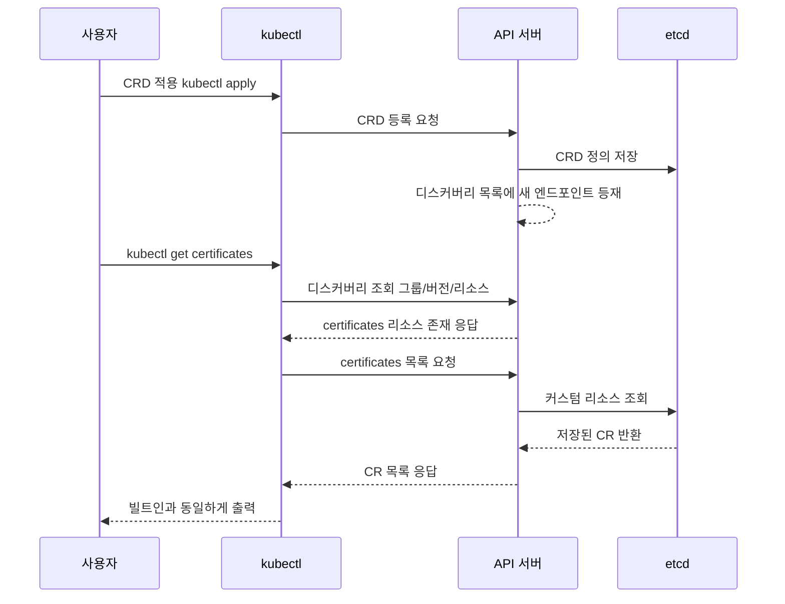

# CRD와 커스텀 리소스 — 쿠버네티스 API 확장하기

## 학습 목표
- CustomResourceDefinition(CRD)의 구조와 OpenAPI v3 스키마 검증을 이해하고 직접 정의할 수 있다
- 커스텀 리소스(CR)를 생성하고 `kubectl get`/`describe`/`explain`으로 빌트인 리소스처럼 다룰 수 있다
- 쿠버네티스 API 확장의 의미와, CRD가 빌트인 리소스와 똑같이 동작하는 원리를 설명할 수 있다

## 본문

### 왜 API를 확장하는가

여러분은 이미 Pod·Deployment·Service 같은 빌트인 리소스를 자유롭게 다룬다. 그런데 쿠버네티스를 운영하다 보면 "우리 도메인에 딱 맞는 리소스 타입이 있으면 좋겠다"는 순간이 온다. 예를 들어 `Database`, `Certificate`, `BackupJob` 같은 개념을 매번 Deployment·ConfigMap·CronJob의 조합으로 표현하는 대신, **그 자체를 하나의 1급 리소스**로 만들고 싶은 것이다.

객체지향 언어에 비유하면 이렇다. 언어가 제공하는 `String`, `Array` 같은 내장 클래스만으로 애플리케이션을 만들 수는 없어서 우리는 직접 클래스를 정의한다. 쿠버네티스에서 CRD는 바로 그 **클래스 정의**에 해당하고, 그 클래스로 찍어내는 인스턴스가 커스텀 리소스(CR)다.

CRD를 등록하면 쿠버네티스 API 서버에 새로운 엔드포인트가 추가된다. 그 순간부터 `kubectl get`, `describe`, RBAC, 라벨 셀렉터, watch, etcd 저장 등 **빌트인 리소스가 누리는 모든 기능을 그대로** 쓸 수 있다. 이것이 "API를 확장한다"는 말의 실제 의미다.

> CRD는 "데이터 모델 등록"일 뿐이다. 그 리소스를 보고 실제 동작을 일으키는 컨트롤러는 별개다. CRD만 만들면 etcd에 예쁘게 저장되는 객체가 생길 뿐, 아무 일도 일어나지 않는다. 동작을 붙이는 것이 다음 강의의 Operator다.

### CRD 매니페스트의 구조

CRD는 그 자체가 하나의 쿠버네티스 리소스이며, `apiextensions.k8s.io/v1` 그룹에 속한다. 핵심 필드를 짚어 보자.

```yaml
apiVersion: apiextensions.k8s.io/v1
kind: CustomResourceDefinition
metadata:
  # 이름은 반드시 <plural>.<group> 형식이어야 한다
  name: certificates.training.example.com
spec:
  group: training.example.com        # API 그룹 (객체지향의 '패키지'에 해당)
  scope: Namespaced                  # Namespaced 또는 Cluster
  names:
    plural: certificates             # kubectl get certificates
    singular: certificate
    kind: Certificate                # 매니페스트의 kind 값
    shortNames: ["cert"]             # kubectl get cert (별칭, 선택)
  versions:
    - name: v1
      served: true                   # API 서버가 이 버전을 응답할지
      storage: true                  # etcd에 이 버전으로 저장할지
      subresources:
        status: {}                   # status 하위 리소스 활성화 (아래 설명)
      schema:
        openAPIV3Schema:
          type: object
          properties:
            spec:                     # 사용자가 선언하는 '원하는 상태'
              type: object
              properties:
                commonName:
                  type: string
                dnsNames:
                  type: array
                  items:
                    type: string
                renewBefore:
                  type: integer
                  minimum: 1
                  maximum: 90
                  default: 30         # 미지정 시 API 서버가 자동 주입
              required: ["commonName"]
            status:                   # 컨트롤러가 채우는 '실제 상태'
              type: object
              properties:
                phase:
                  type: string        # Pending / Ready / Expired 등
                expiresAt:
                  type: string
                message:
                  type: string
```

읽어야 할 핵심은 다음과 같다.

- **group / names**: 리소스의 정체성. `name`은 반드시 `복수형.그룹` 조합이어야 등록된다.
- **scope**: `Namespaced`면 네임스페이스에 속한 리소스(Pod처럼), `Cluster`면 클러스터 전역 리소스(Node·ClusterRole처럼).
- **versions**: 같은 리소스의 여러 버전(`v1alpha1`, `v1beta1`, `v1`)을 동시에 정의할 수 있다. `served`는 클라이언트에게 그 버전을 응답할지, `storage`는 etcd에 저장할 정본(canonical) 버전인지 결정한다. **storage가 true인 버전은 정확히 하나**여야 한다.
- **schema.openAPIV3Schema**: OpenAPI v3 형식으로 필드의 타입·필수 여부·제약을 선언한다. 이 부분이 검증의 핵심이다. 위 `renewBefore`처럼 `default`를 주면, 사용자가 값을 생략했을 때 API 서버가 기본값을 자동으로 채워 넣는다.

### spec과 status — CRD 패턴의 진짜 핵심

위 스키마에서 `spec`과 `status`를 나란히 둔 것이 가장 중요하다. 쿠버네티스의 모든 핵심 리소스는 이 두 부분으로 나뉜다.

- **`spec` (원하는 상태, desired state)**: 사용자가 "이렇게 되길 원한다"고 선언하는 부분. 사람이 작성한다.
- **`status` (실제 상태, actual state)**: 컨트롤러가 현실을 관찰해 "지금 실제로는 이렇다"고 기록하는 부분. **컨트롤러가 작성하고, 사람은 읽기만** 한다.

예를 들어 `Certificate`라는 CR이 있을 때 사용자는 `spec.commonName: web.example.com`만 선언하지만, 실제로 인증서가 발급됐는지(`status.phase: Ready`), 언제 만료되는지(`status.expiresAt`), 발급에 실패했다면 왜인지(`status.message`)는 컨트롤러가 `status`에 써 넣는다. 운영자는 `kubectl get certificate`만 봐도 인증서가 `Pending`인지 `Ready`인지 `Expired`인지 한눈에 파악한다. **이 status가 없으면 CRD는 그저 입력 양식일 뿐, "현재 어떤 상태인가"를 관찰할 수 없다.**

이를 제대로 쓰려면 위 예시처럼 **`subresources.status: {}`를 선언**해 status를 하위 리소스로 활성화해야 한다. 그러면 두 가지 중요한 변화가 생긴다.

1. **권한 분리** — `spec`(사용자가 수정)과 `status`(컨트롤러가 수정)가 별도 엔드포인트(`/status`)로 분리된다. 사용자가 실수로 status를 건드리지 못하고, 컨트롤러도 spec을 함부로 바꾸지 못한다.
2. **충돌 방지** — 사용자의 spec 수정과 컨트롤러의 status 갱신이 서로의 변경을 덮어쓰지 않는다.

> spec과 status의 분리는 쿠버네티스 선언형 모델의 뿌리다. **사람은 spec으로 "원하는 상태"를 말하고, 컨트롤러는 status로 "실제 상태"를 보고한다.** 다음 강의의 컨트롤러/Operator가 하는 일이 바로 spec을 읽어 현실을 맞추고 그 결과를 status에 기록하는 것이다.

### OpenAPI 스키마 검증 — 빌트인과 똑같은 안전망

빌트인 리소스에서 Deployment의 `replicas`에 문자열을 넣으면 거부되듯, CRD도 스키마에 어긋난 CR을 거부한다. 위 예시에서 `renewBefore`에 `minimum: 1, maximum: 90`을 줬으니, 100을 넣으면 API 서버가 다음처럼 막는다.

```
The Certificate is invalid: spec.renewBefore: Invalid value: 100:
spec.renewBefore in body should be less than or equal to 90
```

이 검증은 컨트롤러가 아니라 **API 서버가 admission 단계에서** 수행한다. 즉 잘못된 데이터는 etcd에 저장되기 전에 차단된다. `required`, `enum`, `pattern`(정규식), `default`(기본값 주입) 등을 활용하면 사용자가 잘못 쓸 여지를 크게 줄일 수 있다.

### CEL 검증 — 필드 간 관계까지 선언적으로 거는 법

OpenAPI v3 스키마는 강력하지만 한계가 있다. **각 필드를 독립적으로** 검사할 뿐, "A 필드가 있으면 B 필드도 반드시 있어야 한다"거나 "종료일이 시작일보다 늦어야 한다"처럼 **여러 필드의 관계**를 검증하지 못한다. 과거에는 이런 교차 검증을 위해 별도의 validating admission webhook(외부 검증 서버)을 직접 만들어 운영해야 했다 — 배포·인증서·가용성을 책임져야 하는 부담스러운 작업이다.

쿠버네티스 1.25부터 정식 기능이 된 **CEL(Common Expression Language) 기반 validation rules**가 이 부담을 없앤다. 스키마 안에 `x-kubernetes-validations`로 검증 규칙을 표현식으로 써 두면, 별도 서버 없이 **API 서버가 직접** 교차 검증을 수행한다.

```yaml
schema:
  openAPIV3Schema:
    type: object
    properties:
      spec:
        type: object
        properties:
          autoRenew:
            type: boolean
          renewBefore:
            type: integer
        # 이 spec 객체 수준에서 필드 간 제약을 건다
        x-kubernetes-validations:
          # autoRenew가 true면 renewBefore는 반드시 지정되어야 한다
          - rule: "!self.autoRenew || has(self.renewBefore)"
            message: "autoRenew가 true이면 renewBefore가 필요합니다"
```

`rule`은 불리언으로 평가되는 CEL 표현식이고, `self`는 그 규칙이 걸린 객체(여기선 `spec`)를 가리킨다. 위 규칙은 "autoRenew가 false이거나, 아니면 renewBefore가 존재해야 한다"는 의미다. 이를 어기면 API 서버가 `message`를 그대로 돌려주며 요청을 거부한다. `self.endDate > self.startDate` 같은 대소 비교, 리스트 길이·중복 검사 등도 표현식 하나로 처리된다.

> 핵심 판단 기준: 단일 필드의 타입·범위·정규식은 OpenAPI 스키마로, **여러 필드의 관계**는 CEL(`x-kubernetes-validations`)로 거는 것이 현대 쿠버네티스의 모범 사례다. CEL로 표현되지 않는 진짜 복잡한 로직(외부 시스템 조회 등)만 남겨 webhook으로 처리하면, 운영해야 할 webhook 수를 크게 줄일 수 있다.

### CRD의 진화 — 버전 관리와 변환(Conversion)

CRD도 소프트웨어처럼 진화한다. 처음엔 `v1alpha1`로 실험하다가 안정화되면 `v1`로 승격하는데, 이때 **이미 클러스터에 저장된 기존 리소스와 그것을 사용하는 클라이언트를 깨뜨리지 않는 것**이 고급 운영의 핵심이다. 그래서 `versions`에 여러 버전을 동시에 둔다.

```yaml
versions:
  - name: v1alpha1
    served: true       # 구버전 클라이언트를 위해 계속 응답
    storage: false     # 더 이상 이 버전으로 저장하지 않음
  - name: v1
    served: true
    storage: true      # etcd에는 항상 이 한 버전으로만 저장
```

- **`served`**: API 서버가 이 버전으로 요청을 받아 줄지. 여러 버전을 동시에 `served: true`로 두면 구버전·신버전 클라이언트가 공존할 수 있다.
- **`storage`**: etcd에 저장하는 정본 버전. **딱 하나만 true**다. 모든 객체는 결국 이 버전 형태로 etcd에 들어간다.

여기서 자연스러운 질문이 생긴다. 사용자가 `v1alpha1`로 요청을 보냈는데 저장 버전은 `v1`이라면, 그 사이의 형식 차이는 누가 맞춰 줄까? 이것을 **버전 변환(conversion)**이라 한다.

- **`strategy: None`** — 필드 추가/삭제 정도의 단순한 변화라면 변환 없이 그대로 통과시킨다(기본값).
- **`strategy: Webhook` (Conversion Webhook)** — 필드 이름이 바뀌거나 구조가 달라져 자동으로 매핑할 수 없을 때 사용한다. API 서버가 버전 변환이 필요한 순간마다 **여러분이 등록한 변환 webhook을 호출**해 "이 객체를 v1alpha1에서 v1 형태로 바꿔 달라"고 위임한다. 사용자가 어떤 버전으로 읽든, webhook이 그 버전 형태로 변환해 돌려주므로 클라이언트는 마치 그 버전이 그대로 있는 것처럼 동작한다.

> 운영 포인트: 한번 `served: true`로 노출한 버전은 사용자가 그것에 의존하기 시작하므로 함부로 제거할 수 없다. 안전한 진화 순서는 (1) 새 버전을 `served`로 추가 → (2) 필요하면 conversion webhook으로 변환 보장 → (3) `storage`를 신버전으로 옮김 → (4) 충분한 유예 후 구버전 `served: false` → (5) 최종 제거다. 빌트인 API가 `v1beta1`을 오랜 기간 deprecated로 유지하다 제거하는 것과 같은 절차다.

### 커스텀 리소스 생성과 조작

CRD를 적용하면 즉시 새 엔드포인트가 살아난다.

```bash
kubectl apply -f certificate-crd.yaml
kubectl get crd certificates.training.example.com
```

이제 CRD를 청사진 삼아 실제 인스턴스(CR)를 만든다. CR의 `apiVersion`은 `그룹/버전` 조합이다.

```yaml
apiVersion: training.example.com/v1
kind: Certificate
metadata:
  name: web-cert
spec:
  commonName: web.example.com
  dnsNames: ["web.example.com", "www.example.com"]
  renewBefore: 30
```

```bash
kubectl apply -f web-cert.yaml
kubectl get certificates           # 또는 kubectl get cert
kubectl describe certificate web-cert
# 스키마 문서를 그대로 조회 (전체 리소스 이름을 쓰는 것이 가장 안정적)
kubectl explain certificates.training.example.com.spec
```

`kubectl explain`이 동작한다는 점이 중요하다. 이는 우리가 정의한 OpenAPI 스키마를 API 서버가 **문서로 노출**하기 때문이며, 커스텀 리소스가 빌트인과 동일한 디스커버리 메커니즘 위에 올라가 있다는 증거다.

> 실무 팁: `kubectl explain certificate.spec`처럼 짧은 이름은 같은 약칭이 여러 그룹에 있으면 충돌할 수 있다. `kubectl explain certificates.training.example.com.spec`처럼 **전체 리소스 이름(plural.group)**을 쓰면 어떤 환경에서도 정확히 우리 CRD의 스키마를 조회한다. 같은 이유로 여러 CRD가 같은 `kind`를 공유할 때는 `kubectl describe`에도 전체 리소스 이름을 써 모호성을 없애는 것이 안전하다. 모범 사례로 몸에 익혀 두자.

### CRD가 빌트인과 동일하게 동작하는 원리

`kubectl get certificates`를 실행하면 내부적으로 무슨 일이 벌어질까. kubectl은 먼저 API 서버의 **디스커버리 엔드포인트**에 "어떤 그룹/버전/리소스가 있나"를 묻는다. CRD를 등록한 순간 `training.example.com/v1`의 `certificates`가 이 목록에 등재되므로, kubectl은 이를 표준 리소스와 구분 없이 취급한다. 요청은 같은 API 서버를 통해 처리되고, 데이터는 같은 etcd에 저장되며, RBAC도 `apiGroups: ["training.example.com"]`처럼 동일한 문법으로 권한을 부여한다.

아래 시퀀스는 CRD 등록부터 `kubectl get`이 디스커버리를 거쳐 새 리소스를 빌트인처럼 다루기까지의 흐름을 보여 준다.



> 실무 팁: 잘 만든 CRD에는 `additionalPrinterColumns`를 추가해, `kubectl get`의 출력에 핵심 필드(예: `status.phase`, `status.expiresAt`)를 컬럼으로 노출하라. 운영자가 status를 한눈에 파악할 수 있어 매우 유용하다. 또한 cert-manager·Prometheus Operator 등 실제 운영 도구들이 전부 CRD로 자기 리소스를 정의하므로, 여러분이 쓰는 도구의 CRD를 `kubectl get crd`로 들여다보는 것이 가장 좋은 학습이다.

## 핵심 요약
- CRD는 쿠버네티스 API에 새로운 리소스 타입을 등록하는 메커니즘이며, CR은 그 타입의 인스턴스다(클래스와 객체의 관계).
- CRD는 `group`/`names`/`scope`/`versions`로 정체성을, `openAPIV3Schema`로 필드 검증 규칙을 정의한다. `storage: true` 버전은 단 하나.
- CR은 `spec`(사용자가 선언하는 원하는 상태)과 `status`(컨트롤러가 기록하는 실제 상태)로 나뉜다. `subresources.status: {}`로 활성화하면 권한·충돌이 분리되며, 이 status가 리소스의 현재 상태(Ready/Expired 등)를 관찰하는 기반이다.
- 검증은 두 층이다. 단일 필드는 OpenAPI 스키마(타입·범위·`enum`·`pattern`·`default`)로, 필드 간 관계는 CEL(`x-kubernetes-validations`)로 건다. 둘 다 API 서버가 admission 단계에서 수행하므로 규격 위반 CR은 etcd 저장 전에 차단된다.
- CRD는 여러 버전을 동시에 둘 수 있다(`served`/`storage`). 버전 간 형식이 다르면 conversion(기본 `None`, 복잡하면 Webhook)으로 변환하며, 안전한 진화는 새 버전 추가→storage 이동→구버전 단계적 제거 순으로 진행한다.
- 등록된 CR은 디스커버리·`kubectl`·RBAC·watch·etcd 저장까지 빌트인 리소스와 완전히 동일하게 동작한다. 실제 동작(spec→현실 반영, status 기록)은 컨트롤러/Operator의 몫이며, 이것이 다음 강의의 주제다.
