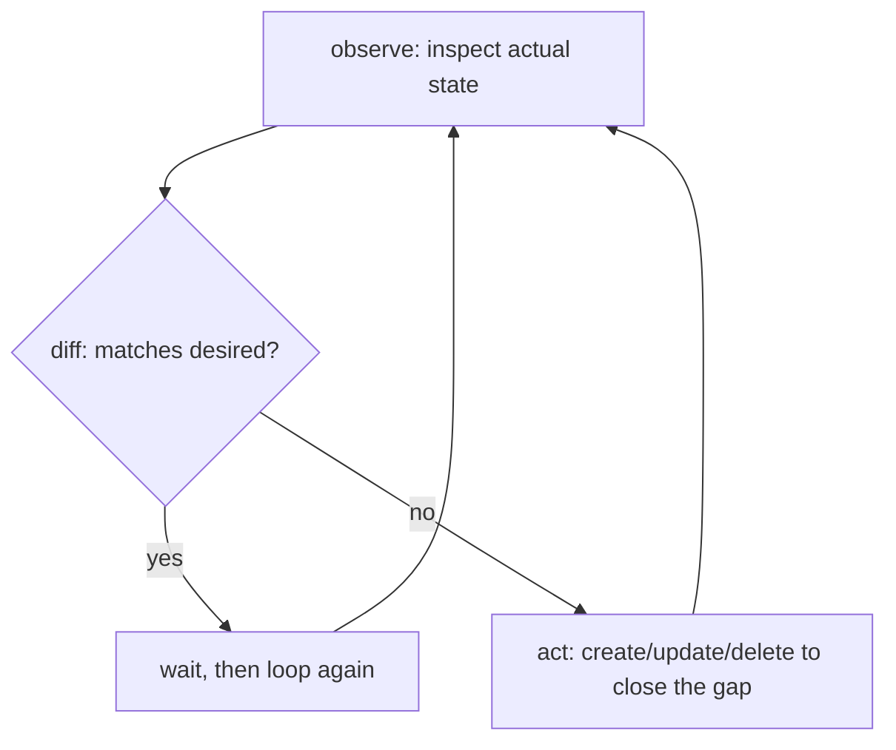
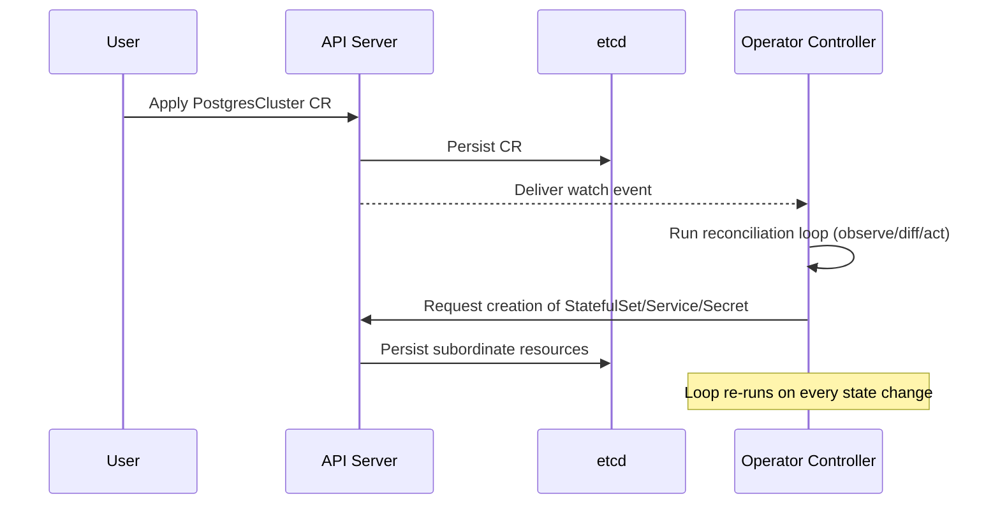

# The Operator Pattern and Controllers — Encoding Operational Knowledge in Code

## Learning Objectives
- Understand the reconciliation loop and how a controller continuously converges actual state toward desired state
- Install an existing Operator and observe the controller reacting to custom resource changes
- Explain key Operator development concepts including the Operator SDK and the Operator maturity model

## Content

### Controllers: The Heart That Drives Kubernetes

In the previous lecture we said that a CRD "only registers a data model and triggers no behavior." The entity that does trigger behavior is the **controller**. In fact, all of Kubernetes is essentially a collection of controllers. When you create a Deployment, the Deployment controller creates a ReplicaSet, and the ReplicaSet controller creates Pods. The reason you declare `replicas: 3` and reliably get exactly 3 Pods is that something is constantly asking: "does the current state match the declared state?"

That continuous check-and-correct process is the **reconciliation loop**. A controller repeats a single question in an endless cycle:

1. **Observe** — what is the actual state of the cluster right now?
2. **Diff** — how does it differ from the desired state the user declared?
3. **Act** — what needs to be created, deleted, or modified to close that gap?

Once the loop completes, it starts again from the top. If a Pod dies, actual ≠ desired, and in the next iteration the controller creates a new Pod to bring the difference back to zero. This is why the model is **declarative** rather than imperative. We say "this is the state I want," and leave it to the controller to close the gap.

The flowchart below shows the controller repeating observe → diff → act indefinitely until actual and desired states converge.



> The reconciliation loop must be **idempotent** — running it any number of times with the same input must produce the same result. Because a controller may execute hundreds of times, it must read current state first and apply only the difference (e.g., "skip if it already exists") rather than unconditionally creating resources, which would cause duplicates and conflicts.

### Operators: Encoding Operational Knowledge in a Controller

Built-in controllers only understand generic resources like Pod and ReplicaSet. But imagine operating a PostgreSQL cluster: primary promotion, backup scheduling, failover handling, version upgrades — all of that lives in a human DBA's head as operational knowledge. **An Operator moves that operational knowledge into a custom controller.**

The composition is simple: **Operator = CRD + a custom controller that watches that CRD**. For example, define a `PostgresCluster` CRD, and when a user declares `spec.replicas: 3, version: 15`, the Operator's controller automatically creates the StatefulSet, Services, Secrets, and backup CronJobs, and promotes a replica if the primary fails. The user doesn't need to know PostgreSQL internals — they just declare the desired state in YAML.

The flow works like this: user creates or updates a CR → the API server saves it to etcd and emits a watch event → the Operator's controller receives the event and runs the reconciliation loop → actual resources are aligned with the desired state. This watch-react-reconcile cycle is the essence of how an Operator works.

The sequence diagram below shows the process from a user applying a CR, through the watch event waking the Operator, to the creation of subordinate resources.



### Installing and Observing an Existing Operator

Before writing your own code, the fastest way to learn is to watch a well-built Operator react in real time. Take cert-manager as an example.

```bash
# 1) Install the cert-manager Operator (CRDs + controller deployed together)
helm repo add jetstack https://charts.jetstack.io
helm repo update
helm install cert-manager jetstack/cert-manager \
  --namespace cert-manager --create-namespace \
  --set installCRDs=true

# 2) Confirm the CRDs registered by the Operator
kubectl get crd | grep cert-manager
# certificates.cert-manager.io, issuers.cert-manager.io ...

# 3) Check controller Pods and stream logs
kubectl get pods -n cert-manager
kubectl logs -n cert-manager deploy/cert-manager -f
```

> The flag name for installing CRDs alongside cert-manager varies by chart version. `--set installCRDs=true` is the most widely used form, while some recent charts use `--set crds.enabled=true` (with `crds.keep=true` to preserve CRDs on chart uninstall). Either way, the intent is the same — **let Helm deploy the CRDs together with the chart**. Check what your chart version expects by running `helm show values jetstack/cert-manager | grep -i crd` before installing.

Now create a CR (for example, a self-signed `Issuer`) and watch the log window. The moment you `apply` the CR, reconciliation messages appear in the controller logs, and shortly after, a Secret containing the certificate is automatically created.

```bash
kubectl apply -f selfsigned-issuer.yaml
kubectl apply -f my-certificate.yaml
kubectl get certificate          # watch the READY column flip to True
kubectl get secret               # the TLS Secret created by the controller appears
```

The key observation here is that **you never created the Secret directly**. You declared one CR, and the controller ran the reconciliation loop and produced the subordinate resource. Delete the CR and the loop runs again, cleaning up the related resources. This is what it looks like for a controller to maintain desired state.

### Operator SDK and the Maturity Model

When building your own Operator you typically use a framework. The **Operator SDK** (and its underlying libraries, controller-runtime and Kubebuilder) handles the plumbing — watch registration, work queuing, retries, client caching — so you only need to fill in the business logic inside the `Reconcile()` function. Go is the most common language, but the SDK also supports Ansible and Helm-based Operators (wrapping a Helm chart directly as an Operator).

Operator capability is commonly described using a **5-level maturity model**:

1. **Basic Install** — Automates installation and basic configuration via CR
2. **Seamless Upgrades** — Automates application and Operator version upgrades
3. **Full Lifecycle** — Manages backup, recovery, and failover
4. **Deep Insights** — Integrates metrics, alerts, and logging for observability
5. **Auto Pilot** — Fully autonomous operation including autoscaling, self-tuning, and anomaly detection

Each higher level represents more operational knowledge encoded in code. OperatorHub categorizes available Operators by this rating, making it a useful benchmark when evaluating a tool before adopting it.

> Not everything needs to become an Operator. Simple deployments are handled perfectly well by Helm or Kustomize. Operators shine for **stateful, operationally complex** applications that require continuous human judgment — databases, message queues, monitoring stacks, and similar workloads.

## Key Takeaways
- A controller repeats the observe → diff → act reconciliation loop indefinitely, converging actual state toward desired state. This idempotent loop is the foundation of the declarative model.
- An Operator = CRD + a custom controller. It is the pattern of encoding human operational knowledge (installation, upgrades, failover, etc.) into code.
- Installing an existing Operator (e.g., cert-manager) and applying a CR lets you directly observe the controller reacting via watch, automatically creating and cleaning up subordinate resources. Check the chart version to determine whether to use `installCRDs=true` or `crds.enabled=true`.
- The Operator SDK (controller-runtime / Kubebuilder) handles the plumbing — watch, queue, retries — so you can focus on the Reconcile logic.
- The maturity model (5 levels from Basic Install to Auto Pilot) provides a measure of an Operator's automation depth. Operators are best suited for stateful, operationally intensive applications.
