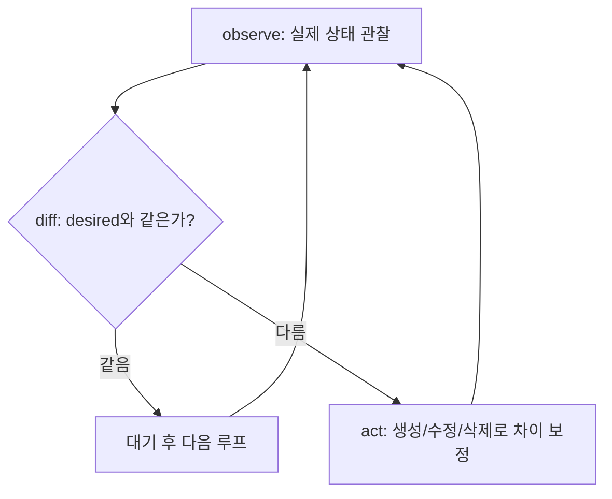
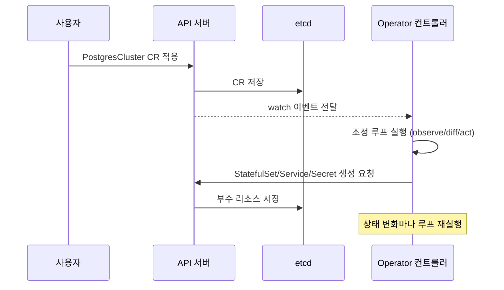

# Operator 패턴과 컨트롤러 — 운영 지식을 코드로

## 학습 목표
- 조정 루프(reconciliation loop)와 컨트롤러가 desired state를 유지하는 동작 원리를 이해한다
- 기존 Operator를 설치하고, 커스텀 리소스 변경 시 컨트롤러가 반응하는 과정을 관찰할 수 있다
- Operator SDK와 Operator 성숙도 모델 등 Operator 개발의 핵심 개념을 설명할 수 있다

## 본문

### 컨트롤러: 쿠버네티스를 움직이는 심장

지난 강의에서 CRD는 "데이터 모델만 등록할 뿐 아무 동작도 하지 않는다"고 했다. 동작을 일으키는 주체가 바로 **컨트롤러**다. 사실 쿠버네티스 전체가 컨트롤러의 집합이다. Deployment를 만들면 Deployment 컨트롤러가 ReplicaSet을 만들고, ReplicaSet 컨트롤러가 Pod를 만든다. 여러분이 `replicas: 3`이라 선언하면 Pod가 정확히 3개 유지되는 것은, 누군가 끊임없이 "현재 상태가 선언한 상태와 같은가"를 확인하기 때문이다.

이 끊임없는 확인-수정 과정이 **조정 루프(reconciliation loop)**다. 컨트롤러는 단 하나의 질문을 반복한다.

1. **observe** — 지금 클러스터의 실제 상태(actual state)는 어떤가?
2. **diff** — 사용자가 선언한 desired state와 무엇이 다른가?
3. **act** — 그 차이를 메우기 위해 무엇을 만들거나 지우거나 고쳐야 하는가?

이 루프가 끝나면 다시 처음으로 돌아온다. Pod 하나가 죽으면 actual ≠ desired가 되고, 다음 루프에서 컨트롤러가 새 Pod를 만들어 차이를 0으로 되돌린다. 명령형 스크립트가 아니라 **선언형(declarative)** 모델인 이유가 여기 있다. 우리는 "무엇을 하라"가 아니라 "어떤 상태이길 원한다"만 말하고, 차이를 메우는 일은 컨트롤러에게 맡긴다.

아래 흐름도는 컨트롤러가 actual과 desired가 같아질 때까지 observe → diff → act를 무한 반복하는 모습을 나타낸다.



> 조정 루프는 멱등(idempotent)해야 한다. 같은 입력으로 몇 번을 돌려도 결과가 같아야 한다는 뜻이다. 컨트롤러는 수백 번 재실행되므로, "이미 만들어져 있으면 건너뛴다"처럼 현재 상태를 먼저 읽고 차이만 보정하는 식으로 작성해야 한다. "무조건 생성"하는 코드는 중복·충돌을 일으킨다.

### Operator: 운영 지식을 컨트롤러에 담다

빌트인 컨트롤러는 Pod·ReplicaSet 같은 범용 리소스만 안다. 하지만 PostgreSQL 클러스터를 운영한다고 생각해 보자. 마스터 승격, 백업 스케줄, 장애 시 페일오버, 버전 업그레이드 — 이런 건 사람 DBA의 머릿속 운영 지식이다. **Operator는 이 운영 지식을 커스텀 컨트롤러 코드로 옮긴 것**이다.

구성은 단순하다. **Operator = CRD + 그 CRD를 감시하는 커스텀 컨트롤러**. 예를 들어 `PostgresCluster`라는 CRD를 정의하고, 사용자가 `spec.replicas: 3, version: 15`라고 선언하면, Operator의 컨트롤러가 StatefulSet·Service·Secret·백업 CronJob을 알아서 만들고, 마스터가 죽으면 복제본을 승격시킨다. 사용자는 DB 내부 운영을 몰라도 되고, "원하는 상태"만 YAML로 선언한다.

흐름은 다음과 같다. 사용자가 CR을 생성/수정 → API 서버가 etcd에 저장하고 watch 이벤트 발생 → Operator의 컨트롤러가 이벤트를 받아 조정 루프 실행 → 실제 리소스를 desired에 맞춤. 이 watch-react-reconcile 사이클이 Operator 동작의 본질이다.

아래 시퀀스는 사용자가 CR을 적용했을 때 watch 이벤트가 Operator를 깨워 부수 리소스를 만들기까지의 과정을 보여 준다.



### 기존 Operator 설치하고 관찰하기

직접 코드를 짜기 전에, 잘 만들어진 Operator가 어떻게 반응하는지 관찰하는 것이 가장 빠른 학습이다. cert-manager를 예로 들자.

```bash
# 1) cert-manager Operator 설치 (CRD + 컨트롤러가 함께 배포됨)
helm repo add jetstack https://charts.jetstack.io
helm repo update
helm install cert-manager jetstack/cert-manager \
  --namespace cert-manager --create-namespace \
  --set installCRDs=true

# 2) Operator가 등록한 CRD 확인
kubectl get crd | grep cert-manager
# certificates.cert-manager.io, issuers.cert-manager.io ...

# 3) 컨트롤러 Pod와 로그 확인
kubectl get pods -n cert-manager
kubectl logs -n cert-manager deploy/cert-manager -f
```

> CRD를 함께 설치하는 플래그는 cert-manager 버전에 따라 이름이 다르니 주의하라. 위 `--set installCRDs=true`가 가장 널리 통용되는 방식이고, 일부 최신 차트에서는 `--set crds.enabled=true`(여기에 `crds.keep=true`로 삭제 시 CRD 보존까지 제어)를 쓴다. 어느 쪽이든 의도는 같다 — **Helm이 CRD를 함께 배포하게 만드는 것**. 설치 전 `helm show values jetstack/cert-manager | grep -i crd`로 그 차트가 어떤 키를 쓰는지 확인하는 습관이 안전하다.

이제 CR(예: `Certificate` 또는 자체 서명 `Issuer`)을 하나 만든 뒤, 위 로그 창을 지켜보라. CR을 `apply`하는 즉시 컨트롤러 로그에 조정 메시지가 찍히고, 곧이어 인증서가 담긴 Secret이 자동 생성된다.

```bash
kubectl apply -f selfsigned-issuer.yaml
kubectl apply -f my-certificate.yaml
kubectl get certificate          # READY 컬럼이 True로 바뀌는 과정 관찰
kubectl get secret               # 컨트롤러가 만든 TLS Secret 등장
```

여기서 핵심 관찰 포인트는, **여러분은 Secret을 직접 만들지 않았다**는 점이다. CR 하나를 선언했을 뿐인데 컨트롤러가 조정 루프를 돌려 부수 리소스를 만들어 냈다. CR을 삭제하면 다시 루프가 돌아 관련 리소스를 정리한다. 이것이 컨트롤러가 desired state를 유지하는 모습이다.

### Operator SDK와 성숙도 모델

직접 Operator를 만들 때는 보통 프레임워크를 쓴다. **Operator SDK**(및 그 기반인 controller-runtime, Kubebuilder)는 watch 등록, 큐잉, 재시도, 클라이언트 캐시 같은 반복 작업을 대신 처리해 주고, 여러분은 `Reconcile()` 함수 안의 비즈니스 로직만 채우면 된다. Go가 가장 일반적이지만, Ansible·Helm 기반 Operator도 SDK가 지원한다(Helm 차트를 그대로 Operator로 감싸는 방식).

Operator의 성숙도는 흔히 **5단계 capability model**로 설명한다.

1. **Basic Install** — CR로 설치·기본 설정만 자동화
2. **Seamless Upgrades** — 애플리케이션·Operator 버전 업그레이드 자동화
3. **Full Lifecycle** — 백업·복구·장애 조치 등 라이프사이클 관리
4. **Deep Insights** — 메트릭·알림·로그 등 관측성 통합
5. **Auto Pilot** — 오토스케일링·자동 튜닝·이상 감지까지 무인 운영

레벨이 올라갈수록 사람 DBA/운영자의 지식이 더 많이 코드로 옮겨진 것이다. OperatorHub에 가면 수많은 Operator가 이 등급으로 분류돼 있어, 도입 전 성숙도를 가늠하는 기준이 된다.

> 모든 것을 Operator로 만들 필요는 없다. 단순 배포는 Helm/Kustomize로 충분하다. Operator는 "스테이트풀하고, 사람의 지속적 운영 판단이 필요한" 애플리케이션(데이터베이스, 메시지 큐, 모니터링 스택 등)에서 진가를 발휘한다.

## 핵심 요약
- 컨트롤러는 observe → diff → act의 조정 루프를 무한 반복하며 actual state를 desired state에 수렴시킨다. 이 멱등한 루프가 선언형 모델의 핵심이다.
- Operator = CRD + 커스텀 컨트롤러. 사람의 운영 지식(설치·업그레이드·페일오버 등)을 코드로 옮긴 패턴이다.
- 기존 Operator(예: cert-manager)를 설치하고 CR을 적용하면, 컨트롤러가 watch로 반응해 부수 리소스를 자동 생성·정리하는 과정을 직접 관찰할 수 있다. CRD 동반 설치 플래그(`installCRDs=true` 또는 최신 차트의 `crds.enabled=true`)는 차트 버전에 맞춰 확인한다.
- Operator SDK(controller-runtime/Kubebuilder)는 watch·큐·재시도 같은 배관을 대신 처리해 Reconcile 로직에 집중하게 해 준다.
- 성숙도 모델(Basic Install → Auto Pilot 5단계)로 Operator의 자동화 수준을 가늠한다. 스테이트풀·운영 집약 애플리케이션에 가장 적합하다.
