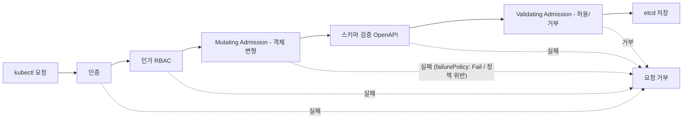

# Admission Control과 정책 강제 — Webhook·OPA/Kyverno·Pod Security

## 학습 목표
- Validating/Mutating Admission Webhook이 API 요청 처리 흐름의 어느 지점에서 동작하는지 이해한다
- OPA Gatekeeper 또는 Kyverno로 정책을 정의하고 위반 리소스를 차단·변형할 수 있다
- Pod Security Admission으로 네임스페이스 단위 보안 표준을 적용할 수 있다

## 본문

### API 요청은 어디서 검문받는가

`kubectl apply`를 누르면 요청이 etcd에 저장되기까지 일렬의 관문을 통과한다. 순서를 정확히 아는 것이 이 강의의 출발점이다.

1. **인증(Authentication)** — 누구인가?
2. **인가(Authorization, RBAC)** — 이 작업을 할 권한이 있는가?
3. **Mutating Admission** — 요청 객체를 **변형**한다(필드 주입·기본값 설정).
4. **스키마 검증(OpenAPI)** — 객체 구조가 올바른가?
5. **Validating Admission** — 정책에 비추어 이 객체를 **허용할지 거부**한다.
6. **etcd 저장**

아래 흐름도는 요청이 통과하는 관문 순서와, 각 단계에서 거부될 경우 어디서 멈추는지를 한눈에 보여 준다. 주의할 점은 **Mutating 단계에서도 요청이 거부될 수 있다**는 것이다. Mutating Webhook은 보통 객체를 변형만 하지만, 등록된 웹훅 서버가 응답하지 못하거나(예: 서비스 다운) `failurePolicy: Fail`로 설정돼 있으면 그 단계에서 곧바로 요청 전체가 거부된다. 즉 Admission은 Mutating·Validating 두 지점 모두에서 요청을 막을 수 있다.



여기서 3번과 5번이 Admission Control 단계다. RBAC가 "이 사용자가 Pod를 만들 수 있는가"를 본다면, Admission은 "이 Pod의 **내용**이 우리 정책에 맞는가"를 본다. 권한은 있어도 내용이 규칙에 어긋나면 막는 것이다.

**Mutating이 Validating보다 먼저** 도는 이유는 명확하다. 먼저 객체를 보정(예: 누락된 라벨 주입, 사이드카 추가)한 뒤, 보정이 끝난 최종 형태를 기준으로 검증해야 일관되기 때문이다. 사이드카 인젝션, 기본 리소스 limit 주입 같은 일이 Mutating 단계에서 일어난다.

> 두 웹훅의 성격은 다르지만, **둘 다 요청을 거부할 수 있다.** Validating Webhook이 한 번이라도 거부하면 요청 전체가 거부된다. Mutating Webhook은 여러 개가 순차로 객체를 누적 변형하되, 변형 도중 거부하거나(정책 위반) 웹훅 호출 자체가 실패하면(`failurePolicy: Fail`) 그 시점에 요청이 막힌다. 핵심 차이는 "검문소(Validating)"와 "성형외과(Mutating)"라는 **역할**에 있지, "거부할 수 없다"는 데 있지 않다.

### `failurePolicy` — 웹훅이 죽으면 어떻게 할까

웹훅 서버는 외부 서비스이므로 다운될 수 있다. 이때 API 서버가 어떻게 처리할지를 `failurePolicy`가 정한다.

- **`Fail`(기본)** — 웹훅 호출이 실패하면 요청을 **거부**한다. 보안 정책처럼 "절대 빠져나가면 안 되는" 규칙에 쓴다. 단, 웹훅 서버가 죽으면 해당 리소스 생성이 전부 막히는 위험이 있다.
- **`Ignore`** — 웹훅 호출이 실패하면 그냥 **통과**시킨다. 가용성을 우선하지만, 장애 중에는 정책이 적용되지 않는 구멍이 생긴다.

이 선택은 "보안 강제 vs 클러스터 가용성"의 트레이드오프다. 핵심 보안 웹훅은 `Fail`로 두되, 웹훅 서버 자체를 고가용성으로 운영하는 것이 정석이다.

### Admission Webhook의 동작

쿠버네티스는 `ValidatingWebhookConfiguration`·`MutatingWebhookConfiguration` 리소스로 외부 서비스를 admission 흐름에 끼워 넣는다. API 서버는 지정한 작업(예: `pods`의 `CREATE`)이 들어오면, 등록된 웹훅 서버에 HTTPS로 `AdmissionReview` 요청을 보내고, 응답의 `allowed: true/false`(또는 변형용 JSON patch)를 받아 처리한다.

웹훅 서버를 직접 구현하면 강력하지만, TLS 인증서 관리·고가용성·로직 작성이 부담이다. 그래서 실무에서는 **정책 엔진**(OPA Gatekeeper, Kyverno)을 웹훅 서버로 깔고, 정책을 선언적으로 작성하는 방식이 표준이 됐다.

### OPA Gatekeeper로 정책 정의·강제

OPA(Open Policy Agent) Gatekeeper는 CRD 기반으로 동작한다. 두 가지 리소스를 이해하면 된다.

- **ConstraintTemplate** — 정책의 *로직*을 Rego 언어로 작성한 재사용 템플릿(파라미터를 받는 함수 같은 것).
- **Constraint** — 그 템플릿을 *어디에, 어떤 파라미터로* 적용할지 지정한 인스턴스.

예를 들어 "모든 Namespace에 `team` 라벨이 있어야 한다"는 정책은 다음과 같다.

```yaml
# ConstraintTemplate: 정책 로직 (Rego)
apiVersion: templates.gatekeeper.sh/v1
kind: ConstraintTemplate
metadata:
  name: k8srequiredlabels
spec:
  crd:
    spec:
      names:
        kind: K8sRequiredLabels
      validation:
        openAPIV3Schema:
          type: object
          properties:
            labels:
              type: array
              items: { type: string }
  targets:
    - target: admission.k8s.gatekeeper.sh
      rego: |
        package k8srequiredlabels
        violation[{"msg": msg}] {
          required := input.parameters.labels
          provided := input.review.object.metadata.labels
          missing := required[_]
          not provided[missing]
          msg := sprintf("필수 라벨 누락: %v", [missing])
        }
```

```yaml
# Constraint: 위 템플릿을 Namespace에 적용
apiVersion: constraints.gatekeeper.sh/v1
kind: K8sRequiredLabels
metadata:
  name: ns-must-have-team
spec:
  match:
    kinds:
      - apiGroups: [""]
        kinds: ["Namespace"]
  parameters:
    labels: ["team"]
```

> Constraint의 `apiVersion`은 최신 Gatekeeper에서 `constraints.gatekeeper.sh/v1`이 정식 버전이다. 과거 예제에서 흔히 보이는 `v1beta1`도 호환되지만, 새로 작성한다면 정식 `v1`을 쓰는 것이 모범 사례다.

적용 후 `team` 라벨 없는 Namespace를 만들면 admission 단계에서 거부된다.

```
admission webhook "validation.gatekeeper.sh" denied the request:
[ns-must-have-team] 필수 라벨 누락: team
```

> Gatekeeper의 `enforcementAction`을 `dryrun`이나 `warn`으로 두면, 차단하지 않고 위반만 기록/경고한다. 기존 클러스터에 정책을 처음 도입할 때는 반드시 dryrun으로 시작해 **얼마나 많은 리소스가 걸리는지 audit**한 뒤, 안전이 확인되면 `deny`로 전환하라. 곧바로 deny를 켜면 운영 중인 배포가 막힌다.

### Kyverno — YAML로 쓰는 정책

Kyverno는 Rego 대신 **쿠버네티스 YAML 문법 그대로** 정책을 쓴다는 점이 매력이다. 학습 곡선이 낮아 빠르게 도입할 수 있고, validate(검증)·mutate(변형)·generate(부수 리소스 자동 생성)를 한 도구에서 다룬다.

```yaml
apiVersion: kyverno.io/v1
kind: ClusterPolicy
metadata:
  name: require-team-label
spec:
  validationFailureAction: Enforce   # Audit이면 경고만
  rules:
    - name: check-team-label
      match:
        any:
          - resources: { kinds: ["Pod"] }
      validate:
        message: "Pod에는 team 라벨이 필요합니다."
        pattern:
          metadata:
            labels:
              team: "?*"             # 비어 있지 않은 값 요구
```

정리하면, OPA Gatekeeper는 Rego의 표현력으로 복잡한 규칙에 강하고, Kyverno는 YAML 친화성과 mutate/generate 통합으로 운영 편의가 높다. 조직 상황에 맞게 택하면 된다.

### Pod Security Admission — 빌트인 보안 표준

웹훅·정책 엔진을 따로 깔지 않아도, 쿠버네티스에는 **Pod Security Admission(PSA)**이 기본 내장돼 있다(구버전 PodSecurityPolicy의 후계). PSA는 Pod 스펙을 세 가지 표준 프로파일에 비춰 검사한다.

- **privileged** — 제한 없음(시스템/인프라 워크로드용)
- **baseline** — 알려진 권한 상승을 막는 최소 기준
- **restricted** — 강하게 하드닝(non-root 강제, 권한 차단 등)

적용은 **네임스페이스 라벨**만으로 끝난다. 세 가지 모드(`enforce`/`audit`/`warn`)를 함께 쓰는 것이 정석이다.

```bash
kubectl label namespace payments \
  pod-security.kubernetes.io/enforce=restricted \
  pod-security.kubernetes.io/audit=restricted \
  pod-security.kubernetes.io/warn=restricted
```

이제 `payments` 네임스페이스에 root로 도는 Pod를 만들면 거부되고, `enforce`로 막히기 전에 `warn`이 kubectl에 경고를 띄워 준다. 별도 컴포넌트 설치 없이 네임스페이스 단위 보안 등급을 강제할 수 있어, 정책 엔진 도입 전 1차 방어선으로 매우 유용하다.

## 핵심 요약
- API 요청은 인증 → 인가(RBAC) → Mutating → 스키마 검증 → Validating → etcd 순으로 처리된다. Admission은 "내용"을 검사·변형하는 단계로 RBAC("권한")와 역할이 다르다.
- Mutating Webhook은 객체를 변형(사이드카 주입 등)하고, Validating Webhook은 허용/거부를 결정한다. Mutating이 먼저 돌며, **두 단계 모두 요청을 거부할 수 있다**(특히 `failurePolicy: Fail`인 웹훅이 응답하지 못하면 그 단계에서 거부).
- OPA Gatekeeper는 ConstraintTemplate(Rego 로직) + Constraint(적용) 구조로 정책을 강제한다. Constraint는 정식 `v1` API를 쓰고, 도입 시 dryrun/audit으로 먼저 영향도를 파악하라.
- Kyverno는 쿠버네티스 YAML 문법으로 validate·mutate·generate를 통합 제공해 학습 곡선이 낮다.
- Pod Security Admission은 빌트인 기능으로, 네임스페이스 라벨(privileged/baseline/restricted × enforce/audit/warn)만으로 보안 표준을 강제한다.
